# Envoy HTTP Layer — Overview Part 2: Codecs & Connection Pools

**Directory:** `source/common/http/`  
**Part:** 2 of 4 — HTTP Codecs (H1/H2/H3), Connection Pools, Protocol Details

---

## Table of Contents

1. [Codec Architecture Overview](#1-codec-architecture-overview)
2. [HTTP/1.1 Codec (`http1/`)](#2-http11-codec-http1)
3. [HTTP/2 Codec (`http2/`)](#3-http2-codec-http2)
4. [HTTP/3 Codec (`http3/`)](#4-http3-codec-http3)
5. [CodecClient — Upstream Client](#5-codecclient--upstream-client)
6. [Connection Pool Architecture](#6-connection-pool-architecture)
7. [ConnectivityGrid — HTTP/3 Happy Eyeballs](#7-connectivitygrid--http3-happy-eyeballs)
8. [Mixed Pool — ALPN-Based Selection](#8-mixed-pool--alpn-based-selection)
9. [Pool Lifecycle & Drain](#9-pool-lifecycle--drain)

---

## 1. Codec Architecture Overview

Envoy's codec layer provides a unified streaming API (`RequestDecoder`/`ResponseDecoder` + `RequestEncoder`/`ResponseEncoder`) over different HTTP protocol versions. The codec handles framing, multiplexing, flow control, and protocol error detection.

```mermaid
flowchart TD
    subgraph "Codec Abstraction (envoy/http/codec.h)"
        ServerConn["ServerConnection\n(downstream, receives requests)"]
        ClientConn["ClientConnection\n(upstream, sends requests)"]
        SE["StreamEncoder\n(encode headers/data/trailers)"]
        SD["StreamDecoder\n(decode headers/data/trailers)"]
    end

    subgraph "HTTP/1.1 (http1/)"
        H1SC["Http1::ServerConnectionImpl"]
        H1CC["Http1::ClientConnectionImpl"]
        Parser["Parser\n(Balsa / LegacyParser)"]
    end

    subgraph "HTTP/2 (http2/)"
        H2SC["Http2::ServerConnectionImpl"]
        H2CC["Http2::ClientConnectionImpl"]
        OgHTTP2["oghttp2 / nghttp2 adapter"]
    end

    subgraph "HTTP/3 (http3/)"
        H3SC["Http3::ServerConnectionImpl"]
        H3CC["Http3::ClientConnectionImpl"]
        QUIC["QUIC (quiche)"]
    end

    ServerConn <|-- H1SC
    ServerConn <|-- H2SC
    ServerConn <|-- H3SC
    ClientConn <|-- H1CC
    ClientConn <|-- H2CC
    ClientConn <|-- H3CC

    H1SC --> Parser
    H2SC --> OgHTTP2
    H3SC --> QUIC
```

---

## 2. HTTP/1.1 Codec (`http1/`)

### Key Files

| File | Purpose |
|------|---------|
| `http1/codec_impl.h/.cc` | Main H1 codec implementation |
| `http1/parser.h` | Abstract `Parser` interface |
| `http1/balsa_parser.h/.cc` | Google Balsa (default) |
| `http1/legacy_parser_impl.h/.cc` | http-parser (legacy, deprecated) |
| `http1/header_formatter.h/.cc` | Optional header case preservation |
| `http1/conn_pool.h/.cc` | H1-specific connection pool |

### Protocol Flow

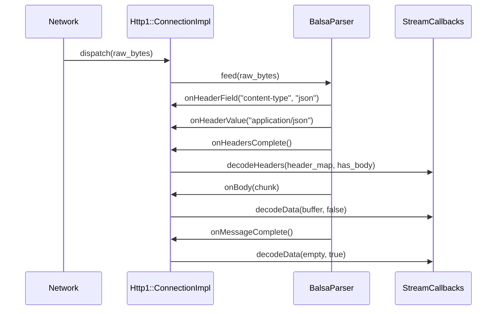

### Parser Abstraction

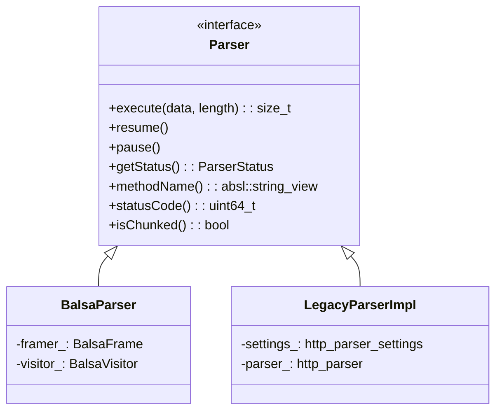

### H1-Specific Features

| Feature | Implementation |
|---------|---------------|
| Keep-alive | `Connection: keep-alive` detection, connection reuse |
| Pipelining | Queue of pending requests (not concurrently processed) |
| Chunked transfer | `Transfer-Encoding: chunked` encode/decode |
| 100-Continue | `Expect: 100-continue` handling before body |
| WebSocket upgrade | Protocol upgrade via `Upgrade: websocket` |
| CONNECT tunneling | HTTP CONNECT method for tunneling |
| Header case | Optional preservation via `HeaderFormatter` |

### Header Formatting

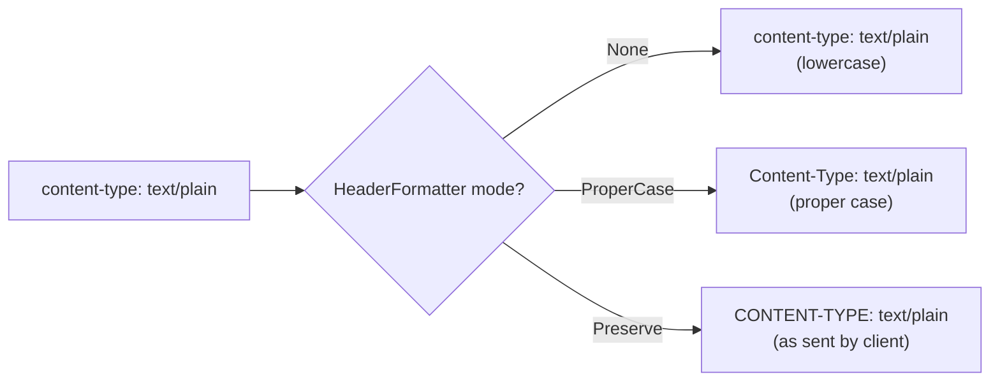

---

## 3. HTTP/2 Codec (`http2/`)

### Key Files

| File | Purpose |
|------|---------|
| `http2/codec_impl.h/.cc` | Main H2 codec wrapping oghttp2/nghttp2 |
| `http2/protocol_constraints.h/.cc` | Flood/abuse detection |
| `http2/metadata_decoder.h/.cc` | Envoy METADATA frame extension |
| `http2/metadata_encoder.h/.cc` | Envoy METADATA frame encoding |
| `http2/conn_pool.h/.cc` | H2-specific multiplexed pool |

### Architecture

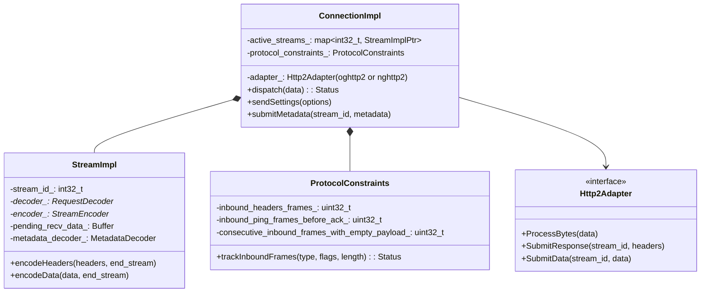

### Stream Multiplexing

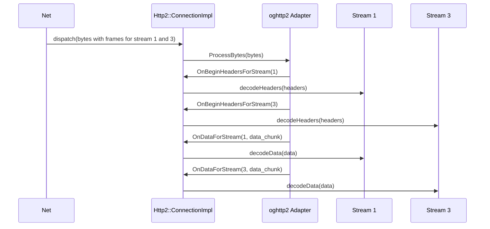

### Protocol Constraints (Flood Protection)

`ProtocolConstraints` tracks frame rates to detect and block H2 flooding attacks:

| Frame Type | Default Limit | Condition Detected |
|-----------|---------------|-------------------|
| HEADERS frames | 100 / stream | Rapid header flood |
| PING frames before ACK | 10 | PING flood |
| DATA frames with empty payload | 1000 | Empty frame flood |
| PRIORITY frames | 2^31-1 (disabled) | PRIORITY flood |
| RST_STREAM frames | configurable | RST flood |

### METADATA Extension

Envoy supports a non-standard HTTP/2 METADATA frame (opaque key-value data attached to a stream, used by Istio for telemetry):

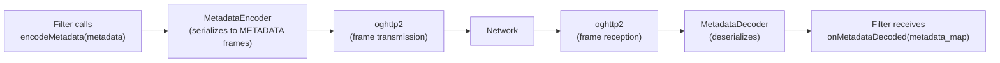

---

## 4. HTTP/3 Codec (`http3/`)

### Architecture

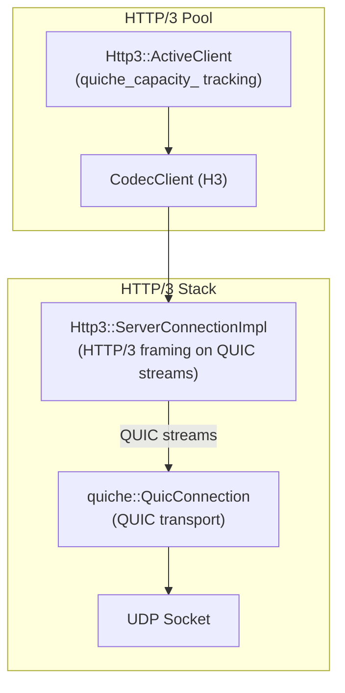

### H3-Specific Features

| Feature | Detail |
|---------|--------|
| 0-RTT | Early data support for faster connection setup |
| `quiche_capacity_` | Dynamic stream limit from QUIC's MAX_STREAMS frame |
| Connection migration | IP/port change without reconnecting |
| No head-of-line blocking | Independent stream delivery (unlike H2 over TCP) |
| Alt-Svc integration | Discovered via `http_server_properties_cache` |

---

## 5. CodecClient — Upstream Client

`CodecClient` bridges the pool layer and the codec layer for upstream connections:

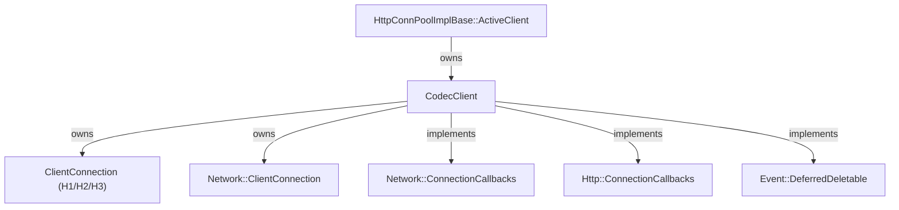

### Connect Timeout Flow

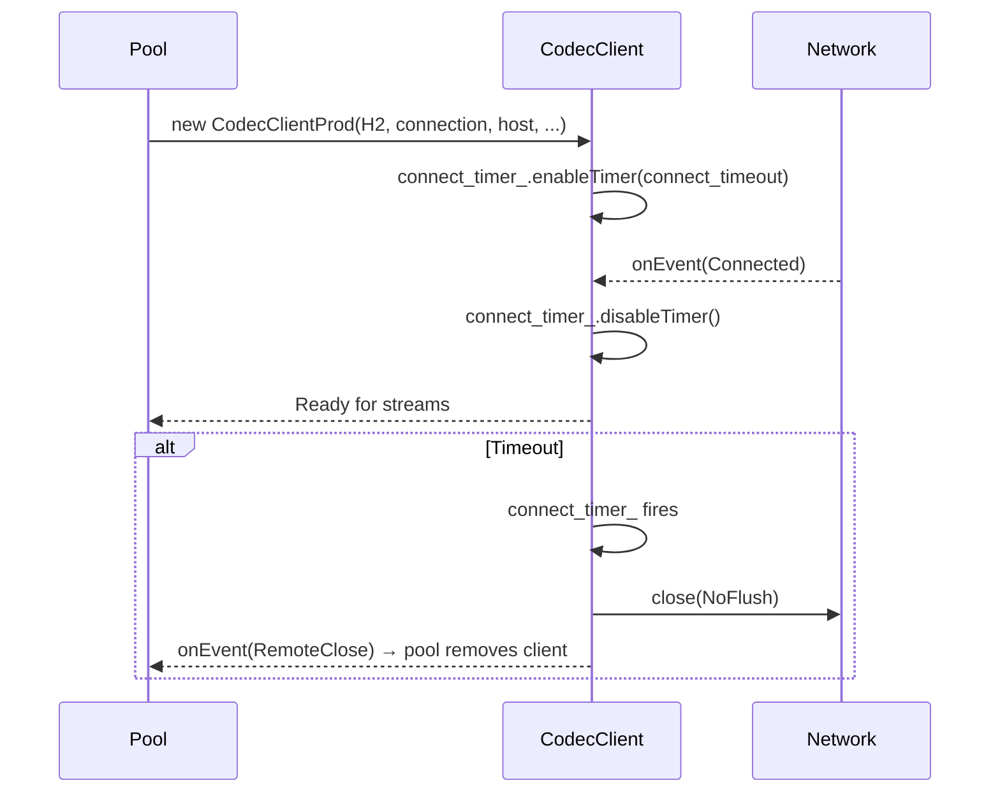

---

## 6. Connection Pool Architecture

### Pool Hierarchy

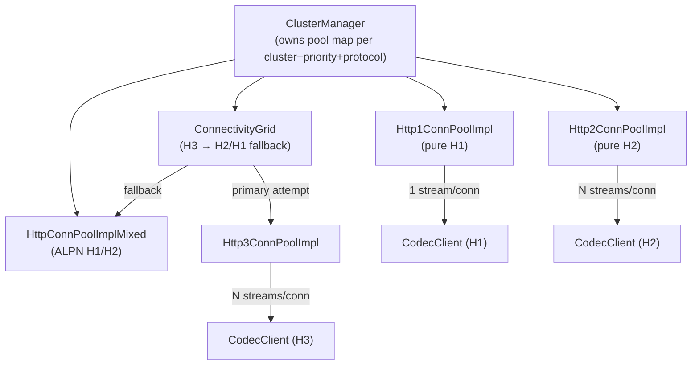

### `HttpPendingStream` — Queued Request

When no connection is available, the request is queued as an `HttpPendingStream`:

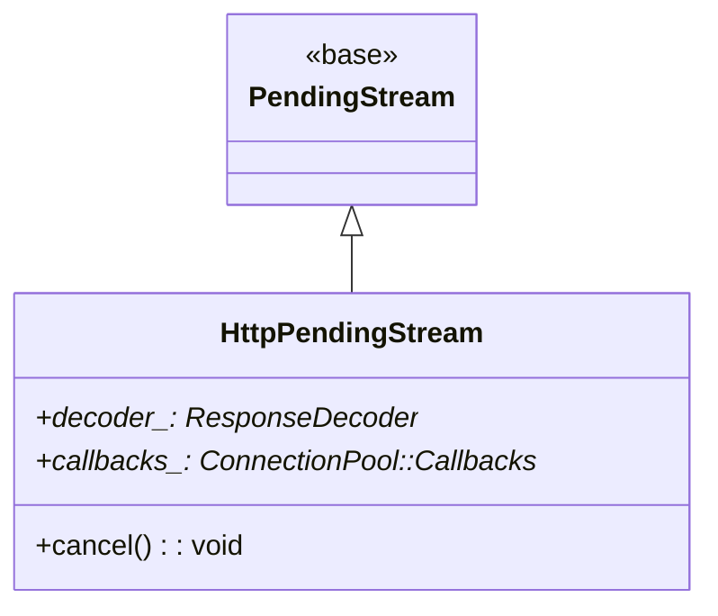

### Pool Flow — Connection Available vs. Queue

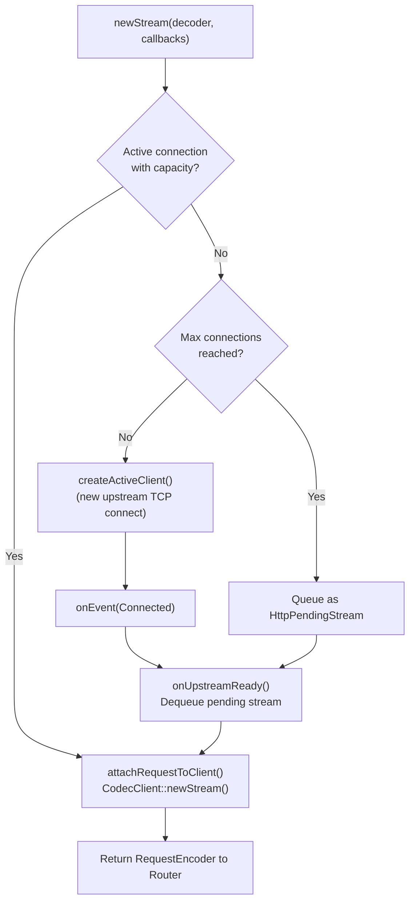

### Max Requests Per Connection

| Protocol | Default | Config |
|----------|---------|--------|
| HTTP/1.1 | 1 (concurrent), unlimited (sequential) | `max_requests_per_connection` |
| HTTP/2 | unlimited (up to SETTINGS_MAX_CONCURRENT_STREAMS) | `max_requests_per_connection` |
| HTTP/3 | dynamic (`quiche_capacity_`) | QUIC MAX_STREAMS |

---

## 7. ConnectivityGrid — HTTP/3 Happy Eyeballs

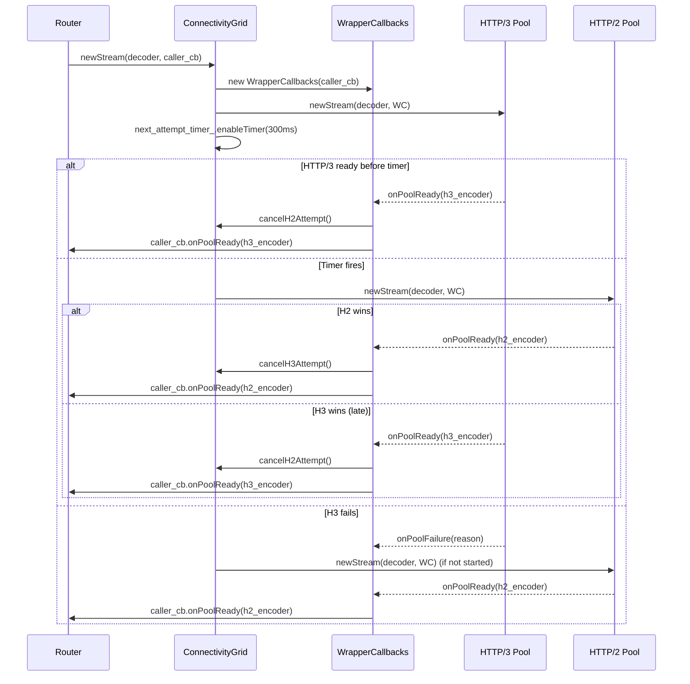

### H3 Status Backoff

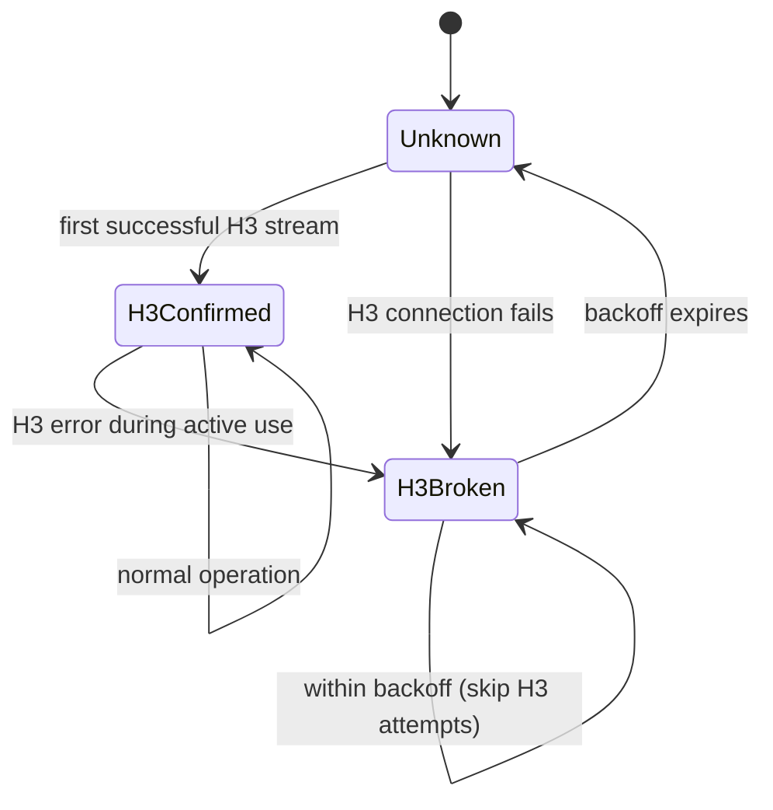

---

## 8. Mixed Pool — ALPN-Based Selection

`HttpConnPoolImplMixed` starts a TLS connection and defers protocol selection until ALPN negotiation completes:

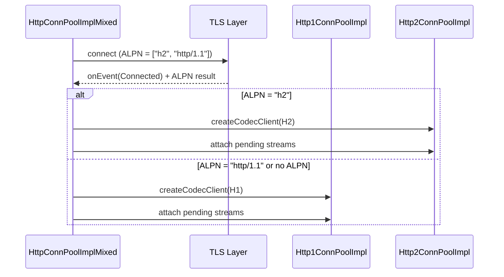

---

## 9. Pool Lifecycle & Drain

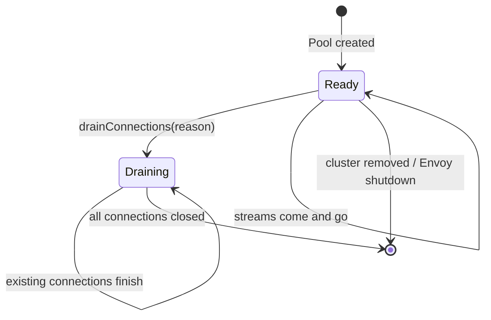

### Drain Reasons

| Reason | Behavior |
|--------|----------|
| `DrainExistingConnections` | No new streams on existing connections; create new connections for new streams |
| `EvictIdleConnections` | Close connections with no in-flight streams immediately |

---

## Navigation

| Part | Topics |
|------|--------|
| [Part 1](OVERVIEW_PART1_request_pipeline.md) | Architecture, Request Pipeline, ConnectionManager, FilterSystem |
| **Part 2 (this file)** | Codecs (H1/H2/H3), Connection Pools, Protocol Details |
| [Part 3](OVERVIEW_PART3_headers_and_utilities.md) | Header System, Utilities, Path Normalization |
| [Part 4](OVERVIEW_PART4_async_and_advanced.md) | Async Client, HTTP/3, Server Properties, Advanced Topics |
