# Envoy HTTP Layer — Overview Part 3: Header System & Utilities

**Directory:** `source/common/http/`  
**Part:** 3 of 4 — Header System, Utilities, Path Normalization, Status Codes, Hash Policy

---

## Table of Contents

1. [Header System Overview](#1-header-system-overview)
2. [HeaderMapImpl — Performance Design](#2-headermapimpl--performance-design)
3. [Inline Header Access via Macros](#3-inline-header-access-via-macros)
4. [HeaderUtility — Matchers & Manipulation](#4-headerutility--matchers--manipulation)
5. [HeaderMutation — Programmatic Changes](#5-headermutation--programmatic-changes)
6. [Http::Utility — URL, Encoding, gRPC](#6-httputility--url-encoding-grpc)
7. [PathUtility — Path Canonicalization](#7-pathutility--path-canonicalization)
8. [HashPolicy — Load Balancing](#8-hashpolicy--load-balancing)
9. [Status Codes and Error Propagation](#9-status-codes-and-error-propagation)
10. [ConnectionManagerUtility — Header Mutation at Runtime](#10-connectionmanagerutility--header-mutation-at-runtime)

---

## 1. Header System Overview

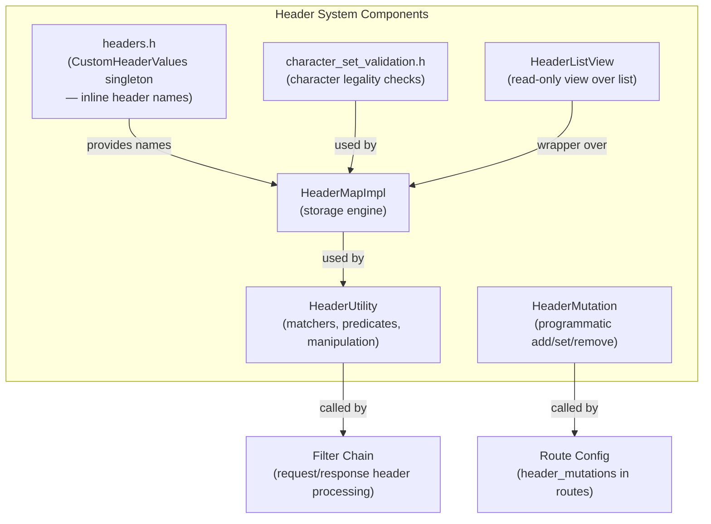

---

## 2. HeaderMapImpl — Performance Design

### Storage Architecture

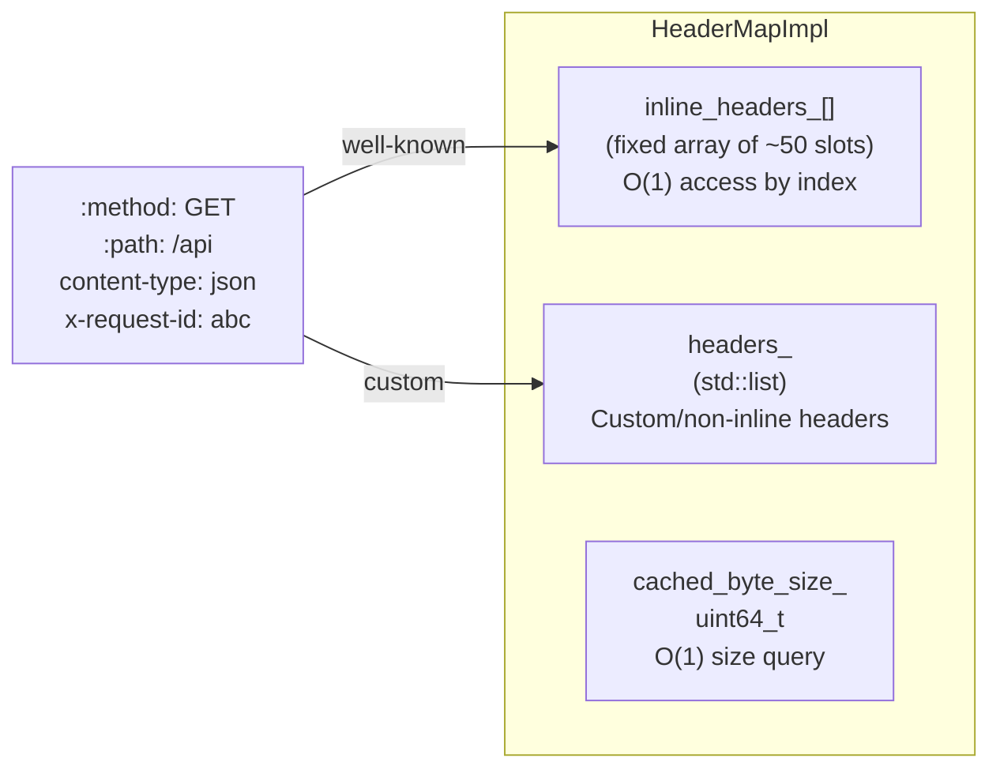

### Inline Slot Lookup vs. List Scan

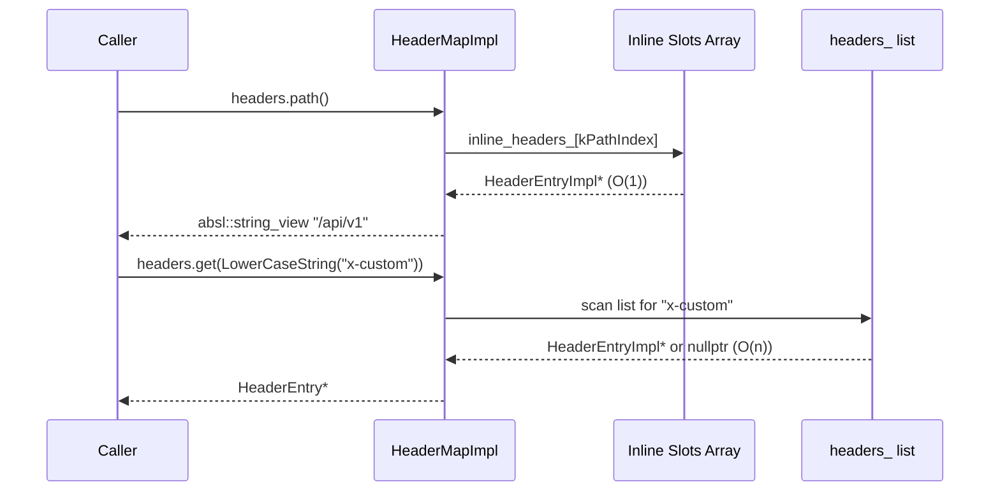

### Byte Size Maintenance

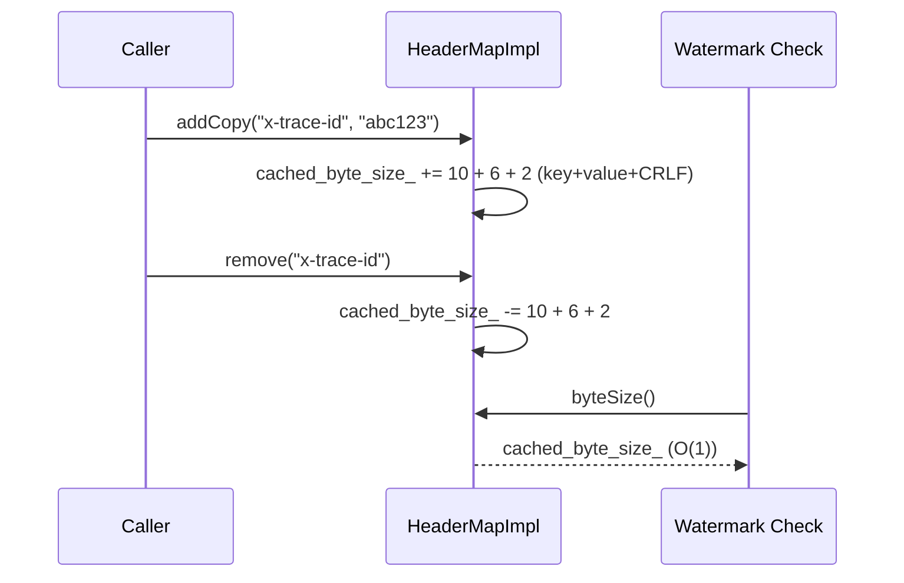

### HeaderString — Small String Optimization

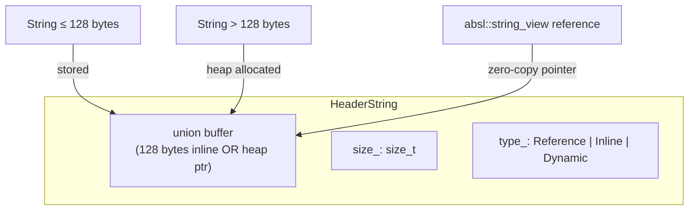

---

## 3. Inline Header Access via Macros

Three macro families generate typed accessor methods for every well-known header:

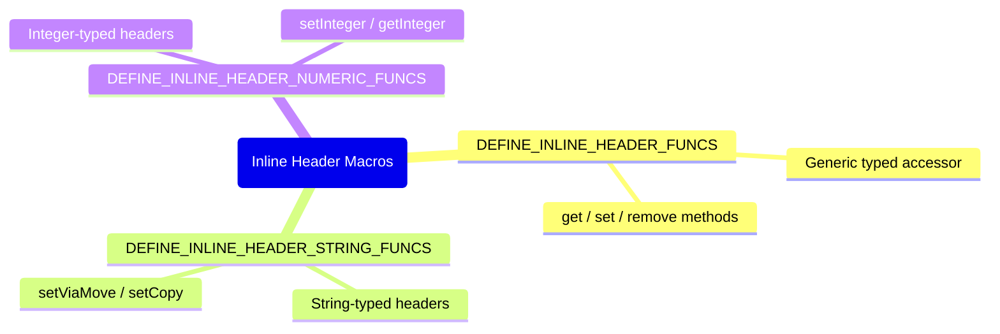

### Examples of Generated Methods

| Macro | Header | Generated Methods |
|-------|--------|------------------|
| `DEFINE_INLINE_HEADER_FUNCS(path)` | `:path` | `path()`, `setPath(value)`, `removePath()` |
| `DEFINE_INLINE_HEADER_STRING_FUNCS(content_type)` | `content-type` | `contentType()`, `setContentType(value)` |
| `DEFINE_INLINE_HEADER_NUMERIC_FUNCS(content_length)` | `content-length` | `contentLength()`, `setContentLength(uint64_t)` |

### Well-Known Inline Headers (Selected)

```
HTTP/2 Pseudo-headers:    :method, :path, :scheme, :authority, :status
Request headers:          host, authorization, content-type, content-length,
                          accept, accept-encoding, user-agent, cookie,
                          transfer-encoding, connection, upgrade
Response headers:         server, date, cache-control, location, etag, 
                          set-cookie, www-authenticate, content-encoding
Envoy-specific:           x-forwarded-for, x-forwarded-proto, x-envoy-internal,
                          x-request-id, x-b3-traceid, x-b3-spanid, x-b3-sampled,
                          x-envoy-upstream-service-time, x-envoy-attempt-count,
                          x-envoy-decorator-operation, grpc-status, grpc-message
```

---

## 4. HeaderUtility — Matchers & Manipulation

`HeaderUtility` provides higher-level operations on header maps, primarily used by routing and filter configurations.

### Header Match Predicates

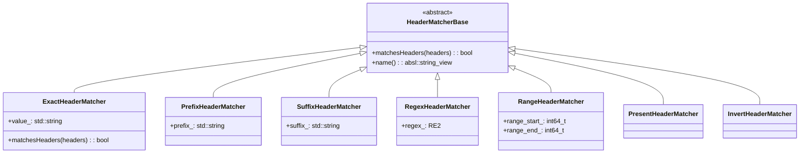

### `matchHeaders(headers, matchers)` Flow

```mermaid
flowchart TD
    A["matchHeaders(request_headers, route.header_matchers)"] --> B["For each HeaderMatcher"]
    B --> C{matcher.matchesHeaders(headers)?}
    C -->|All must match| D[Return true]
    C -->|Any fails| E[Return false]
```

### Common Operations

| Method | Purpose |
|--------|---------|
| `getAllOfHeader(headers, key)` | Get all values for a repeated header |
| `addHeaders(to, from)` | Copy all headers from one map to another |
| `removeHeaders(headers, keys)` | Remove a list of headers |
| `stripConnectionSpecificHeaders(headers)` | Remove hop-by-hop headers |
| `requestHeadersValid(headers)` | Validate required pseudo-headers present |
| `isConnect(headers)` | Check if this is an HTTP CONNECT request |
| `isConnectResponse(req, resp)` | Check if response is a CONNECT success |
| `isGrpc(headers)` | Check content-type for gRPC |
| `isTrailer(headers)` | Distinguish trailer from headers |

---

## 5. HeaderMutation — Programmatic Changes

`HeaderMutation` applies ordered header mutations from route/virtual host configuration:

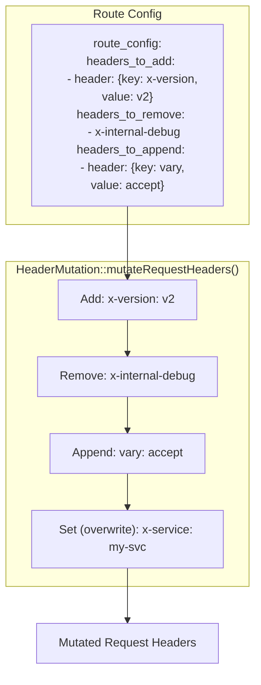

### Mutation Action Types

| Action | Proto Field | Behavior |
|--------|-------------|---------|
| `ADD` | `headers_to_add` | Add header (preserves existing if same key) |
| `OVERWRITE` | `headers_to_overwrite` | Replace existing value or add |
| `APPEND_IF_EXISTS_OR_ADD` | `headers_to_append` | Append to existing values |
| `REMOVE` | `headers_to_remove` | Remove all values for the key |

---

## 6. Http::Utility — URL, Encoding, gRPC

`source/common/http/utility.h` is a large namespace of free functions organized into sub-namespaces.

### URL Parsing

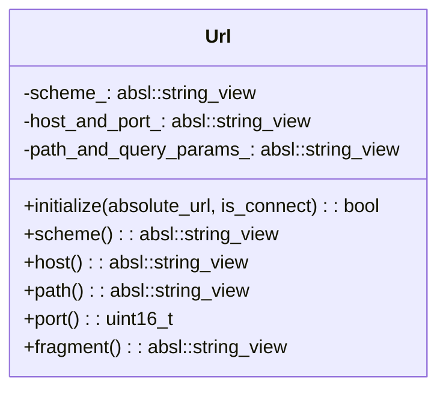

### URL Parse Flow

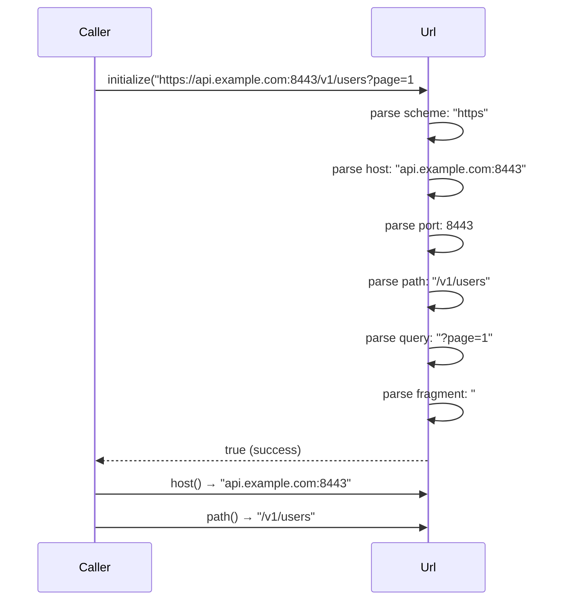

### Percent Encoding (RFC 3986)

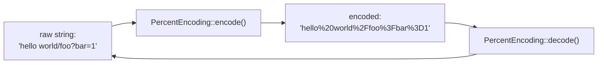

### Query Parameter Parsing

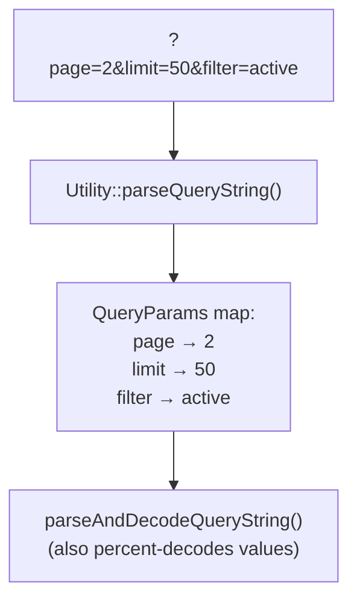

### gRPC Utilities

| Function | Purpose |
|----------|---------|
| `Utility::isGrpc(headers)` | Check `content-type: application/grpc*` |
| `Utility::getGrpcStatus(trailers, ok_only)` | Extract `grpc-status` trailer |
| `Utility::grpcStatusToHttpStatus(grpc_status)` | Map gRPC status code → HTTP status |
| `Utility::httpToGrpcStatus(http_status)` | Map HTTP status → gRPC status |

### HTTP/2 & HTTP/3 Option Validation

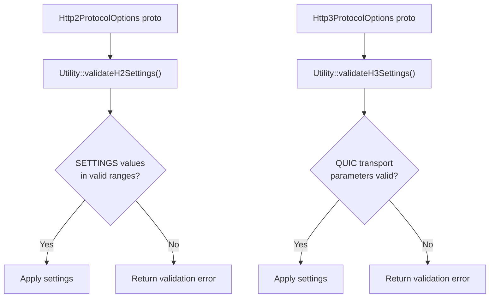

---

## 7. PathUtility — Path Canonicalization

`source/common/http/path_utility.h`:

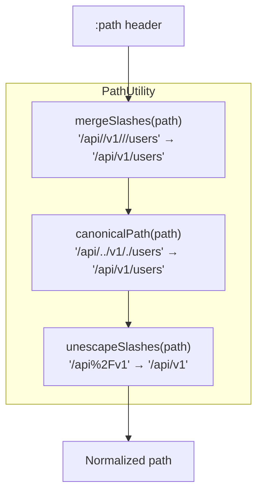

### Dot-Segment Resolution (RFC 3986 §5.2.4)

```
Input:  /a/b/c/../d/./e
Step 1: /a/b/d/./e       (resolve ..)
Step 2: /a/b/d/e         (resolve .)
Output: /a/b/d/e
```

---

## 8. HashPolicy — Load Balancing

`source/common/http/hash_policy.h` implements `Router::HashPolicy` for upstream load balancing:

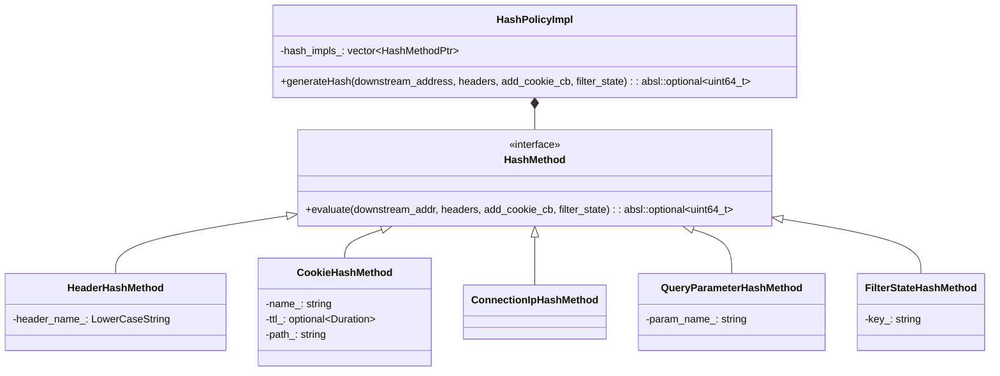

### Hash Policy Evaluation

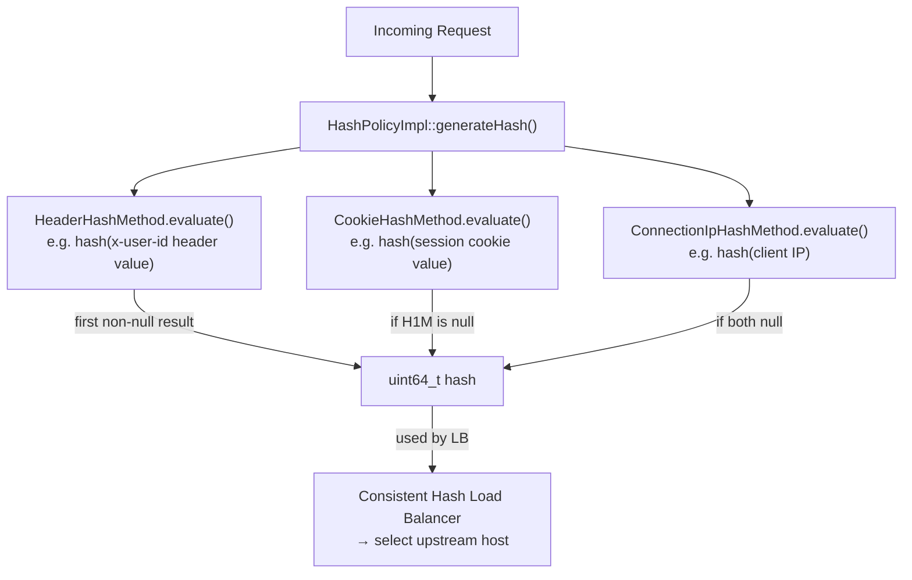

---

## 9. Status Codes and Error Propagation

### `Http::Status` (`status.h`)

Envoy wraps `absl::Status` with HTTP-specific error codes:

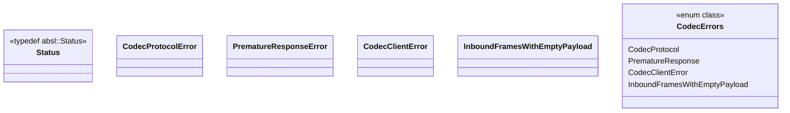

### Error Propagation Flow

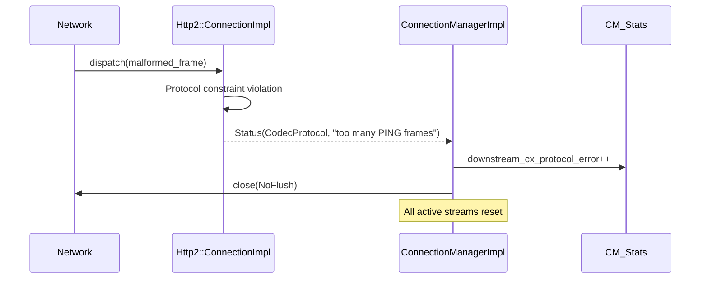

### `CodeStatsImpl` (`codes.h`)

Tracks HTTP response code statistics in histograms and counters:

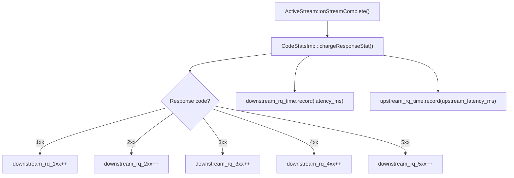

---

## 10. ConnectionManagerUtility — Header Mutation at Runtime

(See also: individual `conn_manager_utility.md` doc)

### Header Mutation Decision Tree

```mermaid
flowchart TD
    Req["Incoming Downstream Request"] --> XFF{"xff_num_trusted_hops > 0?"}
    XFF -->|Yes| AppendIP["Append local IP to x-forwarded-for"]
    XFF -->|No| ReplaceIP["Replace x-forwarded-for with local IP"]
    AppendIP --> Proto["Set x-forwarded-proto"]
    ReplaceIP --> Proto
    Proto --> Internal{"isInternal(remote_addr)?"}
    Internal -->|Yes| SetInt["x-envoy-internal: true"]
    Internal -->|No| RemInt["Remove x-envoy-internal"]
    SetInt --> Envoy["Remove untrusted x-envoy-* headers"]
    RemInt --> Envoy
    Envoy --> RequestID["Generate/propagate x-request-id"]
    RequestID --> Trace["mutateTracingRequestHeader()"]
    Trace --> UA["Sanitize User-Agent"]
    UA --> PathNorm["maybeNormalizePath()"]
    PathNorm --> HostNorm["maybeNormalizeHost()"]
    HostNorm --> Done["Mutated Request Headers → Filter Chain"]
```

---

## Navigation

| Part | Topics |
|------|--------|
| [Part 1](OVERVIEW_PART1_request_pipeline.md) | Architecture, Request Pipeline, ConnectionManager, FilterSystem |
| [Part 2](OVERVIEW_PART2_codecs_and_pools.md) | Codecs (H1/H2/H3), Connection Pools, Protocol Details |
| **Part 3 (this file)** | Header System, Utilities, Path Normalization |
| [Part 4](OVERVIEW_PART4_async_and_advanced.md) | Async Client, HTTP/3, Server Properties, Advanced Topics |
