# Envoy HTTP Layer — Overview Part 4: Async Client, HTTP/3 Properties & Advanced Topics

**Directory:** `source/common/http/`  
**Part:** 4 of 4 — Async HTTP Client, HTTP Server Properties Cache, HTTP/3 Tracking, Watermarks, Tracing, Overload, Misc Components

---

## Table of Contents

1. [Async HTTP Client](#1-async-http-client)
2. [HTTP Server Properties Cache](#2-http-server-properties-cache)
3. [HTTP/3 Status Tracker](#3-http3-status-tracker)
4. [Watermark and Backpressure System](#4-watermark-and-backpressure-system)
5. [Request ID Extension](#5-request-id-extension)
6. [Overload Manager Integration](#6-overload-manager-integration)
7. [Session Idle List](#7-session-idle-list)
8. [MuxDemux — Fan-Out Streaming](#8-muxdemux--fan-out-streaming)
9. [Tracing Integration](#9-tracing-integration)
10. [SSE Parser](#10-sse-parser)
11. [Matching Framework Integration](#11-matching-framework-integration)
12. [Component Interaction Summary](#12-component-interaction-summary)

---

## 1. Async HTTP Client

### Architecture Recap

`AsyncClientImpl` provides Envoy's in-process HTTP client for internal use by filters and extensions (rate limiting, auth, health checks, etc.). It reuses the full router/LB/pool infrastructure without a downstream network connection.

```mermaid
flowchart LR
    subgraph "Caller (e.g., RateLimit filter)"
        F["Filter::decodeHeaders()"]
    end

    subgraph "AsyncClientImpl"
        ACI["AsyncClientImpl"]
        ASI["AsyncStreamImpl\nimplements StreamDecoderFilterCallbacks"]
        NRI["NullRouteImpl\n(fake route for Router)"]
    end

    subgraph "Router + Upstream"
        RF["Router::RouterFilter"]
        Pool["ConnPool"]
        Upstream["Real Upstream"]
    end

    F -->|send(request, callbacks)| ACI
    ACI --> ASI
    ASI -->|decodeHeaders| RF
    RF -->|uses| NRI
    RF -->|newStream| Pool
    Pool --> Upstream
    Upstream -->|response| Pool
    Pool --> RF
    RF -->|encodeHeaders| ASI
    ASI -->|onHeaders/onSuccess| F
```

### Request API vs Stream API

```mermaid
flowchart TD
    A[AsyncClient::send()] --> B["AsyncRequestImpl\n(buffers full response\nup to 32 MB)"]
    B --> C["callbacks.onSuccess(response_message)\nor\ncallbacks.onFailure(reason)"]

    D[AsyncClient::start()] --> E["AsyncStreamImpl\n(streaming, no buffering)"]
    E --> F["callbacks.onHeaders(headers)\ncallbacks.onData(data, end_stream)\ncallbacks.onReset()"]
```

### Retry and Cancellation

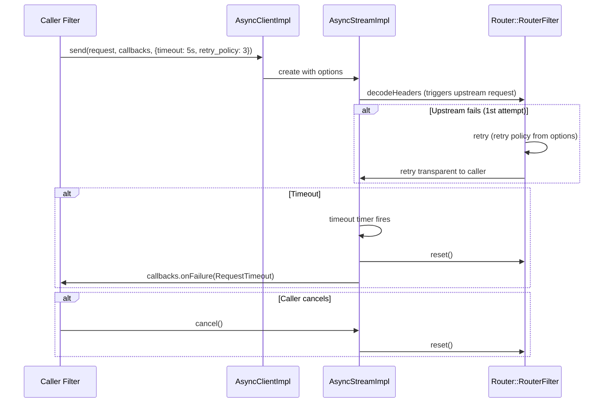

### `NullRouteImpl` Stubs

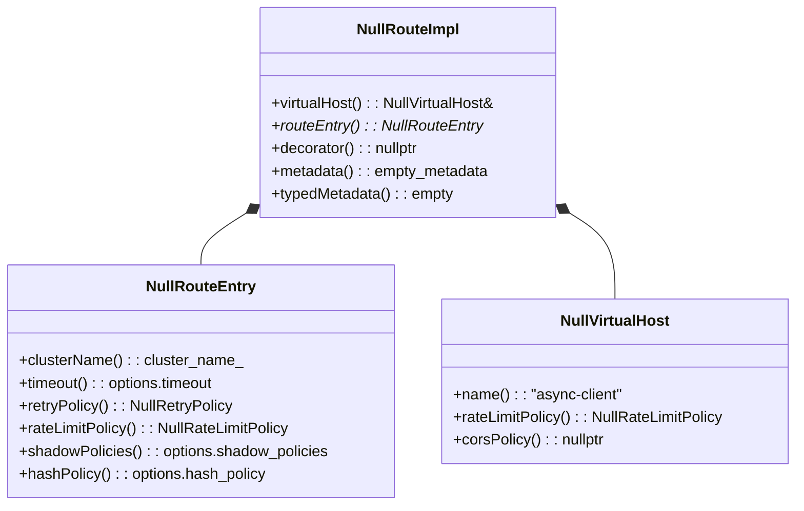

---

## 2. HTTP Server Properties Cache

**Files:** `http_server_properties_cache_impl.h/.cc`, `http_server_properties_cache_manager_impl.h/.cc`

The `HttpServerPropertiesCacheImpl` stores **per-origin** data that influences protocol selection, primarily to support HTTP/3 via Alt-Svc headers.

### What It Caches

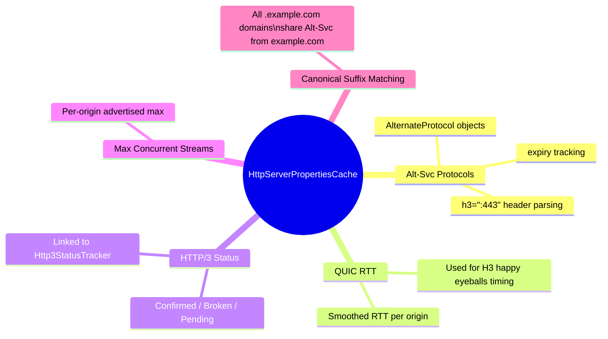

### Alt-Svc Processing Flow

```mermaid
sequenceDiagram
    participant Router as Router Filter
    participant Cache as HttpServerPropertiesCacheImpl
    participant Grid as ConnectivityGrid

    Router->>Cache: findAlternates(origin)
    Cache-->>Router: [] (no H3 known yet)
    Router->>Grid: use TCP pool

    Note over Router: Response arrives with Alt-Svc: h3=":443"; ma=86400
    Router->>Cache: setAlternates(origin, [h3:443, expires=+86400s])

    Router->>Cache: findAlternates(origin)
    Cache-->>Router: [AlternateProtocol{h3, port=443}]
    Router->>Grid: prefer H3 pool for this origin
```

### Cache Eviction

The cache is backed by `quiche::QuicheLinkedHashMap` (LRU order) with a configurable size limit. When the limit is reached, the least-recently-used origin entry is evicted:

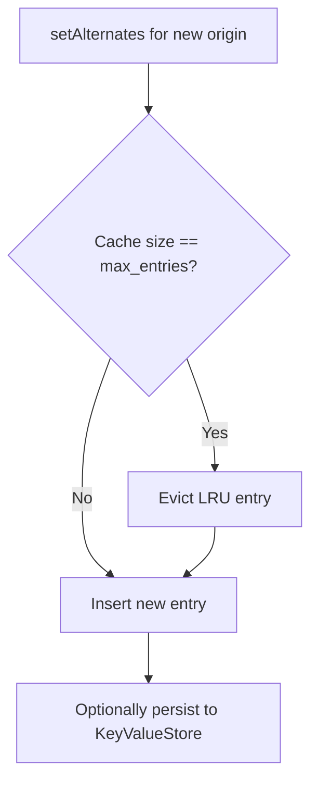

### Persistence via `KeyValueStore`

If a `KeyValueStore` is configured, the cache serializes to disk on insert and restores on startup — enabling Alt-Svc knowledge to survive Envoy restarts without waiting for re-discovery:

```mermaid
flowchart LR
    A[Envoy startup] --> B[KeyValueStore::iterate()]
    B --> C[Deserialize entries into Cache]

    D[setAlternates(origin, protos)] --> E[Cache::storeAlternate()]
    E --> F[KeyValueStore::addOrUpdate(key, serialized)]
```

### Cache Manager

`HttpServerPropertiesCacheManagerImpl` is a singleton (per-thread-local) that manages one cache instance per configured cluster:

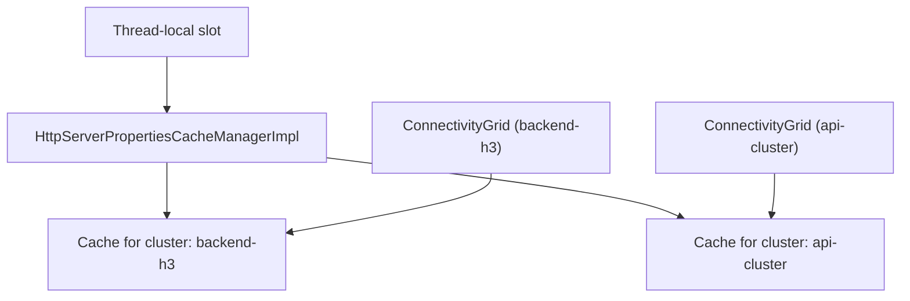

---

## 3. HTTP/3 Status Tracker

**Files:** `http3_status_tracker_impl.h/.cc`

`Http3StatusTrackerImpl` manages the per-origin HTTP/3 health state with exponential backoff to avoid hammering broken H3 endpoints.

### State Machine

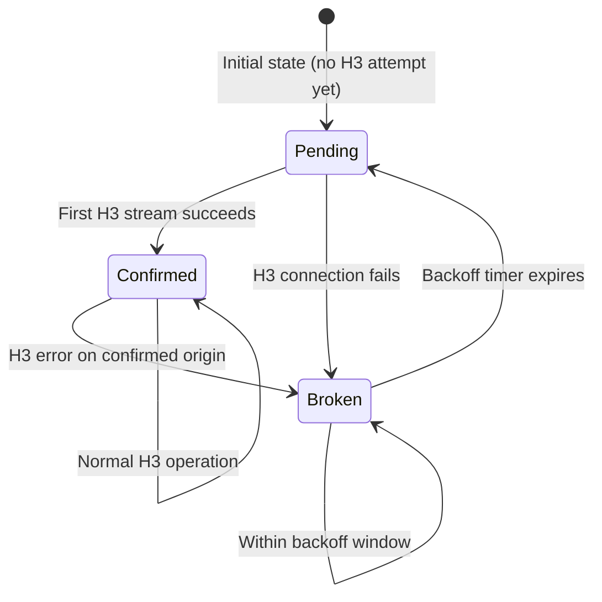

### Exponential Backoff Schedule

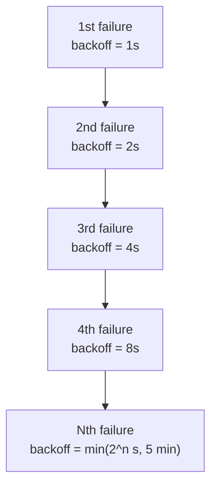

### Integration with ConnectivityGrid

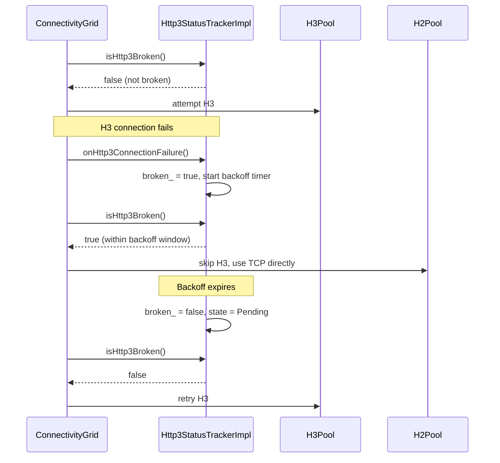

---

## 4. Watermark and Backpressure System

Envoy uses a hierarchical watermark system to prevent buffer exhaustion at every level of the stack.

### Watermark Hierarchy

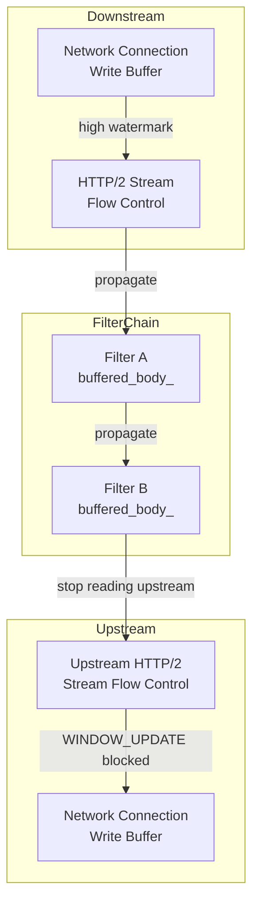

### Watermark Events

| Event | Direction | Effect |
|-------|-----------|--------|
| `onAboveWriteBufferHighWatermark` | Downstream → Filter Chain | Pause encoding to downstream |
| `onBelowWriteBufferLowWatermark` | Downstream → Filter Chain | Resume encoding to downstream |
| `onDecoderFilterAboveWriteBufferHighWatermark` | Filter → Connection Manager | Pause reading from upstream |
| `onDecoderFilterBelowWriteBufferLowWatermark` | Filter → Connection Manager | Resume reading from upstream |
| `onEncoderFilterAboveWriteBufferHighWatermark` | Filter → Router | Pause upstream response buffering |

### `StreamFilterSidestreamWatermarkCallbacks`

Used by side-stream filters (filters that make their own upstream requests while processing the main stream):

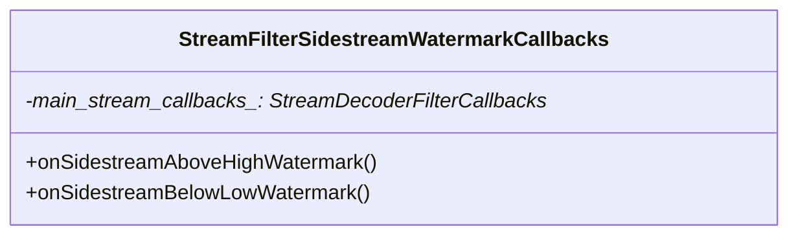

---

## 5. Request ID Extension

**Files:** `request_id_extension_impl.h/.cc`

The default `RequestIDExtension` generates and propagates `x-request-id` (UUID v4):

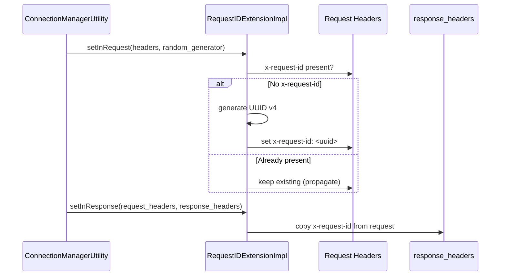

### Custom Implementations

The `RequestIDExtension` interface can be replaced (via `request_id_extension` config) with custom implementations that use different ID formats (e.g., trace IDs, W3C Trace Context).

---

## 6. Overload Manager Integration

`ConnectionManagerImpl` integrates with Envoy's `OverloadManager` to shed load when the process is under resource pressure (CPU, memory, file descriptors).

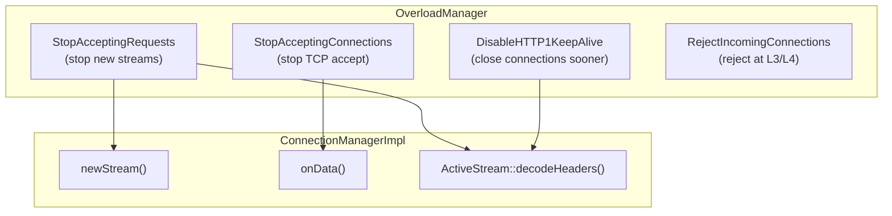

### Overload Actions in Request Flow

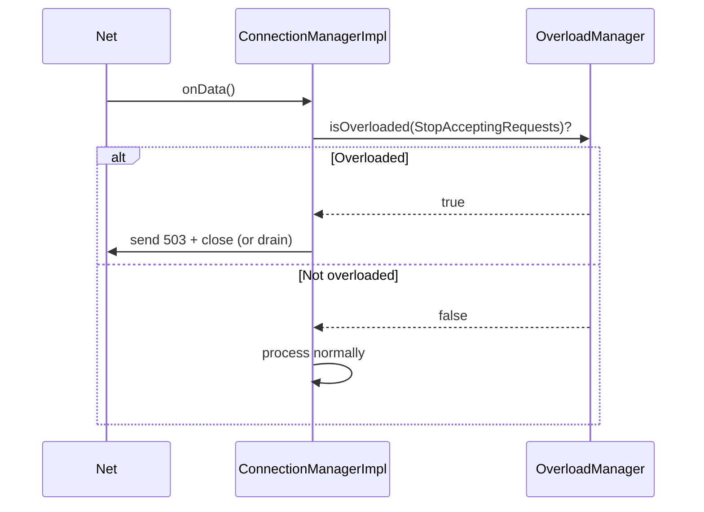

---

## 7. Session Idle List

**Files:** `session_idle_list.h/.cc`, `session_idle_list_interface.h`

`SessionIdleList` is an overload-aware data structure that tracks idle HTTP/2 and HTTP/3 streams and evicts them when Envoy is under memory pressure.

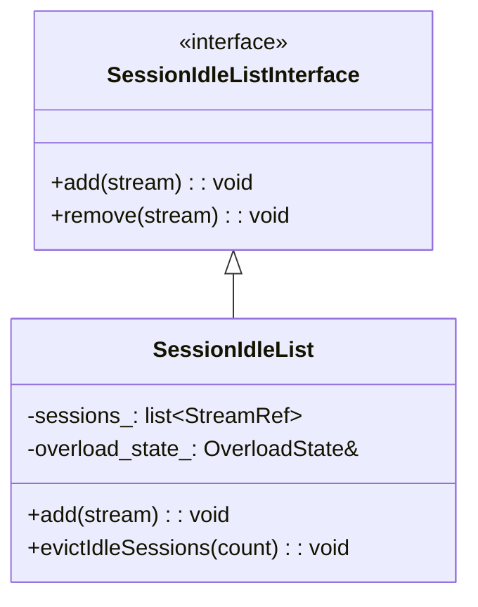

### Eviction Strategy

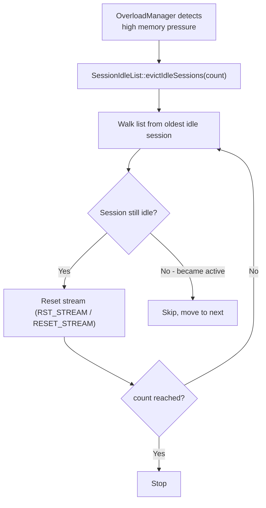

---

## 8. MuxDemux — Fan-Out Streaming

**Files:** `muxdemux.h/.cc`

`MuxDemux` enables a single upstream request to fan out to multiple `AsyncClient::Stream` subscribers. Used internally for features like mirroring and multi-consumer response streaming.

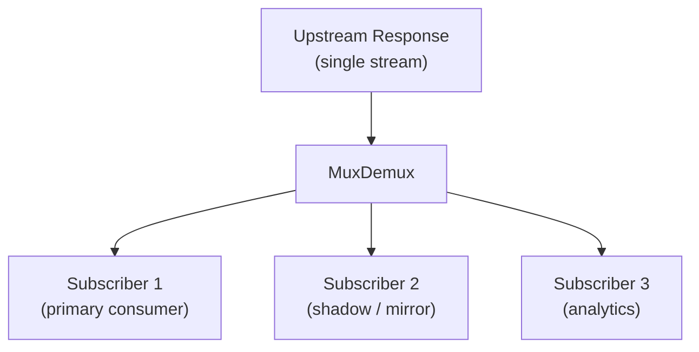

### `MultiStream` — Fan-Out Semantics

```mermaid
classDiagram
    class MuxDemux {
        +addStream(decoder): void
        +removeStream(decoder): void
        -streams_: list~ResponseDecoder*~
    }

    class MultiStream {
        +decodeHeaders(headers, end_stream)
        +decodeData(data, end_stream)
        +decodeTrailers(trailers)
        -streams_: list~ResponseDecoder*~
    }

    MultiStream --> MuxDemux : uses
```

---

## 9. Tracing Integration

`ConnectionManagerImpl` integrates tracing at the `ActiveStream` level:

```mermaid
sequenceDiagram
    participant AS as ActiveStream
    participant Tracer as Tracing::HttpTracerImpl
    participant Span as Tracing::Span

    AS->>AS: decodeHeaders()
    AS->>CMU: mutateTracingRequestHeader()
    CMU->>AS: sampling decision

    alt Sampled
        AS->>Tracer: startSpan(config, request_headers, stream_info, ...)
        Tracer-->>AS: Span (active)
        AS->>Span: setTag("http.method", "GET")
        AS->>Span: setTag("http.url", "/api/v1")
        Note over AS: Request processed...
        AS->>Span: setTag("http.status_code", "200")
        AS->>Span: finishSpan()
        AS->>Tracer: injectContext(span, request_headers)
    else Not sampled
        AS->>AS: NullSpan (no-op)
    end
```

### Tracing Stats Charged by `ConnectionManagerImpl`

| Sampling Reason | Stat |
|----------------|------|
| `RandomSampling` | `tracing.random_sampling` |
| `ServiceForced` | `tracing.service_forced` |
| `ClientForced` | `tracing.client_enabled` |
| `NotTraced` | `tracing.not_traceable` |
| `HealthCheck` | `tracing.health_check` |

---

## 10. SSE Parser

**Files:** `sse/sse_parser.h/.cc`

The SSE (Server-Sent Events) parser handles chunked streaming responses in the SSE format (`text/event-stream`):

```mermaid
flowchart TD
    DataChunk["HTTP response data chunk:\n'data: hello world\n\n'"] --> SSE["SseParser::decode(chunk)"]
    SSE --> E1["Event { type=message, data='hello world', id='' }"]
    SSE --> E2["... more events"]
    E1 --> CB["Callback::onEvent(event)"]
```

### SSE Event Format

```
data: <payload>\n
event: <optional event type>\n
id: <optional event id>\n
retry: <optional reconnect time ms>\n
\n
(blank line = event boundary)
```

---

## 11. Matching Framework Integration

**Directory:** `matching/`

The matching sub-directory provides input data sources for the Envoy unified Matcher API, allowing HTTP-specific attributes to be used in generic match trees.

```mermaid
classDiagram
    class HttpRequestHeadersDataInput {
        +get(data): RequestHeaderMap&
    }

    class HttpResponseHeadersDataInput {
        +get(data): ResponseHeaderMap&
    }

    class HttpResponseStatusCodeInput {
        +get(data): uint64_t (status code)
    }

    class HttpResponseStatusCodeClassInput {
        +get(data): StatusCodeClass (1xx/2xx/3xx/4xx/5xx)
    }

    class DataInput~T~ { <<interface>> }
    DataInput <|-- HttpRequestHeadersDataInput
    DataInput <|-- HttpResponseHeadersDataInput
    DataInput <|-- HttpResponseStatusCodeInput
    DataInput <|-- HttpResponseStatusCodeClassInput
```

### Matcher Usage in Filter Config

```yaml
# Example: per-filter match tree in HTTP filter config
http_filters:
  - name: envoy.filters.http.jwt_authn
    typed_config: ...
    config_discovery:
      apply_default_config_without_warming: true
    # Match tree: only apply JWT auth to /api/* paths
    config_discovery:
      ...
```

```mermaid
flowchart TD
    Req["Incoming Request"] --> MT["MatchTree::match(HttpMatchingDataImpl)"]
    MT --> Input1["HttpRequestHeadersDataInput\n(provides :path, :method, etc.)"]
    MT --> B{path matches /api/*?}
    B -->|Yes| Action["Apply JwtAuthn filter"]
    B -->|No| Skip["Skip filter"]
```

---

## 12. Component Interaction Summary

The following diagram shows how all major components in `source/common/http/` interact with each other:

```mermaid
graph TD
    subgraph "Entry Point"
        CMI["ConnectionManagerImpl"]
    end

    subgraph "Protocol Detection & Codec Creation"
        CMU["ConnectionManagerUtility"]
        H1["Http1::ServerConnectionImpl"]
        H2["Http2::ServerConnectionImpl"]
        H3["Http3::ServerConnectionImpl"]
    end

    subgraph "Per-Request"
        AS["ActiveStream"]
        DFM["DownstreamFilterManager"]
        FM_Filters["Filter Chain (A→B→C)"]
    end

    subgraph "Upstream"
        RF["Router::RouterFilter"]
        Pool["ConnPool\n(H1/H2/H3/Grid/Mixed)"]
        CC["CodecClient"]
        HSP["HttpServerPropertiesCache"]
        H3ST["Http3StatusTracker"]
    end

    subgraph "Headers"
        HMI["HeaderMapImpl"]
        HU["HeaderUtility"]
        HM["HeaderMutation"]
    end

    subgraph "Internal Client"
        ACI["AsyncClientImpl"]
        ASI["AsyncStreamImpl"]
        NRI["NullRouteImpl"]
    end

    subgraph "Advanced"
        OLM["OverloadManager"]
        SIL["SessionIdleList"]
        Tracer["Tracing::HttpTracerImpl"]
        RID["RequestIDExtension"]
    end

    CMI --> CMU
    CMU --> H1 & H2 & H3
    H1 & H2 & H3 --> AS
    AS --> DFM
    DFM --> FM_Filters
    FM_Filters --> RF
    RF --> Pool
    Pool --> CC
    Pool --> HSP
    HSP --> H3ST
    AS --> HMI
    HMI --> HU
    HU --> HM
    ACI --> ASI
    ASI --> RF
    ASI --> NRI
    CMI --> OLM
    CMI --> SIL
    AS --> Tracer
    CMU --> RID
```

---

## Navigation

| Part | Topics |
|------|--------|
| [Part 1](OVERVIEW_PART1_request_pipeline.md) | Architecture, Request Pipeline, ConnectionManager, FilterSystem |
| [Part 2](OVERVIEW_PART2_codecs_and_pools.md) | Codecs (H1/H2/H3), Connection Pools, Protocol Details |
| [Part 3](OVERVIEW_PART3_headers_and_utilities.md) | Header System, Utilities, Path Normalization |
| **Part 4 (this file)** | Async Client, HTTP/3, Server Properties, Advanced Topics |

---

## Index of Individual File Documentation

| File | Individual Doc |
|------|---------------|
| `conn_manager_impl.h/.cc` | [conn_manager_impl.md](conn_manager_impl.md) |
| `filter_manager.h/.cc` | [filter_manager.md](filter_manager.md) |
| `codec_client.h/.cc` | [codec_client.md](codec_client.md) |
| `header_map_impl.h/.cc` | [header_map_impl.md](header_map_impl.md) |
| `conn_pool_base.h/.cc` + `conn_pool_grid.h/.cc` | [conn_pool_base_and_grid.md](conn_pool_base_and_grid.md) |
| `async_client_impl.h/.cc` | [async_client_impl.md](async_client_impl.md) |
| `conn_manager_utility.h/.cc` | [conn_manager_utility.md](conn_manager_utility.md) |
