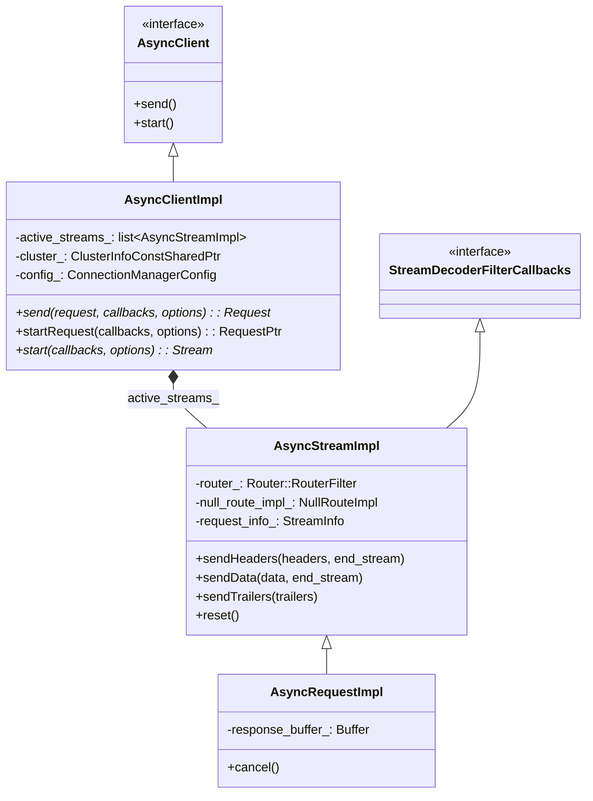
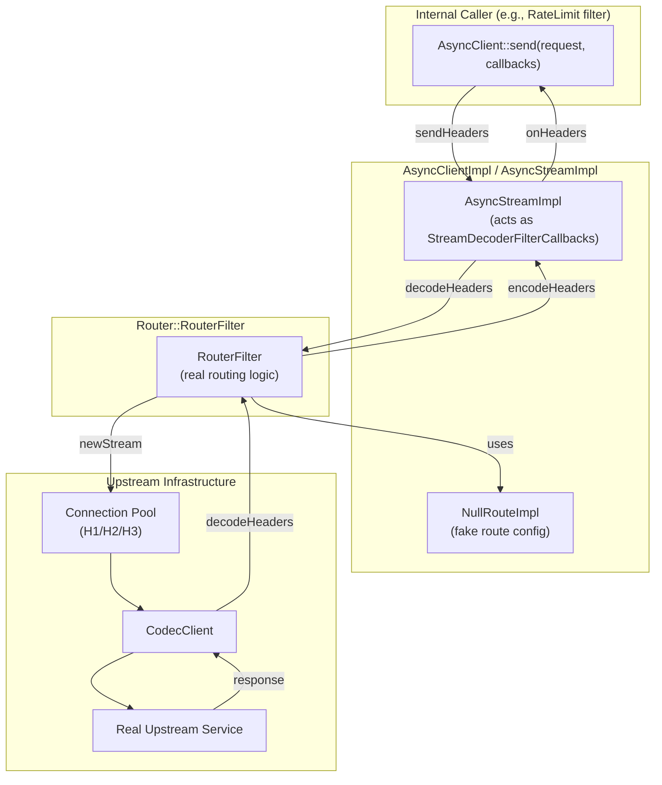
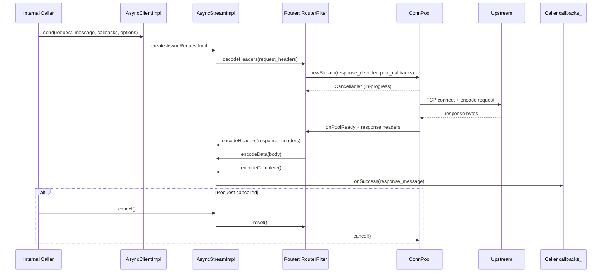
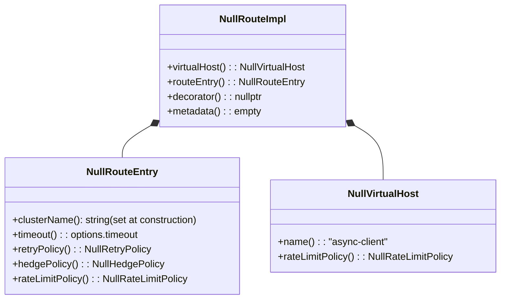
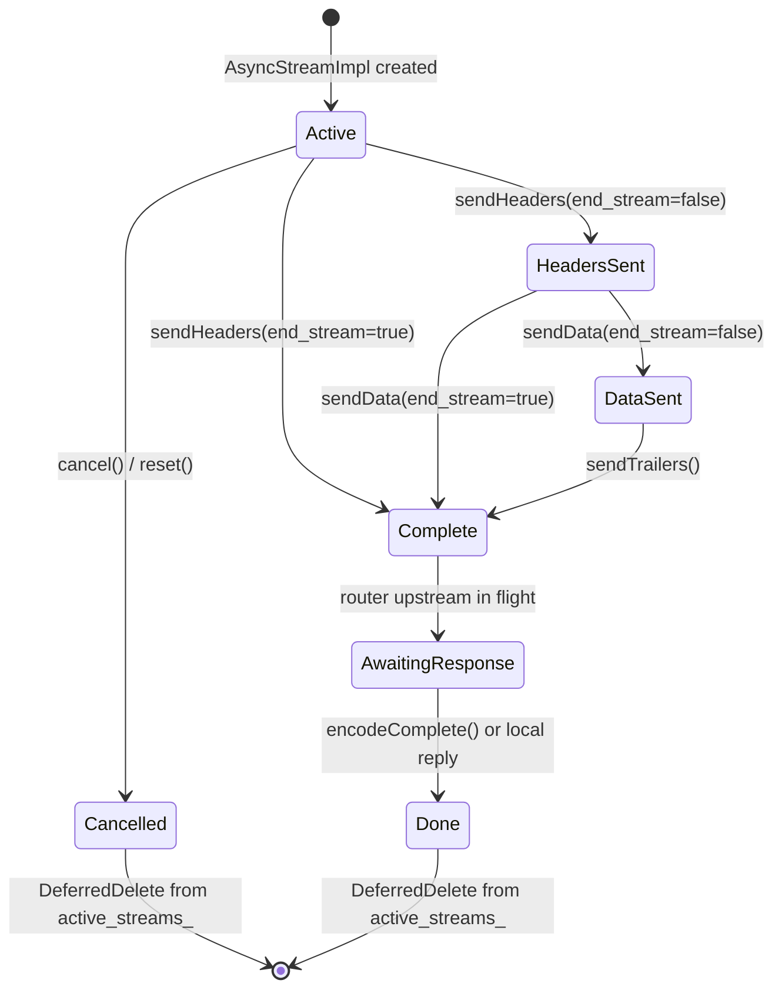

# AsyncClientImpl

**File:** `source/common/http/async_client_impl.h` / `.cc`  
**Size:** ~18 KB header, ~21 KB implementation  
**Namespace:** `Envoy::Http`

## Overview

`AsyncClientImpl` is Envoy's in-process HTTP client, used for internal requests (e.g., rate-limit service calls, auth calls, health checks). It implements `Http::AsyncClient` and creates `AsyncStreamImpl` objects that plug into the full router/filter chain without going through the network layer on the downstream side.

## Class Hierarchy

## Architecture: How AsyncClient Bypasses the Network

`AsyncStreamImpl` masquerades as a `StreamDecoderFilterCallbacks` — the same interface that real HTTP filters implement — and plugs directly into the `Router::RouterFilter`. This means async client requests go through real routing, load balancing, retries, and shadowing, but bypass the downstream network layer.

## Send Request Flow

## `AsyncStreamImpl` as Filter Callbacks

`AsyncStreamImpl` implements `StreamDecoderFilterCallbacks` to satisfy the `Router::RouterFilter`'s expectations. It provides stub/minimal implementations for most callbacks and real implementations for the ones the router actually uses:

| Callback | Implementation |
|----------|---------------|
| `streamInfo()` | Returns real `StreamInfo` for the async request |
| `dispatcher()` | Returns the cluster manager dispatcher |
| `connection()` | Returns `nullopt` (no real downstream connection) |
| `route()` | Returns `NullRouteImpl` (fake route) |
| `sendLocalReply(...)` | Converts to error response for the caller |
| `continueDecoding()` | Triggers router to proceed |
| `addDecodedData()` | Buffers decoded data |
| `encodeHeaders()` | Forwards to `AsyncClient::Callbacks::onHeaders()` |
| `encodeData()` | Accumulates or streams to caller |
| `encodeTrailers()` | Forwards to caller |

## `NullRouteImpl` — Fake Route for AsyncClient

Since async client requests don't have a real downstream connection with a route configuration, `NullRouteImpl` provides stub implementations for all `Router::Route`, `Router::RouteEntry`, and `Router::VirtualHost` interfaces.

## Request vs. Stream API

| API | Class | Use Case |
|-----|-------|---------|
| `send(message, callbacks, options)` | `AsyncRequestImpl` | One-shot request/response (buffered) |
| `start(callbacks, options)` | `AsyncStreamImpl` | Streaming bidirectional (e.g., gRPC) |
| `startRequest(callbacks, options)` | `AsyncStreamImpl` | Streaming request (chunked upload) |

### Buffering Limits

| Direction | Default Limit |
|-----------|--------------|
| Request body (buffered before upstream ready) | 64 KB |
| Response body (buffered for `onSuccess`) | 32 MB |

## Retry and Shadow Support

`AsyncStreamImpl` uses the same `Router::RouterFilter` as normal requests, so it automatically supports:

- **Retries**: Configured via `AsyncClient::RequestOptions::retry_policy`
- **Shadowing**: Configured via `AsyncClient::RequestOptions::shadow_policy`
- **Timeouts**: `AsyncClient::RequestOptions::timeout`
- **Hash policy**: `AsyncClient::RequestOptions::hash_policy`

## Lifecycle & Cleanup

## Thread Safety

`AsyncClientImpl` is owned by the cluster manager and is used only on a single worker thread's event loop. There is no locking. All callbacks (`onSuccess`, `onFailure`, `onHeaders`, `onData`) are invoked synchronously on the same thread.
