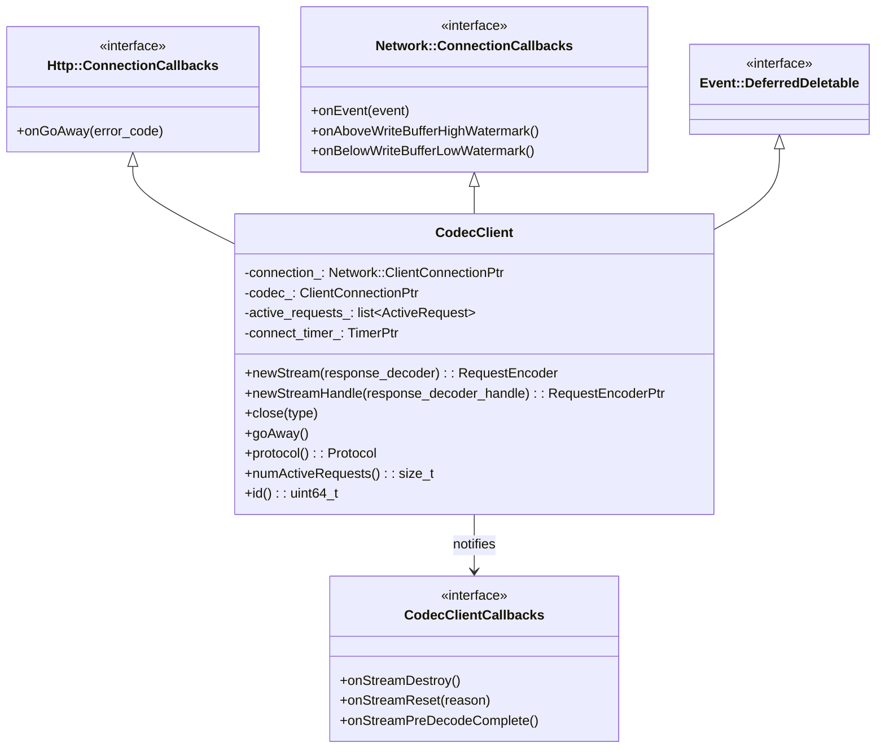
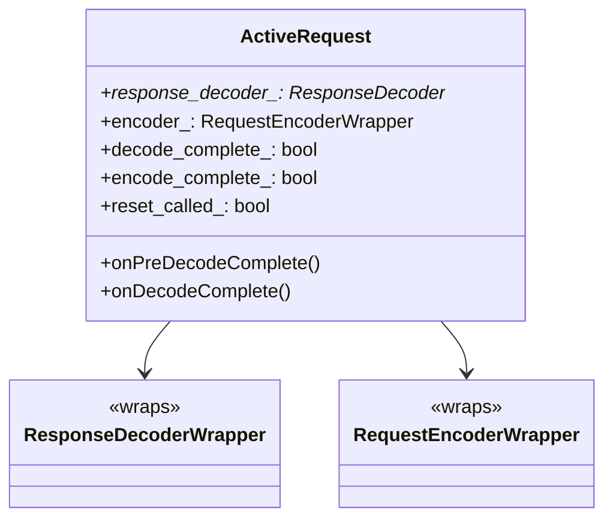
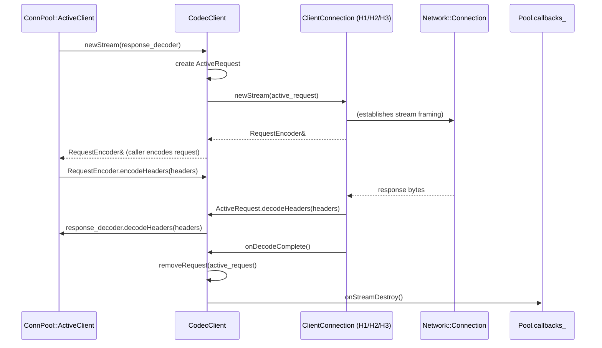
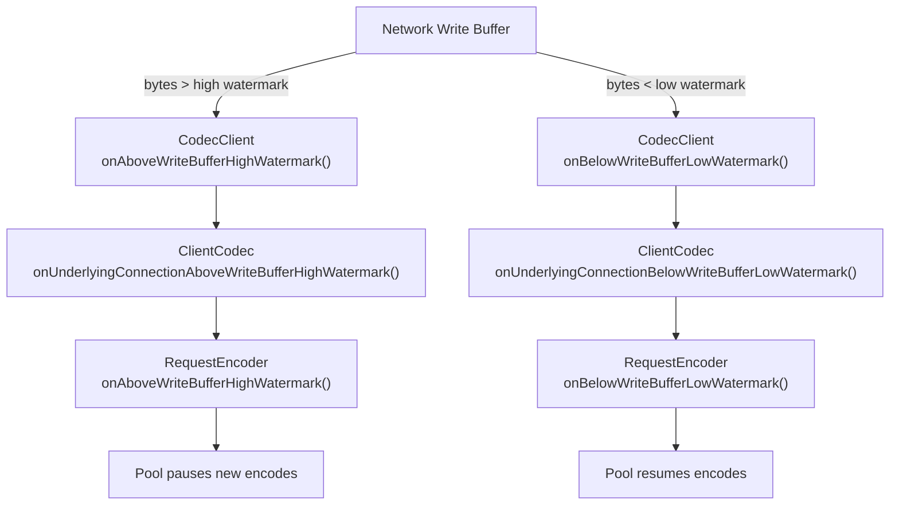
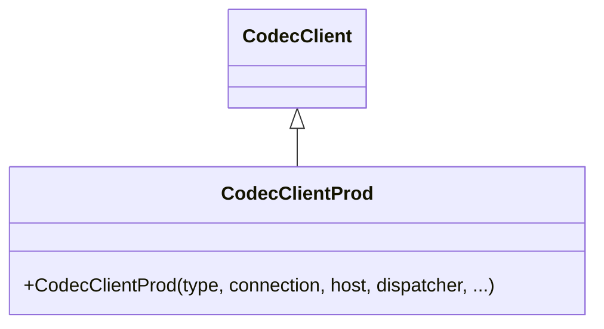

# CodecClient

**File:** `source/common/http/codec_client.h` / `.cc`  
**Size:** ~12 KB header, ~13 KB implementation  
**Namespace:** `Envoy::Http`

## Overview

`CodecClient` is Envoy's **upstream HTTP client** abstraction. It wraps a single `Network::Connection` with an HTTP codec on top (HTTP/1.1, HTTP/2, or HTTP/3) and presents a uniform stream-creation API to the connection pool layer. The pool creates one `CodecClient` per upstream TCP/QUIC connection.

## Class Hierarchy



## Inner Type: `ActiveRequest`

Each in-flight HTTP request is tracked by an `ActiveRequest` object:



## Connection Lifecycle

```mermaid
stateDiagram-v2
    [*] --> Connecting : CodecClient constructed
    Connecting --> Connected : Network::ConnectionEvent::Connected
    Connecting --> ConnectTimeout : connect_timer_ fires
    Connected --> Active : newStream() called
    Active --> Active : more streams (H2/H3 only)
    Active --> GoingAway : onGoAway() received
    GoingAway --> Closed : all active_requests_ drained
    Connected --> Closed : Network::ConnectionEvent::RemoteClose
    Connected --> Closed : close() called
    ConnectTimeout --> [*] : connection destroyed
    Closed --> [*] : DeferredDelete
```

## Stream Creation Flow



## Protocol-Specific Behavior

| Aspect | HTTP/1.1 | HTTP/2 | HTTP/3 (QUIC) |
|--------|----------|--------|---------------|
| Concurrency | 1 stream at a time (no pipelining enforced by CodecClient) | Multiple streams per connection | Multiple streams per QUIC connection |
| GOAWAY | N/A (no concept) | `onGoAway()` — stops new streams | QUIC CONNECTION_CLOSE |
| Half-close | Supported | Not applicable | Not applicable |
| Connect timeout | `connect_timer_` | `connect_timer_` | QUIC handshake timeout |
| Stream reset | `onStreamReset(reason)` | RST_STREAM | RESET_STREAM |

## Watermark / Backpressure



## Error Handling

| Event | Handler | Outcome |
|-------|---------|---------|
| Connect timeout | `connect_timer_` callback | Close connection, notify pool |
| Protocol error | `onEvent(RemoteClose)` | `onStreamReset(RemoteReset)` per active request |
| GOAWAY (H2) | `onGoAway(error_code)` | Stop accepting new streams; drain existing |
| Stream reset | `ActiveRequest::onResetStream(reason)` | Notify `CodecClientCallbacks::onStreamReset()` |
| Codec error (absl::Status) | Propagated from codec dispatch | Connection closed |

## `CodecClientProd`

The production subclass `CodecClientProd` extends `CodecClient` and instantiates the real codec via a codec factory. It is used in all non-test contexts.



## Key Configuration

| Parameter | Purpose |
|-----------|---------|
| `CodecType` | H1 / H2 / H3 — determines which codec implementation is used |
| `connect_timeout` | Duration for `connect_timer_` |
| `max_response_headers_count` | Passed to codec to limit response header count |
| `header_validator_factory` | Optional UHV (Universal Header Validator) for protocol compliance |
