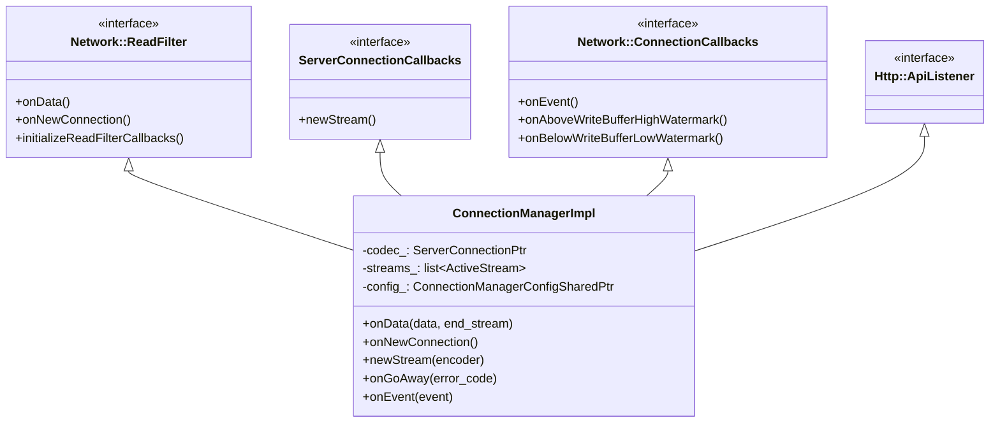
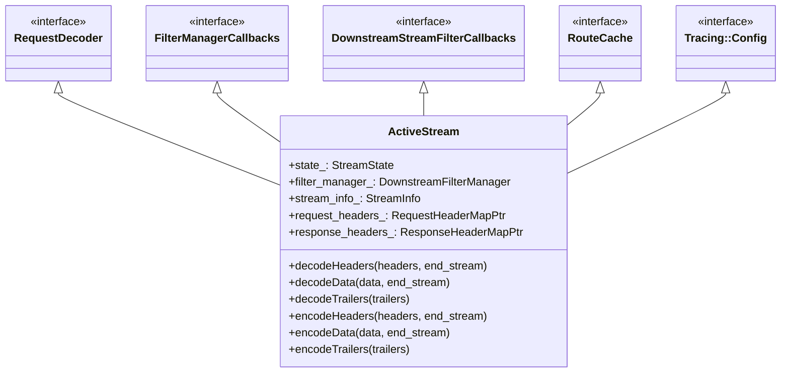
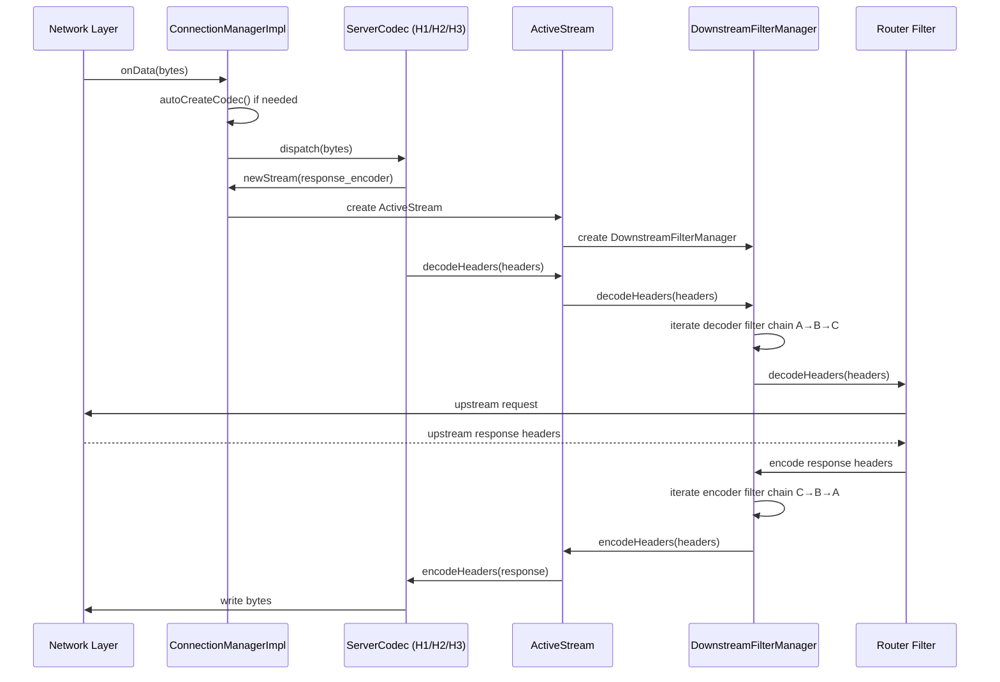
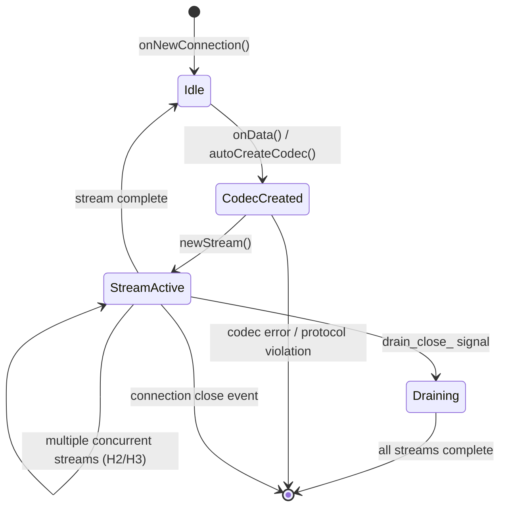
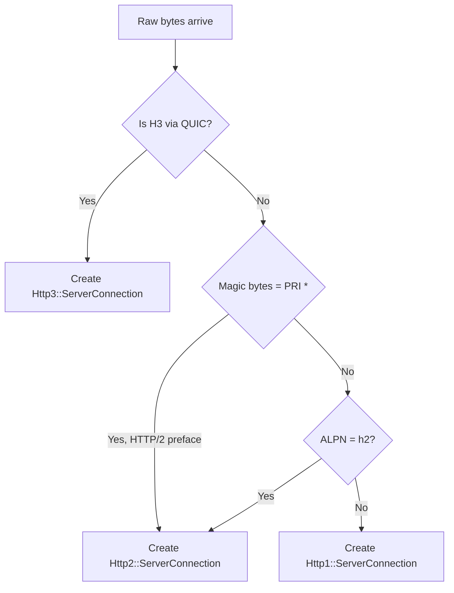
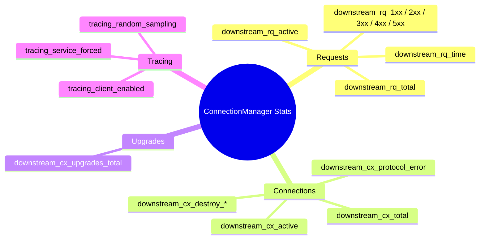

# ConnectionManagerImpl

**File:** `source/common/http/conn_manager_impl.h` / `.cc`  
**Size:** ~34 KB header, ~118 KB implementation  
**Namespace:** `Envoy::Http`

## Overview

`ConnectionManagerImpl` is the central hub of Envoy's HTTP processing pipeline. It is a `Network::ReadFilter` installed on every HTTP listener connection and is responsible for:

- Detecting and instantiating the appropriate HTTP codec (H1/H2/H3)
- Creating and lifecycle-managing one `ActiveStream` per request/push
- Routing decoded data through the downstream filter chain
- Enforcing connection-level policies (drain, overload, idle timeouts, flood protection)

## Class Hierarchy

## Key Inner Types

### `ActiveStream`

Each HTTP request/response pair is represented by an `ActiveStream`, a private nested struct inside `ConnectionManagerImpl`. It is the single object that bridges the downstream network layer, the filter chain, and the upstream router.

## Request Lifecycle

## Connection State Machine

## Codec Auto-Detection

## Flood Protection

`ConnectionManagerImpl` tracks several counters to detect and mitigate protocol-level flooding:

| Counter | Threshold Source | Action |
|---------|-----------------|--------|
| `PrematureResetTotalStreamCountKey` | Runtime flag | Close connection if too many premature resets |
| `MaxRequestsPerIoCycle` | Runtime flag | Limit streams processed per I/O event |
| Downstream overload | `OverloadManager` | Shed load via 503 or connection close |
| Idle stream timeout | Config | Reset idle streams |

## Stats Generated

## Key Static Helpers

| Method | Purpose |
|--------|---------|
| `generateStats(prefix, scope)` | Creates all `ConnectionManagerStats` counters |
| `generateTracingStats(prefix, scope)` | Creates tracing-specific counters |
| `chargeTracingStats(reason, stats)` | Increments the correct tracing counter for a sampling reason |
| `generateListenerStats(prefix, scope)` | Creates listener-scoped downstream stats |
| `continueHeader()` | Returns a cached `100 Continue` response header map |

## Thread Safety

`ConnectionManagerImpl` runs entirely on a single `Event::Dispatcher` thread (the worker thread). All callbacks (`onData`, `onEvent`, `newStream`) are dispatched on that thread. Cross-thread communication (e.g., with the main thread for RDS updates) uses thread-local slot caches.

## Key Configuration Points (`ConnectionManagerConfig`)

| Config Field | Effect |
|-------------|--------|
| `http1Settings` | H1 codec options (header case, allow chunked length) |
| `http2Options` | H2 codec options (SETTINGS, max concurrent streams) |
| `http3Options` | H3 / QUIC codec options |
| `streamIdleTimeout` | Idle timer per stream |
| `requestHeadersTimeout` | Timer from connection accept to headers received |
| `maxRequestHeadersKb` | Maximum size of request headers |
| `localReply` | Custom local reply formatting |
| `tracingConfig` | Tracer, sampling decisions |
| `routeConfigProvider` | RDS or static route table |
