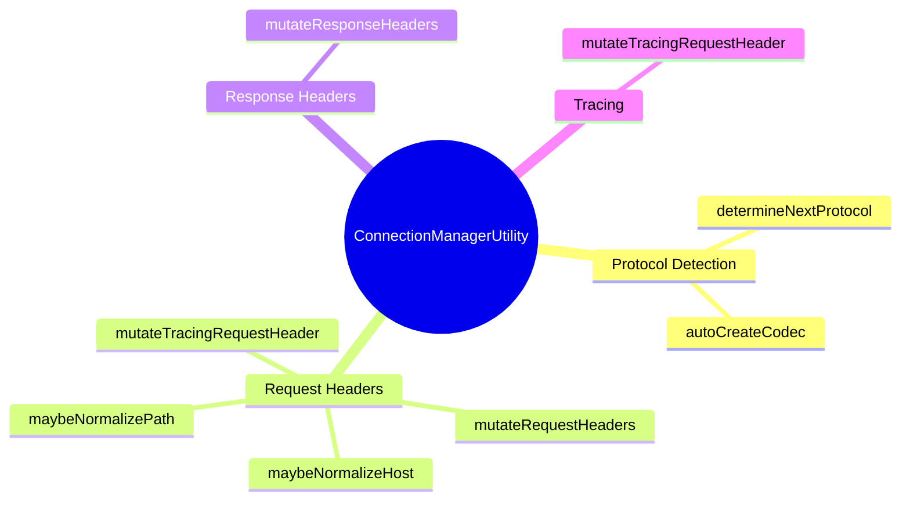
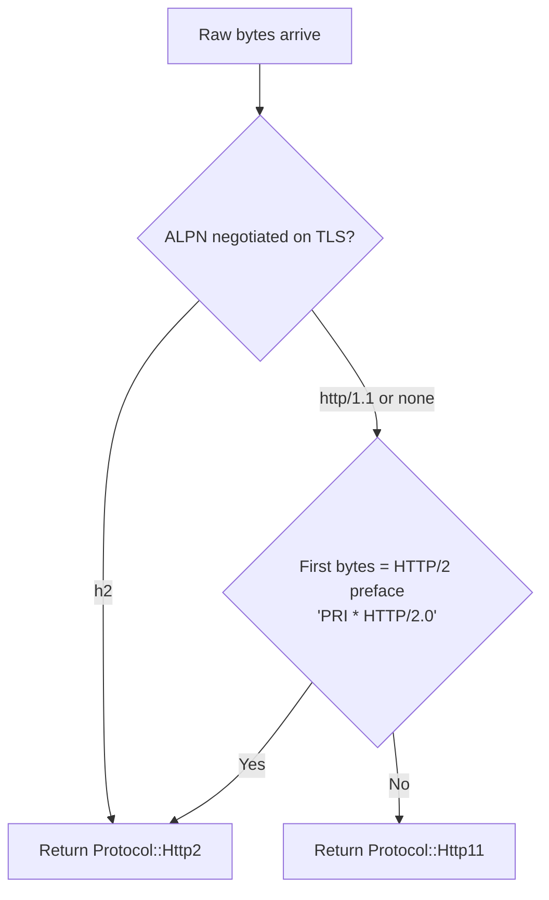
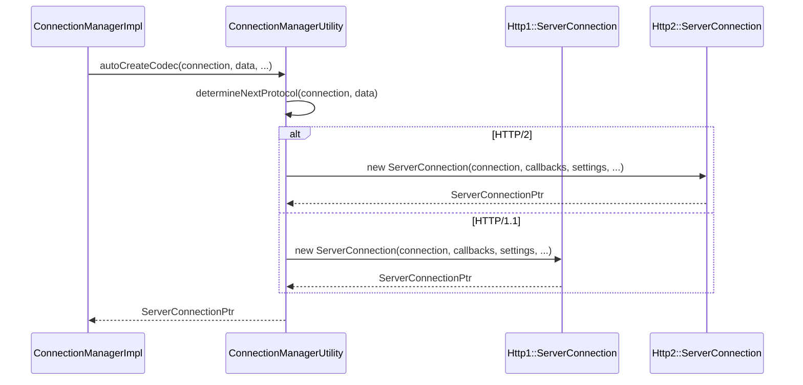
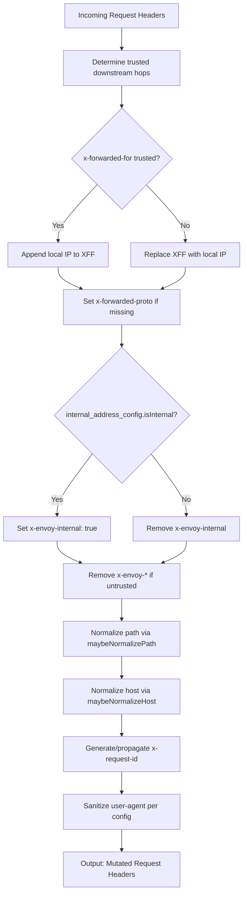
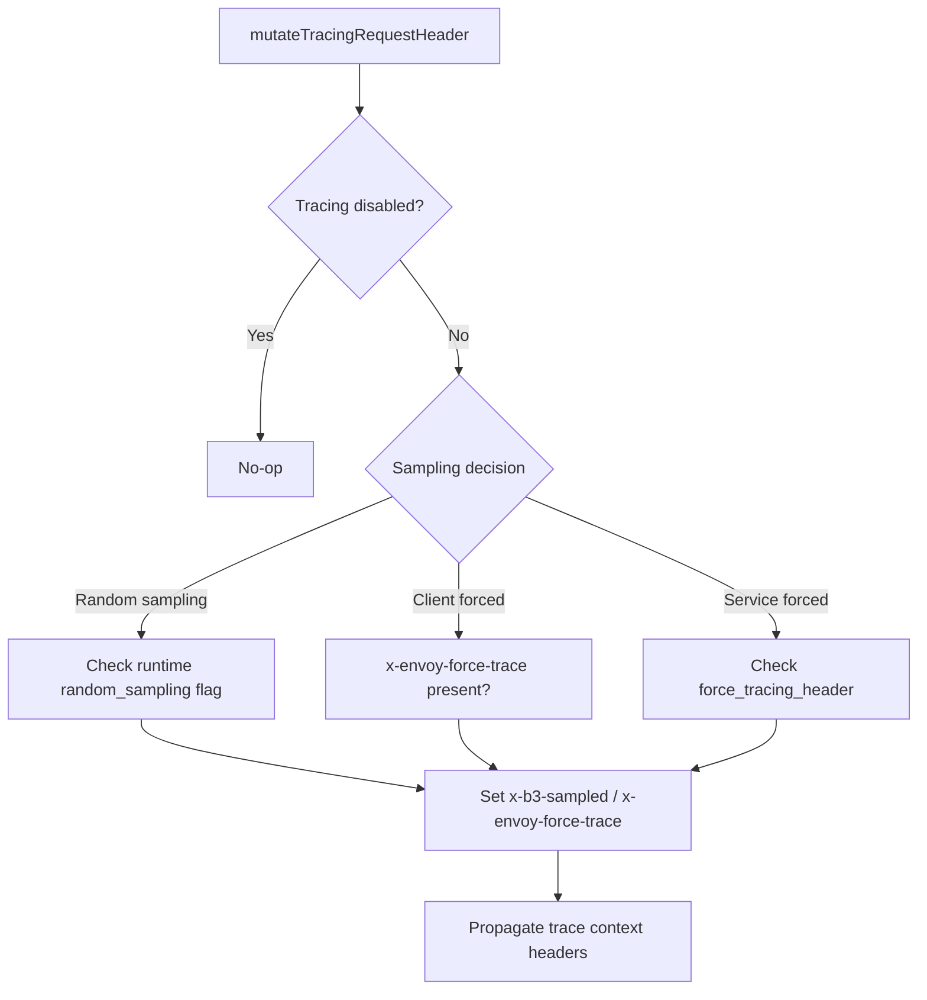
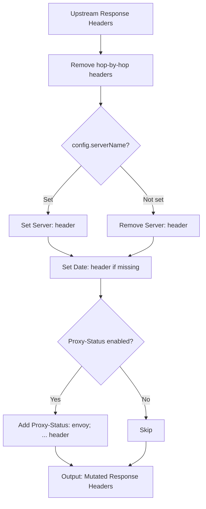
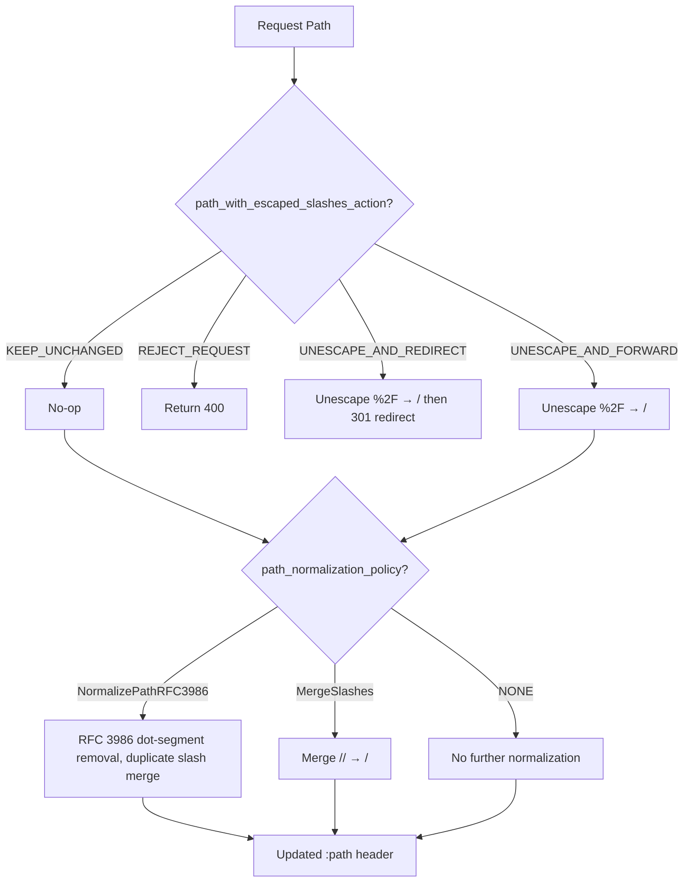
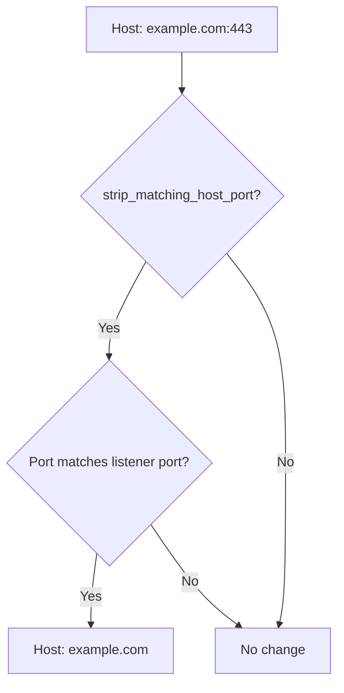
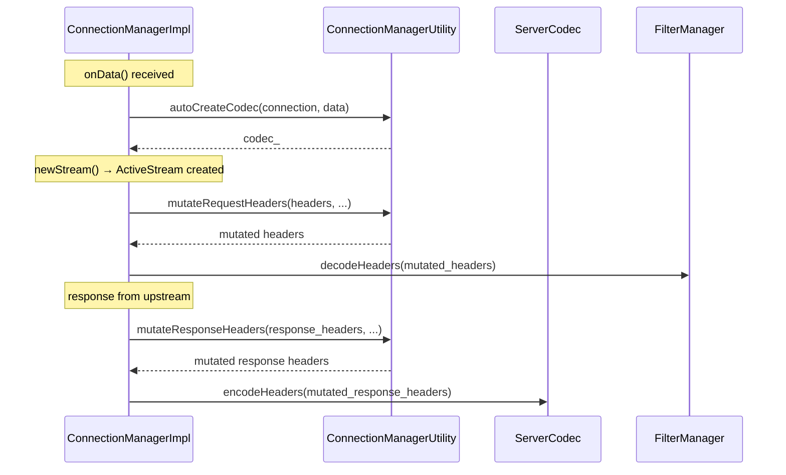

# ConnectionManagerUtility

**File:** `source/common/http/conn_manager_utility.h` / `.cc`  
**Size:** ~6.8 KB header, ~32 KB implementation  
**Namespace:** `Envoy::Http`

## Overview

`ConnectionManagerUtility` is a **stateless utility class** containing pure static methods used by `ConnectionManagerImpl`. It handles protocol detection, codec instantiation, request/response header mutation, path normalization, and tracing header injection. By being stateless, it is trivially testable and has no dependency on the connection manager's lifecycle.

## Static Methods Overview



## Protocol Detection Flow

### `determineNextProtocol(connection, data)`

Sniffs the first bytes of a connection to determine H1 vs H2:



### `autoCreateCodec(connection, data, callbacks, ...)`

Creates the appropriate `ServerConnection` based on protocol detection:



## Request Header Mutation

### `mutateRequestHeaders(headers, connection, config, ...)`

The most complex utility method. Applied to every incoming downstream request before entering the filter chain:



### Headers Added / Modified

| Header | Action | Condition |
|--------|--------|-----------|
| `x-forwarded-for` | Append or replace client IP | Always |
| `x-forwarded-proto` | Set `http` or `https` | If missing |
| `x-envoy-internal` | Set `true` | If internal address |
| `x-envoy-decorator-operation` | Set from route | If route has decorator |
| `x-request-id` | Generate UUID or propagate | Always (if extension enabled) |
| `x-envoy-*` (upstream directives) | Remove | If downstream is untrusted |
| `user-agent` | Append Envoy version | If configured |

### `mutateTracingRequestHeader(headers, runtime, config, ...)`

Injects tracing context into the request headers based on sampling decisions:



## Response Header Mutation

### `mutateResponseHeaders(headers, request_headers, config, ...)`

Applied to every upstream response before entering the encoder filter chain:



### Hop-by-Hop Headers Removed

Per HTTP/1.1 spec (RFC 7230), these are always stripped from proxied responses:

- `Connection`
- `Keep-Alive`
- `Proxy-Authenticate`
- `Proxy-Authorization`
- `TE`
- `Trailer`
- `Transfer-Encoding`
- `Upgrade`
- Any header listed in the `Connection` header value

## Path Normalization

### `maybeNormalizePath(headers, config)`



### `maybeNormalizeHost(headers, config, port)`

Strips the port number from the `Host`/`:authority` header if it matches the listener port (to avoid duplicate port issues):



## `determineNextProtocol` — Detailed Byte Inspection

```
H2 preface bytes: "PRI * HTTP/2.0\r\n\r\nSM\r\n\r\n"
                   ↑ First 3 bytes checked: "PRI"

If first bytes == "PRI" → HTTP/2
Otherwise             → HTTP/1.1
```

## Key Enums and Config Options

| Config Field | Options | Effect |
|-------------|---------|--------|
| `path_normalization_policy` | NONE, NormalizePathRFC3986, MergeSlashes | Controls path canonicalization |
| `path_with_escaped_slashes_action` | KEEP, REJECT, UNESCAPE_REDIRECT, UNESCAPE_FORWARD | Controls `%2F` handling |
| `xff_num_trusted_hops` | integer | How many XFF hops to trust |
| `skip_xff_append` | bool | Suppress adding client IP to XFF |
| `via` | string | Value for `Via:` header (if set) |
| `server_name` | string | Value for `Server:` response header |
| `strip_matching_host_port` | bool | Strip port from Host if matches listener |
| `proxy_status_config` | ProxyStatusConfig | Controls Proxy-Status response header |

## Relationship to `ConnectionManagerImpl`


