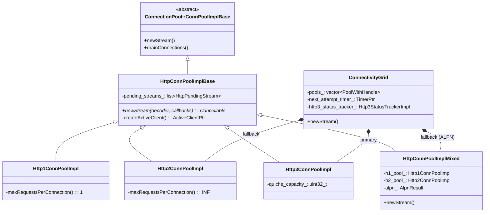
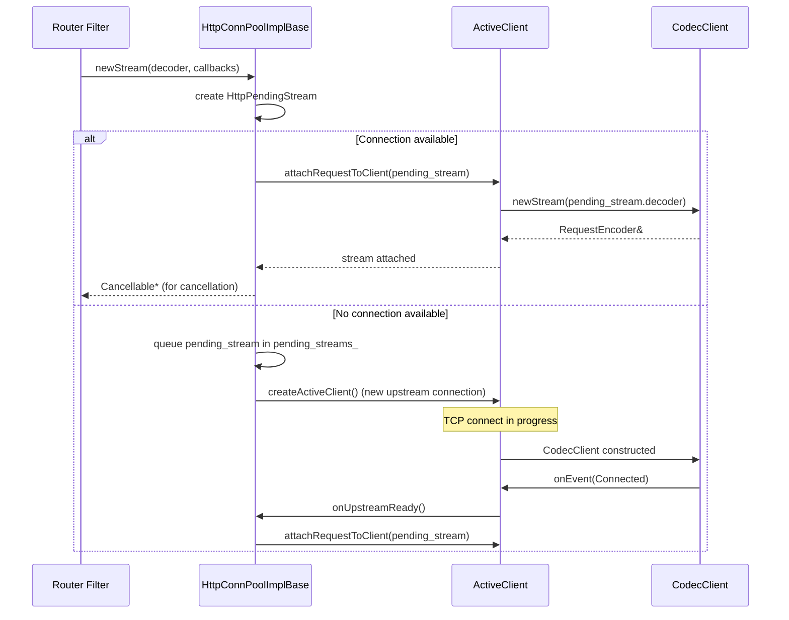
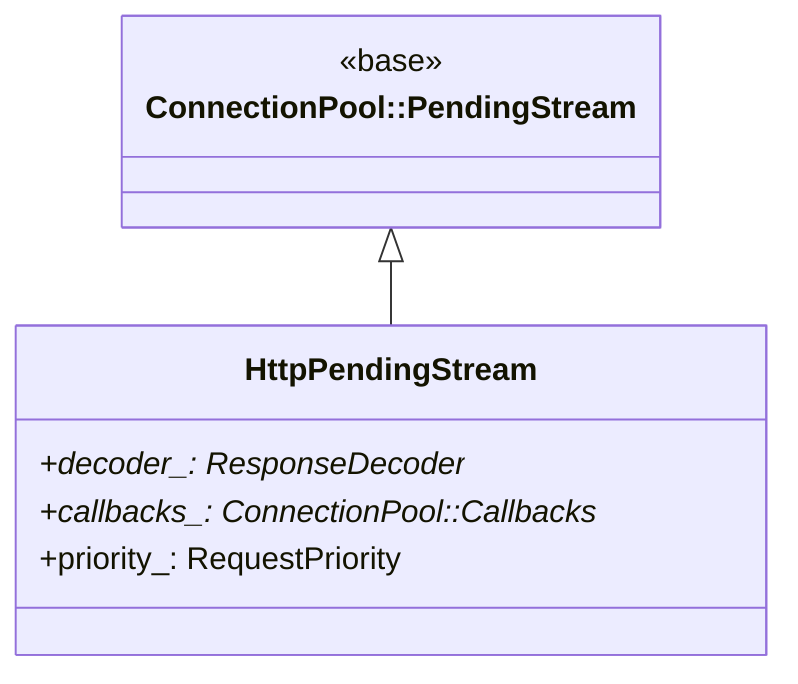
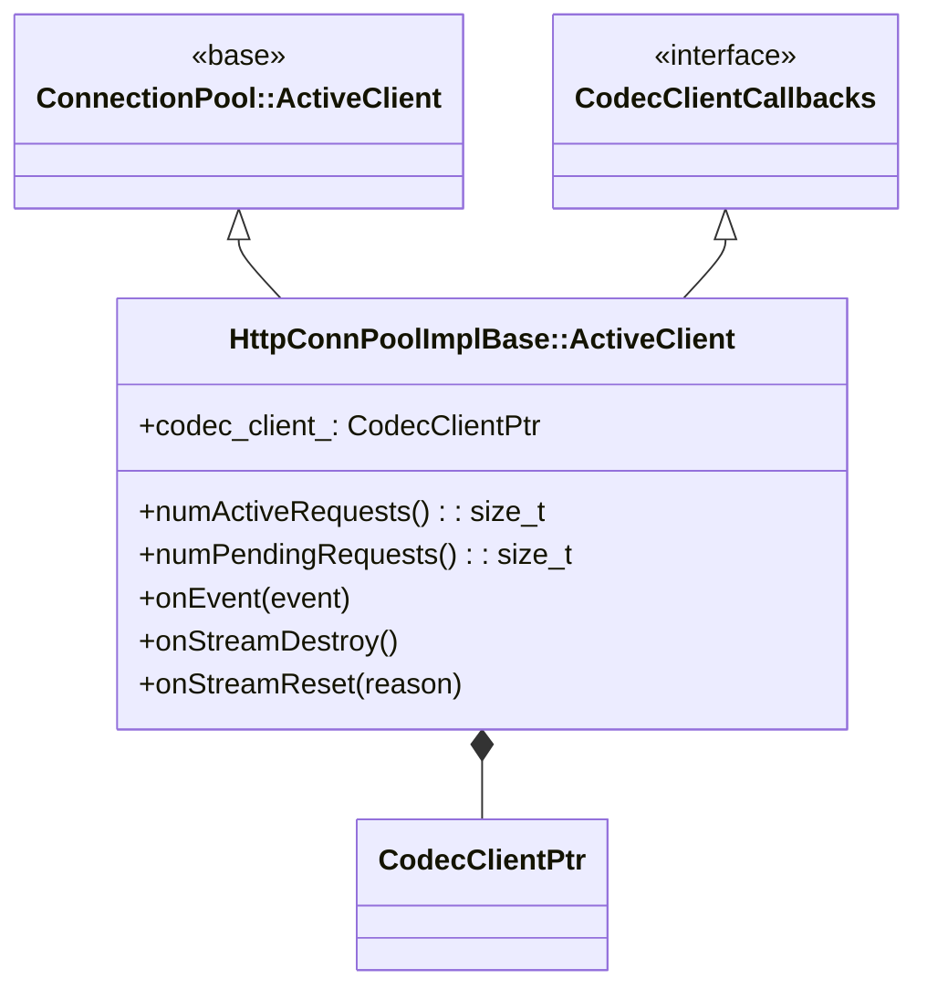
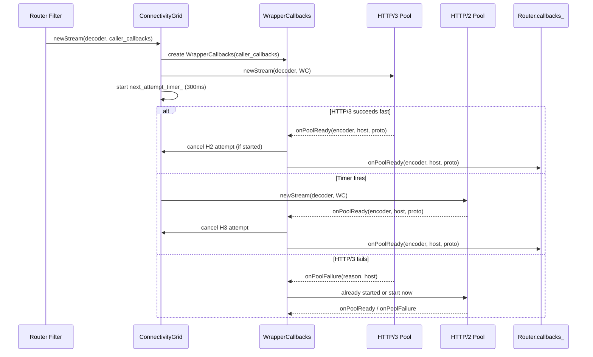
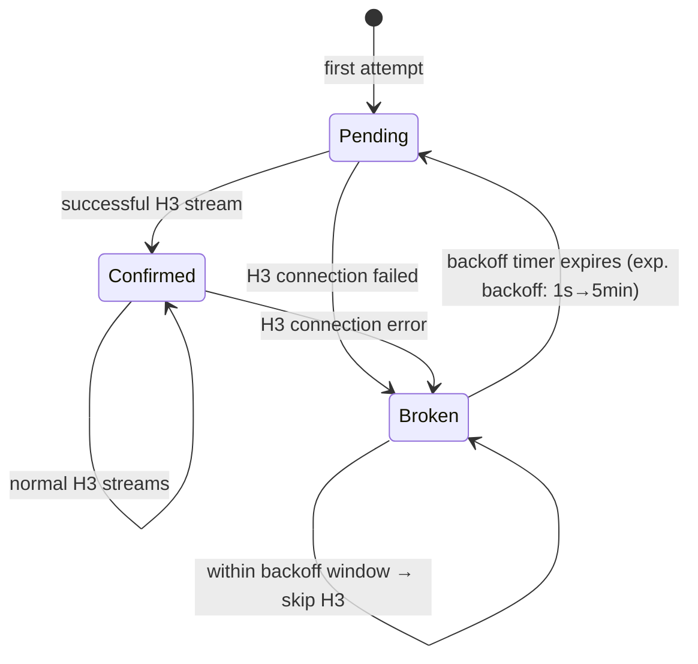
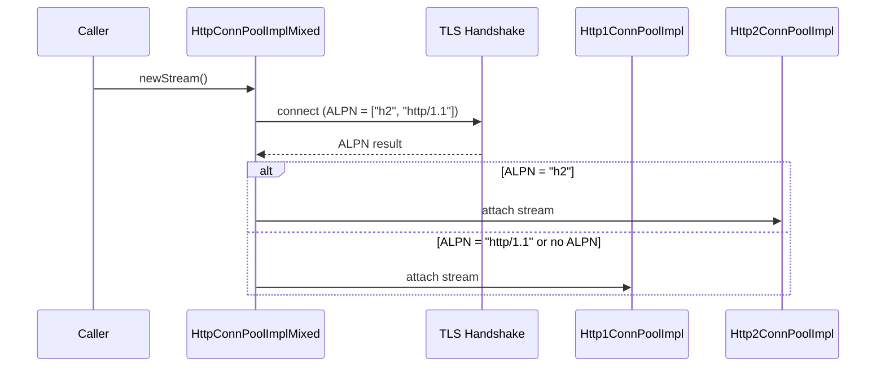

# Connection Pool Base & Connectivity Grid

**Files:**  
- `source/common/http/conn_pool_base.h` / `.cc` (~11 KB / ~9.9 KB)  
- `source/common/http/conn_pool_grid.h` / `.cc` (~14 KB / ~25 KB)  
- `source/common/http/mixed_conn_pool.h` / `.cc` (~1.9 KB / ~4.6 KB)  
**Namespace:** `Envoy::Http`

---

## Overview

The connection pool stack manages upstream HTTP connections across all three protocol versions. `HttpConnPoolImplBase` is the shared base; protocol-specific subclasses (`http1`, `http2`, `http3`) extend it. `ConnectivityGrid` adds HTTP/3-first with automatic TCP fallback and IPv4/IPv6 happy eyeballs.

## Pool Hierarchy



## `HttpConnPoolImplBase` — Core Pool Logic

### Stream Lifecycle



### `HttpPendingStream`



### `ActiveClient` in HTTP Pool



---

## `ConnectivityGrid` — HTTP/3-First with Fallback

`ConnectivityGrid` implements the "happy eyeballs" approach: try HTTP/3 first; start a TCP fallback after a timeout; use whichever succeeds first.

### Pool Architecture

```mermaid
flowchart TD
    subgraph Grid["ConnectivityGrid"]
        H3["HTTP/3 Pool\n(QUIC, IPv6)"]
        H3v4["HTTP/3 Pool\n(QUIC, IPv4)"]
        H2["HTTP/2/1 Pool\n(TCP, mixed ALPN)"]
    end

    NewStream["newStream()"] --> Grid
    Grid -->|attempt 1| H3
    Grid -->|attempt 2 (after timer)| H2
    H3 -->|success| Done["Stream established"]
    H2 -->|success| Done
    H3 -->|failure| H2
```

### `WrapperCallbacks` — Attempt Orchestration

`ConnectivityGrid` wraps the caller's `ConnectionPool::Callbacks` with `WrapperCallbacks` that intercepts success/failure and manages cancellation across simultaneous attempts:



### HTTP/3 Status Tracking

`Http3StatusTrackerImpl` maintains per-origin HTTP/3 health with exponential backoff:



### Backoff Timing

| Failure Count | Backoff Duration |
|---------------|-----------------|
| 1 | 1 second |
| 2 | 2 seconds |
| 3 | 4 seconds |
| 4 | 8 seconds |
| ... | 2^n seconds |
| Max | 5 minutes |

---

## `HttpConnPoolImplMixed` — ALPN-Based H1/H2 Selection



---

## Protocol-Specific Pool Capacities

| Pool | Max Streams / Connection | Connection Reuse |
|------|--------------------------|-----------------|
| `Http1ConnPoolImpl` | 1 (sequential) | Yes (keep-alive) |
| `Http2ConnPoolImpl` | `max_concurrent_streams` (default 2^31-1) | Yes (multiplexed) |
| `Http3ConnPoolImpl` | `quiche_capacity_` (dynamic) | Yes (multiplexed) |

## Drain and Shutdown

```mermaid
flowchart TD
    A[drainConnections(reason)] --> B{reason = DrainExistingConnections?}
    B -->|Yes| C[Mark all ActiveClients as draining\nNo new streams accepted]
    B -->|No - EvictIdleConnections| D[Close idle connections immediately]
    C --> E{All requests complete?}
    E -->|Yes| F[Close connection]
    E -->|No| G[Wait for in-flight streams]
    G --> E
```

## Related Files

| File | Purpose |
|------|---------|
| `http1/conn_pool.h` | HTTP/1.1 specific pool implementation |
| `http2/conn_pool.h` | HTTP/2 specific pool implementation |
| `http3/conn_pool.h` | HTTP/3 (QUIC) specific pool implementation |
| `http3_status_tracker_impl.h` | HTTP/3 broken/confirmed state machine |
| `http_server_properties_cache_impl.h` | Alt-Svc / QUIC RTT cache used by grid |
| `codec_client.h` | The upstream client each `ActiveClient` wraps |
