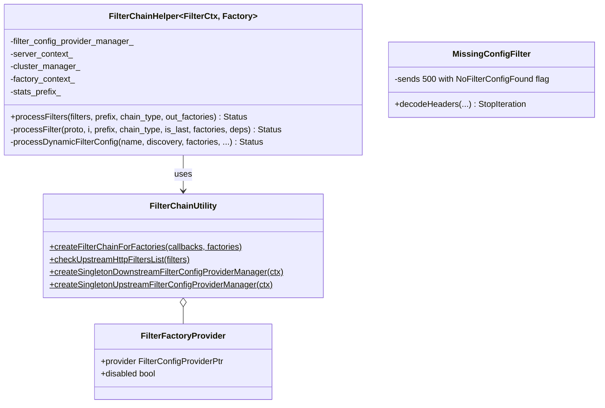
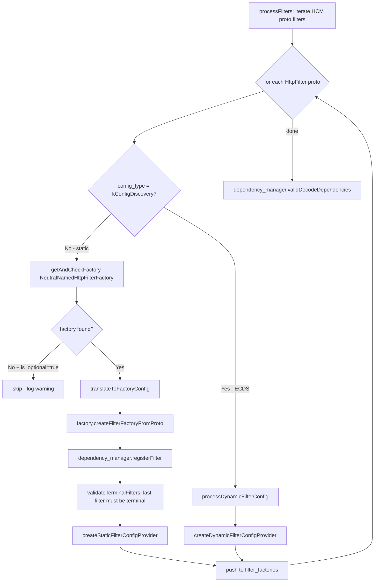
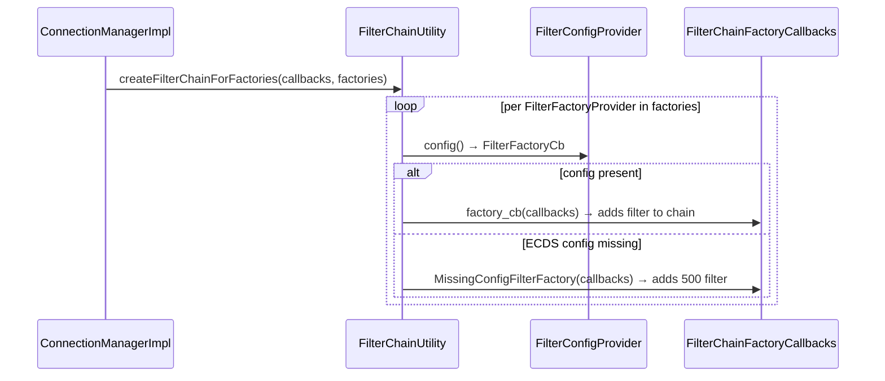

# Filter Chain Helper — `filter_chain_helper.h`

**File:** `source/common/http/filter_chain_helper.h`

Provides `FilterChainHelper<>` (a template) and `FilterChainUtility` (static helpers) for
building HTTP filter chains from protobuf config at startup. Handles both **static** filters
(typed config present at boot) and **dynamic** filters (ECDS — Extension Config Discovery
Service). Also provides `MissingConfigFilter` for graceful ECDS fallback.

---

## Class Overview



---

## `FilterChainHelper<FilterCtx, Factory>::processFilters()`

Core method that walks the `HttpFilter` repeated field from the HCM proto and produces a
`FilterFactoriesList` — one entry per filter, each containing a `FilterConfigProvider`
and a `disabled` flag.



### Static vs. Dynamic Filters

| Type | Config proto field | Provider type | Config available at boot? |
|---|---|---|---|
| **Static** | `typed_config` | `StaticFilterConfigProvider` | Yes — built immediately |
| **Dynamic (ECDS)** | `config_discovery` | `DynamicFilterConfigProvider` | No — fetched from xDS; `MissingConfigFilter` used until first delivery |

### `disabled` Flag

When `HttpFilter.disabled = true` in the proto, the filter is added to the chain but starts
**disabled by default**. It can be explicitly re-enabled per-route via route config. The
**terminal filter** (last in chain) cannot be disabled — enforced at config load time.

---

## `FilterChainUtility::createFilterChainForFactories()`

```cpp
static void createFilterChainForFactories(
    Http::FilterChainFactoryCallbacks& callbacks,
    const FilterFactoriesList& filter_factories);
```

Called **per request** (not at boot). Iterates `filter_factories` and calls the stored
`FilterFactoryCb` to instantiate each filter and add it to the request's filter chain via
`callbacks.addStreamDecoderFilter()` / `addStreamFilter()` etc.



---

## `MissingConfigFilter`

A `PassThroughDecoderFilter` used as a placeholder when an ECDS dynamic filter has not
yet received its configuration.

```cpp
Http::FilterHeadersStatus decodeHeaders(Http::RequestHeaderMap&, bool) override {
    decoder_callbacks_->streamInfo().setResponseFlag(
        StreamInfo::CoreResponseFlag::NoFilterConfigFound);
    decoder_callbacks_->sendLocalReply(
        Http::Code::InternalServerError, "", nullptr, absl::nullopt, "");
    return Http::FilterHeadersStatus::StopIteration;
}
```

Returns **500** and stops processing. The `NoFilterConfigFound` response flag is set on
`StreamInfo` so access logs and stats can distinguish these errors.

---

## Type Aliases

```cpp
using DownstreamFilterConfigProviderManager =
    Filter::FilterConfigProviderManager<
        Filter::HttpFilterFactoryCb,
        Server::Configuration::FactoryContext>;

using UpstreamFilterConfigProviderManager =
    Filter::FilterConfigProviderManager<
        Filter::HttpFilterFactoryCb,
        Server::Configuration::UpstreamFactoryContext>;
```

Separate manager instances for downstream (HCM) and upstream filter chains. Each is a
per-server singleton created via:
- `FilterChainUtility::createSingletonDownstreamFilterConfigProviderManager(ctx)`
- `FilterChainUtility::createSingletonUpstreamFilterConfigProviderManager(ctx)`

---

## `DependencyManager`

`processFilters` creates a `DependencyManager` and calls `registerFilter()` for each
static filter. After the loop, `validDecodeDependencies()` checks that filter decode
dependencies are satisfied (i.e., if filter B requires filter A's decode output, A
must appear before B in the chain). Encode dependency validation is not yet implemented
(TODO in code).

---

## Template Parameters

```cpp
template <class FilterCtx, class NeutralNamedHttpFilterFactory>
class FilterChainHelper
```

| Parameter | Downstream | Upstream |
|---|---|---|
| `FilterCtx` | `Server::Configuration::FactoryContext` | `Server::Configuration::UpstreamFactoryContext` |
| `NeutralNamedHttpFilterFactory` | `NamedHttpFilterConfigFactory` | `UpstreamHttpFilterConfigFactory` |

The template allows the same filter chain building logic to serve both downstream (HCM)
and upstream filter chains.
