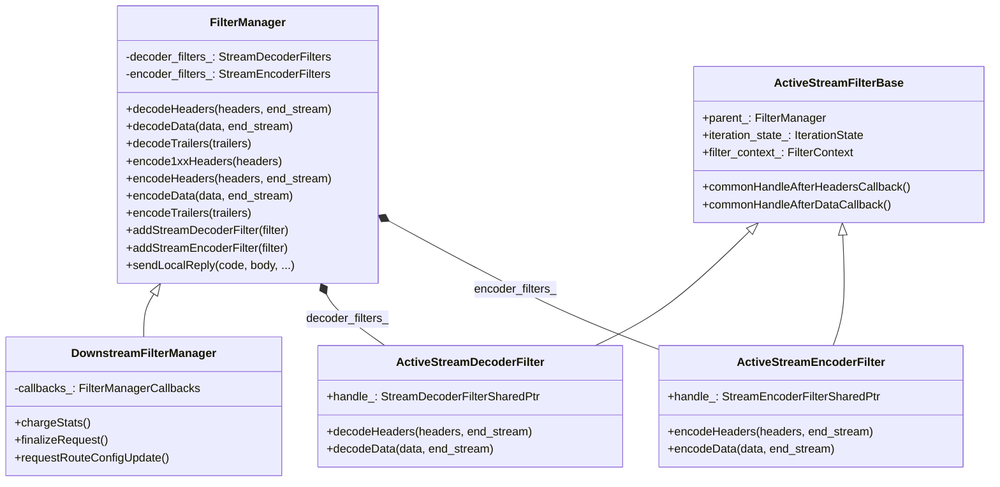
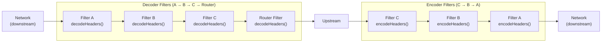
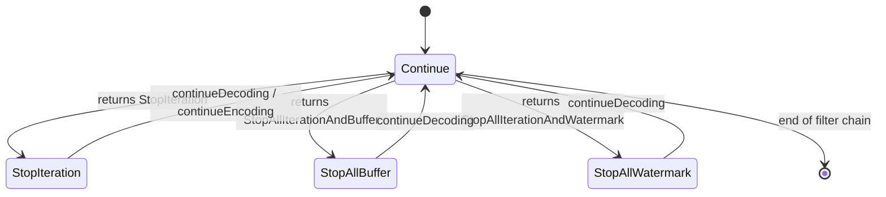
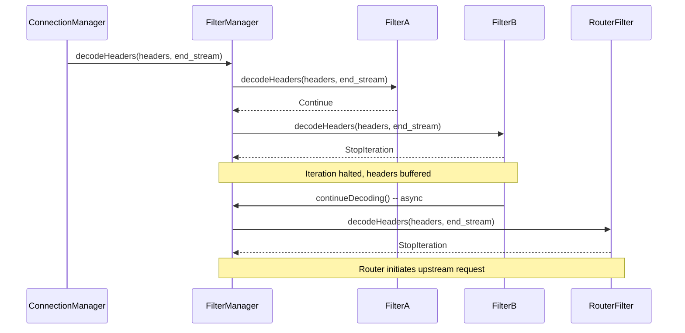
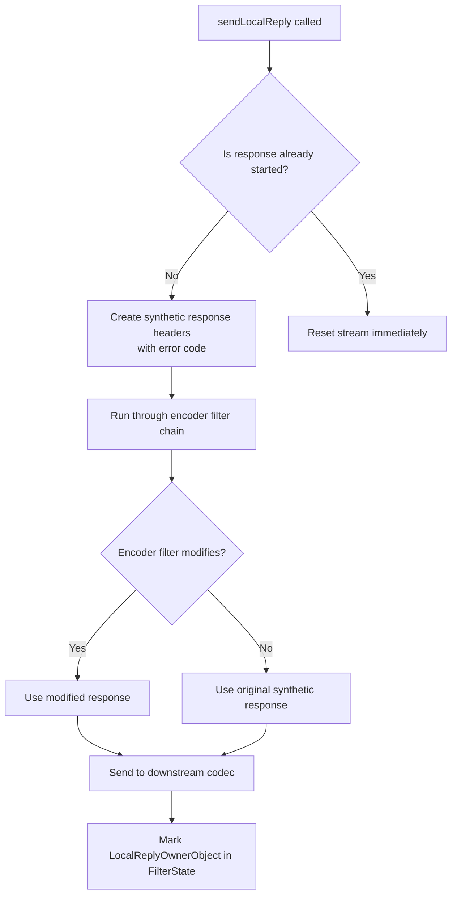
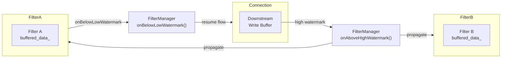
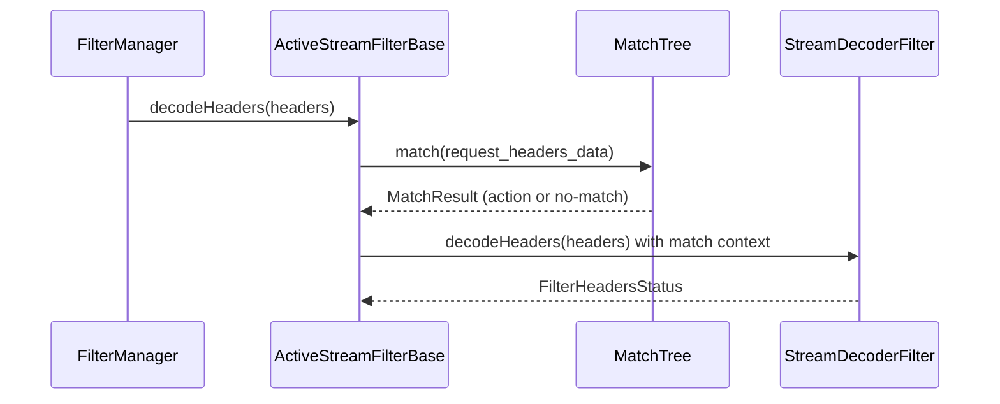

# FilterManager

**File:** `source/common/http/filter_manager.h` / `.cc`  
**Size:** ~55 KB header, ~89 KB implementation  
**Namespace:** `Envoy::Http`

## Overview

`FilterManager` is the HTTP filter chain execution engine. It maintains ordered lists of decoder and encoder filters, drives data through them, manages per-filter state (buffering, watermarks, stop/continue iteration), and handles local replies. `DownstreamFilterManager` extends it with downstream-specific behaviors (tracing, access logging, stream teardown).

## Class Hierarchy



## Filter Chain Ordering



## Filter Iteration State Machine

Each `ActiveStreamFilterBase` has its own `IterationState` that controls whether the chain continues after the filter returns.



## Decode Header Flow



## Local Reply Handling



## Buffer & Watermark Management



## Key Data Structures

### `StreamDecoderFilters`

```
vector<ActiveStreamDecoderFilterPtr>
  ├── [0] ActiveStreamDecoderFilter (wraps Filter A)
  ├── [1] ActiveStreamDecoderFilter (wraps Filter B)
  └── [2] ActiveStreamDecoderFilter (wraps Router)
         ↑ iterated forward via begin()→end()
```

### `StreamEncoderFilters`

```
vector<ActiveStreamEncoderFilterPtr>
  ├── [0] ActiveStreamEncoderFilter (wraps Filter A)
  ├── [1] ActiveStreamEncoderFilter (wraps Filter B)
  └── [2] ActiveStreamEncoderFilter (wraps Filter C)
         ↑ iterated via rbegin()→rend() (reverse: C→B→A)
```

## Filter Callback Contracts

`ActiveStreamDecoderFilter` implements `StreamDecoderFilterCallbacks` and provides:

| Callback | Behavior |
|----------|----------|
| `continueDecoding()` | Resumes iteration from the current filter |
| `stopIteration()` | Halts further filters until `continueDecoding()` |
| `addDecodedData(data, streaming)` | Injects data into the decode path |
| `injectDecodedDataToFilterChain(data, end_stream)` | Re-runs data through subsequent filters |
| `sendLocalReply(code, body, ...)` | Short-circuits with a local response |
| `dispatcher()` | Returns the event dispatcher |
| `streamInfo()` | Returns mutable `StreamInfo` for this request |
| `setUpstreamOverrideHost(host)` | Forces a specific upstream host |

`ActiveStreamEncoderFilter` implements `StreamEncoderFilterCallbacks`:

| Callback | Behavior |
|----------|----------|
| `continueEncoding()` | Resumes encoder iteration |
| `addEncodedData(data, streaming)` | Injects data into the encode path |
| `onEncoderFilterAboveWriteBufferHighWatermark()` | Propagates backpressure upstream |
| `responseRouterHeaderMutation()` | Applies route-level header mutations |

## Matching Framework Integration

Each `ActiveStreamFilterBase` optionally holds a `Matcher::MatchTree` (for per-filter match configuration). When a match tree is present:



## `DownstreamFilterManager` Extensions

`DownstreamFilterManager` adds the following behaviors on top of `FilterManager`:

| Feature | Method |
|---------|--------|
| Access logging | `finalizeRequest()` → calls all access loggers |
| Tracing | `chargeTracingStats()`, `startTracing()` |
| Stats charging | `chargeStats(response_code)` |
| Route config update | `requestRouteConfigUpdate()` via `RdsRouteConfigUpdateRequester` |
| Stream teardown | `onStreamComplete()` / `resetStream()` |

## Thread Safety

`FilterManager` is NOT thread-safe. All methods must be called from the owning worker thread's `Event::Dispatcher`. Filters that need cross-thread operations must post work back to the dispatcher.
