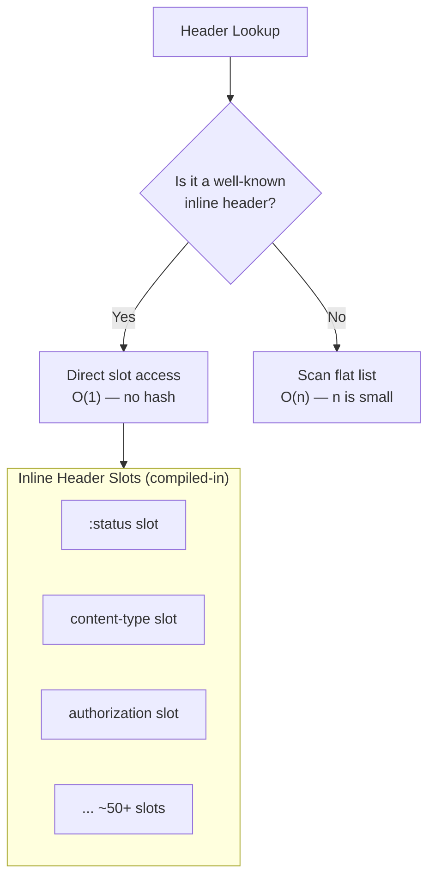
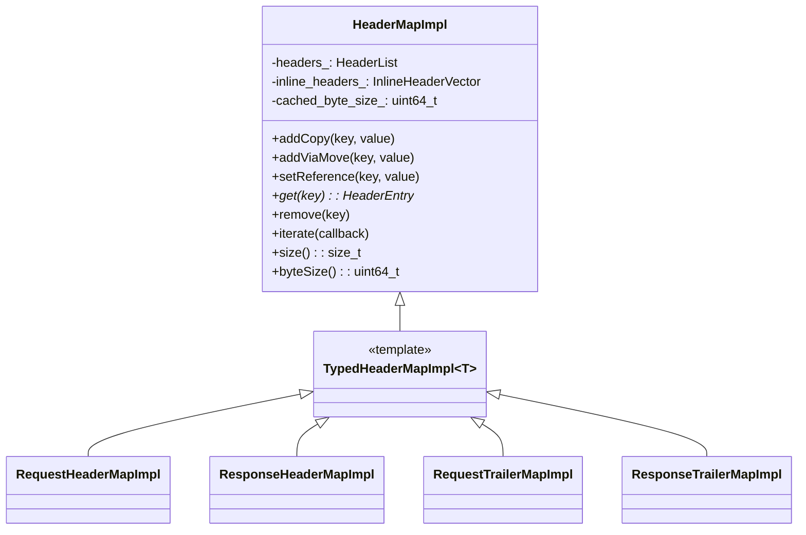
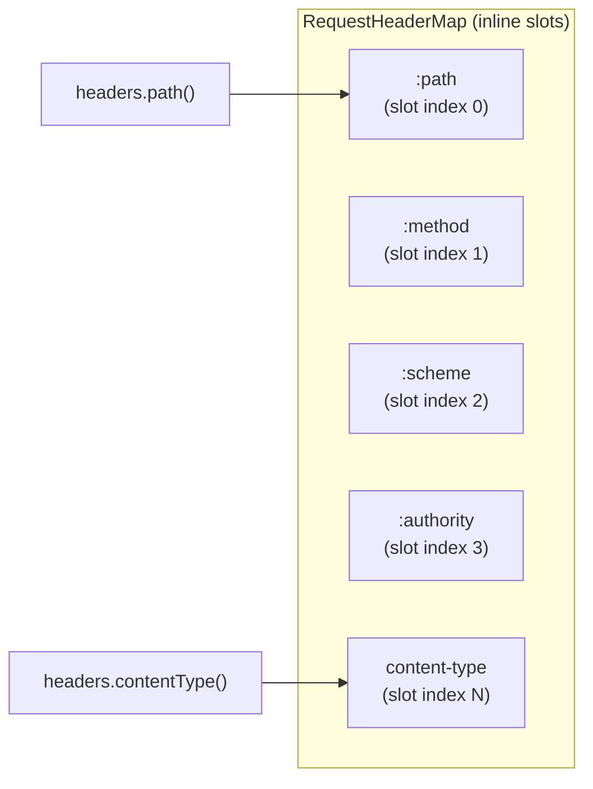
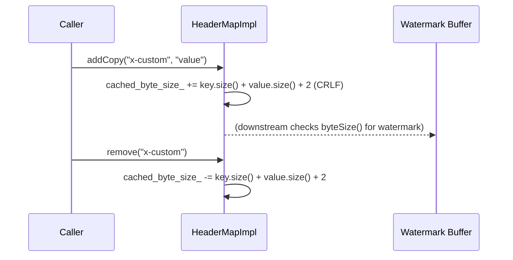
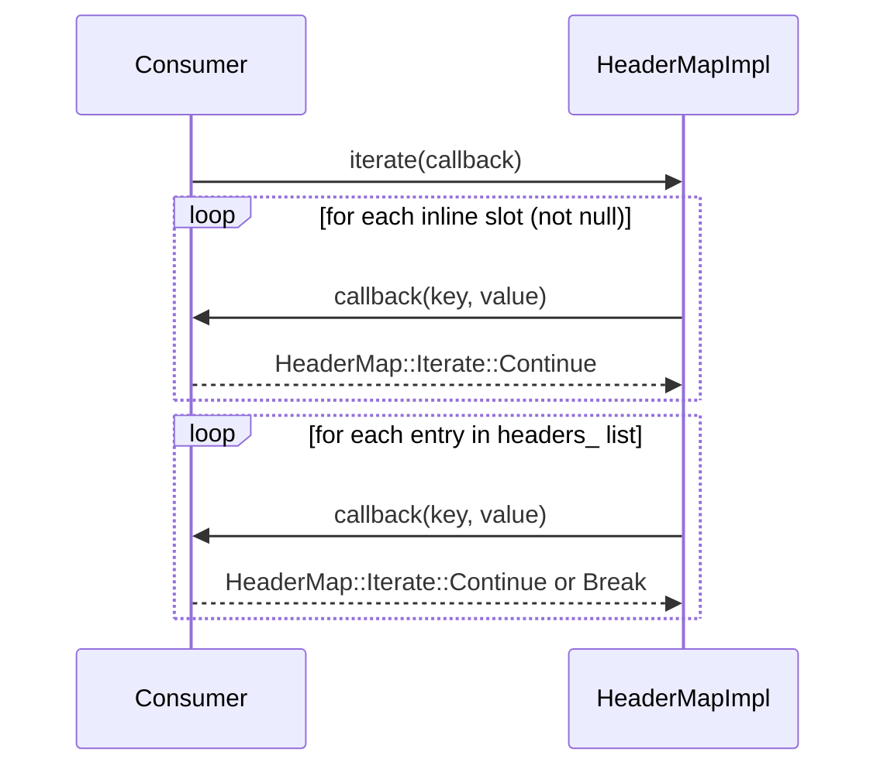

# HeaderMapImpl

**File:** `source/common/http/header_map_impl.h` / `.cc`  
**Size:** ~34 KB header, ~19 KB implementation  
**Namespace:** `Envoy::Http`

## Overview

`HeaderMapImpl` is Envoy's high-performance HTTP header container. It provides **O(1) access** to well-known headers via statically generated inline slots (avoiding hash map lookups for common headers like `:status`, `Content-Type`, `Authorization`) while storing arbitrary custom headers in a flat list. It also maintains a running byte-count for watermark enforcement.

## Design: Inline vs. Non-Inline Headers



## Class Hierarchy



## Inline Header Access (Generated via Macros)

Macros expand at compile time to generate typed accessor methods for each well-known header:

```cpp
// Macro generates:
//   const HeaderEntry* path() const;       // getter
//   void removePath();                     // remover
//   void setPath(absl::string_view value); // setter
DEFINE_INLINE_HEADER_FUNCS(path)
DEFINE_INLINE_HEADER_STRING_FUNCS(content_type)
DEFINE_INLINE_HEADER_NUMERIC_FUNCS(content_length)
```



## Memory Layout

```
HeaderMapImpl
├── inline_headers_: array<HeaderEntryImpl*, N>
│     ├── [0] → HeaderEntryImpl { key=":path", value="/api/v1" }
│     ├── [1] → HeaderEntryImpl { key=":method", value="GET" }
│     └── ... (nullptr if not set)
│
└── headers_: std::list<HeaderEntryImpl>
      ├── HeaderEntryImpl { key="x-request-id", value="abc123" }
      ├── HeaderEntryImpl { key="x-envoy-upstream-service-time", value="5" }
      └── ... (custom/non-inline headers)
```

## Byte Size Tracking



## Common Operations

| Operation | Method | Complexity |
|-----------|--------|------------|
| Get inline header | `headers.path()` | O(1) |
| Set inline header | `headers.setPath("/foo")` | O(1) |
| Remove inline header | `headers.removePath()` | O(1) |
| Get custom header | `headers.get(LowerCaseString("x-custom"))` | O(n) |
| Add custom header | `headers.addCopy(key, value)` | O(1) amortized |
| Remove custom header | `headers.remove(LowerCaseString("x-custom"))` | O(n) |
| Iterate all headers | `headers.iterate(callback)` | O(n) inline + O(m) list |
| Byte size | `headers.byteSize()` | O(1) |

## `HeaderEntry` and `HeaderString`

```mermaid
classDiagram
    class HeaderEntry {
        <<interface>>
        +key(): HeaderString
        +value(): HeaderString
        +setValue(value)
    }

    class HeaderEntryImpl {
        -key_: HeaderString
        -value_: HeaderString
    }

    class HeaderString {
        +getStringView(): absl::string_view
        +empty(): bool
        +size(): size_t
        -buffer_: union { inline_buffer[128], heap_ptr }
    }

    HeaderEntry <|-- HeaderEntryImpl
    HeaderEntryImpl *-- HeaderString : key_
    HeaderEntryImpl *-- HeaderString : value_
```

`HeaderString` uses a small-string optimization: strings up to 128 bytes are stored in an inline buffer on the stack; longer strings are heap-allocated.

## Iteration Protocol



## Immutable vs. Mutable Views

| Type | Interface | Use Case |
|------|-----------|---------|
| `RequestHeaderMap` | Mutable | Downstream request headers in filter chain |
| `ResponseHeaderMap` | Mutable | Upstream response headers in filter chain |
| `RequestTrailerMap` | Mutable | Downstream request trailers |
| `ResponseTrailerMap` | Mutable | Upstream response trailers |

All four have `Impl` variants (`RequestHeaderMapImpl` etc.) via `TypedHeaderMapImpl<T>`.

## Performance Characteristics

- **No hashing** for the ~50+ well-known headers (HTTP/2 pseudo-headers, standard HTTP/1.1 headers, Envoy-specific `x-envoy-*` headers)
- **Cache-friendly** inline slot array (contiguous memory, avoids pointer chasing)
- **O(1) byte-size** avoids re-scanning headers on every watermark check
- **Copy-on-write semantics** for `setReference()` (zero-copy when the caller owns the lifetime)

## Related Files

| File | Relationship |
|------|-------------|
| `headers.h` | Defines `CustomHeaderValues` — the singleton registry of all inline header names |
| `header_utility.h` | Higher-level header manipulation (matchers, add/remove, case normalization) |
| `header_mutation.h` | Programmatic mutation rules (add, set, remove, append) |
| `character_set_validation.h` | Character set validation for header values |
