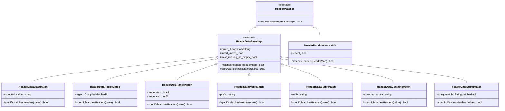
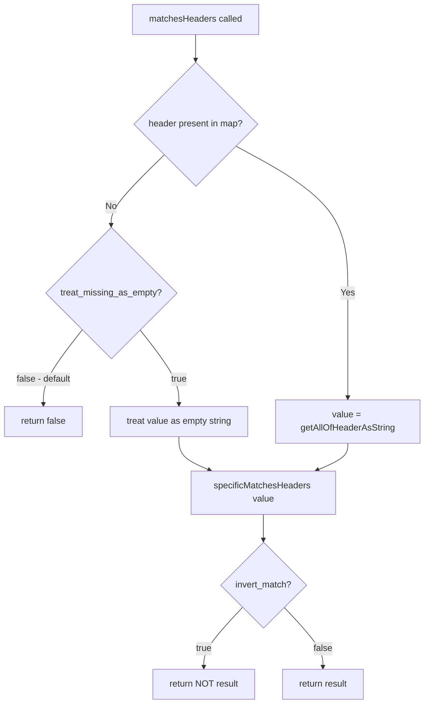

# HTTP Header Utility — `header_utility.h`

**File:** `source/common/http/header_utility.h`

Static utility class for matching, validating, and manipulating HTTP headers. Used
extensively by the router, HCM, and codec for both matching route conditions and
enforcing protocol correctness.

---

## Class Overview



---

## Header Matching Hierarchy

The matcher classes mirror the `HeaderMatcher` proto oneof in `route_components.proto`:

| Proto field | Class | Match logic |
|---|---|---|
| `exact_match` | `HeaderDataExactMatch` | `header_value == expected` (empty expected = any value) |
| `safe_regex_match` | `HeaderDataRegexMatch` | `regex->match(header_value)` |
| `range_match` | `HeaderDataRangeMatch` | Integer range `[start, end)` — parses value with `SimpleAtoi` |
| `present_match` | `HeaderDataPresentMatch` | Header exists (or not, if `present=false`) |
| `prefix_match` | `HeaderDataPrefixMatch` | `StartsWith(header_value, prefix)` |
| `suffix_match` | `HeaderDataSuffixMatch` | `EndsWith(header_value, suffix)` |
| `contains_match` | `HeaderDataContainsMatch` | `StrContains(header_value, substr)` |
| `string_match` | `HeaderDataStringMatch` | Delegates to `Matchers::StringMatcherImpl` (supports all of the above + more) |

### `invert_match` + `treat_missing_as_empty`

All matchers except `PresentMatch` share this logic via `HeaderDataBaseImpl::matchesHeaders()`:



### `getAllOfHeaderAsString` — Zero-Allocation Multi-Value Join

```cpp
class GetAllOfHeaderAsStringResult {
    absl::optional<absl::string_view> result();   // points into original header or backing_string_
    const std::string& backingString();            // non-empty only when allocation was needed
};
```

- Single-value header: `result_` returns a `string_view` into the `HeaderString` — **zero allocation**
- Multi-value header: values are joined with `,` into `result_backing_string_` — one allocation
- No value found: `result_` is `absl::nullopt`

---

## Factory Methods

```cpp
static HeaderDataPtr createHeaderData(
    const envoy::config::route::v3::HeaderMatcher& config,
    Server::Configuration::CommonFactoryContext& factory_context);

static std::vector<HeaderDataPtr> buildHeaderDataVector(
    const RepeatedPtrField<HeaderMatcher>& matchers, ...);

static std::vector<HeaderMatcherSharedPtr> buildHeaderMatcherVector(
    const RepeatedPtrField<HeaderMatcher>& matchers, ...);
```

`createHeaderData` inspects the proto `header_match_specifier` oneof and constructs the
correct concrete subclass. `buildHeaderDataVector` and `buildHeaderMatcherVector` are
convenience batch-builders.

```cpp
static bool matchHeaders(
    const HeaderMap& request_headers,
    const std::vector<HeaderDataPtr>& config_headers);
```

Returns `true` **only if all** configured header conditions match — logical AND across the list.
Empty list → always `true`.

---

## Validation Methods

| Method | Returns | RFC |
|---|---|---|
| `headerValueIsValid(value)` | `bool` | RFC 7230 §3.2 — rejects NUL, CR, LF |
| `headerNameIsValid(name)` | `bool` | RFC 7230 §3.2 — rejects non-token characters |
| `headerNameContainsUnderscore(name)` | `bool` | Security check — underscore policy |
| `authorityIsValid(value)` | `bool` | Authority format check |
| `checkRequiredRequestHeaders(headers)` | `Http::Status` | Requires `:method`; `:path` for non-CONNECT; `host`/`:authority` for H1.1/CONNECT |
| `checkRequiredResponseHeaders(headers)` | `Http::Status` | Requires `:status` |
| `checkValidRequestHeaders(headers)` | `Http::Status` | All header keys/values free of NUL/CRLF |

### `HeaderValidationResult` Enum

```cpp
enum class HeaderValidationResult {
    ACCEPT = 0,   // Allow header through
    DROP,         // Silently drop the header
    REJECT,       // Reject the entire request
};
```

### Underscore Check

```cpp
static HeaderValidationResult checkHeaderNameForUnderscores(
    absl::string_view header_name,
    envoy::config::core::v3::HttpProtocolOptions::HeadersWithUnderscoresAction action,
    HeaderValidatorStats& stats);
```

| `action` value | Result | Stat incremented |
|---|---|---|
| `ALLOW` | `ACCEPT` | — |
| `DROP_HEADER` | `DROP` | `dropped_headers_with_underscores` |
| `REJECT_REQUEST` | `REJECT` | `requests_rejected_with_underscores_in_headers` |

### Content-Length Validation

```cpp
static HeaderValidationResult validateContentLength(
    absl::string_view header_value,
    bool override_stream_error_on_invalid_http_message,
    bool& should_close_connection,
    size_t& content_length_output);
```

Validates that `content-length` is a non-negative integer. Sets `should_close_connection` if
the value is invalid and `override_stream_error_on_invalid_http_message = false`.

---

## CONNECT / Upgrade Detection

| Method | Returns true when |
|---|---|
| `isConnect(headers)` | `:method == CONNECT` |
| `isStandardConnectRequest(headers)` | `:method == CONNECT` **and no** `:protocol` (RFC 9110 §9.3.6) |
| `isExtendedH2ConnectRequest(headers)` | `:method == CONNECT` **and** `:protocol` present (RFC 8441 §4) |
| `isConnectUdpRequest(headers)` | `:method == CONNECT` and `:protocol == connect-udp` |
| `isConnectUdpResponse(headers)` | `:status == 200` on a CONNECT-UDP stream |
| `isConnectResponse(request, response)` | `isConnect(request)` and `:status == 200` |
| `isUpgrade(headers)` | `Connection: Upgrade` + `Upgrade: <anything>` |
| `isWebSocketUpgradeRequest(headers)` | `Connection: Upgrade` + `Upgrade: websocket` |
| `isSpecial1xx(headers)` | Status is 100 or 101 (handled by encode/decode1xx path, not encode/decodeHeaders) |
| `isEnvoyInternalRequest(headers)` | `x-envoy-internal: true` |
| `requestShouldHaveNoBody(headers)` | Method is GET/HEAD/DELETE/CONNECT/OPTIONS/TRACE |
| `isSafeRequest(headers)` | Method is GET/HEAD/OPTIONS/TRACE (RFC 7231 §4.2.1) |

---

## Host / Authority Manipulation

| Method | Purpose |
|---|---|
| `stripPortFromHost(headers, listener_port)` | Removes port from `:authority` if matches `listener_port` (or always if nullopt) |
| `stripPortFromHost(host)` | Removes port from a plain string |
| `stripTrailingHostDot(headers)` | Removes trailing `.` from `:authority` (e.g. `foo.bar.` → `foo.bar`) |
| `hostHasPort(host)` | Returns `true` if host contains `:port` suffix |
| `getPortStart(host)` | Returns index of `:` before port, or `npos` |
| `rewriteAuthorityForConnectUdp(headers)` | Rewrites `:authority` from CONNECT-UDP URI template |
| `shouldCloseConnection(protocol, headers)` | Returns true if `Connection: close` or HTTP/1.0 without `keep-alive` |

---

## Miscellaneous

| Method | Purpose |
|---|---|
| `isRemovableHeader(name)` | Returns `false` for `:*` pseudo-headers and `host` |
| `isModifiableHeader(name)` | Same as `isRemovableHeader` — protects pseudo and host |
| `isPseudoHeader(name)` | Returns `true` if name starts with `:` |
| `parseCommaDelimitedHeader(value)` | Splits `Accept-Encoding: gzip, br` into `["gzip", "br"]` |
| `getSemicolonDelimitedAttribute(value)` | Returns part before first `;` — e.g. `"foo;bar=1"` → `"foo"` |
| `addEncodingToAcceptEncoding(header, encoding)` | Appends an encoding token to Accept-Encoding |
| `isCapsuleProtocol(headers)` | RFC 9297 — `Capsule-Protocol: true` (single occurrence only) |
