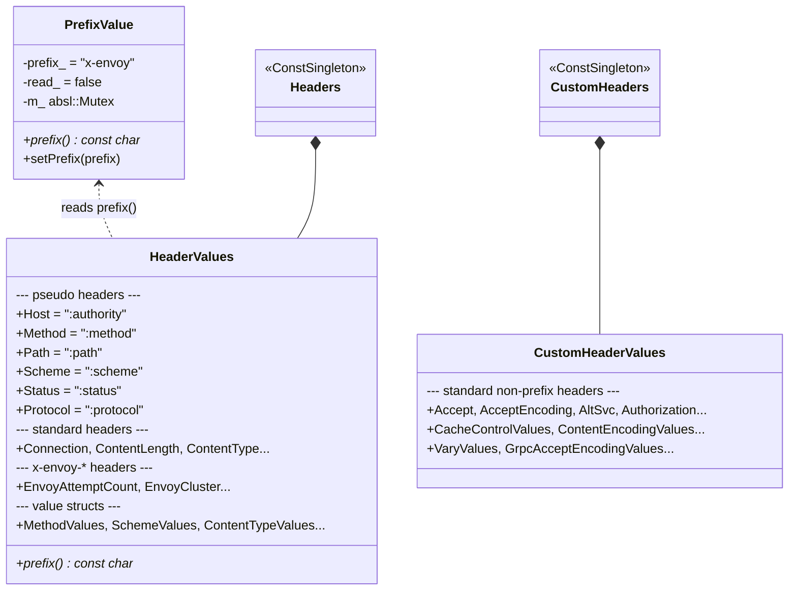
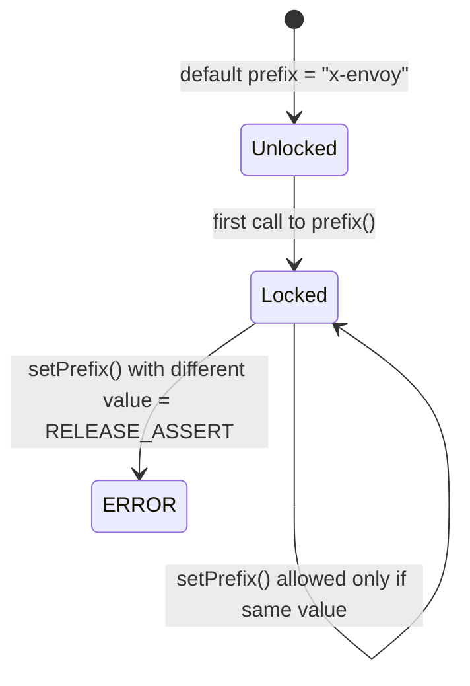

# HTTP Header Constants — `headers.h`

**File:** `source/common/http/headers.h`

Defines two singleton registries of HTTP header name and value constants used throughout
Envoy. Also defines the `PrefixValue` class that allows the `x-envoy` header prefix to be
overridden at bootstrap time.

---

## Singleton Architecture



**Key rule:** `HeaderValues` (used via `Headers::get()`) contains headers that may use the
configurable `x-envoy` prefix. `CustomHeaderValues` (used via `CustomHeaders::get()`) contains
headers that do **not** need prefix overrides and must be instantiated before bootstrap is loaded.

---

## `PrefixValue` — Write-Once Prefix Override



- `setPrefix()` must be called **before** any `Headers::get()` access (i.e., before the first
  `prefix()` read). Typically called during bootstrap loading from the `stats_prefix` or
  `node.metadata`.
- In production, this is write-once. In integration tests, the same value may be set multiple times.
- Uses `absl::WriterMutexLock` for thread safety during the transition.

```cpp
// Change prefix (must happen before any Headers::get() call)
ThreadSafeSingleton<PrefixValue>::get().setPrefix("x-custom");

// After that, Headers::get().EnvoyAttemptCount == "x-custom-attempt-count"
```

---

## `HeaderValues` — `Headers::get()`

All members are `const LowerCaseString`. Pseudo-headers use the `:` prefix (HTTP/2 style).

### Pseudo-Headers

| Member | Wire value | Used for |
|---|---|---|
| `Host` | `:authority` | Request target host (H2/H3 style) |
| `HostLegacy` | `host` | HTTP/1.1 `Host` header |
| `Method` | `:method` | HTTP method |
| `Path` | `:path` | Request path + query |
| `Scheme` | `:scheme` | `http` or `https` |
| `Status` | `:status` | Response status code |
| `Protocol` | `:protocol` | Extended CONNECT protocol (RFC 8441) |

### Standard Headers

| Member | Wire value |
|---|---|
| `Connection` | `connection` |
| `ContentLength` | `content-length` |
| `ContentRange` | `content-range` |
| `ContentType` | `content-type` |
| `Cookie` | `cookie` |
| `Date` | `date` |
| `Expect` | `expect` |
| `ForwardedClientCert` | `x-forwarded-client-cert` |
| `ForwardedFor` | `x-forwarded-for` |
| `ForwardedHost` | `x-forwarded-host` |
| `ForwardedPort` | `x-forwarded-port` |
| `ForwardedProto` | `x-forwarded-proto` |
| `GrpcMessage` | `grpc-message` |
| `GrpcStatus` | `grpc-status` |
| `GrpcTimeout` | `grpc-timeout` |
| `GrpcStatusDetailsBin` | `grpc-status-details-bin` |
| `Http2Settings` | `http2-settings` |
| `KeepAlive` | `keep-alive` |
| `Location` | `location` |
| `ProxyAuthenticate` | `proxy-authenticate` |
| `ProxyAuthorization` | `proxy-authorization` |
| `ProxyConnection` | `proxy-connection` |
| `ProxyStatus` | `proxy-status` |
| `Range` | `range` |
| `RequestId` | `x-request-id` |
| `Server` | `server` |
| `SetCookie` | `set-cookie` |
| `TE` | `te` |
| `TransferEncoding` | `transfer-encoding` |
| `Upgrade` | `upgrade` |
| `UserAgent` | `user-agent` |
| `Via` | `via` |
| `WWWAuthenticate` | `www-authenticate` |
| `XContentTypeOptions` | `x-content-type-options` |
| `EarlyData` | `early-data` |
| `CapsuleProtocol` | `capsule-protocol` |

### `x-envoy-*` Headers (prefix-configurable)

These are computed at singleton construction time using `absl::StrCat(prefix(), "-...")`:

| Member | Default wire value | Purpose |
|---|---|---|
| `EnvoyAttemptCount` | `x-envoy-attempt-count` | Retry attempt number |
| `EnvoyCluster` | `x-envoy-cluster` | Upstream cluster name |
| `EnvoyDegraded` | `x-envoy-degraded` | Upstream is in degraded health |
| `EnvoyDownstreamServiceCluster` | `x-envoy-downstream-service-cluster` | Internal mesh identity |
| `EnvoyDownstreamServiceNode` | `x-envoy-downstream-service-node` | Internal mesh node |
| `EnvoyExternalAddress` | `x-envoy-external-address` | Client IP after XFF processing |
| `EnvoyForceTrace` | `x-envoy-force-trace` | Force tracing on this request |
| `EnvoyHedgeOnPerTryTimeout` | `x-envoy-hedge-on-per-try-timeout` | Enable hedging on timeout |
| `EnvoyImmediateHealthCheckFail` | `x-envoy-immediate-health-check-fail` | HC failure signal |
| `EnvoyInternalRequest` | `x-envoy-internal` | Marks internal mesh request |
| `EnvoyIpTags` | `x-envoy-ip-tags` | IP tag filter result |
| `EnvoyIsTimeoutRetry` | `x-envoy-is-timeout-retry` | This request is a timeout retry |
| `EnvoyLocalOverloaded` | `x-envoy-local-overloaded` | Overload response signal |
| `EnvoyMaxRetries` | `x-envoy-max-retries` | Per-request retry override |
| `EnvoyNotForwarded` | `x-envoy-not-forwarded` | Do not forward upstream |
| `EnvoyOriginalDstHost` | `x-envoy-original-dst-host` | Pre-DNAT destination |
| `EnvoyOriginalMethod` | `x-envoy-original-method` | Method before rewrite |
| `EnvoyOriginalPath` | `x-envoy-original-path` | Path before rewrite |
| `EnvoyOriginalHost` | `x-envoy-original-host` | Host before rewrite |
| `EnvoyOriginalUrl` | `x-envoy-original-url` | Full URL before redirect |
| `EnvoyOverloaded` | `x-envoy-overloaded` | Server-side overload signal |
| `EnvoyDropOverload` | `x-envoy-drop-overload` | Request dropped due to overload |
| `EnvoyRateLimited` | `x-envoy-ratelimited` | Request rate-limited |
| `EnvoyRetryOn` | `x-envoy-retry-on` | Retry policy override |
| `EnvoyRetryGrpcOn` | `x-envoy-retry-grpc-on` | gRPC retry policy override |
| `EnvoyRetriableStatusCodes` | `x-envoy-retriable-status-codes` | Retriable status codes override |
| `EnvoyRetriableHeaderNames` | `x-envoy-retriable-header-names` | Retriable response header names |
| `EnvoyUpstreamAltStatName` | `x-envoy-upstream-alt-stat-name` | Alternate stat namespace |
| `EnvoyUpstreamCanary` | `x-envoy-upstream-canary` | Upstream is canary |
| `EnvoyUpstreamHostAddress` | `x-envoy-upstream-host-address` | Upstream IP:port |
| `EnvoyUpstreamHostname` | `x-envoy-upstream-hostname` | Upstream hostname |
| `EnvoyUpstreamServiceTime` | `x-envoy-upstream-service-time` | Upstream latency (ms) |
| `EnvoyUpstreamHealthCheckedCluster` | `x-envoy-upstream-healthchecked-cluster` | HC cluster name |
| `EnvoyUpstreamStreamDurationMs` | `x-envoy-upstream-stream-duration-ms` | Total stream duration |
| `EnvoyUpstreamRequestTimeoutMs` | `x-envoy-upstream-rq-timeout-ms` | Timeout override (ms) |
| `EnvoyUpstreamRequestPerTryTimeoutMs` | `x-envoy-upstream-rq-per-try-timeout-ms` | Per-try timeout override |
| `EnvoyUpstreamRequestTimeoutAltResponse` | `x-envoy-upstream-rq-timeout-alt-response` | Alt response on timeout |
| `EnvoyExpectedRequestTimeoutMs` | `x-envoy-expected-rq-timeout-ms` | Expected overall timeout |
| `EnvoyDecoratorOperation` | `x-envoy-decorator-operation` | Tracing span name override |
| `EnvoyCompressionStatus` | `x-envoy-compression-status` | Compression filter result |
| `ClientTraceId` | `x-client-trace-id` | Client-supplied trace ID |

---

## `HeaderValues` — Value Structs

Each struct is a nested const struct on `HeaderValues`, accessed as e.g.
`Headers::get().MethodValues.Get`.

| Struct | Members |
|---|---|
| `MethodValues` | `Connect`, `Delete`, `Get`, `Head`, `Options`, `Patch`, `Post`, `Put`, `Trace` |
| `SchemeValues` | `Http`, `Https` |
| `ContentTypeValues` | `Text`, `Html`, `Json`, `Grpc`, `GrpcWeb*`, `Protobuf`, `FormUrlEncoded`, `Connect`, `ConnectProto`, `Thrift`, `TextEventStream` |
| `ConnectionValues` | `Close`, `Http2Settings`, `KeepAlive`, `Upgrade` |
| `UpgradeValues` | `H2c`, `WebSocket`, `ConnectUdp` |
| `TransferEncodingValues` | `Brotli`, `Chunked`, `Compress`, `Deflate`, `Gzip`, `Identity`, `Zstd` |
| `EnvoyRetryOnValues` | `_5xx`, `GatewayError`, `ConnectFailure`, `RefusedStream`, `Retriable4xx`, `Reset`, `ResetBeforeRequest`, `Http3PostConnectFailure` |
| `EnvoyRetryOnGrpcValues` | `Cancelled`, `DeadlineExceeded`, `ResourceExhausted`, `Unavailable`, `Internal` |
| `ProtocolStrings` | `Http10String`, `Http11String`, `Http2String`, `Http3String` |
| `ExpectValues` | `_100Continue` |
| `UserAgentValues` | `EnvoyHealthChecker`, `GoBrowser` |
| `TEValues` | `Trailers` |
| `XContentTypeOptionValues` | `Nosniff` |

---

## `CustomHeaderValues` — `CustomHeaders::get()`

Headers that **never** need the `x-envoy` prefix. Safe to use in static initializers (e.g.
extension filter registration) before bootstrap loading.

Key headers: `Accept`, `AcceptEncoding`, `AltSvc`, `Authorization`, `CacheControl`,
`ContentEncoding`, `Etag`, `GrpcAcceptEncoding`, `GrpcEncoding`, `GrpcTimeout`,
`IfMatch`, `IfNoneMatch`, `Origin`, `OtSpanContext`, `Pragma`, `Referer`, `Vary`,
`ConnectAcceptEncoding`, `ConnectContentEncoding`, `ConnectProtocolVersion`, `ConnectTimeoutMs`.

Also includes CORS headers: `AccessControlRequestHeaders/Method/Origin/AllowOrigin/AllowHeaders/...`.

---

## Usage Pattern

```cpp
// Accessing a header name
const auto& headers = Http::Headers::get();
request_headers.addCopy(headers.EnvoyInternalRequest, headers.EnvoyInternalRequestValues.True);

// Accessing a custom header
const auto& custom = Http::CustomHeaders::get();
response_headers.addCopy(custom.Vary, custom.VaryValues.AcceptEncoding);

// Checking a pseudo-header
const Http::LowerCaseString& path_header = Http::Headers::get().Path;
```
