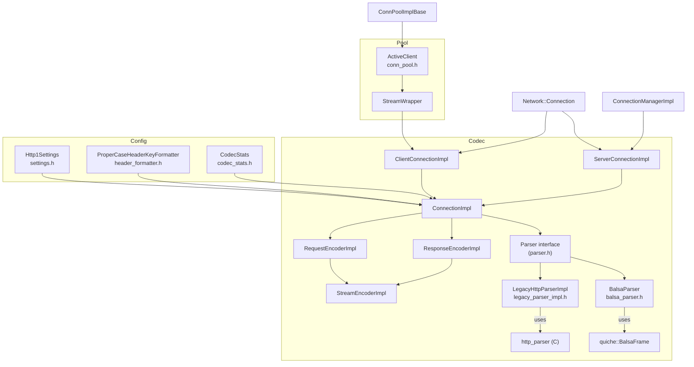

# Envoy HTTP/1.1 Codec — Documentation Index

**Source folder:** `source/common/http/http1/`

---

## File → Doc Map

| Source File | Doc | Description |
|---|---|---|
| `codec_impl.h` / `codec_impl.cc` | [codec_impl.md](./codec_impl.md) | Core HTTP/1.1 codec — encoder, decoder, server/client connection classes |
| `parser.h` | [parser.md](./parser.md) | Abstract `Parser` and `ParserCallbacks` interfaces; parser selection |
| `balsa_parser.h` / `balsa_parser.cc` | [balsa_parser.md](./balsa_parser.md) | QUICHE-based preferred parser wrapping `BalsaFrame` |
| `legacy_parser_impl.h` / `.cc` | [legacy_parser_impl.md](./legacy_parser_impl.md) | Fallback node.js `http_parser`-based implementation |
| `conn_pool.h` / `conn_pool.cc` | [conn_pool.md](./conn_pool.md) | HTTP/1.1 connection pool — `ActiveClient` and `StreamWrapper` |
| `codec_stats.h` | [codec_stats.md](./codec_stats.md) | `http1.*` stats counters |
| `settings.h` / `header_formatter.h` | [settings_and_header_formatter.md](./settings_and_header_formatter.md) | Config parsing and `ProperCaseHeaderKeyFormatter` |

---

## Component Relationships

---

## Key Design Properties

- **Single stream per connection** — HTTP/1.1 has no multiplexing; `numActiveStreams()` is always 0 or 1
- **Pluggable parser** — `BalsaParser` (default) or `LegacyHttpParserImpl` selected via runtime flag `use_balsa_parser`
- **Output buffer ownership** — each connection has an `owned_output_buffer_` (a `WatermarkBuffer`); watermark events propagate to `StreamCallbackHelper` callbacks
- **readDisable unwinding** — `StreamEncoderImpl` destructor and `ClientConnectionImpl::onMessageComplete()` unwind outstanding `readDisable(true)` calls for correct connection reuse
- **Deferred end-stream headers** — `deferred_end_stream_headers_` allows HTTP/2-style `end_stream=true` headers block presentation
- **Flood protection** — `ServerConnectionImpl::doFloodProtectionChecks()` limits pipelined `outbound_responses_`
