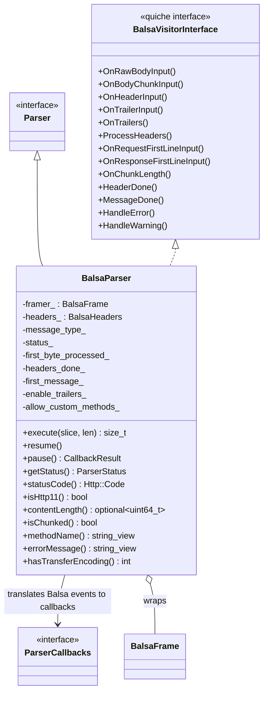
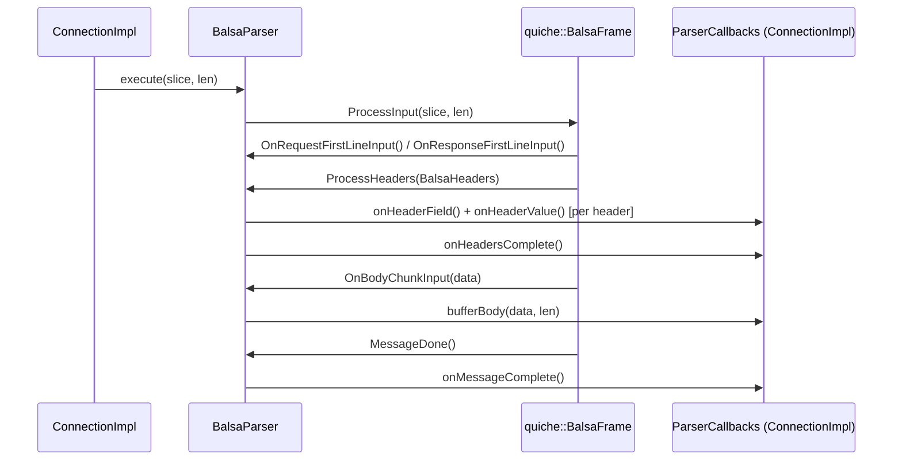

# HTTP/1 Balsa Parser — `balsa_parser.h`

**File:** `source/common/http/http1/balsa_parser.h`

`BalsaParser` is the **preferred HTTP/1.1 parser** in Envoy, wrapping the QUICHE project's
`BalsaFrame` framer. It implements the `Parser` interface and receives raw frame events from
`BalsaFrame` via `quiche::BalsaVisitorInterface`, translating them into `ParserCallbacks`
calls consumed by `ConnectionImpl`.

---

## Class Overview



---

## Data Flow



---

## Key Design Points

### Balsa vs Legacy Parser

| Feature | `BalsaParser` | `LegacyHttpParserImpl` |
|---|---|---|
| Underlying library | QUICHE `BalsaFrame` | node.js `http_parser` |
| Custom HTTP methods | Configurable via `allow_custom_methods_` | Limited |
| Trailer support | Yes (`enable_trailers_`) | Yes |
| First-line parsing | `OnRequestFirstLineInput` / `OnResponseFirstLineInput` | via `onUrl` / `onStatus` |
| Error reporting | `HandleError()` + `HandleWarning()` | `errorMessage()` |
| Selection | Runtime flag `use_balsa_parser` | Default/fallback |

### `first_message_` Flag
Set to `true` until the first byte of the **second** message arrives. Used to distinguish
first-message parsing from pipelined request parsing — important for connection reuse semantics.

### `convertResult()` Helper
Internal helper that maps a `CallbackResult` from `ParserCallbacks` back to `ParserStatus`.
Marked `ABSL_MUST_USE_RESULT` — callers must not silently discard the returned status.

```cpp
// Typical usage pattern inside BalsaVisitorInterface callbacks:
status_ = convertResult(connection_->onHeadersComplete());
```

### Header/Trailer Processing
Both request headers and trailers share `validateAndProcessHeadersOrTrailersImpl()`.
This function iterates `BalsaHeaders`, fires `onHeaderField()` + `onHeaderValue()` callbacks
for each entry, then calls `onHeadersComplete()` or signals trailer end via `onMessageComplete()`.

### Interim Headers (`OnInterimHeaders`)
Handles `100 Continue` and other informational responses by firing callbacks
directly without going through the normal header processing pipeline.

---

## Error Handling

```mermaid
flowchart TD
    BF[BalsaFrame detects error] --> HE[HandleError(error_code)]
    HE --> SetMsg[error_message_ = mapped error string]
    HE --> SetStatus[status_ = ParserStatus::Error]
    SetStatus --> CI[ConnectionImpl::dispatch() returns error Status]
    CI --> Close[Connection closed with protocol error]

    BF2[BalsaFrame warning] --> HW[HandleWarning(error_code)]
    HW --> Log[Log warning, continue processing]
```
