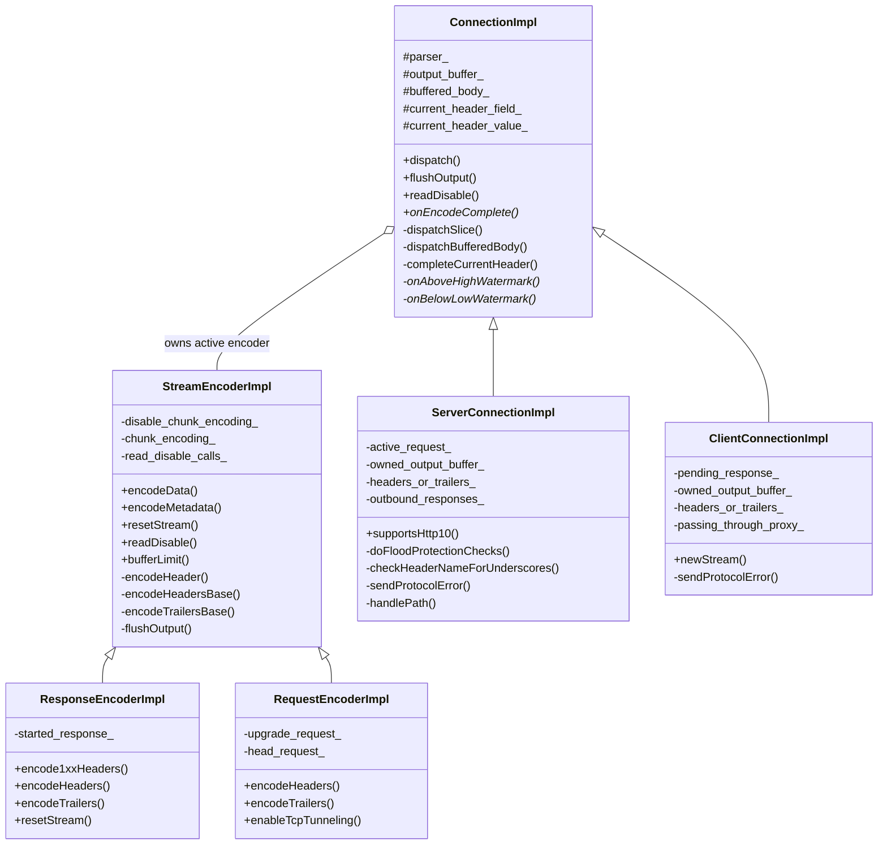
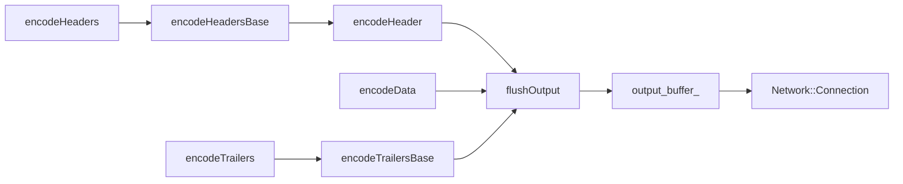
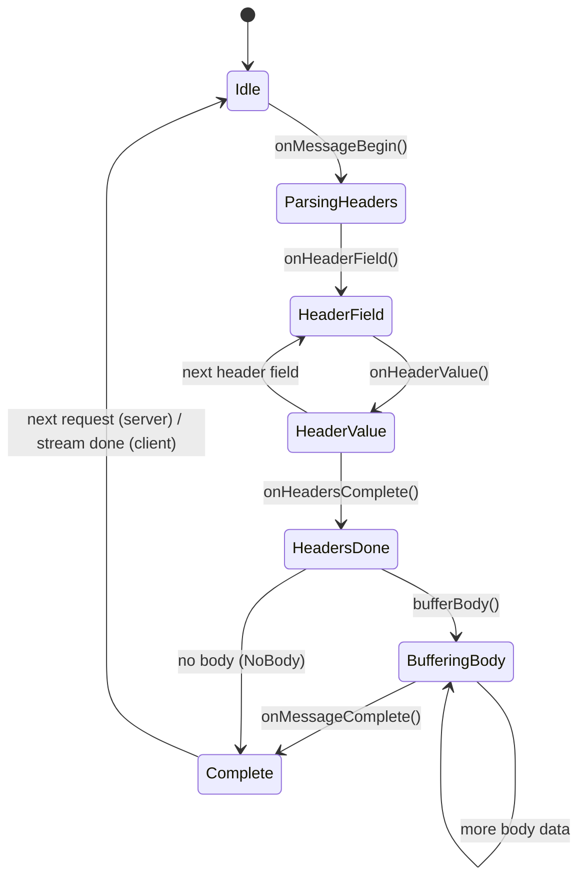

# HTTP/1 Codec Implementation — `codec_impl.h`

**File:** `source/common/http/http1/codec_impl.h`

This is the central file for the HTTP/1.1 codec in Envoy. It defines the full class hierarchy
for encoding and decoding HTTP/1.1 messages on both the client and server sides.

---

## Class Hierarchy

---

## `StreamEncoderImpl`

Base class for both request and response encoders. Encodes HTTP/1.1 messages onto the
underlying connection's `output_buffer_`.

**Key responsibilities:**
- Serializes headers (`encodeHeadersBase()`), body (`encodeData()`), and trailers
- Manages chunked transfer encoding (`chunk_encoding_`, `disable_chunk_encoding_`)
- Tracks `readDisable` calls — on destruction, unwinds all outstanding `readDisable(true)` calls
  to resume reading (critical for preventing connection stalls after stream teardown)
- No flush timeout — HTTP/1 has one stream per connection, data is written directly to the
  connection buffer invoking watermarks immediately (no internal buffering requiring a timeout)
- No codec-level stream ID (`codecStreamId()` returns `nullopt`)

**Encoding flow:**

---

## `ResponseEncoderImpl`

Server-side encoder — writes HTTP responses to the downstream client.

- Handles `encode1xxHeaders()` for 100-continue and other interim responses
- `stream_error_on_invalid_http_message_` controls whether to reset or close on invalid messages
- On destruction, clears the downstream `BufferMemoryAccount` to release memory tracking

---

## `RequestEncoderImpl`

Client-side encoder — writes HTTP requests to the upstream server.

- Tracks whether the request is an `upgrade_request_`, `head_request_`, or `connect_request_`
- `enableTcpTunneling()` sets `is_tcp_tunneling_` for CONNECT tunneling

---

## `ConnectionImpl`

Base class for both `ServerConnectionImpl` and `ClientConnectionImpl`. Implements the
`Http::Connection` interface and `ParserCallbacks`.

**Key responsibilities:**
- Drives the parser (`parser_->execute()`) via `dispatch()`
- Accumulates partial header fields/values in `current_header_field_` / `current_header_value_`
- Accumulates body data in `buffered_body_` during a dispatch call; pushes it through the
  filter pipeline at most once per `dispatch()` call (performance optimization)
- Implements `ParserCallbacks` — receives events from the parser and dispatches to virtual methods
- Implements write-side watermark hooks:
  - `onUnderlyingConnectionAboveWriteBufferHighWatermark()` → `onAboveHighWatermark()`
  - `onUnderlyingConnectionBelowWriteBufferLowWatermark()` → `onBelowLowWatermark()`
- `deferred_end_stream_headers_`: delays raising headers until the full HTTP/1 message is
  parsed — allows presenting an HTTP/2-style headers block with `end_stream=true`

**Parsing state machine:**

**`HeaderParsingState` enum:** `Field` → `Value` → `Done` — tracks whether the parser is
mid-field, mid-value, or done with headers, used by `completeCurrentHeader()`.

**`dispatch()` and `maybeDirectDispatch()`:**
- `dispatch()` is the main entry point; feeds data to the parser slice by slice
- `maybeDirectDispatch()` tries to dispatch the current read buffer directly without copying
  (zero-copy optimization when no partial data is buffered)

---

## `ServerConnectionImpl`

Server-side (downstream) HTTP/1.1 connection. Manages inbound requests from clients.

**Key responsibilities:**
- Holds one `ActiveRequest` at a time (HTTP/1.1 is single-stream per connection)
- `ActiveRequest` contains the `ResponseEncoderImpl` and a pointer to the `RequestDecoder`
- `handlePath()` parses the request URL and constructs `:authority` / `Host` headers per RFC 7230
- `sendProtocolError()` sends a 400/other error response and closes the connection
- `sendOverloadError()` responds with 503 when the overload manager fires `abort_dispatch_`
- `doFloodProtectionChecks()` guards against response flood attacks (limits `outbound_responses_`)
- `checkHeaderNameForUnderscores()` — may drop or reject requests based on `headers_with_underscores_action_`
- `maybeAddSentinelBufferFragment()` — appends a sentinel fragment to `owned_output_buffer_`
  to track when response data has been flushed; used for pipelining correctness

**Watermarks:**
- `onAboveHighWatermark()` → calls `runHighWatermarkCallbacks()` on the active response encoder
- `onBelowLowWatermark()` → calls `runLowWatermarkCallbacks()`

---

## `ClientConnectionImpl`

Client-side (upstream) HTTP/1.1 connection. Sends requests to backends.

**Key responsibilities:**
- `newStream()` creates a new `RequestEncoderImpl` and registers a `PendingResponse`
- `PendingResponse` holds the encoder and the `ResponseDecoder*` for routing the response back
- `pending_response_done_` tracks completion without destroying `pending_response_` prematurely
  (needed for safe callback dispatch during `onMessageComplete`)
- `sendFullyQualifiedUrl()` — sends absolute-form URLs when acting as a proxy
  (`passing_through_proxy_` + plaintext transport)
- `onMessageComplete()` unwinds `readDisable(true)` calls (connection pool reuse cleanup)
- `ignore_message_complete_for_1xx_` — skips the spurious `onMessageComplete` after non-101
  1xx (informational) responses

**Important note:** The `pending_response_` is declared `absl::optional` to support the
case where no request has been sent yet (connection just established).

---

## Constants

| Constant | Value | Description |
|---|---|---|
| `MAX_RESPONSE_HEADERS_KB` | 80 KiB | Default max response header size (matches vanilla http-parser) |
