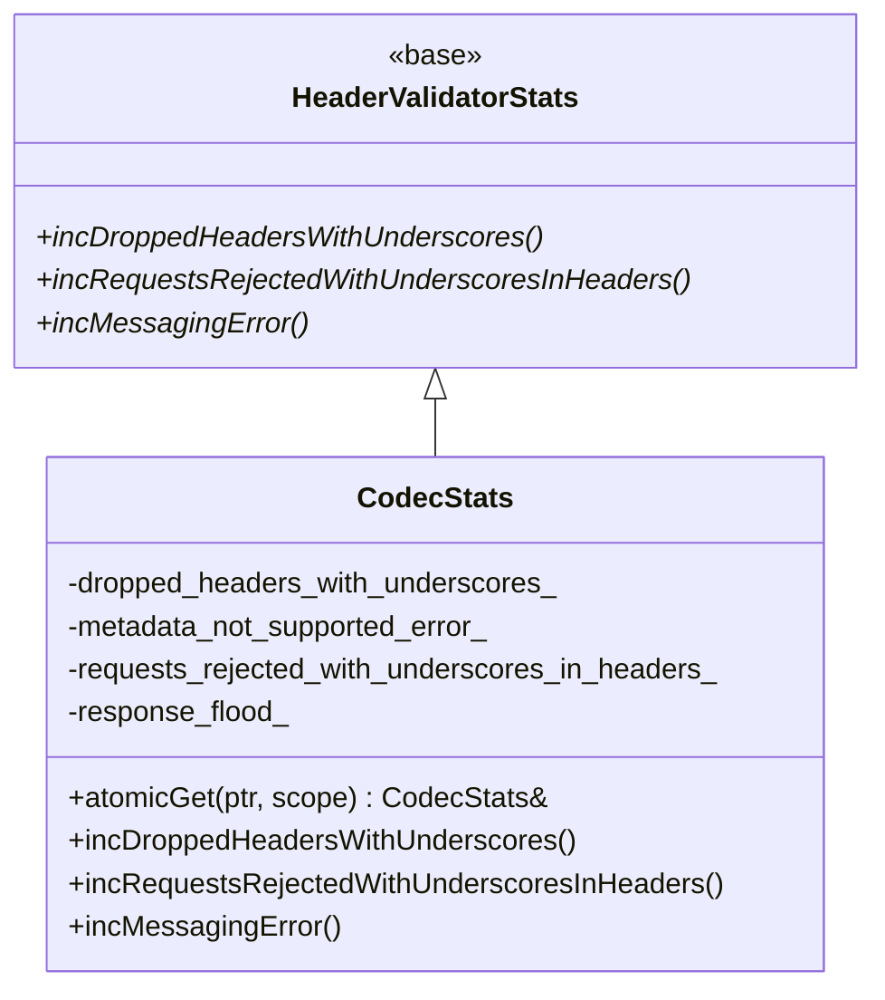
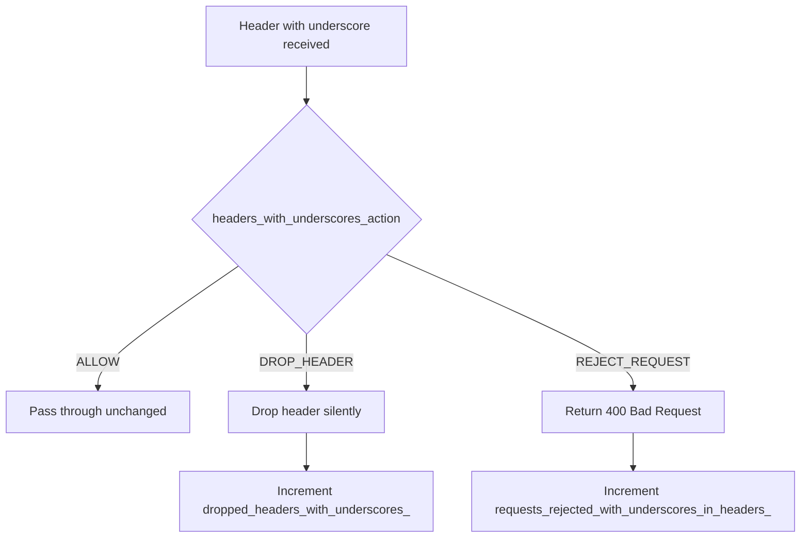

# HTTP/1 Codec Stats — `codec_stats.h`

**File:** `source/common/http/http1/codec_stats.h`

Defines `CodecStats`, the stats container for the HTTP/1.1 codec. All counters are prefixed
with `http1.` in the stats scope and are accessible via Envoy's stats system.

---

## Class Overview



---

## Counters

| Stat Name (in scope) | Field | Description |
|---|---|---|
| `http1.dropped_headers_with_underscores` | `dropped_headers_with_underscores_` | Headers containing `_` silently dropped (per config) |
| `http1.metadata_not_supported_error` | `metadata_not_supported_error_` | Metadata encoding attempted but not supported in HTTP/1.1 |
| `http1.requests_rejected_with_underscores_in_headers` | `requests_rejected_with_underscores_in_headers_` | Requests rejected because headers contain `_` (per config) |
| `http1.response_flood` | `response_flood_` | Response flood protection triggered (too many pipelined responses) |

---

## Underscore Header Policy

The `headers_with_underscores_action` config field (in `HttpProtocolOptions`) controls what
happens when a header name contains an underscore (`_`):



---

## `atomicGet()` Pattern

`CodecStats` uses the `Thread::AtomicPtr` pattern for lazy, thread-safe initialization:

```cpp
static CodecStats& atomicGet(AtomicPtr& ptr, Stats::Scope& scope) {
    return *ptr.get([&scope]() -> CodecStats* {
        return new CodecStats{ALL_HTTP1_CODEC_STATS(POOL_COUNTER_PREFIX(scope, "http1."))};
    });
}
```

- Stats are created **once** on first access and cached atomically
- The `DeleteOnDestruct` allocmode ensures cleanup on scope destruction
- Called from `ServerConnectionImpl` and `ClientConnectionImpl` constructors via `CodecStats::atomicGet()`

---

## `incMessagingError()` — Not Implemented

```cpp
void incMessagingError() override {}  // TODO: add corresponding counter for H/1 codec
```

This override is a no-op. The equivalent counter exists for HTTP/2 but has not been wired
for HTTP/1 yet.
