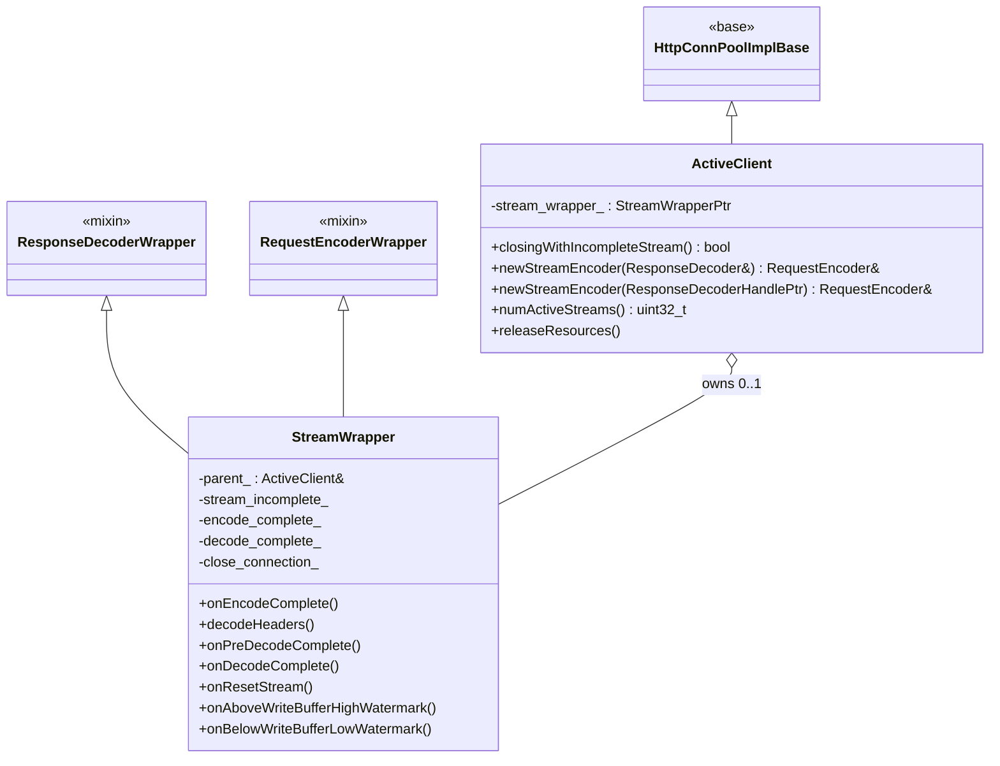
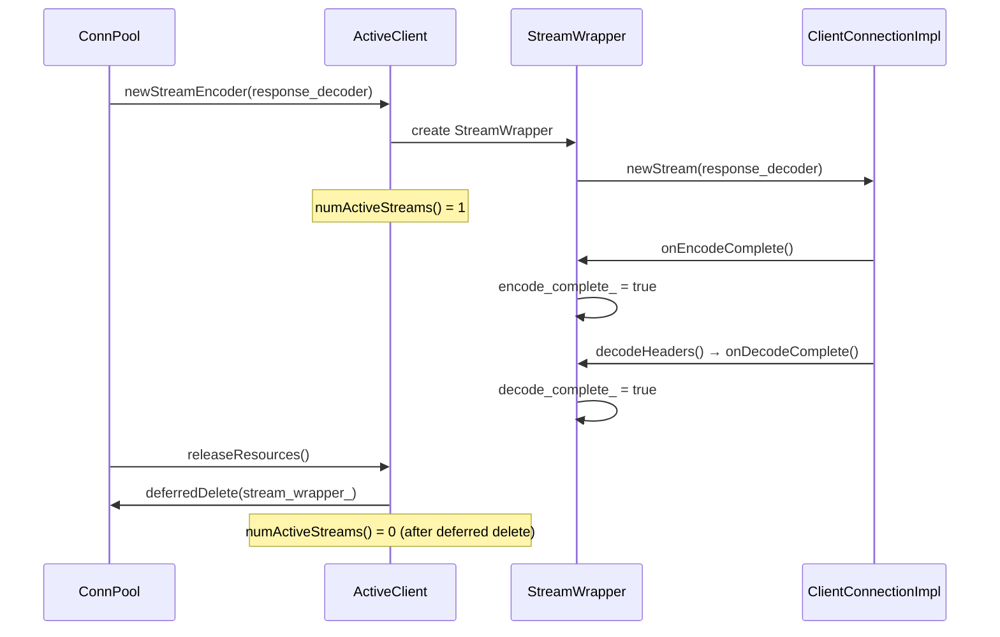

# HTTP/1 Connection Pool — `conn_pool.h`

**File:** `source/common/http/http1/conn_pool.h`

Defines the HTTP/1.1-specific connection pool `ActiveClient` and its `StreamWrapper`.
HTTP/1.1 is strictly single-stream per connection — only one request/response pair can be
in-flight at any time, which drives several design choices here.

---

## Class Overview



---

## HTTP/1 Single-Stream Constraint

HTTP/1.1 allows only one request/response pair per connection. This is reflected in:

```cpp
uint32_t numActiveStreams() const override {
    // 1 if stream_wrapper_ exists, 0 otherwise
    return stream_wrapper_.get() ? 1 : 0;
}
```

The connection pool uses `numActiveStreams()` to determine if a connection has capacity.
The override is critical: the HTTP/1 codec **destroys the stream object before decode is
complete**, so the base class counter would incorrectly show the connection as available.
`StreamWrapper` must remain alive until `onDecodeComplete()` to block premature reuse.



---

## `StreamWrapper`

Wraps `ResponseDecoder` and `RequestEncoder` for a single HTTP/1.1 stream.
Implements `StreamCallbacks` to observe stream lifecycle events.

### Lifecycle Flags

| Flag | Set When | Purpose |
|---|---|---|
| `encode_complete_` | `onEncodeComplete()` called | Request fully sent to upstream |
| `decode_complete_` | `onDecodeComplete()` called | Response fully received from upstream |
| `stream_incomplete_` | Reset before decode complete | Marks stream as abnormally terminated |
| `close_connection_` | `onResetStream()` or abnormal end | Forces connection close after stream |

### `decodeHeaders()` override
Inspects response headers before passing them to the wrapped `ResponseDecoder`. Detects
conditions that require connection closure (e.g., `Connection: close`, non-keepalive HTTP/1.0)
and sets `close_connection_` accordingly.

### Watermark callbacks
`onAboveWriteBufferHighWatermark()` and `onBelowWriteBufferLowWatermark()` are **no-ops** —
the connection pool itself does not participate in per-stream flow control; that is handled
at the codec and `ConnectionImpl` level.

---

## `allocateConnPool()` Factory

```cpp
ConnectionPool::InstancePtr allocateConnPool(
    Event::Dispatcher& dispatcher,
    Random::RandomGenerator& random_generator,
    Upstream::HostConstSharedPtr host,
    Upstream::ResourcePriority priority,
    const Network::ConnectionSocket::OptionsSharedPtr& options,
    const Network::TransportSocketOptionsConstSharedPtr& transport_socket_options,
    Upstream::ClusterConnectivityState& state,
    Server::OverloadManager& overload_manager);
```

Factory function that creates an `HttpConnPoolImplBase` configured for HTTP/1.1.
Called by the cluster manager when creating upstream connection pools.

---

## Connection Reuse Flow

```mermaid
flowchart TD
    A[New request arrives] --> B{Any idle HTTP/1 connection?}
    B -->|Yes| C[Assign to existing ActiveClient]
    B -->|No| D[Create new ActiveClient + TCP connection]
    C --> E[newStreamEncoder() → StreamWrapper created]
    D --> E
    E --> F[Request encoded + sent]
    F --> G[Response decoded]
    G --> H{close_connection_?}
    H -->|Yes| I[Close TCP connection]
    H -->|No| J[Return connection to idle pool]
    J --> B
```
