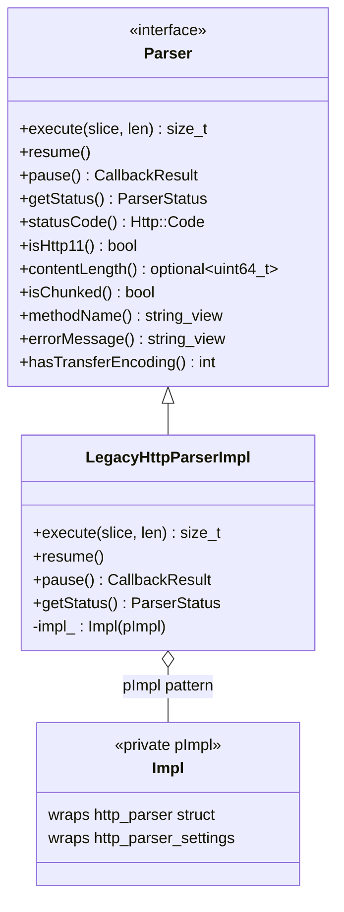
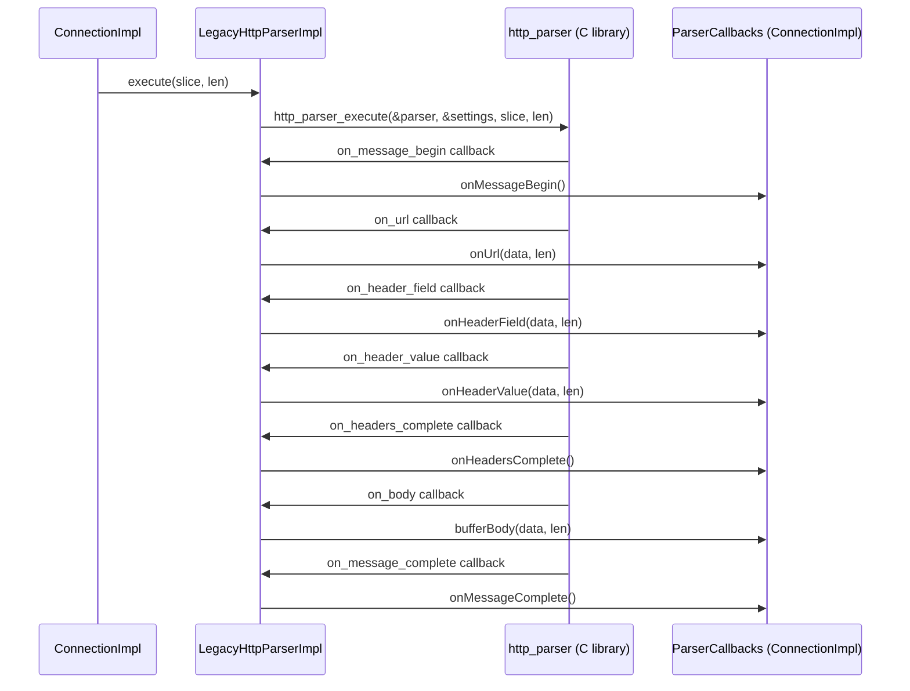
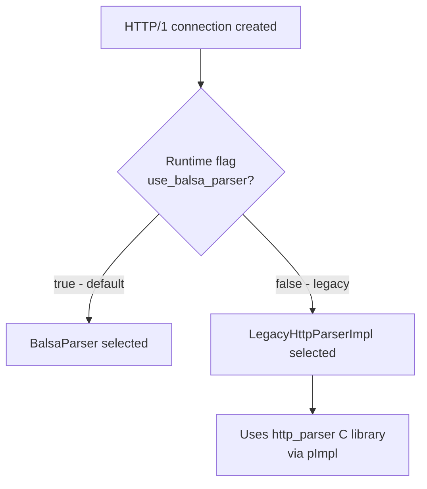

# HTTP/1 Legacy Parser — `legacy_parser_impl.h`

**File:** `source/common/http/http1/legacy_parser_impl.h`

`LegacyHttpParserImpl` is the **original HTTP/1.1 parser** in Envoy, wrapping the
[node.js `http_parser`](https://github.com/nodejs/http-parser) C library. It implements
the `Parser` interface and is the fallback when the `use_balsa_parser` runtime flag is disabled.

---

## Class Overview



---

## Design Notes

### pImpl Pattern
`LegacyHttpParserImpl` uses the **pImpl (pointer to implementation) idiom** via the private
`Impl` class. This isolates the `http_parser.h` C headers from the rest of the Envoy codebase,
avoiding macro and symbol pollution from the C library.

```cpp
class LegacyHttpParserImpl : public Parser {
  private:
    class Impl;                    // Forward-declared
    std::unique_ptr<Impl> impl_;   // Actual http_parser struct lives here
};
```

### Callback Translation
The underlying `http_parser` fires C function callbacks (`on_url`, `on_header_field`, etc.).
The `Impl` class registers these as `http_parser_settings` and translates them into
`ParserCallbacks` method calls on `ConnectionImpl`.



---

## Comparison with `BalsaParser`

| Aspect | `LegacyHttpParserImpl` | `BalsaParser` |
|---|---|---|
| Underlying library | node.js `http_parser` (C) | QUICHE `BalsaFrame` (C++) |
| Isolation | pImpl pattern | Direct member |
| Custom methods | Limited | `allow_custom_methods_` flag |
| Interim headers | Not natively supported | `OnInterimHeaders()` |
| Status | **Deprecated / fallback** | **Preferred** |
| Selection | `use_balsa_parser = false` | `use_balsa_parser = true` (default) |

---

## When Is It Used?



> The `LegacyHttpParserImpl` is retained for compatibility and rollback purposes.
> New development should target `BalsaParser`.
