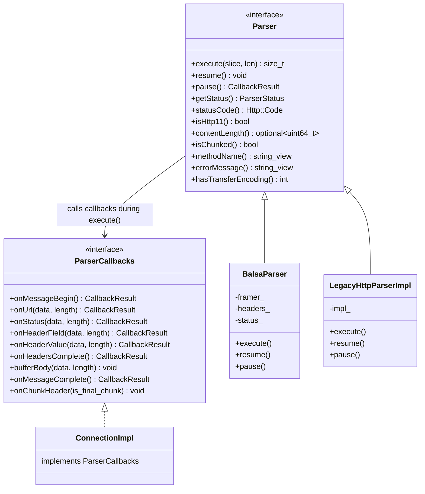
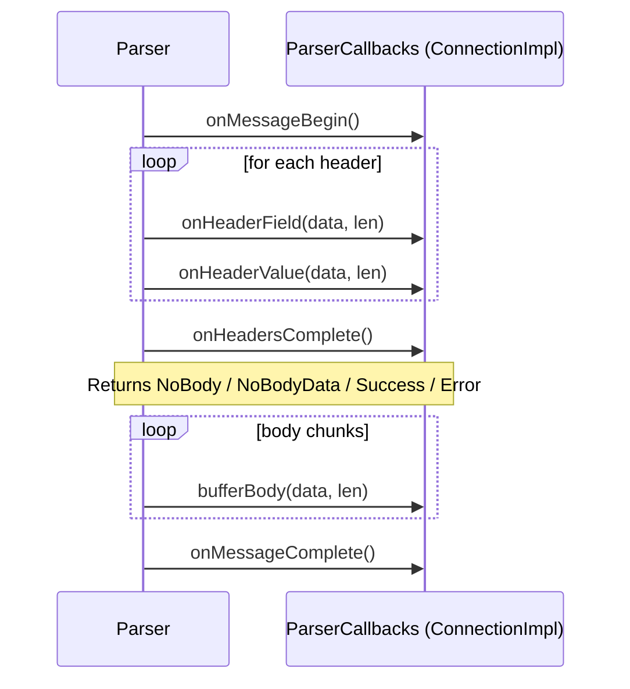

# HTTP/1 Parser Interface — `parser.h`

**File:** `source/common/http/http1/parser.h`

Defines the abstract `Parser` interface and `ParserCallbacks` interface that decouple the
HTTP/1.1 codec (`ConnectionImpl`) from any specific parser implementation. Two implementations
exist: `BalsaParser` (QUICHE-based, preferred) and `LegacyHttpParserImpl` (node.js http-parser).

---

## Interface Overview



---

## `ParserCallbacks`

Implemented by `ConnectionImpl`. The parser calls these methods as it processes bytes.

### Callback Sequence



### `CallbackResult` Enum

| Value | Meaning |
|---|---|
| `Error = -1` | An error occurred; parser must stop consuming data |
| `Success = 0` | Normal continuation |
| `NoBody = 1` | Returned by `onHeadersComplete()` — no body expected (e.g. HEAD response) |
| `NoBodyData = 2` | Returned by `onHeadersComplete()` — no body AND no further data expected on connection |

> `NoBody` and `NoBodyData` are only valid returns from `onHeadersComplete()`. They signal the
> parser to skip body processing, equivalent to HTTP/2's `end_stream` semantics.

---

## `Parser`

Abstract interface for the underlying byte-level HTTP/1 framing engine.

### Key Methods

| Method | Description |
|---|---|
| `execute(slice, len)` | Feed bytes to the parser; returns number of bytes consumed |
| `pause()` | Pause the parser mid-message (e.g. waiting for upstream); returns `CallbackResult::Success` for convenience |
| `resume()` | Unpause and continue processing |
| `getStatus()` | Returns `Ok`, `Paused`, or `Error` |
| `contentLength()` | Returns `Content-Length` value if present; `nullopt` otherwise |
| `isChunked()` | True if `Transfer-Encoding: chunked` |
| `methodName()` | Request method string (requests only) |
| `errorMessage()` | Human-readable description of the last parser error |

### `ParserStatus` Enum

| Value | Meaning |
|---|---|
| `Error = -1` | Parser encountered an unrecoverable error |
| `Ok = 0` | Normal state |
| `Paused` | Parser has been explicitly paused via `pause()` |

---

## `ParserType` and `MessageType`

```cpp
enum class ParserType { Legacy };       // Only Legacy currently; Balsa is selected at runtime
enum class MessageType { Request, Response };  // Passed at construction to configure parser mode
```

> `ParserType::Legacy` refers to `LegacyHttpParserImpl`. `BalsaParser` is selected via
> runtime feature flag rather than this enum.

---

## Parser Selection Flow

```mermaid
flowchart TD
    A[ConnectionImpl constructor] --> B{Runtime flag\nenvoy.reloadable_features.use_balsa_parser?}
    B -->|true| C[Create BalsaParser]
    B -->|false| D[Create LegacyHttpParserImpl]
    C --> E[parser_ = BalsaParser]
    D --> E
    E --> F[dispatch() calls parser_->execute()]
```
