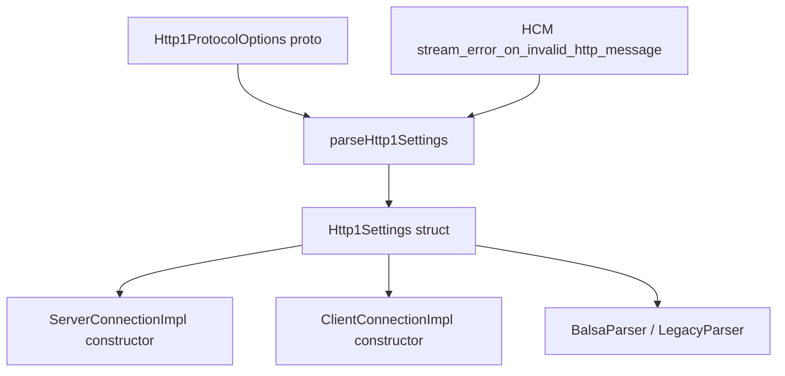
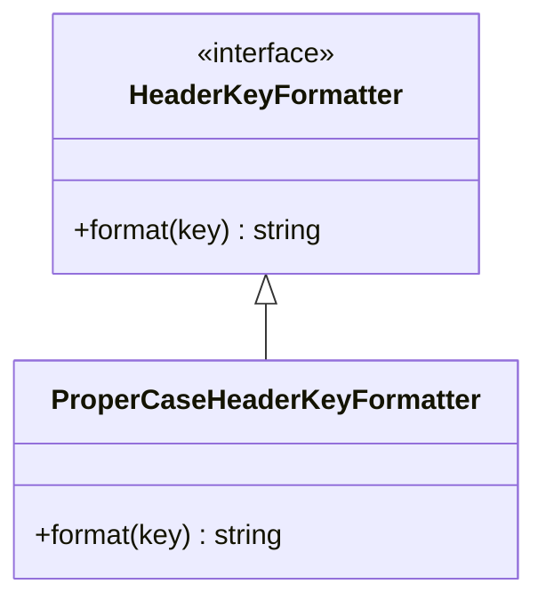

# HTTP/1 Settings and Header Formatter — `settings.h` / `header_formatter.h`

---

## `settings.h`

**File:** `source/common/http/http1/settings.h`

Provides factory functions that parse `envoy::config::core::v3::Http1ProtocolOptions` protobuf
config into an `Http1Settings` struct consumed by `ConnectionImpl`.

### Functions

```cpp
// Basic parse — no HCM-level stream error or scheme validation overrides
Http1Settings parseHttp1Settings(
    const envoy::config::core::v3::Http1ProtocolOptions& config,
    Server::Configuration::CommonFactoryContext& context,
    ProtobufMessage::ValidationVisitor& validation_visitor);

// Full parse — also applies HCM-level stream_error_on_invalid_http_message
// and validate_scheme overrides
Http1Settings parseHttp1Settings(
    const envoy::config::core::v3::Http1ProtocolOptions& config,
    Server::Configuration::CommonFactoryContext& context,
    ProtobufMessage::ValidationVisitor& validation_visitor,
    const Protobuf::BoolValue& hcm_stream_error,
    bool validate_scheme);
```

### `Http1Settings` Fields (populated by these parsers)

| Field | Source Proto Field | Description |
|---|---|---|
| `enable_trailers_` | `enable_trailers` | Allow HTTP/1 trailers (non-standard extension) |
| `allow_absolute_url_` | `allow_absolute_url` | Accept absolute-form URLs in requests |
| `accept_http_10_` | `accept_http_10` | Accept HTTP/1.0 requests |
| `default_host_for_http_10_` | `default_host_for_http_10` | Host header value for HTTP/1.0 requests |
| `header_key_format_` | `header_key_format` | Preserve, proper-case, or stateful header key formatting |
| `enable_chunked_encoding_` | implicit | Whether to use chunked transfer encoding |
| `stream_error_on_invalid_http_message_` | `stream_error_on_invalid_http_message` / HCM override | Reset stream vs close connection on parse errors |
| `send_fully_qualified_url_` | `send_fully_qualified_url` | Send absolute-form URLs to upstream (proxy mode) |
| `allow_custom_methods_` | `allow_custom_methods` | Pass non-standard HTTP methods through |

### Config Hierarchy



---

## `header_formatter.h`

**File:** `source/common/http/http1/header_formatter.h`

Defines `ProperCaseHeaderKeyFormatter`, which formats HTTP/1 header names in
**Proper-Case** style (e.g., `content-type` → `Content-Type`).

### Class Overview



### Formatting Rules

`ProperCaseHeaderKeyFormatter::format()` upper-cases:
- The **first character** of the key
- Any **alpha character immediately following a special character** (e.g., `-`, `_`)

```
Examples:
  "content-type"      → "Content-Type"
  "x-envoy-upstream"  → "X-Envoy-Upstream"
  "accept-encoding"   → "Accept-Encoding"
```

### When Is It Used?

Activated when `Http1ProtocolOptions.header_key_format` is set to `PROPER_CASE` in the
listener or cluster configuration. `ConnectionImpl` stores an
`encode_only_header_key_formatter_` that is applied during `encodeFormattedHeader()`.

```mermaid
flowchart LR
    Config["header_key_format: PROPER_CASE"] --> Create[Create ProperCaseHeaderKeyFormatter]
    Create --> CI[ConnectionImpl::encode_only_header_key_formatter_]
    CI --> EH[encodeFormattedHeader called for each header]
    EH --> Format[formatter.format(key)]
    Format --> Wire[Write formatted key to output_buffer_]
```

### Other Formatter Options

| `header_key_format` value | Formatter Used | Behavior |
|---|---|---|
| `DEFAULT` (unset) | `nullptr` | Headers written as-is (lowercase) |
| `PROPER_CASE` | `ProperCaseHeaderKeyFormatter` | Capitalise each word |
| `STATEFUL_FORMATTER` | `StatefulHeaderKeyFormatterImpl` | Per-connection formatter that mirrors original casing from downstream request |
