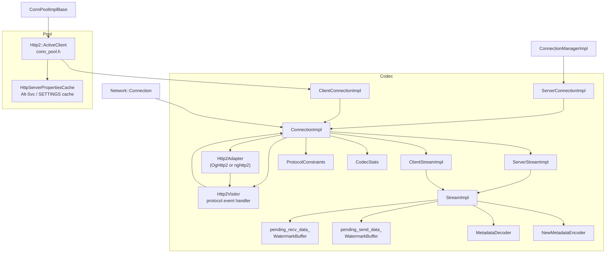
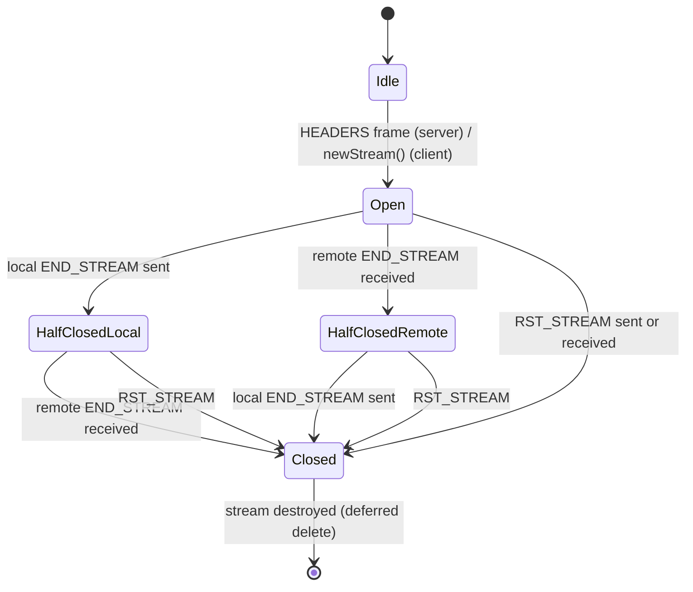
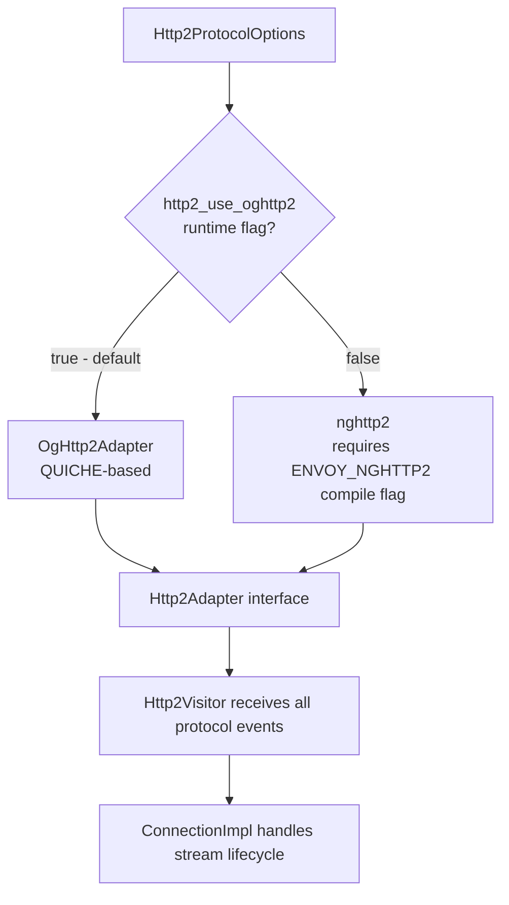

# Envoy HTTP/2 Codec — Documentation Index

**Source folder:** `source/common/http/http2/`

---

## File → Doc Map

| Source File(s) | Doc | Description |
|---|---|---|
| `codec_impl.h` / `codec_impl.cc` | [codec_impl.md](./codec_impl.md) | Full codec class hierarchy — `ConnectionImpl`, `StreamImpl`, `ClientStreamImpl`, `ServerStreamImpl`, `Http2Visitor` |
| `protocol_constraints.h` / `.cc` | [protocol_constraints.md](./protocol_constraints.md) | Flood detection and per-connection security limits |
| `codec_stats.h` | [codec_stats.md](./codec_stats.md) | All `http2.*` counters and gauges |
| `conn_pool.h` / `conn_pool.cc` | [conn_pool.md](./conn_pool.md) | HTTP/2 multiplexed connection pool and stream limit calculation |
| `metadata_encoder.h` / `metadata_decoder.h` | [metadata_encoder_decoder.md](./metadata_encoder_decoder.md) | Non-standard METADATA frame extension — encoding and decoding |

---

## Component Relationships

---

## Key Design Properties

- **Multiplexed streams** — many `StreamImpl`s share a single `Network::Connection`; stream IDs allocated by the adapter
- **Dual adapter support** — `OgHttp2Adapter` (QUICHE, default) or `nghttp2` (legacy, compile-time flag `ENVOY_NGHTTP2`), selected via runtime flag `http2_use_oghttp2`
- **Per-stream buffers** — each stream has `pending_recv_data_` and `pending_send_data_` as `WatermarkBuffer`s; watermark callbacks drive flow control (see `source/docs/flow_control_02_http2_filters.md`)
- **`readDisable` reference counting** — `read_disable_count_` tracks multiple independent callers; stream only resumes when all callers release
- **Deferred processing** — opt-in feature that buffers body/trailers inside the codec when a stream is read-disabled; drained via `process_buffered_data_callback_`
- **Flood protection** — `ProtocolConstraints` enforces per-connection limits on outbound frames and inbound PRIORITY/WINDOW_UPDATE/empty frames
- **METADATA extension** — custom frame type `0x4D` for inter-filter key-value passing; requires `allow_metadata = true`
- **LRU stream ordering** — with deferred processing, `active_streams_` is LRU; low watermark notifications prefer least-recently-written streams

---

## H2 Stream Lifecycle

## Adapter Selection

