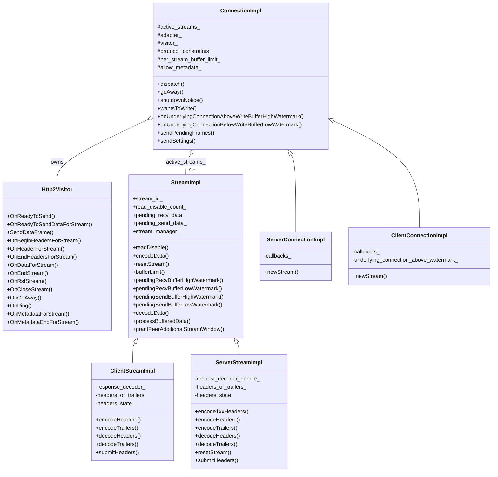
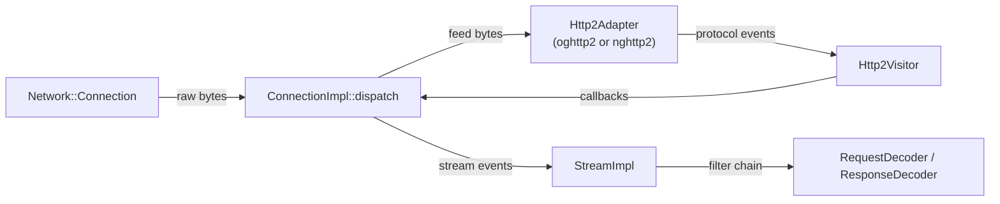
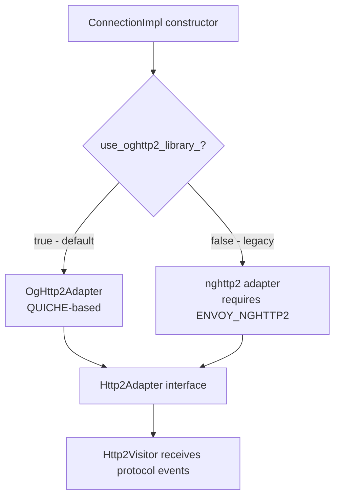

# HTTP/2 Codec Implementation — `codec_impl.h`

**File:** `source/common/http/http2/codec_impl.h`

Central file for the HTTP/2 codec. Defines the full class hierarchy for multiplexed
stream encoding/decoding on both server (downstream) and client (upstream) sides.

---

## Class Hierarchy



---

## `ConnectionImpl`

Base class for both server and client H2 connections. Bridges `Network::Connection` to
the HTTP/2 framing library (oghttp2 / nghttp2).

### Adapter / Visitor Architecture



Two adapter backends are supported:
- **`OgHttp2Adapter`** (QUICHE-based) — default, selected via runtime flag `http2_use_oghttp2`
- **`nghttp2`** — legacy, available when compiled with `ENVOY_NGHTTP2`

`Http2SessionFactory` / `ProdNghttp2SessionFactory` create the appropriate adapter at construction.

### Key Methods

| Method | Description |
|---|---|
| `dispatch(data)` | Feeds incoming bytes to the adapter; drives the `Http2Visitor` callbacks |
| `sendPendingFrames()` | Flushes frames buffered by the adapter to the network write buffer |
| `sendSettings()` | Sends SETTINGS frame to peer at connection establishment |
| `goAway()` | Sends GOAWAY and begins draining active streams |
| `wantsToWrite()` | Returns `adapter_->want_write()` — used to schedule write events |
| `onUnderlyingConnectionAboveWriteBufferHighWatermark()` | Calls `runHighWatermarkCallbacks()` on **all** active streams |
| `onUnderlyingConnectionBelowWriteBufferLowWatermark()` | Calls `runLowWatermarkCallbacks()` on active streams (LRU order if deferred processing) |

### `active_streams_` LRU Order

With deferred processing enabled, `active_streams_` is maintained in **LRU order** — when a
stream encodes data, it is moved to the front. When the downstream write buffer drains (low
watermark), streams are notified in reverse LRU order (least-recently-written first), giving
priority to streams that haven't written recently.

### `sendPendingFrames()` Contexts

| Context | Behaviour |
|---|---|
| `dispatching_ == true` | No-op — prevents reentering the adapter library |
| `dispatching_ == false`, server | Returns protocol constraint check status; increments outbound frame counters |
| `dispatching_ == false`, client | Always returns success; no outbound frame accounting |

---

## `Http2Visitor`

Implements `quiche::Http2VisitorInterface`. Receives decoded protocol events from the
adapter and translates them into Envoy codec actions on `ConnectionImpl`.

### Event → Action Mapping

| Visitor Event | Action |
|---|---|
| `OnBeginHeadersForStream` | Creates new `StreamImpl` or prepares for trailer headers |
| `OnHeaderForStream` | Calls `saveHeader()` — accumulates header name/value pairs |
| `OnEndHeadersForStream` | Calls `stream->decodeHeaders()` — dispatches to filter chain |
| `OnDataForStream` | Calls `stream->decodeData()` — buffers into `pending_recv_data_` |
| `OnEndStream` | Sets `remote_end_stream_ = true`; flushes body/trailers |
| `OnRstStream` | Triggers `onResetStream()` on the stream |
| `OnCloseStream` | Final stream cleanup; calls `stream->destroy()` |
| `OnGoAway` | Propagates to `ConnectionCallbacks::onGoAway()` |
| `OnPing` | Handles keepalive ping responses; increments `keepalive_timeout` on miss |
| `OnReadyToSend` | Writes serialized frame bytes to `Network::Connection` write buffer |
| `OnMetadataForStream` | Routes bytes to `MetadataDecoder` |
| `OnMetadataEndForStream` | Signals end of metadata group |
| `OnFrameSent` | Decrements outbound frame count via `ProtocolConstraints` releasor |
| `OnBeforeFrameSent` | Increments outbound frame count; sets `is_outbound_flood_monitored_control_frame_` |

---

## `StreamImpl`

Base struct for H2 streams. Owns the per-stream receive and send buffers and drives flow control.

### Dual Buffer Design


| Buffer | Type | High WM triggers |
|---|---|---|
| `pending_recv_data_` | `WatermarkBuffer` | `pendingRecvBufferHighWatermark()` → `readDisable(true)` |
| `pending_send_data_` | `WatermarkBuffer` | `pendingSendBufferHighWatermark()` → `runHighWatermarkCallbacks()` |

### `readDisable()` Reference Counting

```cpp
uint32_t read_disable_count_{0};
bool buffersOverrun() const { return read_disable_count_ > 0; }
```

Multiple callers can independently disable a stream. A stream only resumes when all
`readDisable(true)` callers have issued matching `readDisable(false)`.

`shouldAllowPeerAdditionalStreamWindow()` returns false if either `read_disable_count_ > 0`
or `pending_recv_data_` has triggered its high watermark — preventing window updates
from being sent to the peer while the stream is backed up.

### `BufferedStreamManager` (Deferred Processing)

```cpp
struct BufferedStreamManager {
    bool body_buffered_;
    bool trailers_buffered_;
    bool buffered_on_stream_close_;
    uint32_t defer_processing_segment_size_;  // 0 = process all at once
};
```

When deferred processing is enabled:
- Body and trailers are buffered in the codec instead of immediately dispatched
- `process_buffered_data_callback_` (a `SchedulableCallback`) drains buffered data
- `defer_processing_segment_size_` controls chunk size; 0 means process all at once
- Stream close is deferred if buffered data is still pending (`buffered_on_stream_close_`)

### Key Flags

| Flag | Meaning |
|---|---|
| `local_end_stream_sent_` | Encoder has sent END_STREAM |
| `remote_end_stream_` | Remote peer has sent END_STREAM |
| `remote_rst_` | Remote peer sent RST_STREAM |
| `data_deferred_` | Body data is buffered (deferred processing path) |
| `received_noninformational_headers_` | True after first non-1xx response headers received |
| `pending_receive_buffer_high_watermark_called_` | Latch for recv buffer HWM state |
| `pending_send_buffer_high_watermark_called_` | Latch for send buffer HWM state |
| `deferred_reset_` | Reset is deferred until `sendPendingFrames()` flushes pending frames |
| `extend_stream_lifetime_flag_` | Set when `registerCodecEventCallbacks` is used; prevents premature destruction |

### `useDeferredReset()`

| Subclass | Value | Reason |
|---|---|---|
| `ServerStreamImpl` | `true` | Allow error replies to be flushed before RST |
| `ClientStreamImpl` | `false` | Upstream timeouts/resets should be immediate |

---

## `ClientStreamImpl`

Upstream (client-side) stream. Sends requests, receives responses.

- `headers_or_trailers_` holds either `ResponseHeaderMapPtr` (during response) or
  `ResponseTrailerMapPtr` (after `allocTrailers()`)
- `allocTrailers()` logic: if waiting for informational headers (non-`received_noninformational_headers_`),
  creates a new response header map; otherwise creates a trailer map
- No flush timer — request/stream timeouts cover failure-to-flush cases
- `enableTcpTunneling()` is a no-op for H2 (tunneling uses CONNECT method instead)

---

## `ServerStreamImpl`

Downstream (server-side) stream. Receives requests, sends responses.

- `headers_or_trailers_` holds `RequestHeaderMapSharedPtr` or `RequestTrailerMapPtr`
- `request_decoder_handle_` — safe handle to the `RequestDecoder`; allows checking validity
  when decode completes after `recreateStream()`
- `useDeferredReset() = true` — error replies (e.g. 400, 503) are flushed before RST

---

## `ServerConnectionImpl` / `ClientConnectionImpl`

Concrete subclasses that provide `ConnectionCallbacks` and `newStream()` implementations.

| Aspect | `ServerConnectionImpl` | `ClientConnectionImpl` |
|---|---|---|
| Creates streams | `ServerStreamImpl` (on inbound HEADERS) | `ClientStreamImpl` (on `newStream()` call) |
| Watermark latch | N/A | `underlying_connection_above_watermark_` |
| New stream + above HWM | N/A | Immediately fires `runHighWatermarkCallbacks()` |
| Cookie reconstitution | Via `Utility::reconstituteCrumbledCookies()` | N/A |

### `underlying_connection_above_watermark_` (Client)

When the upstream TCP connection is above its high watermark and a new H2 stream is
created, `runHighWatermarkCallbacks()` is fired immediately to ensure the new stream
starts in the correct paused state.

---

## Adapter Selection



---

## Constants / Identifiers

| Constant | Value | Description |
|---|---|---|
| `CLIENT_MAGIC_PREFIX` | `"PRI * HTTP/2"` | Used to distinguish H2 from H1 on the wire |
| `H2_FRAME_HEADER_SIZE` | `9` | Fixed H2 frame header size in bytes (per RFC 7540) |
| `stream_id_ == -1` | N/A | Sentinel: stream ID not yet assigned by the adapter |
