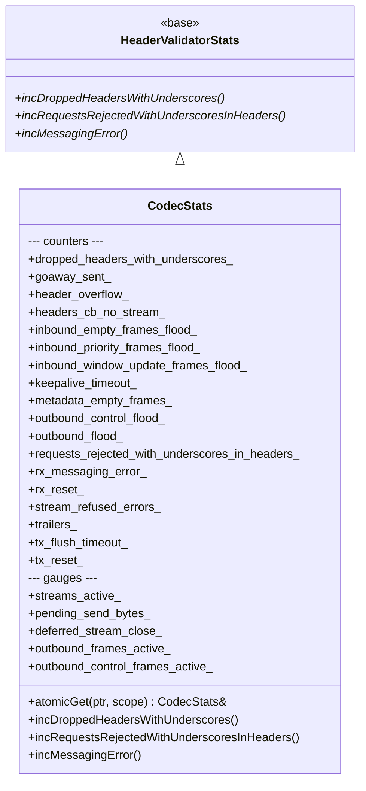
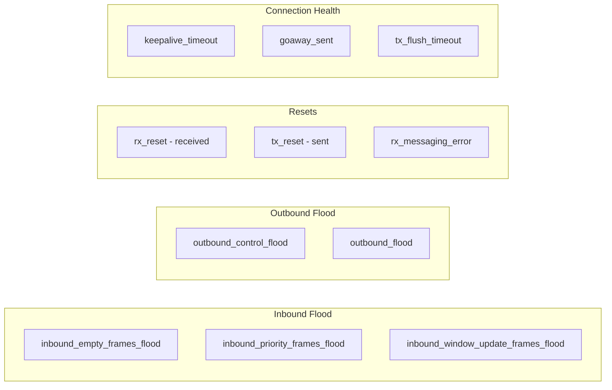

# HTTP/2 Codec Stats — `codec_stats.h`

**File:** `source/common/http/http2/codec_stats.h`

Defines `CodecStats`, the stats container for the HTTP/2 codec. All counters and gauges are
prefixed with `http2.` in the stats scope.

---

## Class Overview



---

## Counters

| Stat (`http2.*`) | Incremented by | Description |
|---|---|---|
| `dropped_headers_with_underscores` | `ServerConnectionImpl` | Header with `_` silently dropped per config |
| `goaway_sent` | `ConnectionImpl::goAway()` | GOAWAY frame sent to peer |
| `header_overflow` | `Http2Visitor::OnHeaderForStream` | Total headers size exceeded `max_headers_kb` |
| `headers_cb_no_stream` | `Http2Visitor::OnBeginHeadersForStream` | Headers callback fired for unknown stream ID |
| `inbound_empty_frames_flood` | `ProtocolConstraints::trackInboundFrame()` | Consecutive empty frame flood detected |
| `inbound_priority_frames_flood` | `ProtocolConstraints::trackInboundFrame()` | PRIORITY frame flood detected |
| `inbound_window_update_frames_flood` | `ProtocolConstraints::trackInboundFrame()` | WINDOW_UPDATE flood detected |
| `keepalive_timeout` | `Http2Visitor::OnPing` | Keepalive ping timed out (no ACK from peer) |
| `metadata_empty_frames` | Metadata encoder | Empty METADATA frame sent |
| `outbound_control_flood` | `ProtocolConstraints::checkOutboundFrameLimits()` | Control frame flood detected (PING/SETTINGS/RST) |
| `outbound_flood` | `ProtocolConstraints::checkOutboundFrameLimits()` | Total outbound frame flood detected |
| `requests_rejected_with_underscores_in_headers` | `ServerConnectionImpl` | Request rejected due to `_` in header name |
| `rx_messaging_error` | `StreamImpl::resetStream()` | Stream reset due to received HTTP messaging violation |
| `rx_reset` | `Http2Visitor::OnRstStream` | RST_STREAM received from peer |
| `stream_refused_errors` | `ClientConnectionImpl` | Stream refused by upstream (REFUSED_STREAM error) |
| `trailers` | `StreamImpl::encodeTrailersBase()` | Trailer frames sent |
| `tx_flush_timeout` | `StreamImpl::onPendingFlushTimer()` | Flush timeout expired on a stream |
| `tx_reset` | `StreamImpl::resetStream()` | RST_STREAM sent to peer |

---

## Gauges

| Stat (`http2.*`) | Mode | Description |
|---|---|---|
| `streams_active` | Accumulate | Number of currently active H2 streams |
| `pending_send_bytes` | Accumulate | Total bytes pending in all stream `pending_send_data_` buffers |
| `deferred_stream_close` | Accumulate | Streams whose close is deferred due to pending buffered data |
| `outbound_frames_active` | Accumulate | Frames buffered for sending but not yet written to socket |
| `outbound_control_frames_active` | Accumulate | Control frames (PING/SETTINGS/RST) pending write |

> `Accumulate` mode means the gauge is **summed across all worker threads** in the stats output,
> suitable for connection-level metrics that exist on every worker.

---

## Flood vs. Non-Flood Stats



---

## `atomicGet()` Pattern

Same thread-safe lazy-init pattern as HTTP/1 `CodecStats`:

```cpp
static CodecStats& atomicGet(AtomicPtr& ptr, Stats::Scope& scope) {
    return *ptr.get([&scope]() -> CodecStats* {
        return new CodecStats{ALL_HTTP2_CODEC_STATS(
            POOL_COUNTER_PREFIX(scope, "http2."),
            POOL_GAUGE_PREFIX(scope, "http2.")
        )};
    });
}
```
