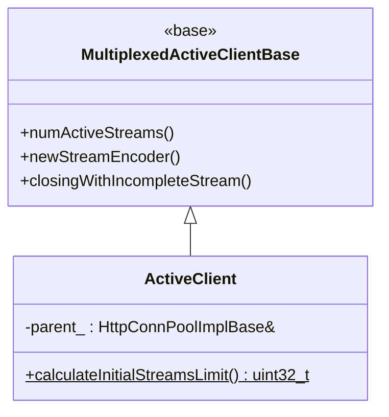
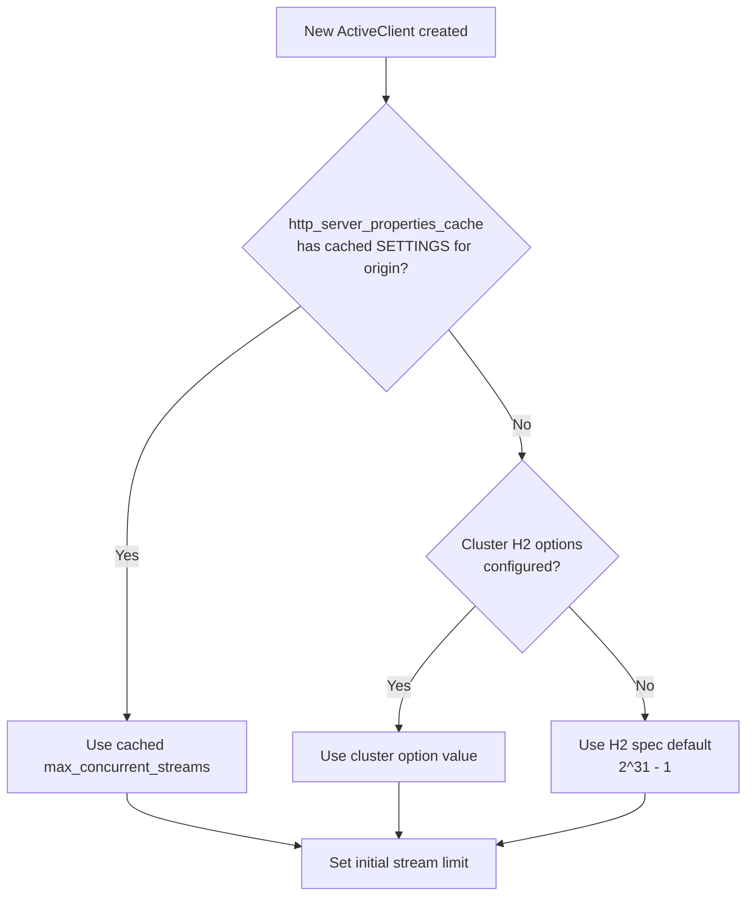
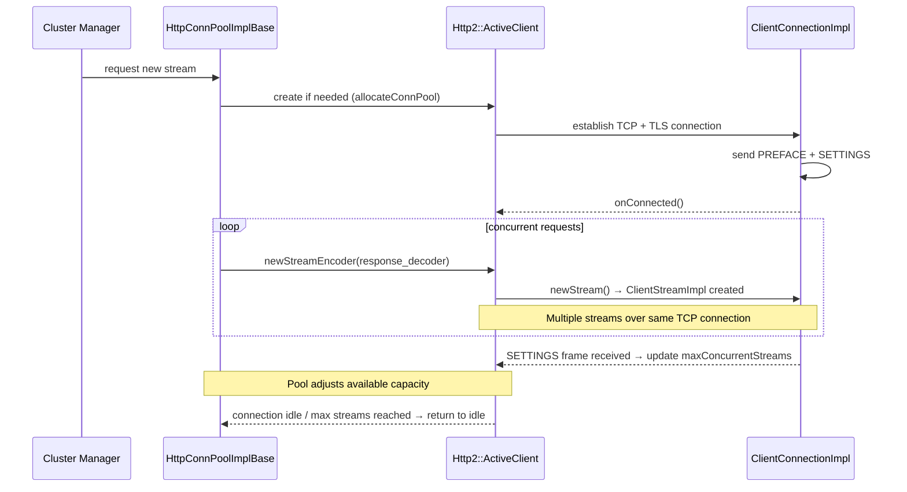

# HTTP/2 Connection Pool — `conn_pool.h`

**File:** `source/common/http/http2/conn_pool.h`

Defines the HTTP/2 `ActiveClient` for the connection pool. Unlike HTTP/1, HTTP/2 fully
multiplexes multiple streams over a single TCP connection, so a single `ActiveClient` can
serve many concurrent requests simultaneously.

---

## Class Overview



---

## Multiplexing vs HTTP/1

| Property | HTTP/1 `ActiveClient` | HTTP/2 `ActiveClient` |
|---|---|---|
| Streams per connection | 1 | Up to `max_concurrent_streams` (negotiated via SETTINGS) |
| Stream tracking | Manual `StreamWrapper` | Base class `MultiplexedActiveClientBase` |
| Capacity check | `stream_wrapper_ != nullptr` | `numActiveStreams() < maxConcurrentStreams()` |
| Connection reuse | Only after response complete | Immediately for new streams |
| `numActiveStreams()` source | `stream_wrapper_` presence | Codec-level active stream count |

---

## `calculateInitialStreamsLimit()`

```cpp
static uint32_t calculateInitialStreamsLimit(
    Http::HttpServerPropertiesCacheSharedPtr http_server_properties_cache,
    absl::optional<HttpServerPropertiesCache::Origin>& origin,
    Upstream::HostDescriptionConstSharedPtr host);
```

Determines the initial maximum concurrent stream limit for a new connection. Uses:

1. **HTTP Server Properties Cache** — if the origin has a previously observed `max_concurrent_streams`
   from a prior SETTINGS frame, that value is used (avoids creating too many streams before
   SETTINGS arrives on a new connection)
2. **Host cluster config** — falls back to the cluster-configured H2 options
3. **H2 spec default** — falls back to 2^31 - 1 if nothing else is configured



---

## Connection Lifecycle



---

## `allocateConnPool()` Factory

```cpp
ConnectionPool::InstancePtr allocateConnPool(
    Event::Dispatcher& dispatcher,
    Random::RandomGenerator& random_generator,
    Upstream::HostConstSharedPtr host,
    Upstream::ResourcePriority priority,
    const Network::ConnectionSocket::OptionsSharedPtr& options,
    const Network::TransportSocketOptionsConstSharedPtr& transport_socket_options,
    Upstream::ClusterConnectivityState& state,
    Server::OverloadManager& overload_manager,
    absl::optional<HttpServerPropertiesCache::Origin> origin = absl::nullopt,
    Http::HttpServerPropertiesCacheSharedPtr http_server_properties_cache = nullptr);
```

Factory that creates an `HttpConnPoolImplBase` configured for HTTP/2. The optional
`origin` and `http_server_properties_cache` parameters enable Alt-Svc / HTTP Server
Properties Cache support — allowing reuse of previously observed SETTINGS values.
