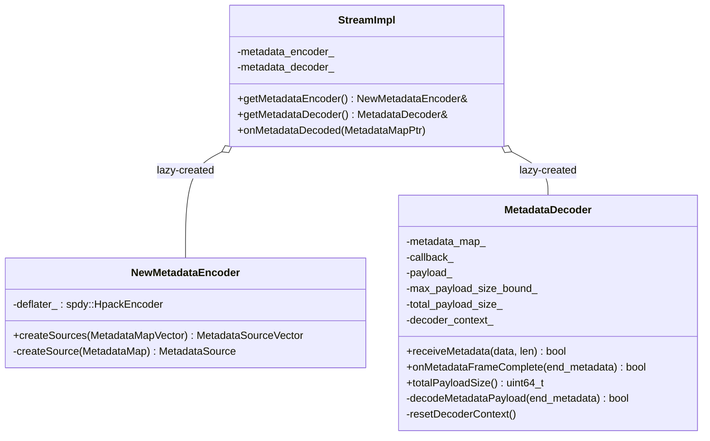
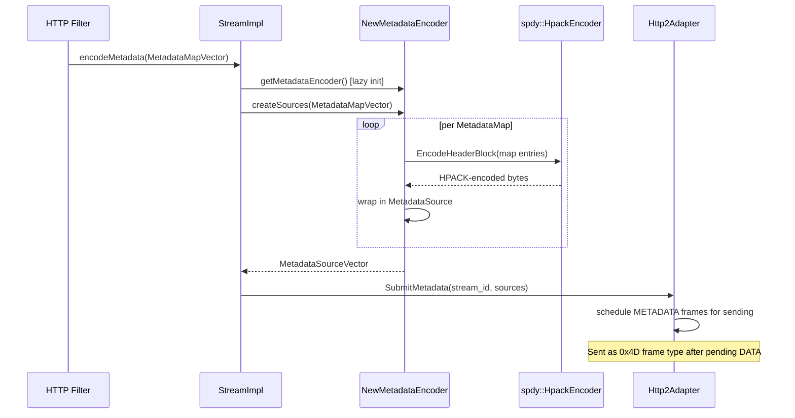
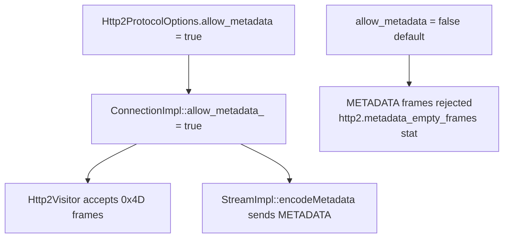

# HTTP/2 Metadata Encoder and Decoder — `metadata_encoder.h` / `metadata_decoder.h`

**Files:**
- `source/common/http/http2/metadata_encoder.h`
- `source/common/http/http2/metadata_decoder.h`

Envoy supports a non-standard HTTP/2 extension: **METADATA frames**. These carry
arbitrary key-value pairs alongside a stream, outside the normal HTTP header/body flow.
They are used for inter-filter communication and internal signaling (e.g., passing
upstream metadata to downstream filters without modifying headers).

> **Note:** METADATA frames are an Envoy-proprietary extension. Peers must opt in;
> standard H2 clients and servers will reject or ignore them. Enabled via
> `allow_metadata` in `Http2ProtocolOptions`.

---

## Class Overview



---

## `NewMetadataEncoder`

Encodes a `MetadataMapVector` (a vector of `MetadataMap` — string key-value maps) into
wire-format HTTP/2 METADATA frame payloads using HPACK encoding.

### Encoding Flow



### `MetadataSourceVector`
A `vector<unique_ptr<MetadataSource>>`. Each `MetadataSource` is a
`quiche::http2::adapter::MetadataSource` — a data source that the adapter calls
when it is ready to send the frame payload.

---

## `MetadataDecoder`

Decodes incoming METADATA frame payloads back into `MetadataMap` and fires a callback
when a complete metadata group (terminated by `end_metadata = true`) is received.

### Decoding Flow

```mermaid
sequenceDiagram
    participant Visitor as Http2Visitor
    participant Stream as StreamImpl
    participant Dec as MetadataDecoder
    participant HC as HpackDecoderContext
    participant CB as MetadataCallback (StreamImpl)

    Visitor->>Stream: OnMetadataForStream(stream_id, bytes)
    Stream->>Dec: receiveMetadata(data, len)
    Dec->>Dec: payload_.add(data, len)
    Dec->>Dec: total_payload_size_ += len

    Visitor->>Stream: OnMetadataEndForStream(stream_id)
    Stream->>Dec: onMetadataFrameComplete(end_metadata)
    Dec->>HC: HPACK decode payload_
    HC-->>Dec: MetadataMap entries
    alt end_metadata == true
        Dec->>CB: callback_(MetadataMapPtr)
        CB->>Stream: onMetadataDecoded(MetadataMapPtr)
        Stream->>Filter: decodeMetadata(MetadataMapPtr)
    else more frames coming
        Dec->>Dec: accumulate; await next frame
    end
```

### Size Limit

`max_payload_size_bound_` caps the total accumulated `total_payload_size_`. If exceeded,
`receiveMetadata()` returns `false`, causing the connection to be closed with a protocol error.
This prevents memory exhaustion from a peer sending unbounded METADATA.

### `HpackDecoderContext`

Private `struct HpackDecoderContext` wraps the QUICHE HPACK decoder. It is reset between
metadata groups via `resetDecoderContext()` to ensure clean state for each new group.

---

## Wire Format

METADATA frames use the custom frame type `0x4D` (not in the H2 spec). Each frame:

```
+-----------------------------------------------+
|                 Length (24)                    |
+---------------+---------------+---------------+
|   Type (0x4D) |   Flags (8)   |
+-+-------------+---------------+-------------------------------+
|R|                 Stream Identifier (31)                      |
+=+=============================================================+
|                   HPACK-encoded key-value pairs               |
+---------------------------------------------------------------+
```

- The `END_METADATA` flag (`0x4`) marks the last frame in a group
- Multiple frames can carry a single `MetadataMap` group (split across frames)
- Multiple `MetadataMap`s in a `MetadataMapVector` become separate groups

---

## Enabling Metadata


