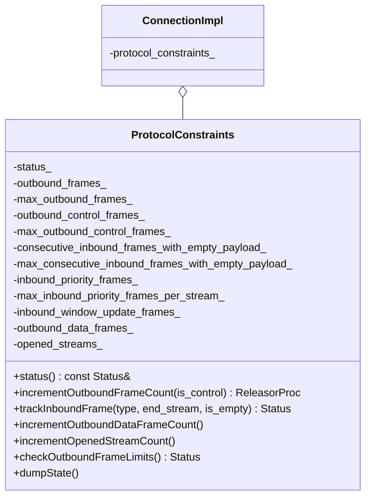
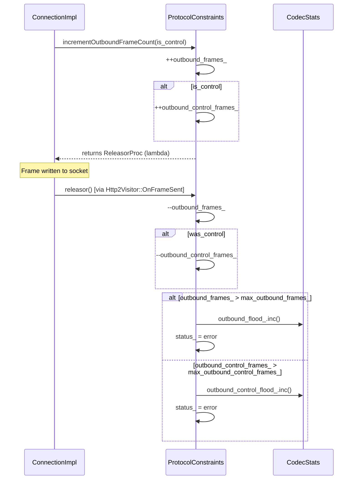
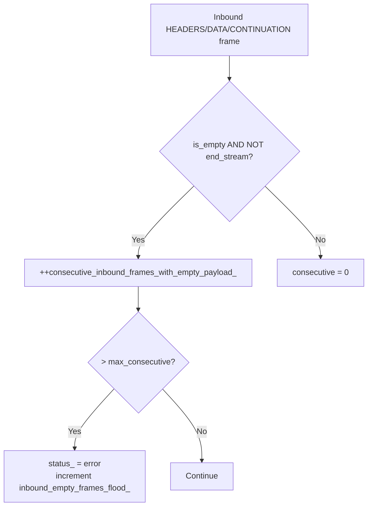

# HTTP/2 Protocol Constraints — `protocol_constraints.h`

**File:** `source/common/http/http2/protocol_constraints.h`

`ProtocolConstraints` detects **abusive peers** and enforces Envoy-specific security limits
on top of what the H2 framing library already validates. It guards against resource exhaustion
attacks via frame flooding.

---

## Class Overview



---

## What It Guards Against

### 1. Outbound Frame Flood

An attacker can send requests/resets that cause Envoy to generate large numbers of outbound
frames that pile up in the write buffer. Two counters track this:

| Counter | Limit (default) | Frame types covered |
|---|---|---|
| `outbound_frames_` | **10,000** | All frame types |
| `outbound_control_frames_` | **1,000** | PING, SETTINGS, RST_STREAM only |



The `ReleasorProc` returned by `incrementOutboundFrameCount()` is called from
`Http2Visitor::OnFrameSent` when the frame is actually written to the socket, decrementing
the pending counter. This prevents counting frames that have already been flushed.

### 2. Inbound Empty Frame Flood (HEADERS/CONTINUATION/DATA with no payload)

Sending large numbers of empty frames is a low-cost way to consume server resources.

| Counter | Limit (default) | Reset condition |
|---|---|---|
| `consecutive_inbound_frames_with_empty_payload_` | **1** | Any non-empty frame or END_STREAM |



### 3. Inbound PRIORITY Frame Flood

| Formula | Meaning |
|---|---|
| `inbound_priority_frames_ > max_inbound_priority_frames_per_stream_ * (1 + opened_streams_)` | Too many PRIORITY frames relative to the number of streams that have been opened |

Default `max_inbound_priority_frames_per_stream_` = **100**.

### 4. Inbound WINDOW_UPDATE Frame Flood

| Formula | Meaning |
|---|---|
| `inbound_window_update_frames_ > 1 + 2 * (opened_streams_ + max_inbound_window_update_frames_per_data_frame_sent_ * outbound_data_frames_)` | Too many WINDOW_UPDATE frames relative to streams + data frames sent |

Default `max_inbound_window_update_frames_per_data_frame_sent_` = **10**.

---

## Limits Reference

| Option field (`Http2ProtocolOptions`) | Default | Guards against |
|---|---|---|
| `max_outbound_frames` | 10,000 | Outbound frame flood |
| `max_outbound_control_frames` | 1,000 | Control frame flood (PING/SETTINGS/RST) |
| `max_consecutive_inbound_frames_with_empty_payload` | 1 | Empty frame flood |
| `max_inbound_priority_frames_per_stream` | 100 | PRIORITY frame flood |
| `max_inbound_window_update_frames_per_data_frame_sent` | 10 | WINDOW_UPDATE flood |

---

## Violation Handling

```mermaid
flowchart TD
    V[Constraint violated] --> S[status_ set to error\nStat counter incremented]
    S --> NOTE[Subsequent violations do NOT reset status\nor increment stats again]
    S --> CI[ConnectionImpl checks status()\nafter sendPendingFrames()]
    CI --> SCHED[scheduleProtocolConstraintViolationCallback()]
    SCHED --> CLOSE[onProtocolConstraintViolation() → close connection]
```

Once a violation is detected, `status()` returns an error permanently. The connection is
closed on the next event loop iteration via a scheduled callback (not inline) to allow
the call stack to unwind cleanly.

---

## `FrameType` Enum

```cpp
enum FrameType {
    OGHTTP2_DATA_FRAME_TYPE,
    OGHTTP2_HEADERS_FRAME_TYPE,
    OGHTTP2_PRIORITY_FRAME_TYPE,
    OGHTTP2_RST_STREAM_FRAME_TYPE,
    OGHTTP2_SETTINGS_FRAME_TYPE,
    OGHTTP2_PUSH_PROMISE_FRAME_TYPE,
    OGHTTP2_PING_FRAME_TYPE,
    OGHTTP2_GOAWAY_FRAME_TYPE,
    OGHTTP2_WINDOW_UPDATE_FRAME_TYPE,
    OGHTTP2_CONTINUATION_FRAME_TYPE,
};
```

These enum values are inherited from nghttp2 numeric values and preserved for compatibility
with oghttp2. Used in `trackInboundFrame()` to classify frames.
