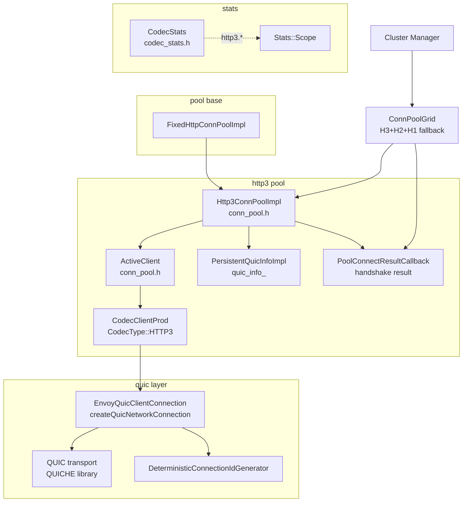
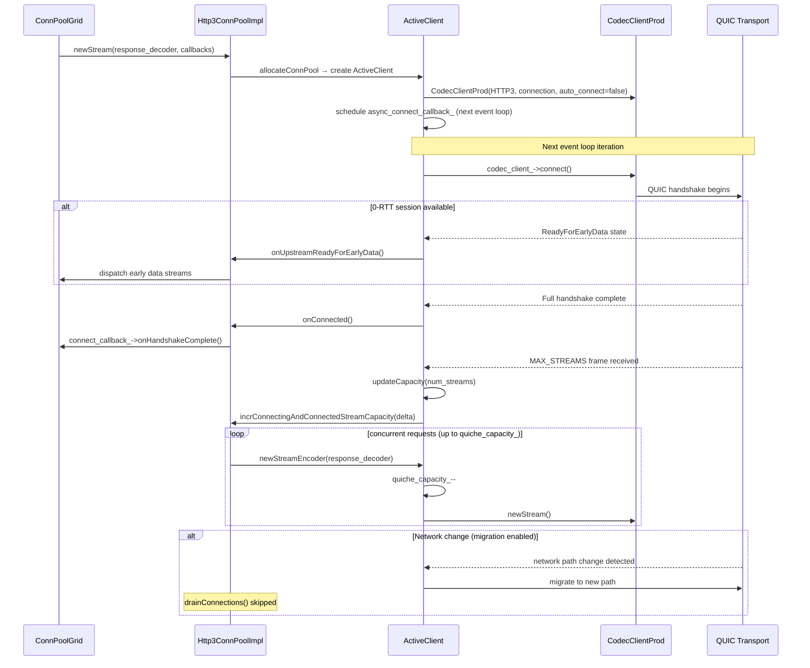
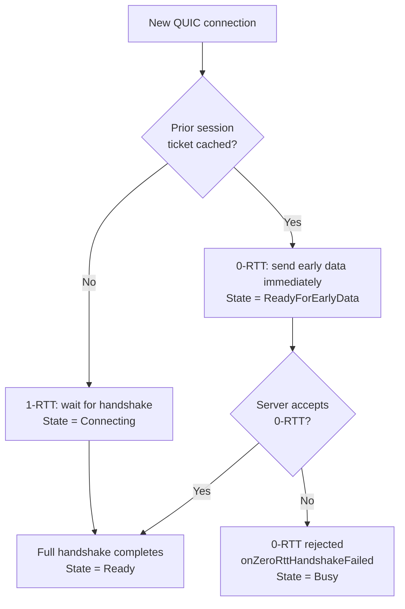

# Envoy HTTP/3 Codec — Documentation Index

**Source folder:** `source/common/http/http3/`

> **Compile guard:** All HTTP/3 code requires `ENVOY_ENABLE_QUIC`. The folder will not build
> with QUIC disabled.

---

## File → Doc Map

| Source File(s) | Doc | Description |
|---|---|---|
| `codec_stats.h` | [codec_stats.md](./codec_stats.md) | All `http3.*` counters, QUIC version tracking, comparison with H2 stats |
| `conn_pool.h` / `conn_pool.cc` | [conn_pool.md](./conn_pool.md) | `ActiveClient`, `Http3ConnPoolImpl`, QUIC capacity model, 0-RTT, connection migration |

> HTTP/3 codec implementation (stream encoding/decoding) lives in
> `source/common/quic/` rather than here — specifically
> `envoy_quic_client_stream.h/cc` and `envoy_quic_server_stream.h/cc`.

---

## Component Relationships

---

## Key Differences from HTTP/1 and HTTP/2

| Property | HTTP/1 | HTTP/2 | HTTP/3 |
|---|---|---|---|
| Transport | TCP | TCP | **QUIC (UDP)** |
| TLS | Optional (TCP-level) | Required (TLS 1.2+) | **Built-in (TLS 1.3 only)** |
| Stream multiplexing | No (1 per conn) | Yes (SETTINGS negotiated) | Yes (**MAX_STREAMS** frame) |
| Head-of-line blocking | Yes | At TCP level | **None** (per-stream loss recovery) |
| 0-RTT resumption | No | No | **Yes** |
| Capacity restored on stream close | N/A | Yes | **No** |
| `trackStreamCapacity()` | — | `true` | **`false`** |
| Connection migration | No | No | **Yes** (on network change) |
| Codec location | `http/http1/` | `http/http2/` | **`quic/`** |
| Pool implementation | `FixedHttpConnPoolImpl` | `HttpConnPoolImplBase` | **`FixedHttpConnPoolImpl`** |
| METADATA frames | No | Yes (extension) | **No** |

---

## HTTP/3 Connection Lifecycle

---

## 0-RTT vs Full Handshake

