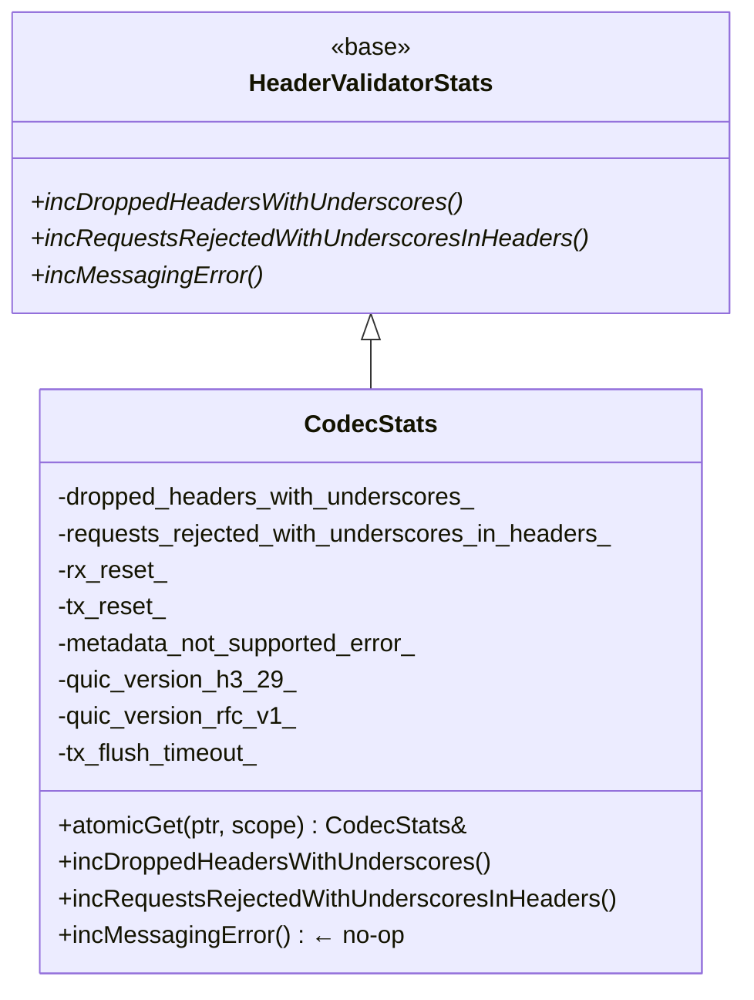

# HTTP/3 Codec Stats — `codec_stats.h`

**File:** `source/common/http/http3/codec_stats.h`

Defines `CodecStats`, the stats container for the HTTP/3 codec. All counters are prefixed
with `http3.` in the stats scope.

---

## Class Overview



---

## Counters

| Stat (`http3.*`) | Incremented by | Description |
|---|---|---|
| `dropped_headers_with_underscores` | QUIC/H3 codec | Header with `_` silently dropped per `headers_with_underscores_action` config |
| `requests_rejected_with_underscores_in_headers` | QUIC/H3 codec | Request rejected due to `_` in header name |
| `rx_reset` | QUIC stream reset handler | Stream reset received from peer (QUIC `RESET_STREAM` frame) |
| `tx_reset` | QUIC stream encoder | Stream reset sent to peer (QUIC `STOP_SENDING` / `RESET_STREAM`) |
| `metadata_not_supported_error` | H3 codec encoder | `encodeMetadata()` called but METADATA is not supported in HTTP/3 |
| `quic_version_h3_29` | Connection established | Connection negotiated using draft-29 of the H3 spec (legacy) |
| `quic_version_rfc_v1` | Connection established | Connection negotiated using RFC 9114 (QUIC v1, the current standard) |
| `tx_flush_timeout` | Stream flush timer | Flush timeout expired on an H3 stream |

> **Note:** HTTP/3 has no gauges — unlike HTTP/2, stream and frame lifecycle metrics are tracked
> at the QUIC transport layer rather than the HTTP codec layer.

---

## HTTP/3 vs HTTP/2 Stats Comparison

| Stat | HTTP/2 | HTTP/3 | Notes |
|---|---|---|---|
| `dropped_headers_with_underscores` | ✓ | ✓ | Same header policy |
| `requests_rejected_with_underscores_in_headers` | ✓ | ✓ | Same header policy |
| `rx_reset` / `tx_reset` | ✓ | ✓ | H2 RST_STREAM ↔ QUIC RESET_STREAM |
| `tx_flush_timeout` | ✓ | ✓ | Same semantics |
| `metadata_not_supported_error` | — | ✓ | H3 does not support METADATA extension |
| `metadata_empty_frames` | ✓ | — | H2 only |
| `goaway_sent` | ✓ | — | H3 GOAWAY tracked at QUIC layer |
| `outbound_flood` / `inbound_*_flood` | ✓ | — | QUIC handles this natively |
| `streams_active` (gauge) | ✓ | — | QUIC transport tracks this |
| `quic_version_h3_29` / `quic_version_rfc_v1` | — | ✓ | H3-specific version tracking |
| `rx_messaging_error` | ✓ | — | Not yet wired for H3 (`incMessagingError()` is a no-op) |

---

## `incMessagingError()` — Not Implemented

```cpp
void incMessagingError() override {}  // TODO: add corresponding counter for H/3 codec
```

Same as HTTP/1 — the messaging error counter exists in the base class but is not yet
wired for HTTP/3.

---

## QUIC Version Counters

The `quic_version_h3_29` and `quic_version_rfc_v1` counters are unique to HTTP/3 and help
operators track which QUIC version is being negotiated in production:

```mermaid
flowchart TD
    A[QUIC handshake completes] --> B{Negotiated version?}
    B -->|QUIC draft-29| C[http3.quic_version_h3_29.inc()]
    B -->|QUIC RFC v1 = 0x1| D[http3.quic_version_rfc_v1.inc()]
```
