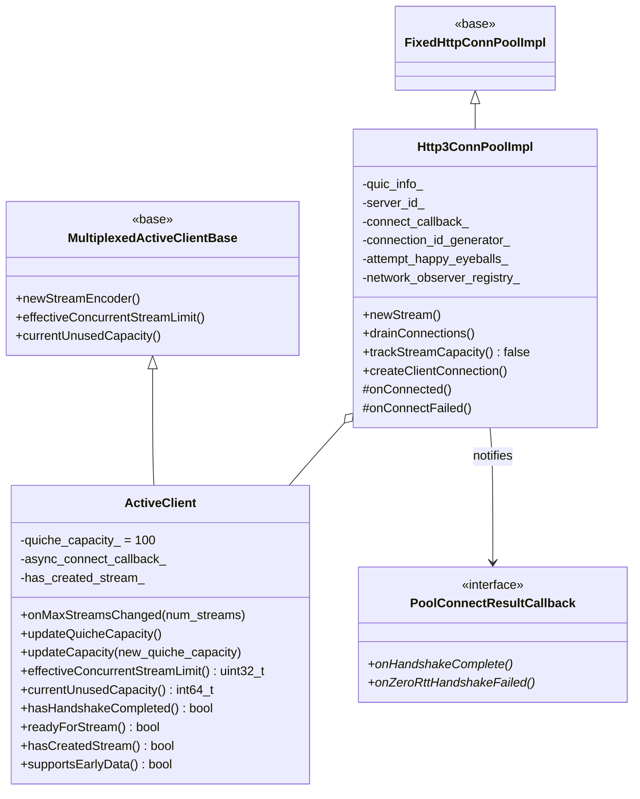
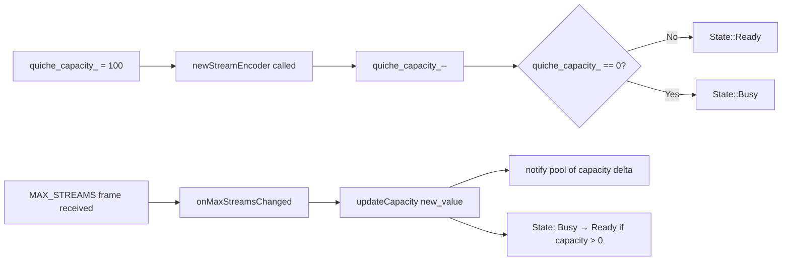
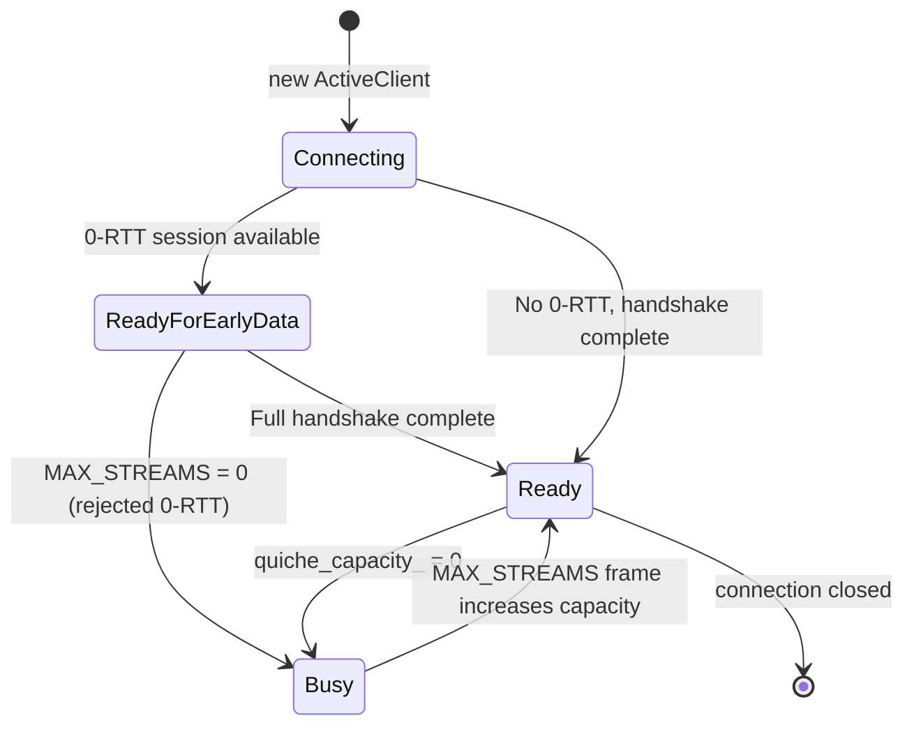

# HTTP/3 Connection Pool — `conn_pool.h` / `conn_pool.cc`

**Files:**
- `source/common/http/http3/conn_pool.h`
- `source/common/http/http3/conn_pool.cc`

Defines the HTTP/3 QUIC-based connection pool. HTTP/3 runs over QUIC rather than TCP, which
fundamentally changes how connection and stream capacity are managed compared to HTTP/1 and HTTP/2.

> **Compile guard:** The entire file is wrapped in `#ifdef ENVOY_ENABLE_QUIC`. HTTP/3 pooling
> cannot be built with QUIC disabled.

---

## Class Overview



---

## QUIC Stream Capacity Model

HTTP/3 / QUIC uses a fundamentally different capacity model from HTTP/1 and HTTP/2:

| Property | HTTP/1 | HTTP/2 | HTTP/3 (QUIC) |
|---|---|---|---|
| Capacity unit | 1 per connection | `max_concurrent_streams` (SETTINGS) | `MAX_STREAMS` frame (unidirectional, not restored on close) |
| Capacity restored on stream close | N/A | Yes | **No** |
| Capacity tracked by | `StreamWrapper` | Base class | `ActiveClient::quiche_capacity_` |
| `trackStreamCapacity()` | — | `true` | **`false`** |

### `quiche_capacity_`

```cpp
uint64_t quiche_capacity_ = 100;  // Optimistic initial value
```

- Starts at **100** as an optimistic estimate — avoids the pool creating one connection per
  request before the initial handshake and `MAX_STREAMS` frame arrive
- **Decremented by 1** each time `newStreamEncoder()` is called (stream allocated)
- **NOT restored** when a stream closes (unlike H2) — reflects QUIC's stream ID space being finite
- **Updated** when a `MAX_STREAMS` frame arrives → `onMaxStreamsChanged()` → `updateCapacity()`



### `updateCapacity()` Delta Logic

```cpp
uint64_t old_capacity = currentUnusedCapacity();
quiche_capacity_ = new_quiche_capacity;
uint64_t new_capacity = currentUnusedCapacity();

if (new_capacity < old_capacity)
    parent_.decrConnectingAndConnectedStreamCapacity(delta);
else if (old_capacity < new_capacity)
    parent_.incrConnectingAndConnectedStreamCapacity(delta);
```

The pool must be notified of the capacity delta (not the raw value) because
`effectiveConcurrentStreamLimit()` applies additional Envoy-configured limits on top of
`quiche_capacity_`. Using the delta from `currentUnusedCapacity()` ensures both QUIC limits
and Envoy config limits are accounted for.

---

## 0-RTT / Early Data

HTTP/3 supports **0-RTT resumption** — data can be sent before the TLS handshake completes,
using session tickets from a previous connection.



Key methods:
- `readyForStream()` — returns `true` for **both** `Ready` and `ReadyForEarlyData` states
- `hasHandshakeCompleted()` — returns `false` during 0-RTT; true only after full handshake
- `supportsEarlyData()` — always `true` for H3
- `async_connect_callback_` — defers `codec_client_->connect()` to the next event loop iteration
  to avoid handling network events (including inline 0-RTT events) during `CodecClient` construction

---

## `PoolConnectResultCallback`

Interface for propagating handshake results to callers (e.g., `ConnPoolGrid` which
orchestrates H3 vs H2/H1 fallback).

```cpp
class PoolConnectResultCallback {
  public:
    virtual void onHandshakeComplete() PURE;
    virtual void onZeroRttHandshakeFailed() PURE;
};
```

| Callback | Triggered when |
|---|---|
| `onHandshakeComplete()` | `Http3ConnPoolImpl::onConnected()` — full QUIC handshake finished |
| `onZeroRttHandshakeFailed()` | `Http3ConnPoolImpl::onConnectFailed()` — connection failed after a stream was already created via 0-RTT early data |

---

## `Http3ConnPoolImpl`

Extends `FixedHttpConnPoolImpl` with QUIC-specific connection creation and drain logic.

### Connection Creation

```mermaid
flowchart TD
    A[allocateConnPool called] --> B[client_fn lambda]
    B --> C[Http3ConnPoolImpl::createClientConnection]
    C --> D[host->transportSocketFactory().getCryptoConfig()]
    D --> E{crypto_config == nullptr?}
    E -->|Yes - secrets not loaded| F[return nullptr]
    E -->|No| G[getHostAddress happy_eyeballs?]
    G --> H[Quic::createQuicNetworkConnection\nwith DeterministicConnectionIdGenerator]
    H --> I[ActiveClient created\nwith async_connect_callback_]
    I --> J[connect deferred to next event loop]
```

### `trackStreamCapacity() = false`

The base pool (`FixedHttpConnPoolImpl`) normally tracks stream capacity to know when to
create new connections. For H3, `ActiveClient::quiche_capacity_` tracks this instead — so
the base pool's tracking is disabled to avoid double-counting.

### `drainConnections()` and Connection Migration

```cpp
void drainConnections(DrainBehavior drain_behavior) override {
    if (drain_behavior == DrainExistingNonMigratableConnections
        && quic_info_.migration_config_.migrate_session_on_network_change) {
        return; // Don't drain; let each connection handle migration itself
    }
    FixedHttpConnPoolImpl::drainConnections(drain_behavior);
}
```

When QUIC connection migration is enabled (e.g., on network interface change for mobile clients),
connections are **not** drained — they migrate to the new network path instead.

### Happy Eyeballs

```cpp
bool attempt_happy_eyeballs_;
Network::Address::InstanceConstSharedPtr getHostAddress(host, secondary_address_family);
```

When `attempt_happy_eyeballs_ = true`, the pool attempts to connect to the **second address**
in the host's address list (typically a different address family — IPv4 vs IPv6). This mirrors
Happy Eyeballs RFC 8305 behavior for QUIC.

---

## `allocateConnPool()` Factory

```cpp
std::unique_ptr<Http3ConnPoolImpl> allocateConnPool(
    Event::Dispatcher& dispatcher,
    Random::RandomGenerator& random_generator,
    Upstream::HostConstSharedPtr host,
    Upstream::ResourcePriority priority,
    const Network::ConnectionSocket::OptionsSharedPtr& options,
    const Network::TransportSocketOptionsConstSharedPtr& transport_socket_options,
    Upstream::ClusterConnectivityState& state,
    Quic::QuicStatNames& quic_stat_names,
    OptRef<Http::HttpServerPropertiesCache> rtt_cache,
    Stats::Scope& scope,
    OptRef<PoolConnectResultCallback> connect_callback,
    Http::PersistentQuicInfo& quic_info,
    OptRef<Quic::EnvoyQuicNetworkObserverRegistry> network_observer_registry,
    Server::OverloadManager& overload_manager,
    bool attempt_happy_eyeballs = false);
```

Notable parameters vs H2's `allocateConnPool`:
- `quic_stat_names`, `rtt_cache`, `scope` — passed to `createQuicNetworkConnection()`
- `connect_callback` — optional callback for handshake result propagation (used by `ConnPoolGrid`)
- `quic_info` — `PersistentQuicInfoImpl` holding shared QUIC session state (crypto, config)
- `network_observer_registry` — for network change detection (connection migration)
- `attempt_happy_eyeballs` — enables dual-stack address selection

The codec client is created with `auto_connect = false` — `connect()` is deliberately deferred
to the next event loop via `async_connect_callback_` to prevent inline 0-RTT event handling
during construction.
