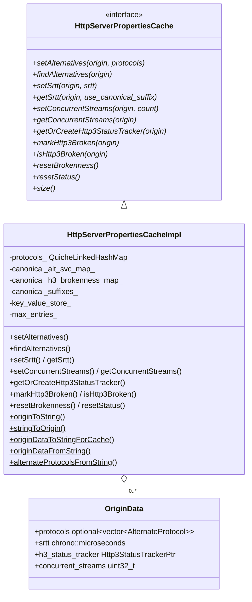
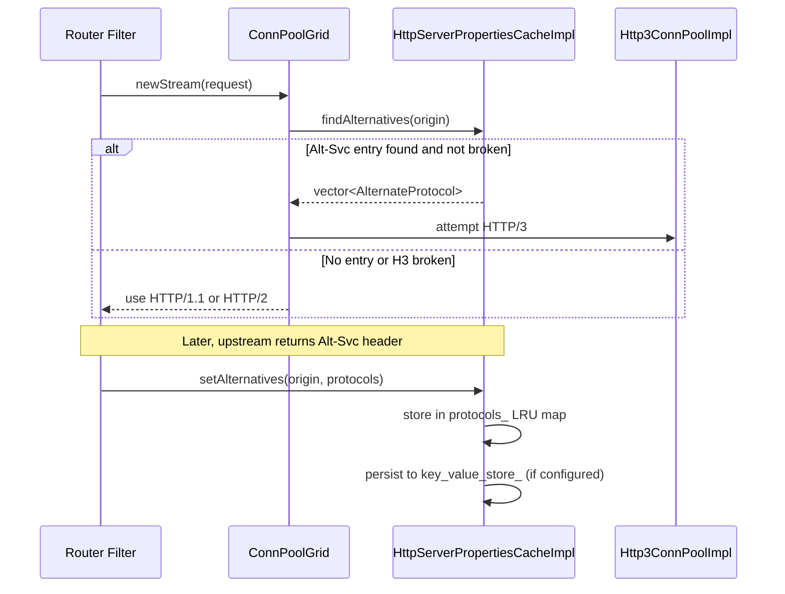
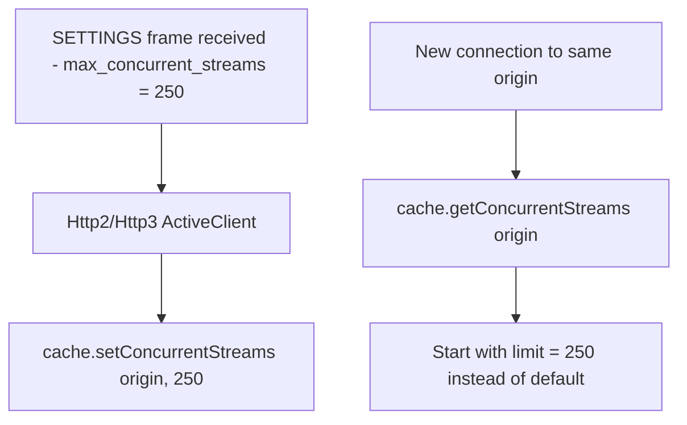

# HTTP Server Properties Cache — `http_server_properties_cache_impl.h`

**Files:**
- `source/common/http/http_server_properties_cache_impl.h`
- `source/common/http/http_server_properties_cache_impl.cc`

Implements `HttpServerPropertiesCache` — a per-worker LRU cache that stores Alt-Svc
(alternative service) entries, QUIC round-trip time (SRTT), HTTP/3 connectivity status,
and expected concurrent stream limits for each origin. This is the core data structure
behind Envoy's HTTP/3 upgrade discovery.

See also: `source/docs/http3_upstream.md`

---

## Class Overview



---

## What Is Cached per Origin

An `Origin` is `{scheme, hostname, port}`.

| Field | Type | Description |
|---|---|---|
| `protocols` | `optional<vector<AlternateProtocol>>` | Alt-Svc entries — alternative protocols (e.g., `h3`, `h3-29`) with `ma` expiry |
| `srtt` | `chrono::microseconds` | Smoothed round-trip time to origin, used for TCP vs QUIC failover decisions |
| `h3_status_tracker` | `Http3StatusTrackerPtr` | Whether H3 is currently broken, and for how long |
| `concurrent_streams` | `uint32_t` | Last observed `max_concurrent_streams` from SETTINGS frame (pre-seeds new connections) |

---

## Alt-Svc Discovery Flow



---

## LRU Map and Eviction

```cpp
using ProtocolsMap = quiche::QuicheLinkedHashMap<Origin, OriginData, OriginHash>;
ProtocolsMap protocols_;
const size_t max_entries_;
```

`QuicheLinkedHashMap` maintains insertion/access order. When `size() > max_entries_`,
the least-recently-used entry is evicted. `max_entries_` is configured per-cluster
(default: `1024`).

---

## Canonical Suffix Support

Canonical suffixes allow multiple hostnames sharing a domain suffix (e.g.
`a.c.youtube.com`, `b.googlevideo.com`) to share the same Alt-Svc and H3 brokenness
state.

```mermaid
flowchart TD
    A[setAlternatives for a.c.youtube.com] --> B{matches canonical suffix\n.c.youtube.com?}
    B -->|Yes| C[canonical_alt_svc_map_[.c.youtube.com] = a.c.youtube.com]
    B -->|No| D[stored only for exact origin]

    E[findAlternatives for b.c.youtube.com] --> F{exact match in protocols_?}
    F -->|No| G[getCanonicalOrigin: look up .c.youtube.com suffix]
    G --> H[use canonical origin a.c.youtube.com's entry]
```

Two separate canonical maps exist:
- `canonical_alt_svc_map_` — for protocol entries
- `canonical_h3_brokenness_map_` — for H3 broken status (can differ when some entries expire)

---

## Persistence (`KeyValueStore`)

When a `KeyValueStore` is provided (optional), all `setAlternatives` writes are also
flushed to persistent storage. On startup, the store is replayed to warm the cache.

**Serialization format:** `"protocols|rtt"` where:
- `protocols` = Alt-Svc wire format, but with `ma=` as **absolute epoch seconds** (not relative)
- `rtt` = microseconds as decimal integer

`originDataFromString(str, time_source, from_cache=true)` parses `ma=` as absolute time.
`originDataFromString(str, time_source, from_cache=false)` parses `ma=` as relative time
(i.e., as received in the `Alt-Svc` response header).

---

## HTTP/3 Status Tracker

```cpp
HttpServerPropertiesCache::Http3StatusTracker&
    getOrCreateHttp3StatusTracker(const Origin& origin);

void markHttp3Broken(const Origin& origin);
bool isHttp3Broken(const Origin& origin);
void resetBrokenness();  // called when network changes
void resetStatus();      // full reset
```

`Http3StatusTrackerImpl` implements exponential backoff for broken origins — after a
failed H3 connection, H3 is suppressed for increasing periods before being retried.
`resetBrokenness()` is called on network change events to allow H3 to be retried
immediately (e.g., after switching to a new network interface).

---

## `OriginHash`

```cpp
size_t operator()(const Origin& origin) const {
    size_t hash = hash(scheme) + 37 * (hash(hostname) + 37 * hash(port));
    return hash;
}
```

FNV-like combination — multiplies by the "magic number" 37 to spread bits.

---

## `getConcurrentStreams` / `setConcurrentStreams`

Used by `Http2::ActiveClient::calculateInitialStreamsLimit()` and
`Http3::ActiveClient` to pre-seed the initial stream limit on new connections,
avoiding the per-request connection creation that would otherwise occur if Envoy
assumed no information before the first SETTINGS frame.


