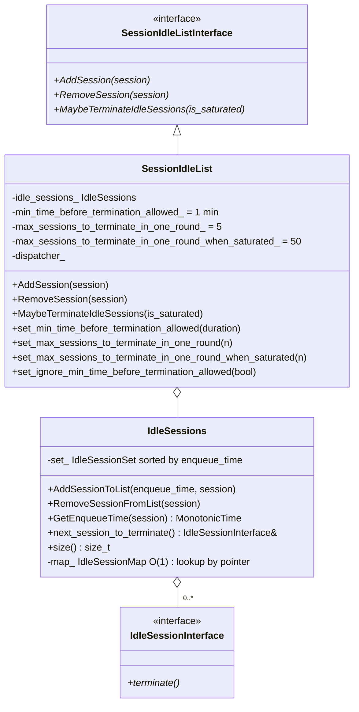
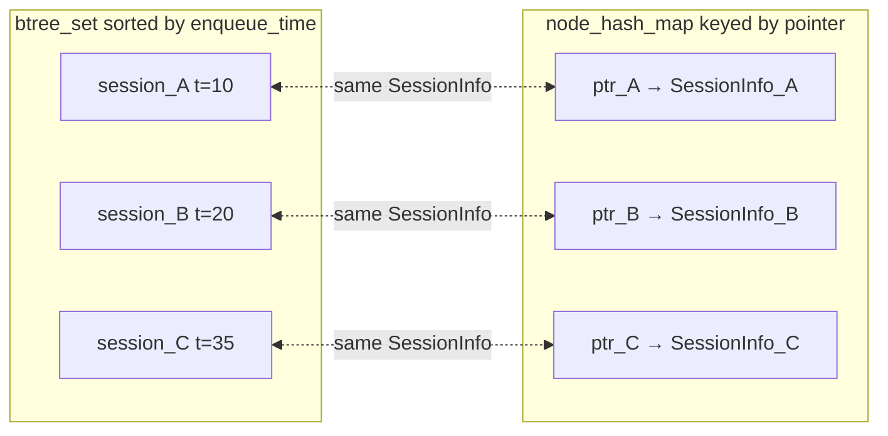
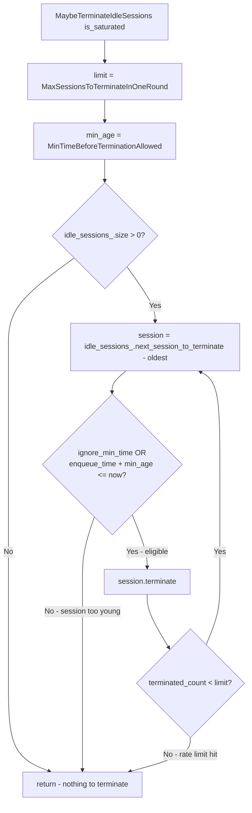
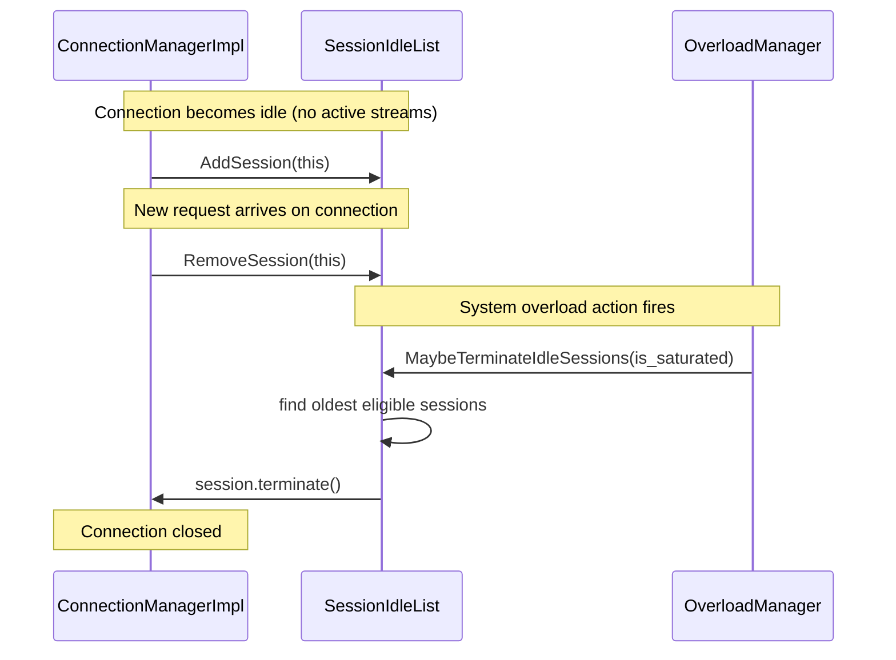

# Session Idle List — `session_idle_list.h`

**Files:**
- `source/common/http/session_idle_list.h`
- `source/common/http/session_idle_list_interface.h`
- `source/common/http/session_idle_list.cc`

`SessionIdleList` manages a set of idle HTTP sessions that can be terminated when the
system is overloaded. It is used by the Overload Manager to shed load by closing
long-lived idle connections in a controlled, rate-limited manner.

---

## Class Overview



---

## Dual Data Structure Design

`IdleSessions` maintains two parallel structures for O(1) operations in both directions:

| Structure | Type | Purpose |
|---|---|---|
| `set_` | `absl::btree_set<SessionInfo>` sorted by `(enqueue_time, session*)` | Ordered iteration — find oldest session first |
| `map_` | `absl::node_hash_map<IdleSessionInterface*, SessionInfo>` | O(1) lookup by pointer — for `RemoveSession` and `GetEnqueueTime` |



- `AddSession` → inserts into both set and map
- `RemoveSession` → looks up in map (O(1)), then removes from both
- `MaybeTerminateIdleSessions` → iterates `set_.begin()` (oldest first)

---

## Termination Logic — `MaybeTerminateIdleSessions(is_saturated)`

Called by the worker thread when the Overload Manager fires a termination action.



### Rate Limits

| Condition | Max terminations per round |
|---|---|
| Normal (`is_saturated = false`) | `max_sessions_to_terminate_in_one_round_` = **5** |
| Saturated (`is_saturated = true`) | `max_sessions_to_terminate_in_one_round_when_saturated_` = **50** |

Defaults are defined as compile-time constants:
```cpp
constexpr size_t kMaxSessionsToTerminateInOneRound = 5;
constexpr size_t kMaxSessionsToTerminateInOneRoundWhenSaturated = 50;
```

### Age Guard

`min_time_before_termination_allowed_` (default **1 minute**) prevents recently-established
sessions from being immediately terminated during overload. Only sessions that have been
in the idle list for at least this duration are eligible.

Setting `ignore_min_time_before_termination_allowed_ = true` bypasses this check — used
in tests and extreme overload scenarios.

---

## Usage Pattern



---

## Configuration

All limits are set via setters (typically by the Overload Manager integration layer):

| Setter | Default | Description |
|---|---|---|
| `set_min_time_before_termination_allowed(d)` | 1 minute | Minimum age before a session can be terminated |
| `set_max_sessions_to_terminate_in_one_round(n)` | 5 | Max terminations per invocation under normal load |
| `set_max_sessions_to_terminate_in_one_round_when_saturated(n)` | 50 | Max terminations per invocation under saturation |
| `set_ignore_min_time_before_termination_allowed(bool)` | false | Skip age check |
