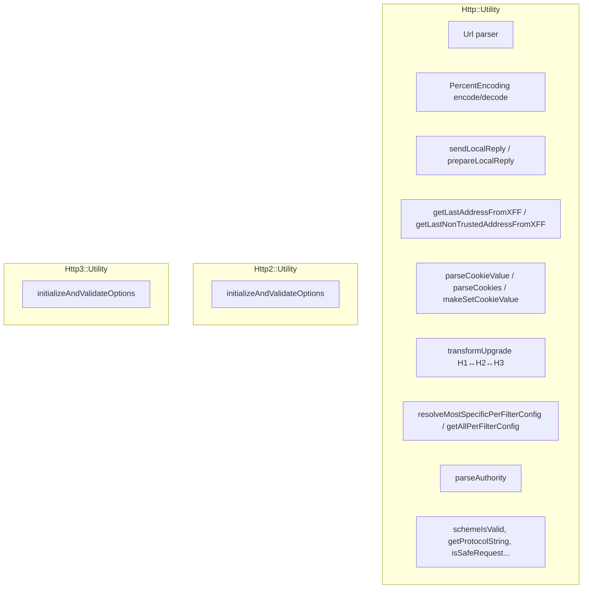
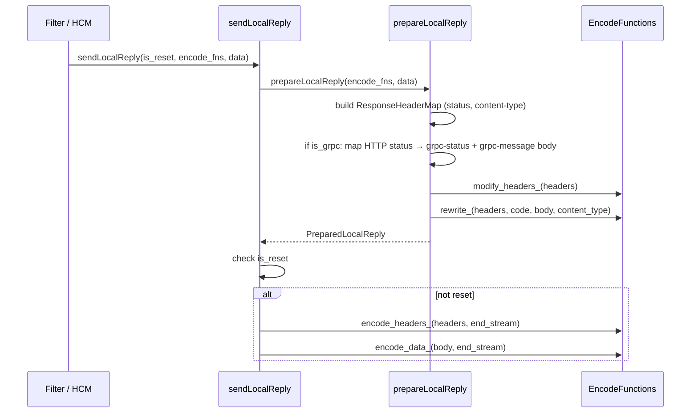
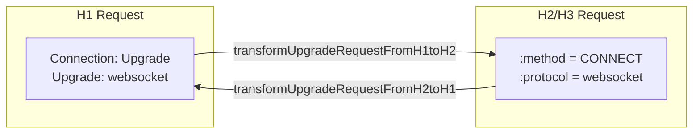

# HTTP Utility Functions — `utility.h`

**File:** `source/common/http/utility.h`

Large collection of free functions and helper classes in `Http::Utility`, `Http2::Utility`,
and `Http3::Utility` namespaces. Covers URL parsing, local reply generation, XFF handling,
cookie manipulation, upgrade transformations, per-route config resolution, and more.

---

## Namespace Structure



---

## `Url` — Absolute URL Parser

```cpp
class Url {
  public:
    bool initialize(absl::string_view absolute_url, bool is_connect_request);
    absl::string_view scheme() const;
    absl::string_view hostAndPort() const;
    absl::string_view pathAndQueryParams() const;
    void setPathAndQueryParams(absl::string_view);
    std::string toString() const;
    bool containsFragment();
    bool containsUserinfo();
};
```

Parses a fully-qualified URL like `https://host:8080/path?query#frag` into components.
`is_connect_request = true` skips scheme parsing (CONNECT targets are just `host:port`).

`containsFragment()` and `containsUserinfo()` are used for security checks — Envoy
typically rejects or strips fragment and userinfo portions.

---

## `PercentEncoding`

| Method | Purpose |
|---|---|
| `encode(value, reserved_chars="%")` | Percent-encode, always escaping non-visible ASCII |
| `decode(encoded)` | Percent-decode (RFC 3986 §2.1) |
| `urlEncode(value)` | x-www-form-urlencoded encoding (space → `%20`, not `+`) |
| `urlDecodeQueryParameter(encoded)` | Decode a URL used as a query parameter value |
| `queryParameterIsUrlEncoded(value)` | Returns `false` if any character should have been encoded but wasn't |

---

## Local Reply — `sendLocalReply` / `prepareLocalReply`

Used by `ConnectionManagerImpl`, filters, and the router to generate locally-originated error
responses (e.g., 400, 503) without going to an upstream.

### `EncodeFunctions`

```cpp
struct EncodeFunctions {
    std::function<void(ResponseHeaderMap&)> modify_headers_;
    std::function<void(ResponseHeaderMap&, Code&, std::string& body, absl::string_view& content_type)> rewrite_;
    std::function<void(ResponseHeaderMapPtr&&, bool end_stream)> encode_headers_;
    std::function<void(Buffer::Instance&, bool end_stream)> encode_data_;
};
```

- `modify_headers_` — called first; allows setting/removing response headers (e.g., `Server`)
- `rewrite_` — called after; allows the `LocalReply` config to substitute the body and status
- `encode_headers_` / `encode_data_` — bound to the filter manager's encode functions

### `LocalReplyData`

```cpp
struct LocalReplyData {
    bool is_grpc_;               // True → body is mapped to gRPC trailing status
    Code response_code_;         // HTTP status code
    absl::string_view body_text_;
    absl::optional<Grpc::Status::GrpcStatus> grpc_status_;  // Override gRPC status code
    bool is_head_request_ = false;  // True → suppress body
};
```

### Flow



**Two-phase design** (`prepare` then `encode`) allows callers to defer encoding (e.g. buffering
a local reply while draining the request body) without re-preparing headers.

---

## XFF (X-Forwarded-For) Handling

### `getLastAddressFromXFF`

```cpp
GetLastAddressFromXffInfo getLastAddressFromXFF(
    const RequestHeaderMap& request_headers,
    uint32_t num_to_skip = 0);
```

Parses the rightmost valid IP from the `x-forwarded-for` header, skipping `num_to_skip`
addresses from the right (used for `xff_num_trusted_hops` config).

`allow_trusted_address_checks_` in the result is `true` if the address was successfully
extracted and can be used for internal request determination.

### `getLastNonTrustedAddressFromXFF`

```cpp
GetLastAddressFromXffInfo getLastNonTrustedAddressFromXFF(
    const RequestHeaderMap& request_headers,
    absl::Span<const Network::Address::CidrRange> trusted_cidrs);
```

Walks the XFF header right-to-left, skipping addresses that fall within `trusted_cidrs`.
Returns the first non-trusted address found. Used when `trusted_cidrs` is configured
instead of a simple hop count.

---

## Cookie Utilities

| Method | Purpose |
|---|---|
| `parseCookieValue(headers, key)` | Parse a single `Cookie` header value by key |
| `parseCookies(headers)` | Parse all `Cookie` headers into a flat_hash_map |
| `parseCookies(headers, key_filter)` | Same but only include keys where `key_filter(key) == true` |
| `parseSetCookieValue(headers, key)` | Parse a `Set-Cookie` header value by key |
| `makeSetCookieValue(name, value, path, max_age, httponly, attributes)` | Produce a valid `Set-Cookie` header string |
| `removeCookieValue(headers, key)` | Remove a specific cookie from `Cookie` header |

---

## Upgrade / CONNECT Protocol Transforms

These functions handle the header surgery required when proxying WebSocket, gRPC-WebSocket,
or CONNECT-with-protocol across protocol versions.



| Transform function | Direction | Description |
|---|---|---|
| `transformUpgradeRequestFromH1toH2` | H1→H2 | `Upgrade: X` + `Connection: Upgrade` → `:method=CONNECT`, `:protocol=X` |
| `transformUpgradeRequestFromH1toH3` | H1→H3 | Same as H1→H2 |
| `transformUpgradeResponseFromH1toH2` | H1→H2 | `101 Switching Protocols` → `200` |
| `transformUpgradeResponseFromH1toH3` | H1→H3 | Same as H1→H2 |
| `transformUpgradeRequestFromH2toH1` | H2→H1 | `:method=CONNECT`, `:protocol=X` → `Connection: Upgrade`, `Upgrade: X` |
| `transformUpgradeRequestFromH3toH1` | H3→H1 | Same as H2→H1 |
| `transformUpgradeResponseFromH2toH1` | H2→H1 | `200` → `101 Switching Protocols`, restores `Upgrade: X` |
| `transformUpgradeResponseFromH3toH1` | H3→H1 | Same as H2→H1 |

---

## Per-Route Filter Config Resolution

```cpp
template <class ConfigType>
const ConfigType* resolveMostSpecificPerFilterConfig(
    const Http::StreamFilterCallbacks* callbacks);
```

Walks the route hierarchy (routeEntry → route → virtual host → route configuration) and
returns the **most specific** per-filter config found. Returns `nullptr` if none.

```cpp
template <class ConfigType>
absl::InlinedVector<std::reference_wrapper<const ConfigType>, 4>
getAllPerFilterConfig(const Http::StreamFilterCallbacks* callbacks);
```

Returns **all** per-filter configs in ascending specificity order (route table first, most
specific last). Used when a filter needs to merge configs across hierarchy levels.

**Usage:**
```cpp
const auto* config =
    Utility::resolveMostSpecificPerFilterConfig<MyFilterConfig>(decoder_callbacks_);
```

---

## URI / Authority Utilities

| Method | Purpose |
|---|---|
| `extractSchemeHostPathFromUri(uri, scheme, host, path)` | Split `scheme://host/path` into parts |
| `extractHostPathFromUri(uri, host, path)` | Split into host + path (ignores scheme) |
| `localPathFromFilePath(file_path)` | Convert `file:///foo/bar` path component to local filesystem path |
| `buildOriginalUri(headers, max_path_length)` | Reconstruct original request URI from headers |
| `parseAuthority(host)` | Parse host:port into `AuthorityAttributes` (IP vs FQDN, optional port) |
| `appendXff(headers, remote_address)` | Append IP to `x-forwarded-for` |
| `appendVia(headers, via)` | Append to `via` header |
| `updateAuthority(headers, hostname, append_xfh, keep_old)` | Replace `:authority`, optionally saving old in `x-forwarded-host` or `x-envoy-original-host` |
| `createSslRedirectPath(headers)` | Produce `https://host/path` redirect target |
| `findQueryStringStart(path)` | Find `?` in a path `HeaderString` |
| `stripQueryString(path)` | Return path without query string |

---

## Miscellaneous

| Method | Purpose |
|---|---|
| `getResponseStatus(headers)` | Parse `:status` as `uint64_t`; returns 0 on invalid |
| `getResponseStatusOrNullopt(headers)` | Returns `absl::optional<uint64_t>` |
| `getProtocolString(protocol)` | `Protocol::Http11` → `"HTTP/1.1"` etc. |
| `resetReasonToString(reason)` | `StreamResetReason` → human-readable string |
| `schemeIsValid(scheme)` | `true` for `http` or `https` |
| `schemeIsHttp(scheme)` | `true` for `http` |
| `schemeIsHttps(scheme)` | `true` for `https` |
| `isSafeRequest(headers)` | `true` for GET/HEAD/OPTIONS/TRACE |
| `isValidRefererValue(value)` | RFC 7231 Referer validation |
| `sanitizeConnectionHeader(headers)` | Strip hop-by-hop headers nominated by `Connection:`, sanitize `TE` |
| `maybeRequestTimeoutCode(remote_decode_complete)` | Returns `504` if request body is complete, `408` otherwise |
| `newUri(redirect_config, headers)` | Compute new URI from `RedirectConfig` |
| `prepareHeaders(http_uri)` | Build `RequestMessage` from `envoy::config::core::v3::HttpUri` |
| `validateCoreRetryPolicy(policy)` | Validate core retry policy proto |
| `convertCoreToRouteRetryPolicy(policy, retry_on)` | Convert core retry policy to route retry policy |
| `isUpgrade(headers)` | `Connection: Upgrade` + any `Upgrade` value |
| `isH2UpgradeRequest(headers)` | CONNECT + `:protocol` present |
| `isH3UpgradeRequest(headers)` | Same as H2 upgrade |
| `isWebSocketUpgradeRequest(headers)` | `Upgrade: websocket` |
| `removeUpgrade(headers, matchers)` | Remove matching tokens from `Upgrade` header |
| `removeConnectionUpgrade(headers, tokens)` | Remove tokens from `Connection` header |
| `remoteAddressIsTrustedProxy(remote, cidrs)` | Check if remote is in trusted CIDR list |

---

## `Http2::Utility` / `Http3::Utility`

```cpp
// Http2
absl::StatusOr<Http2ProtocolOptions> initializeAndValidateOptions(
    const Http2ProtocolOptions& options);
absl::StatusOr<Http2ProtocolOptions> initializeAndValidateOptions(
    const Http2ProtocolOptions& options,
    bool hcm_stream_error_set,
    const BoolValue& hcm_stream_error);

// Http3
Http3ProtocolOptions initializeAndValidateOptions(
    const Http3ProtocolOptions& options,
    bool hcm_stream_error_set,
    const BoolValue& hcm_stream_error);
```

These functions apply default values and cross-validate H2/H3 protocol options. The
`hcm_stream_error_set` / `hcm_stream_error` parameters allow the HCM-level
`stream_error_on_invalid_http_message` setting to override the per-protocol option
when not explicitly set.

---

## `RedirectConfig`

```cpp
struct RedirectConfig {
    std::string scheme_redirect_;
    std::string host_redirect_;
    std::string port_redirect_;
    std::string path_redirect_;
    std::string prefix_rewrite_redirect_;
    std::string regex_rewrite_redirect_substitution_;
    Regex::CompiledMatcherPtr regex_rewrite_redirect_;
    bool path_redirect_has_query_;
    bool https_redirect_;
    bool strip_query_;
};
```

Aggregates route-level redirect configuration used by `newUri()` to compute the final
redirect target.

---

## `AlpnNames` Singleton

```cpp
class AlpnNameValues {
    const std::string Http10 = "http/1.0";
    const std::string Http11 = "http/1.1";
    const std::string Http2  = "h2";
    const std::string Http2c = "h2c";
    const std::string Http3  = "h3";
};
using AlpnNames = ConstSingleton<AlpnNameValues>;
```

Wire ALPN identifiers used in TLS extension negotiation and protocol selection.
