# Envoy Active Stream Listener Architecture

## Overview

The Active Stream Listener subsystem manages the lifecycle of incoming TCP connections in Envoy, from socket acceptance through listener filter processing to active connection establishment. It provides a sophisticated framework for connection management with support for filter chains, graceful draining, and flexible connection tracking.

---

## Architecture Overview

### High-Level Flow

**This diagram shows how a TCP connection flows through Envoy's listener architecture:**

- **Listener Layer**: The OS socket listener receives incoming TCP connections from clients
- **Stream Listener Base**: Three layered base classes manage the progression from raw socket to established connection
  - `ActiveListenerImplBase`: Holds listener statistics and configuration
  - `ActiveStreamListenerBase`: Manages sockets during the listener filter phase
  - `OwnedActiveStreamListenerBase`: Groups connections by their filter chain for efficient management
- **Socket Processing**: Newly accepted sockets undergo listener filter processing (TLS inspection, protocol detection)
- **Connection Management**: After passing filters, connections are organized by filter chain and managed throughout their lifetime

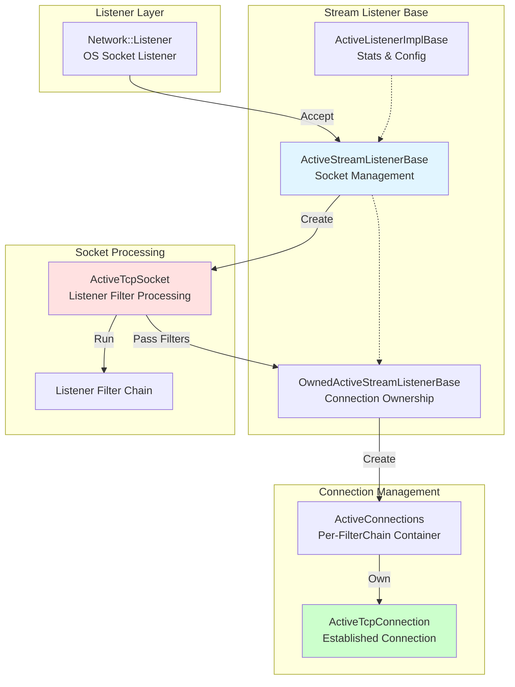
```mermaid
graph TB
    subgraph "Listener Layer"
        Listener[Network::Listener<br/>OS Socket Listener]
    end

    subgraph "Stream Listener Base"
        ActiveListenerBase[ActiveListenerImplBase<br/>Stats & Config]
        StreamListenerBase[ActiveStreamListenerBase<br/>Socket Management]
        OwnedListenerBase[OwnedActiveStreamListenerBase<br/>Connection Ownership]
    end

    subgraph "Socket Processing"
        TcpSocket[ActiveTcpSocket<br/>Listener Filter Processing]
        FilterChain[Listener Filter Chain]
    end

    subgraph "Connection Management"
        ActiveConns[ActiveConnections<br/>Per-FilterChain Container]
        TcpConn[ActiveTcpConnection<br/>Established Connection]
    end

    Listener -->|Accept| StreamListenerBase
    StreamListenerBase -->|Create| TcpSocket
    TcpSocket -->|Run| FilterChain
    TcpSocket -->|Pass Filters| OwnedListenerBase
    OwnedListenerBase -->|Create| ActiveConns
    ActiveConns -->|Own| TcpConn

    ActiveListenerBase -.-> StreamListenerBase
    StreamListenerBase -.-> OwnedListenerBase

    style StreamListenerBase fill:#e1f5ff
    style TcpSocket fill:#ffe1e1
    style TcpConn fill:#ccffcc
```

---

## 1. Class Hierarchy

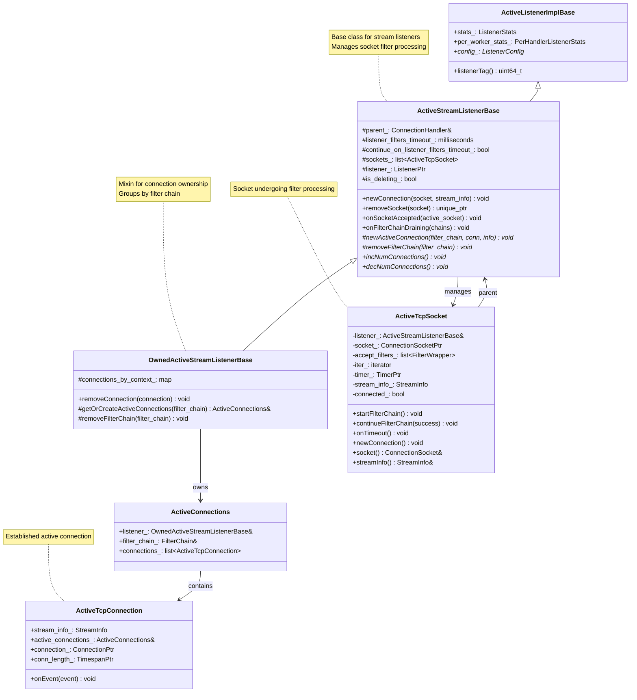
```mermaid
classDiagram
    class ActiveListenerImplBase {
        +stats_: ListenerStats
        +per_worker_stats_: PerHandlerListenerStats
        +config_: ListenerConfig*
        +listenerTag() uint64_t
    }

    class ActiveStreamListenerBase {
        #parent_: ConnectionHandler&
        #listener_filters_timeout_: milliseconds
        #continue_on_listener_filters_timeout_: bool
        #sockets_: list~ActiveTcpSocket~
        #listener_: ListenerPtr
        #is_deleting_: bool
        +newConnection(socket, stream_info) void
        +removeSocket(socket) unique_ptr
        +onSocketAccepted(active_socket) void
        +onFilterChainDraining(chains) void
        #newActiveConnection(filter_chain, conn, info) void*
        #removeFilterChain(filter_chain) void*
        +incNumConnections() void*
        +decNumConnections() void*
    }

    class OwnedActiveStreamListenerBase {
        #connections_by_context_: map
        +removeConnection(connection) void
        #getOrCreateActiveConnections(filter_chain) ActiveConnections&
        #removeFilterChain(filter_chain) void
    }

    class ActiveTcpSocket {
        -listener_: ActiveStreamListenerBase&
        -socket_: ConnectionSocketPtr
        -accept_filters_: list~FilterWrapper~
        -iter_: iterator
        -timer_: TimerPtr
        -stream_info_: StreamInfo
        -connected_: bool
        +startFilterChain() void
        +continueFilterChain(success) void
        +onTimeout() void
        +newConnection() void
        +socket() ConnectionSocket&
        +streamInfo() StreamInfo&
    }

    class ActiveConnections {
        +listener_: OwnedActiveStreamListenerBase&
        +filter_chain_: FilterChain&
        +connections_: list~ActiveTcpConnection~
    }

    class ActiveTcpConnection {
        +stream_info_: StreamInfo
        +active_connections_: ActiveConnections&
        +connection_: ConnectionPtr
        +conn_length_: TimespanPtr
        +onEvent(event) void
    }

    ActiveListenerImplBase <|-- ActiveStreamListenerBase
    ActiveStreamListenerBase <|-- OwnedActiveStreamListenerBase

    ActiveStreamListenerBase --> ActiveTcpSocket: manages
    OwnedActiveStreamListenerBase --> ActiveConnections: owns
    ActiveConnections --> ActiveTcpConnection: contains
    ActiveTcpSocket --> ActiveStreamListenerBase: parent

    note for ActiveStreamListenerBase "Base class for stream listeners<br/>Manages socket filter processing"
    note for OwnedActiveStreamListenerBase "Mixin for connection ownership<br/>Groups by filter chain"
    note for ActiveTcpSocket "Socket undergoing filter processing"
    note for ActiveTcpConnection "Established active connection"
```

---

## 2. Connection Lifecycle

### Complete Flow

**This sequence diagram shows the complete journey of a TCP connection from acceptance to active processing:**

**Socket Acceptance Phase:**
- Operating system signals a new TCP connection is available
- Network listener accepts the socket from the OS
- `ActiveStreamListenerBase` creates an `ActiveTcpSocket` wrapper to manage the socket
- The socket enters the listener filter processing phase

**Filter Chain Processing Phase:**
- Listener filters (like TLS Inspector, Proxy Protocol parser) are created and chained together
- Each filter examines the connection to extract metadata (SNI, ALPN, source IP, etc.)
- Filters can return three statuses:
  - **Continue**: Move to next filter immediately
  - **StopIteration**: Need more data - socket is added to waiting list with timeout
  - **Close**: Reject this connection
- If filters time out, behavior depends on `continue_on_listener_filters_timeout` setting

**Connection Establishment Phase:**
- Once filters complete successfully, `newConnection()` is called
- The appropriate filter chain is matched based on collected metadata
- An `ActiveTcpConnection` is created and added to the connection tracking map
- Network filters are initialized and the connection begins processing data

**Active Connection Phase:**
- Connection processes requests through its network filter chain
- Statistics are updated for active connections

**Connection Termination Phase:**
- Connection close event triggers `removeConnection()`
- Connection is removed from tracking structures
- Access logs are emitted with final connection statistics
- Resources are scheduled for deferred deletion

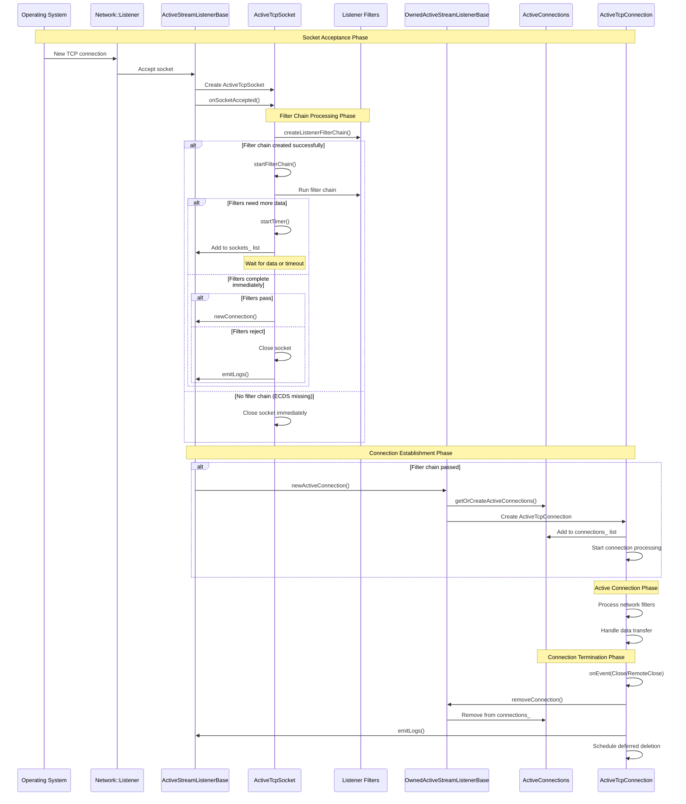
```mermaid
sequenceDiagram
    participant OS as Operating System
    participant Listener as Network::Listener
    participant StreamListener as ActiveStreamListenerBase
    participant TcpSocket as ActiveTcpSocket
    participant Filters as Listener Filters
    participant OwnedListener as OwnedActiveStreamListenerBase
    participant ActiveConns as ActiveConnections
    participant TcpConn as ActiveTcpConnection

    Note over OS,TcpConn: Socket Acceptance Phase

    OS->>Listener: New TCP connection
    Listener->>StreamListener: Accept socket
    StreamListener->>TcpSocket: Create ActiveTcpSocket
    StreamListener->>TcpSocket: onSocketAccepted()

    Note over TcpSocket,Filters: Filter Chain Processing Phase

    TcpSocket->>Filters: createListenerFilterChain()
    alt Filter chain created successfully
        TcpSocket->>TcpSocket: startFilterChain()
        TcpSocket->>Filters: Run filter chain

        alt Filters need more data
            TcpSocket->>TcpSocket: startTimer()
            TcpSocket->>StreamListener: Add to sockets_ list
            Note over TcpSocket: Wait for data or timeout
        else Filters complete immediately
            alt Filters pass
                TcpSocket->>StreamListener: newConnection()
            else Filters reject
                TcpSocket->>TcpSocket: Close socket
                TcpSocket->>StreamListener: emitLogs()
            end
        end
    else No filter chain (ECDS missing)
        TcpSocket->>TcpSocket: Close socket immediately
    end

    Note over StreamListener,TcpConn: Connection Establishment Phase

    alt Filter chain passed
        StreamListener->>OwnedListener: newActiveConnection()
        OwnedListener->>ActiveConns: getOrCreateActiveConnections()
        OwnedListener->>TcpConn: Create ActiveTcpConnection
        TcpConn->>ActiveConns: Add to connections_ list
        TcpConn->>TcpConn: Start connection processing
    end

    Note over TcpConn: Active Connection Phase

    TcpConn->>TcpConn: Process network filters
    TcpConn->>TcpConn: Handle data transfer

    Note over TcpConn,ActiveConns: Connection Termination Phase

    TcpConn->>TcpConn: onEvent(Close/RemoteClose)
    TcpConn->>OwnedListener: removeConnection()
    OwnedListener->>ActiveConns: Remove from connections_
    TcpConn->>StreamListener: emitLogs()
    TcpConn->>TcpConn: Schedule deferred deletion
```

---

## 3. ActiveTcpSocket State Machine

**This state machine tracks an ActiveTcpSocket's lifecycle from creation through listener filter processing:**

**Key States:**
- **Created**: Socket accepted from OS, wrapper object created, StreamInfo initialized
- **FilterProcessing**: Listener filter chain execution begins
- **FilterIterating**: Walking through the filter list, each filter examines the connection
- **NeedMoreData**: A filter needs additional network data before making a decision (e.g., waiting for TLS ClientHello)
- **Waiting**: Socket is in the waiting list with an active timeout timer
- **Timeout**: Timer expired before filters completed
- **FilterPassed**: All filters approved the connection - ready to become active
- **FilterFailed**: A filter rejected the connection or timeout behavior says to close
- **Connected**: Promoted to ActiveTcpConnection, begins normal request processing
- **Closed**: Connection rejected, resources cleaned up

**Critical Decision Points:**
- When a filter returns `StopIteration`, socket enters waiting state with timer
- On timeout, `continue_on_listener_filters_timeout` config determines whether to proceed or reject
- Filter rejection immediately moves to close state
- Successful completion promotes the socket to a full connection

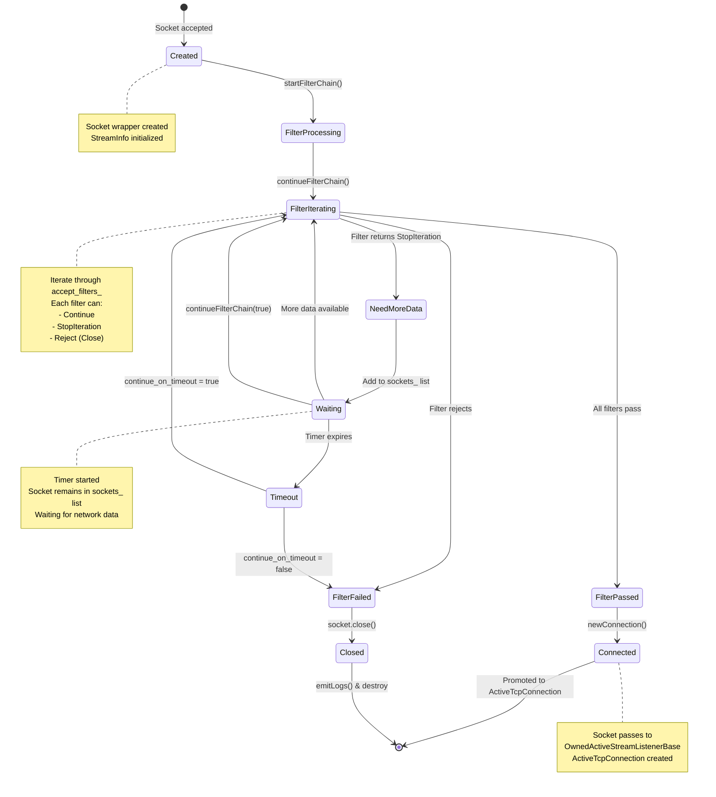
```mermaid
stateDiagram-v2
    [*] --> Created: Socket accepted

    Created --> FilterProcessing: startFilterChain()

    FilterProcessing --> FilterIterating: continueFilterChain()

    FilterIterating --> NeedMoreData: Filter returns StopIteration
    FilterIterating --> FilterPassed: All filters pass
    FilterIterating --> FilterFailed: Filter rejects

    NeedMoreData --> Waiting: Add to sockets_ list
    Waiting --> FilterIterating: More data available
    Waiting --> Timeout: Timer expires
    Waiting --> FilterIterating: continueFilterChain(true)

    Timeout --> FilterFailed: continue_on_timeout = false
    Timeout --> FilterIterating: continue_on_timeout = true

    FilterPassed --> Connected: newConnection()
    FilterFailed --> Closed: socket.close()

    Connected --> [*]: Promoted to ActiveTcpConnection
    Closed --> [*]: emitLogs() & destroy

    note right of Created
        Socket wrapper created
        StreamInfo initialized
    end note

    note right of FilterIterating
        Iterate through accept_filters_
        Each filter can:
        - Continue
        - StopIteration
        - Reject (Close)
    end note

    note right of Waiting
        Timer started
        Socket remains in sockets_ list
        Waiting for network data
    end note

    note right of Connected
        Socket passes to
        OwnedActiveStreamListenerBase
        ActiveTcpConnection created
    end note
```

---

## 4. Listener Filter Processing

### Filter Chain Execution

**This flowchart details the listener filter chain execution logic:**

**Initial Phase:**
- Socket is accepted and `ActiveTcpSocket` is created
- Filter chain creation is attempted - if it fails (e.g., due to missing ECDS config), socket is closed immediately
- Filter iterator is initialized to the beginning of the filter list

**Filter Iteration Loop:**
- Each filter is invoked sequentially
- Filter can return three statuses:
  - **Continue**: Proceed to next filter
  - **StopIteration**: Socket needs more data - add to waiting list, start timer
  - **Close**: Reject connection immediately

**Waiting State:**
- When a filter returns `StopIteration`, socket is added to `sockets_` list
- Timer is started with duration from `listener_filters_timeout` config (typically 15 seconds)
- Socket waits for:
  - More network data arriving (filter can resume)
  - Timeout expiration

**Timeout Handling:**
- If `continue_on_listener_filters_timeout` is **true**: Continue with remaining filters (may match less specific filter chain)
- If `continue_on_listener_filters_timeout` is **false**: Reject connection and close socket

**Success Path:**
- All filters pass: Call `newConnection()` to find matching filter chain
- Socket is promoted to `ActiveTcpConnection`
- Listener filter instances are destroyed (no longer needed)

**Failure Path:**
- Filter rejection or timeout-based closure
- Access logs are emitted with connection metadata
- Socket is closed and resources cleaned up

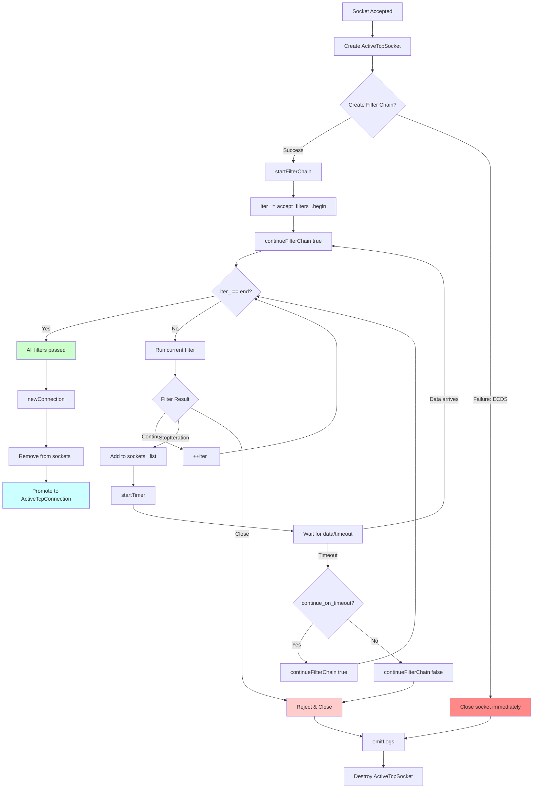
```mermaid
flowchart TD
    Start[Socket Accepted] --> CreateSocket[Create ActiveTcpSocket]
    CreateSocket --> CreateFilters{Create Filter Chain?}

    CreateFilters -->|Success| StartChain[startFilterChain]
    CreateFilters -->|Failure: ECDS| CloseImmediate[Close socket immediately]

    StartChain --> InitIter[iter_ = accept_filters_.begin]
    InitIter --> ContinueChain[continueFilterChain true]

    ContinueChain --> CheckEnd{iter_ == end?}

    CheckEnd -->|Yes| AllPassed[All filters passed]
    CheckEnd -->|No| RunFilter[Run current filter]

    RunFilter --> CheckResult{Filter Result}

    CheckResult -->|Continue| NextFilter[++iter_]
    CheckResult -->|StopIteration| AddToList[Add to sockets_ list]
    CheckResult -->|Close| RejectSocket[Reject & Close]

    NextFilter --> CheckEnd

    AddToList --> StartTimer[startTimer]
    StartTimer --> WaitData[Wait for data/timeout]

    WaitData -->|Data arrives| ContinueChain
    WaitData -->|Timeout| CheckTimeout{continue_on_timeout?}

    CheckTimeout -->|Yes| ContinueTrue[continueFilterChain true]
    CheckTimeout -->|No| ContinueFalse[continueFilterChain false]

    ContinueTrue --> CheckEnd
    ContinueFalse --> RejectSocket

    AllPassed --> NewConnection[newConnection]
    NewConnection --> RemoveFromList[Remove from sockets_]
    RemoveFromList --> Promote[Promote to ActiveTcpConnection]

    RejectSocket --> EmitLogs[emitLogs]
    CloseImmediate --> EmitLogs
    EmitLogs --> Destroy[Destroy ActiveTcpSocket]

    style AllPassed fill:#ccffcc
    style RejectSocket fill:#ffcccc
    style CloseImmediate fill:#ff8888
    style Promote fill:#ccffff
```

### Filter Status Handling

| Filter Status | Action | Next Step |
|--------------|--------|-----------|
| **Continue** | Move to next filter | `++iter_` → Continue chain |
| **StopIteration** | Pause filter chain | Add to `sockets_`, start timer, wait for data |
| **Close** | Reject connection | Close socket, emit logs, destroy |

---

## 5. Connection Management by Filter Chain

### ActiveConnections Container

**This diagram shows how connections are organized by their matched filter chain:**

**Why Group by Filter Chain:**
- Enables efficient draining when filter chains are updated
- All connections using a specific filter chain can be found and closed together
- Supports filter-chain-only updates without full listener restart

**Structure:**
- `OwnedActiveStreamListenerBase` maintains a map: `connections_by_context_`
- Key: pointer to `FilterChain` instance
- Value: `ActiveConnections` container holding all connections for that filter chain

**Example Scenario:**
- Filter Chain A: TLS connections to `api.example.com` - has 3 active connections
- Filter Chain B: TLS connections to `*.example.com` - has 2 active connections
- Filter Chain C: Raw TCP connections - has 1 active connection
- When Filter Chain B is updated, only those 2 connections need to be drained

**Lookup Performance:**
- Map lookup is O(1) using filter chain pointer as key
- Each `ActiveConnections` container uses a linked list for O(1) insertion/removal
- Connection removal can happen at any time without invalidating iterators

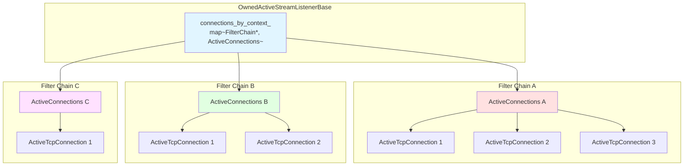
```mermaid
graph TB
    subgraph "OwnedActiveStreamListenerBase"
        ConnMap[connections_by_context_<br/>map~FilterChain*, ActiveConnections~]
    end

    subgraph "Filter Chain A"
        ActiveConnsA[ActiveConnections A]
        ConnA1[ActiveTcpConnection 1]
        ConnA2[ActiveTcpConnection 2]
        ConnA3[ActiveTcpConnection 3]
    end

    subgraph "Filter Chain B"
        ActiveConnsB[ActiveConnections B]
        ConnB1[ActiveTcpConnection 1]
        ConnB2[ActiveTcpConnection 2]
    end

    subgraph "Filter Chain C"
        ActiveConnsC[ActiveConnections C]
        ConnC1[ActiveTcpConnection 1]
    end

    ConnMap --> ActiveConnsA
    ConnMap --> ActiveConnsB
    ConnMap --> ActiveConnsC

    ActiveConnsA --> ConnA1
    ActiveConnsA --> ConnA2
    ActiveConnsA --> ConnA3

    ActiveConnsB --> ConnB1
    ActiveConnsB --> ConnB2

    ActiveConnsC --> ConnC1

    style ConnMap fill:#e1f5ff
    style ActiveConnsA fill:#ffe1e1
    style ActiveConnsB fill:#e1ffe1
    style ActiveConnsC fill:#ffe1ff
```

### getOrCreateActiveConnections

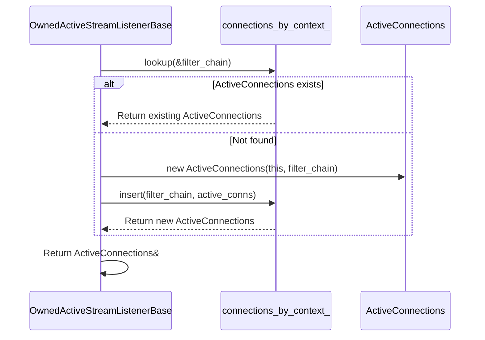
```mermaid
sequenceDiagram
    participant Listener as OwnedActiveStreamListenerBase
    participant Map as connections_by_context_
    participant ActiveConns as ActiveConnections

    Listener->>Map: lookup(&filter_chain)

    alt ActiveConnections exists
        Map-->>Listener: Return existing ActiveConnections
    else Not found
        Listener->>ActiveConns: new ActiveConnections(this, filter_chain)
        Listener->>Map: insert(filter_chain, active_conns)
        Map-->>Listener: Return new ActiveConnections
    end

    Listener->>Listener: Return ActiveConnections&
```

---

## 6. Filter Chain Draining

### Drain Process

**This flowchart shows how filter chains are gracefully removed during configuration updates:**

**When Draining Occurs:**
- Configuration update removes or modifies a filter chain
- The old filter chain needs to be gracefully shut down
- Existing connections on that chain should complete their work before closing

**Drain Sequence:**
1. `onFilterChainDraining()` is called with list of filter chains to drain
2. `is_deleting_` flag is temporarily set to prevent concurrent modifications
3. For each draining filter chain:
   - Find its `ActiveConnections` container in the map
   - Schedule graceful close for all connections in that chain
   - Connections close with `FlushWrite` - complete pending writes before closing
4. Remove the filter chain entry from `connections_by_context_` map
5. Schedule deferred deletion of `ActiveConnections` object

**Graceful Close:**
- Connections are not forcibly terminated
- Pending response data is written before closing
- Gives applications time to complete in-flight requests
- Drain timer (configurable, default 600s) determines maximum drain time

**Why This Matters:**
- Allows zero-downtime filter chain updates
- Minimizes disruption to active connections
- Supports gradual rollout of configuration changes

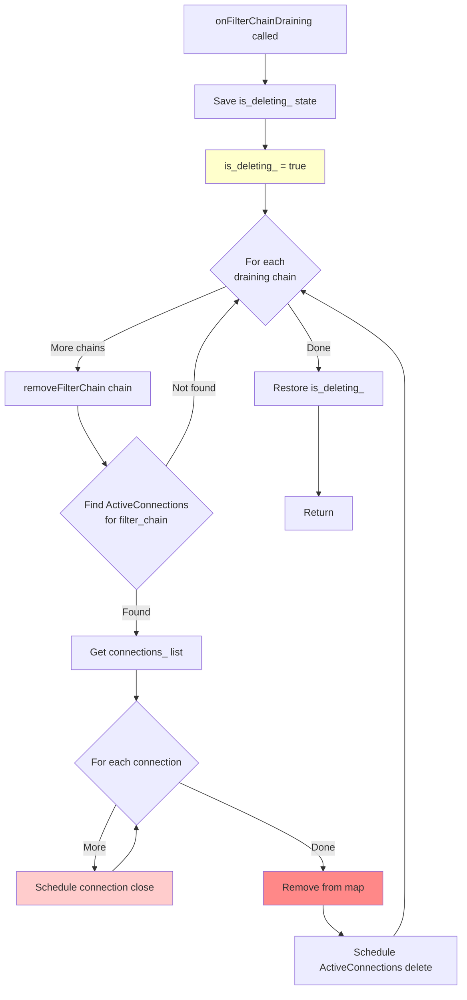
```mermaid
flowchart TD
    Start[onFilterChainDraining called] --> SaveState[Save is_deleting_ state]
    SaveState --> SetDeleting[is_deleting_ = true]

    SetDeleting --> Loop{For each<br/>draining chain}

    Loop -->|More chains| RemoveChain[removeFilterChain chain]
    Loop -->|Done| RestoreState[Restore is_deleting_]

    RemoveChain --> FindConns{Find ActiveConnections<br/>for filter_chain}

    FindConns -->|Found| GetConns[Get connections_ list]
    FindConns -->|Not found| Loop

    GetConns --> DrainLoop{For each connection}

    DrainLoop -->|More| ScheduleClose[Schedule connection close]
    DrainLoop -->|Done| RemoveContext[Remove from map]

    ScheduleClose --> DrainLoop
    RemoveContext --> ScheduleDelete[Schedule ActiveConnections delete]
    ScheduleDelete --> Loop

    RestoreState --> End[Return]

    style SetDeleting fill:#ffffcc
    style ScheduleClose fill:#ffcccc
    style RemoveContext fill:#ff8888
```

### removeFilterChain Implementation

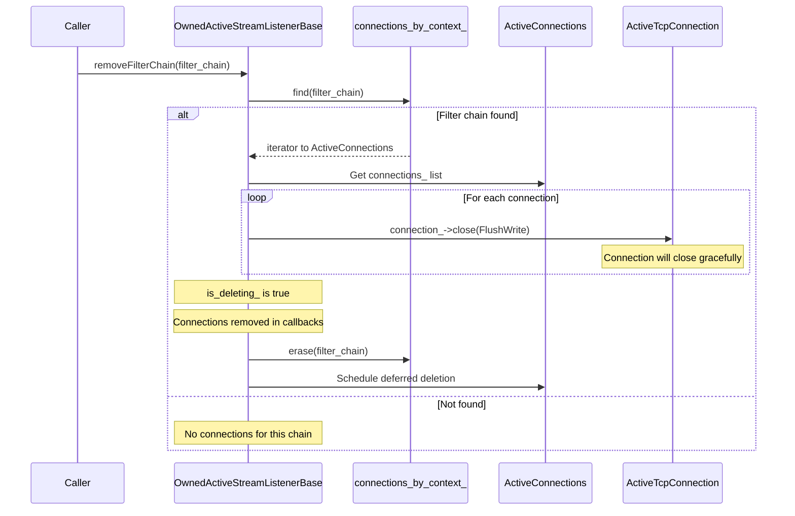
```mermaid
sequenceDiagram
    participant Caller
    participant Listener as OwnedActiveStreamListenerBase
    participant Map as connections_by_context_
    participant ActiveConns as ActiveConnections
    participant Conn as ActiveTcpConnection

    Caller->>Listener: removeFilterChain(filter_chain)
    Listener->>Map: find(filter_chain)

    alt Filter chain found
        Map-->>Listener: iterator to ActiveConnections
        Listener->>ActiveConns: Get connections_ list

        loop For each connection
            Listener->>Conn: connection_->close(FlushWrite)
            Note over Conn: Connection will close gracefully
        end

        Note over Listener: is_deleting_ is true
        Note over Listener: Connections removed in callbacks

        Listener->>Map: erase(filter_chain)
        Listener->>ActiveConns: Schedule deferred deletion
    else Not found
        Note over Listener: No connections for this chain
    end
```

---

## 7. Connection Lifecycle Events

### ActiveTcpConnection Event Handling

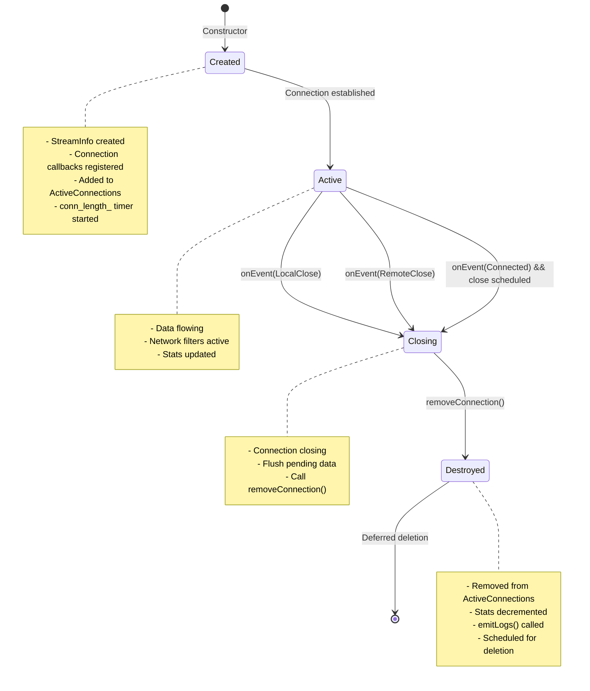
```mermaid
stateDiagram-v2
    [*] --> Created: Constructor

    Created --> Active: Connection established

    Active --> Closing: onEvent(LocalClose)
    Active --> Closing: onEvent(RemoteClose)
    Active --> Closing: onEvent(Connected) && close scheduled

    Closing --> Destroyed: removeConnection()

    Destroyed --> [*]: Deferred deletion

    note right of Created
        - StreamInfo created
        - Connection callbacks registered
        - Added to ActiveConnections
        - conn_length_ timer started
    end note

    note right of Active
        - Data flowing
        - Network filters active
        - Stats updated
    end note

    note right of Closing
        - Connection closing
        - Flush pending data
        - Call removeConnection()
    end note

    note right of Destroyed
        - Removed from ActiveConnections
        - Stats decremented
        - emitLogs() called
        - Scheduled for deletion
    end note
```

### Connection Event Processing

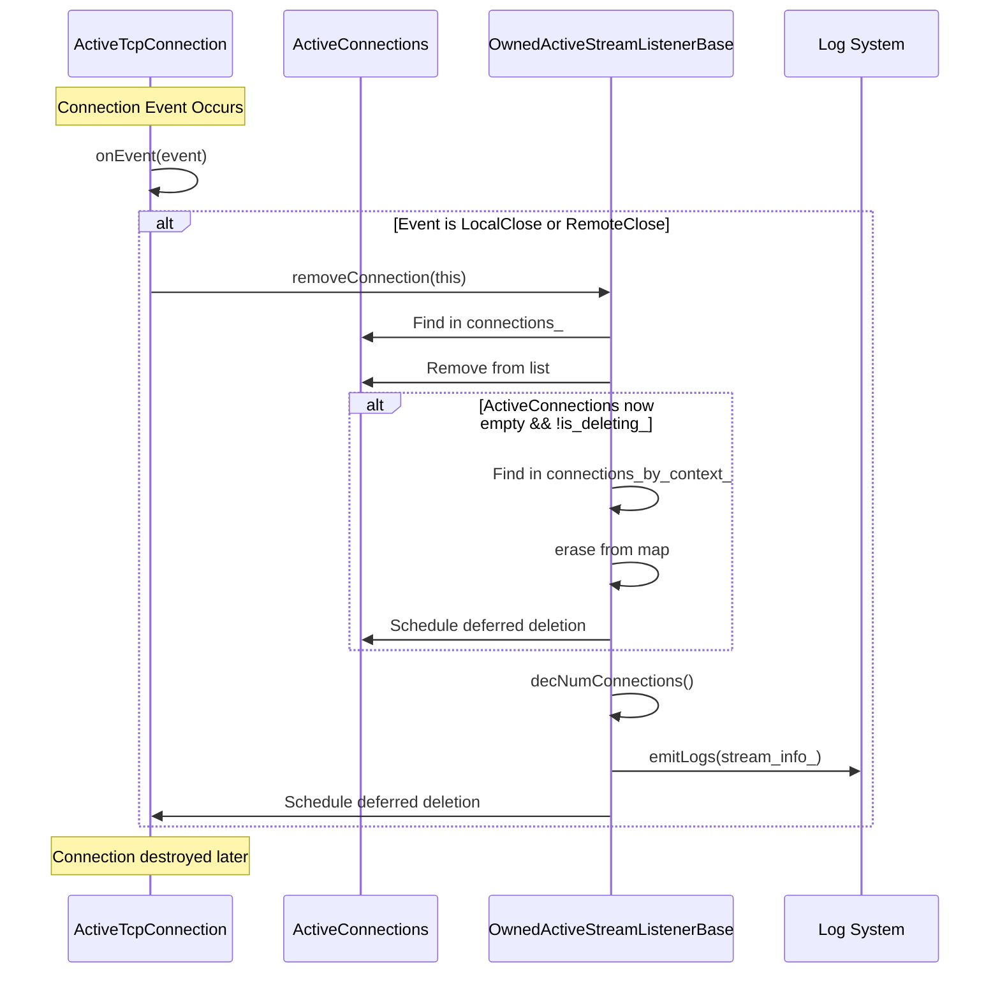
```mermaid
sequenceDiagram
    participant Conn as ActiveTcpConnection
    participant ActiveConns as ActiveConnections
    participant Listener as OwnedActiveStreamListenerBase
    participant Logs as Log System

    Note over Conn: Connection Event Occurs

    Conn->>Conn: onEvent(event)

    alt Event is LocalClose or RemoteClose
        Conn->>Listener: removeConnection(this)
        Listener->>ActiveConns: Find in connections_
        Listener->>ActiveConns: Remove from list

        alt ActiveConnections now empty && !is_deleting_
            Listener->>Listener: Find in connections_by_context_
            Listener->>Listener: erase from map
            Listener->>ActiveConns: Schedule deferred deletion
        end

        Listener->>Listener: decNumConnections()
        Listener->>Logs: emitLogs(stream_info_)
        Listener->>Conn: Schedule deferred deletion
    end

    Note over Conn: Connection destroyed later
```

---

## 8. Timeout Handling

### Listener Filter Timeout

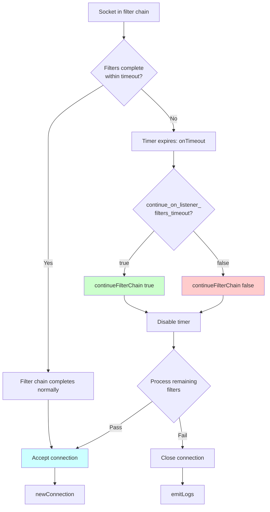
```mermaid
flowchart TD
    Start[Socket in filter chain] --> CheckTimeout{Filters complete<br/>within timeout?}

    CheckTimeout -->|Yes| Complete[Filter chain completes normally]
    CheckTimeout -->|No| Timeout[Timer expires: onTimeout]

    Timeout --> CheckBehavior{continue_on_listener_<br/>filters_timeout?}

    CheckBehavior -->|true| Continue[continueFilterChain true]
    CheckBehavior -->|false| Reject[continueFilterChain false]

    Continue --> RemoveTimer[Disable timer]
    Reject --> RemoveTimer

    RemoveTimer --> ProcessFilters{Process remaining<br/>filters}

    ProcessFilters -->|Pass| Accept[Accept connection]
    ProcessFilters -->|Fail| Close[Close connection]

    Complete --> Accept
    Accept --> NewConn[newConnection]
    Close --> EmitLogs[emitLogs]

    style Continue fill:#ccffcc
    style Reject fill:#ffcccc
    style Accept fill:#ccffff
```

### Timeout Configuration

```cpp
// From listener config
listener_filters_timeout_: std::chrono::milliseconds
continue_on_listener_filters_timeout_: bool

// Typical values:
// timeout: 15s (15000ms)
// continue_on_timeout: false (reject by default)
```

---

## 9. Socket Management

### Sockets List Operations

```mermaid
graph TB
    subgraph "ActiveStreamListenerBase"
        SocketsList[sockets_<br/>list~unique_ptr~ActiveTcpSocket~~]
    end

    subgal "Operations"
        Add[Add Socket]
        Remove[Remove Socket]
        Iterate[Iterate Sockets]
        Clear[Clear on Destroy]
    end

    Add -->|LinkedList::moveIntoListBack| SocketsList
    SocketsList -->|removeSocket| Remove
    SocketsList --> Iterate
    SocketsList --> Clear

    style Add fill:#ccffcc
    style Remove fill:#ffcccc
    style SocketsList fill:#e1f5ff
```

### Socket Addition and Removal

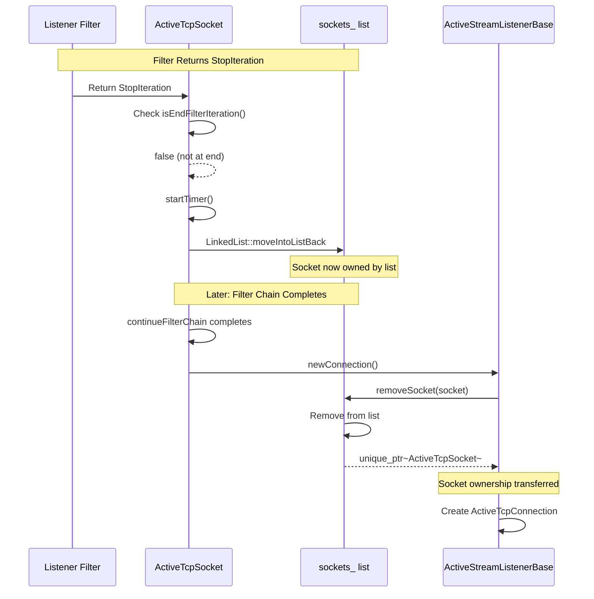
```mermaid
sequenceDiagram
    participant Filter as Listener Filter
    participant Socket as ActiveTcpSocket
    participant List as sockets_ list
    participant Listener as ActiveStreamListenerBase

    Note over Filter,List: Filter Returns StopIteration

    Filter->>Socket: Return StopIteration
    Socket->>Socket: Check isEndFilterIteration()
    Socket-->>Socket: false (not at end)

    Socket->>Socket: startTimer()
    Socket->>List: LinkedList::moveIntoListBack
    Note over List: Socket now owned by list

    Note over Socket,List: Later: Filter Chain Completes

    Socket->>Socket: continueFilterChain completes
    Socket->>Listener: newConnection()
    Listener->>List: removeSocket(socket)
    List->>List: Remove from list
    List-->>Listener: unique_ptr~ActiveTcpSocket~

    Note over Listener: Socket ownership transferred
    Listener->>Listener: Create ActiveTcpConnection
```

---

## 10. Statistics and Logging

### Listener Statistics

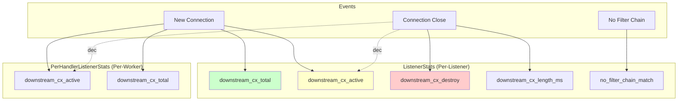
```mermaid
graph TB
    subgraph "ListenerStats (Per-Listener)"
        CxTotal[downstream_cx_total]
        CxActive[downstream_cx_active]
        CxDestroy[downstream_cx_destroy]
        CxLength[downstream_cx_length_ms]
        NoFilter[no_filter_chain_match]
    end

    subgraph "PerHandlerListenerStats (Per-Worker)"
        WorkerCxActive[downstream_cx_active]
        WorkerCxTotal[downstream_cx_total]
    end

    subgraph "Events"
        NewConn[New Connection] --> CxTotal
        NewConn --> CxActive
        NewConn --> WorkerCxTotal
        NewConn --> WorkerCxActive

        ConnClose[Connection Close] --> CxDestroy
        ConnClose --> CxLength
        ConnClose -.->|dec| CxActive
        ConnClose -.->|dec| WorkerCxActive

        NoMatch[No Filter Chain] --> NoFilter
    end

    style CxTotal fill:#ccffcc
    style CxActive fill:#ffffcc
    style CxDestroy fill:#ffcccc
```

### Log Emission

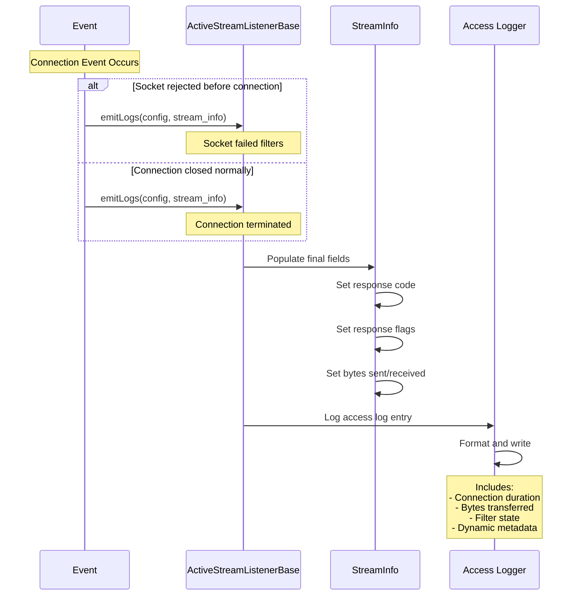
```mermaid
sequenceDiagram
    participant Event
    participant Listener as ActiveStreamListenerBase
    participant StreamInfo
    participant Logger as Access Logger

    Note over Event: Connection Event Occurs

    alt Socket rejected before connection
        Event->>Listener: emitLogs(config, stream_info)
        Note over Listener: Socket failed filters
    else Connection closed normally
        Event->>Listener: emitLogs(config, stream_info)
        Note over Listener: Connection terminated
    end

    Listener->>StreamInfo: Populate final fields
    StreamInfo->>StreamInfo: Set response code
    StreamInfo->>StreamInfo: Set response flags
    StreamInfo->>StreamInfo: Set bytes sent/received

    Listener->>Logger: Log access log entry
    Logger->>Logger: Format and write

    Note over Logger: Includes:<br/>- Connection duration<br/>- Bytes transferred<br/>- Filter state<br/>- Dynamic metadata
```

---

## 11. Memory Management

### Ownership Model

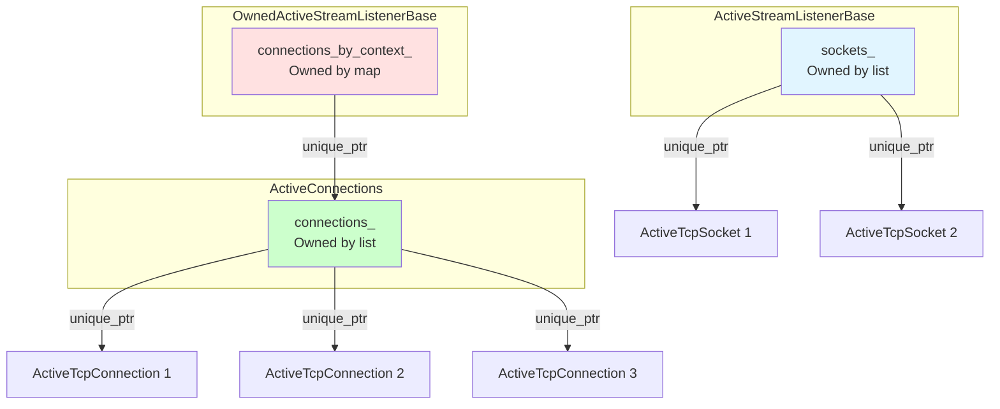
```mermaid
graph TB
    subgraph "ActiveStreamListenerBase"
        SocketsList[sockets_<br/>Owned by list]
    end

    subgraph "OwnedActiveStreamListenerBase"
        ConnsByContext[connections_by_context_<br/>Owned by map]
    end

    subgraph "ActiveConnections"
        ConnsList[connections_<br/>Owned by list]
    end

    ActiveSocket1[ActiveTcpSocket 1]
    ActiveSocket2[ActiveTcpSocket 2]

    ActiveConn1[ActiveTcpConnection 1]
    ActiveConn2[ActiveTcpConnection 2]
    ActiveConn3[ActiveTcpConnection 3]

    SocketsList -->|unique_ptr| ActiveSocket1
    SocketsList -->|unique_ptr| ActiveSocket2

    ConnsByContext -->|unique_ptr| ConnsList

    ConnsList -->|unique_ptr| ActiveConn1
    ConnsList -->|unique_ptr| ActiveConn2
    ConnsList -->|unique_ptr| ActiveConn3

    style SocketsList fill:#e1f5ff
    style ConnsByContext fill:#ffe1e1
    style ConnsList fill:#ccffcc
```

### Deferred Deletion

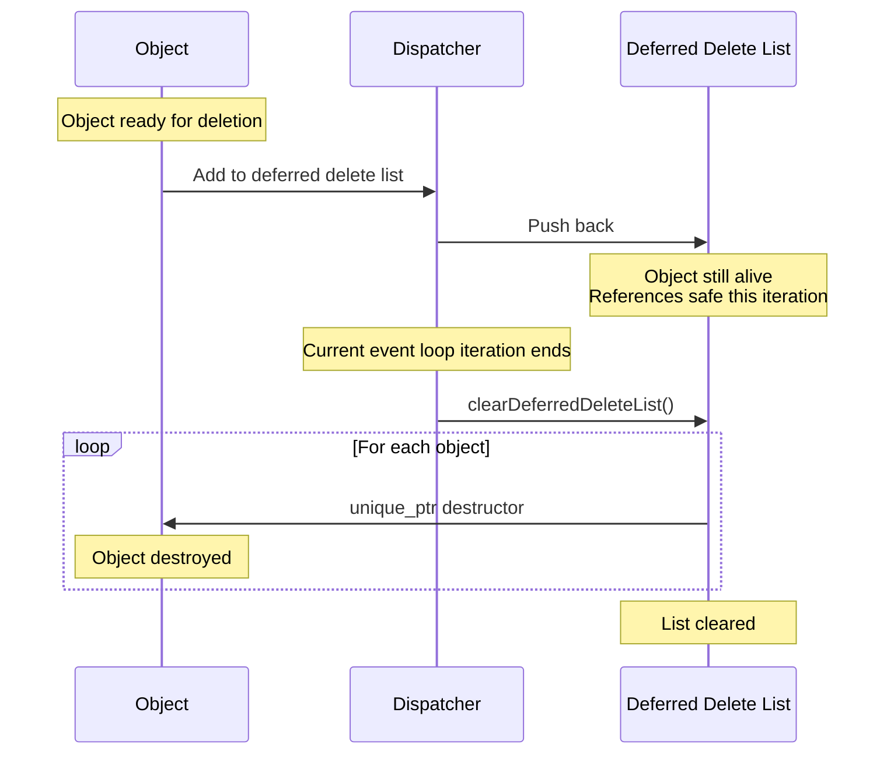
```mermaid
sequenceDiagram
    participant Object
    participant Dispatcher
    participant DeferredList as Deferred Delete List

    Note over Object: Object ready for deletion

    Object->>Dispatcher: Add to deferred delete list
    Dispatcher->>DeferredList: Push back

    Note over DeferredList: Object still alive<br/>References safe this iteration

    Note over Dispatcher: Current event loop iteration ends

    Dispatcher->>DeferredList: clearDeferredDeleteList()

    loop For each object
        DeferredList->>Object: unique_ptr destructor
        Note over Object: Object destroyed
    end

    Note over DeferredList: List cleared
```

**Objects using deferred deletion:**
- `ActiveTcpSocket`
- `ActiveTcpConnection`
- `ActiveConnections`

---

## 12. Integration Points

### Connection Handler Integration

```mermaid
graph TB
    subgraph "ConnectionHandler"
        Handler[ConnectionHandler]
        ActiveListener[ActiveListener Interface]
    end

    subgraph "Listener Implementation"
        StreamListener[ActiveStreamListenerBase]
        OwnedListener[OwnedActiveStreamListenerBase]
    end

    subgraph "Concrete Implementations"
        TcpListener[ActiveTcpListener]
        UdpListener[ActiveRawUdpListener]
    end

    Handler --> ActiveListener
    ActiveListener <|.. StreamListener
    StreamListener <|-- OwnedListener
    OwnedListener <|-- TcpListener
    OwnedListener <|-- UdpListener

    style Handler fill:#e1f5ff
    style StreamListener fill:#ffe1e1
    style TcpListener fill:#ccffcc
```

### Network Filter Chain Integration

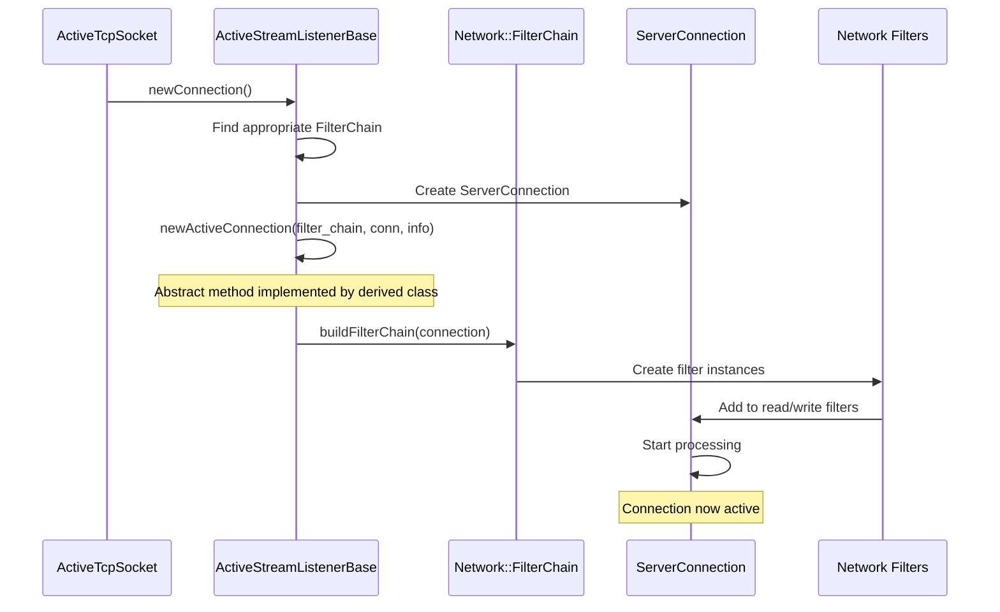
```mermaid
sequenceDiagram
    participant Socket as ActiveTcpSocket
    participant Listener as ActiveStreamListenerBase
    participant FilterChain as Network::FilterChain
    participant ServerConn as ServerConnection
    participant NetworkFilters as Network Filters

    Socket->>Listener: newConnection()
    Listener->>Listener: Find appropriate FilterChain
    Listener->>ServerConn: Create ServerConnection
    Listener->>Listener: newActiveConnection(filter_chain, conn, info)

    Note over Listener: Abstract method implemented by derived class

    Listener->>FilterChain: buildFilterChain(connection)
    FilterChain->>NetworkFilters: Create filter instances
    NetworkFilters->>ServerConn: Add to read/write filters

    ServerConn->>ServerConn: Start processing
    Note over ServerConn: Connection now active
```

---

## 13. Error Handling

### Error Scenarios

```mermaid
flowchart TD
    Start[Error Occurs] --> CheckType{Error Type}

    CheckType -->|Filter Chain Creation Failed| NoECDS[ECDS config missing]
    CheckType -->|Filter Timeout| Timeout[Listener filter timeout]
    CheckType -->|Filter Rejection| Reject[Filter returns Close]
    CheckType -->|Connection Error| ConnErr[Connection event error]

    NoECDS --> CloseSocket[Close socket immediately]
    Timeout --> CheckConfig{continue_on_timeout?}
    Reject --> CloseSocket
    ConnErr --> CloseConn[Close connection]

    CheckConfig -->|false| CloseSocket
    CheckConfig -->|true| ContinueChain[Continue filter chain]

    CloseSocket --> EmitLog1[emitLogs]
    CloseConn --> EmitLog2[emitLogs]
    ContinueChain --> Process[Continue processing]

    EmitLog1 --> UpdateStats1[Update error stats]
    EmitLog2 --> UpdateStats2[Update error stats]

    UpdateStats1 --> Cleanup[Deferred deletion]
    UpdateStats2 --> Cleanup
    Process --> End[Continue]

    style CloseSocket fill:#ffcccc
    style CloseConn fill:#ff8888
    style Reject fill:#ff4444
```

### Error Statistics

| Error Type | Stat Name | Trigger |
|-----------|-----------|---------|
| No filter chain match | `no_filter_chain_match` | Cannot find matching filter chain |
| Connection create failed | `downstream_cx_destroy` | Connection failed during creation |
| Filter timeout | Custom filter stat | Listener filter timeout exceeded |
| Filter rejection | Custom filter stat | Filter explicitly rejects connection |

---

## 14. Configuration

### Key Configuration Parameters

```yaml
# Listener configuration
listener:
  # Listener filter timeout
  listener_filters_timeout: 15s

  # Continue processing after timeout
  continue_on_listener_filters_timeout: false

  # Listener filters
  listener_filters:
    - name: envoy.filters.listener.tls_inspector
    - name: envoy.filters.listener.http_inspector
    - name: envoy.filters.listener.original_dst

  # Filter chains
  filter_chains:
    - filter_chain_match:
        server_names: ["example.com"]
      filters:
        - name: envoy.filters.network.http_connection_manager
```

### Configuration Impact

```mermaid
graph TB
    Config[Listener Config] --> Timeout[listener_filters_timeout]
    Config --> Continue[continue_on_timeout]
    Config --> ListenerFilters[listener_filters]
    Config --> FilterChains[filter_chains]

    Timeout --> SocketTimer[ActiveTcpSocket timer]
    Continue --> TimeoutBehavior[Timeout handling]
    ListenerFilters --> FilterChain[Filter chain creation]
    FilterChains --> ConnGroups[Connection grouping]

    style Config fill:#e1f5ff
    style Timeout fill:#ffffcc
    style Continue fill:#ffffcc
```

---

## 15. Performance Considerations

### Optimization Strategies

1. **Lazy Filter Chain Creation**
   - Filter chains created only when needed
   - Reduces memory overhead for idle listeners

2. **Connection Grouping**
   - Connections grouped by filter chain
   - Efficient draining of specific filter chains
   - O(1) lookup by filter chain pointer

3. **Deferred Deletion**
   - Objects deleted at safe points
   - Prevents use-after-free
   - Minimal overhead (end of event loop)

4. **Linked Lists for Ordering**
   - O(1) insertion/removal
   - Maintains connection order
   - Cache-friendly iteration

### Performance Metrics

```mermaid
graph LR
    subgraph "Timing"
        Accept[Socket Accept: ~10μs]
        Filter[Filter Processing: ~100μs]
        Connect[Connection Create: ~50μs]
    end

    subgraph "Memory"
        SocketMem[ActiveTcpSocket: ~512 bytes]
        ConnMem[ActiveTcpConnection: ~1KB]
    end

    subgraph "Scalability"
        Conns[Connections: 100K+]
        Listeners[Listeners: 1000+]
    end

    style Accept fill:#ccffcc
    style Filter fill:#ffffcc
    style Connect fill:#ccffcc
```

---

## 16. Key Design Patterns

### Pattern 1: Template Method Pattern
- `ActiveStreamListenerBase` provides template
- Derived classes implement `newActiveConnection()`
- Separation of socket handling from connection management

### Pattern 2: Chain of Responsibility
- Listener filters form a chain
- Each filter can:
  - Pass to next filter
  - Stop and wait
  - Reject connection
- Flexible, extensible filtering

### Pattern 3: Composite Pattern
- `ActiveConnections` groups connections
- Organized by filter chain
- Enables batch operations (drain)

### Pattern 4: Deferred Deletion Pattern
- Objects marked for deletion
- Actual deletion deferred to safe point
- Prevents dangling references

---

## Summary

The Active Stream Listener architecture provides:

1. **Robust Socket Processing**
   - Flexible listener filter chain
   - Timeout handling
   - Graceful failure modes

2. **Efficient Connection Management**
   - Grouped by filter chain
   - O(1) operations for common paths
   - Memory-efficient storage

3. **Lifecycle Management**
   - Clear ownership model
   - Deferred deletion for safety
   - Comprehensive logging

4. **Extensibility**
   - Abstract base for customization
   - Template method pattern
   - Filter chain extensibility

5. **Production Ready**
   - Error handling at all layers
   - Detailed statistics
   - Graceful degradation

This design enables Envoy to efficiently handle millions of connections while maintaining safety, observability, and flexibility for diverse deployment scenarios.
