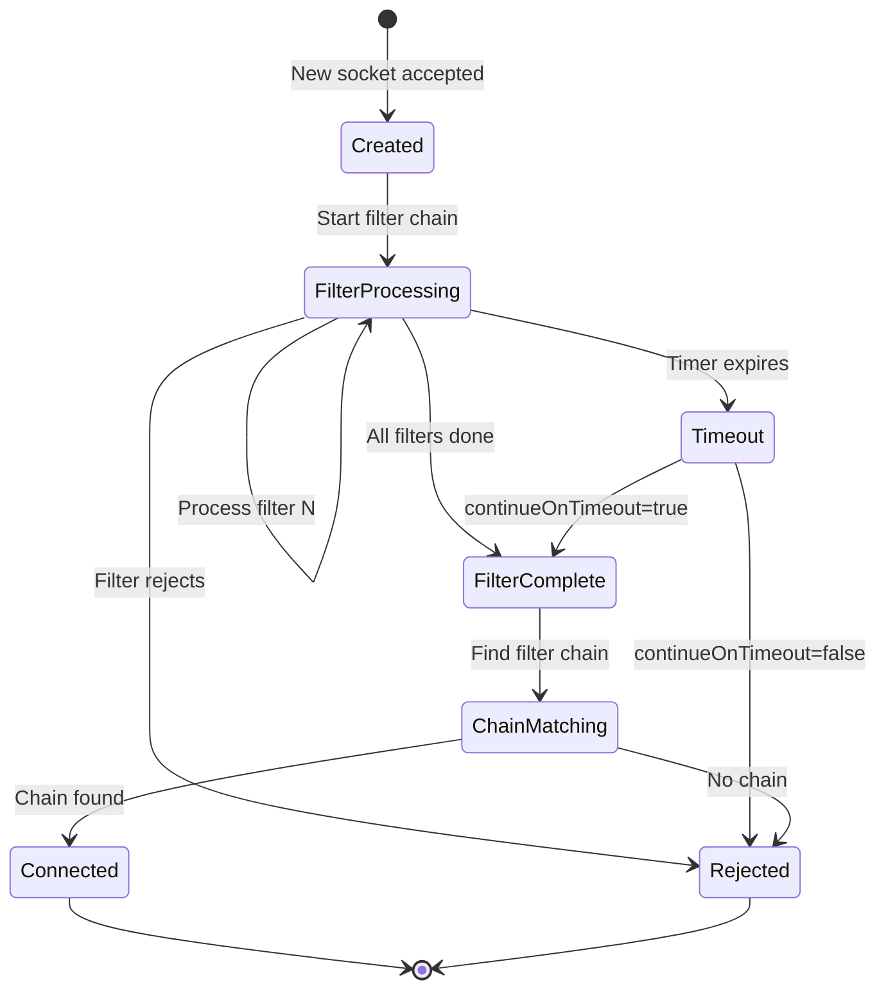
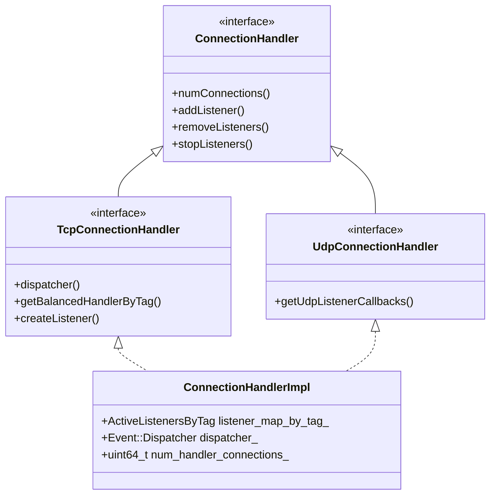
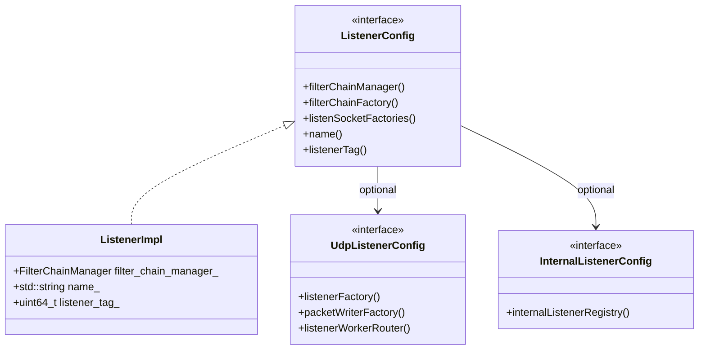
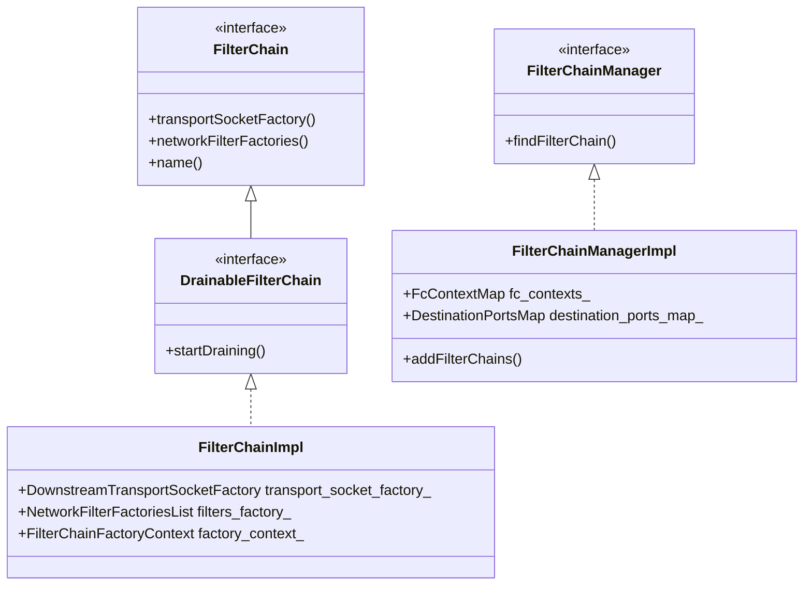
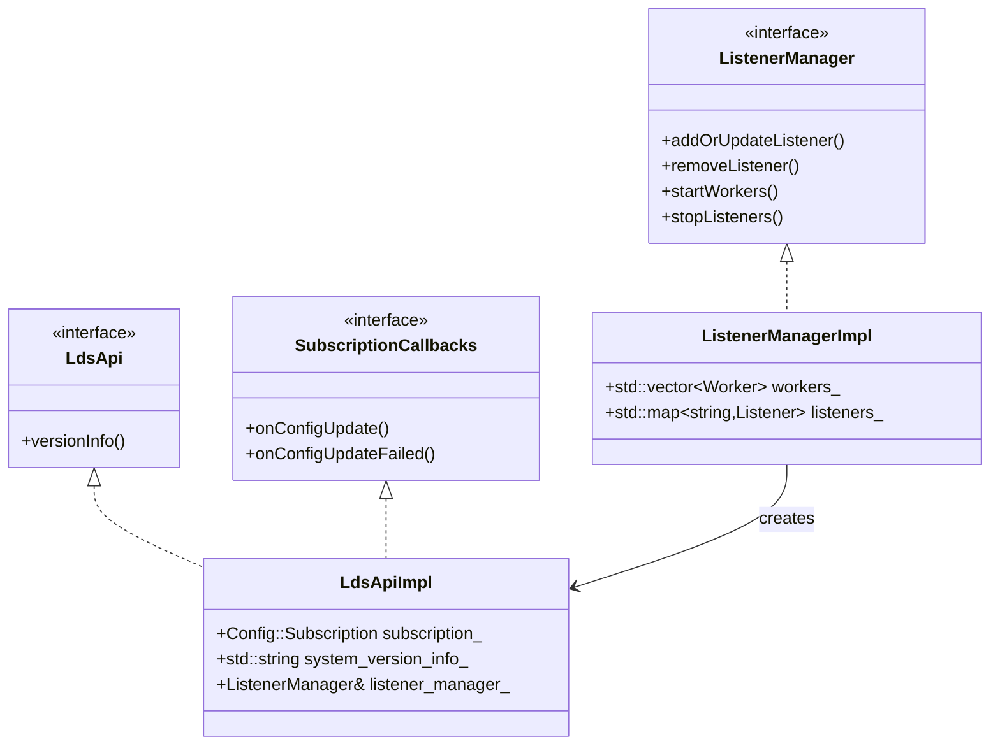

# Listener Manager Base Classes and Interfaces

## Table of Contents
1. [Overview](#overview)
2. [Core Network Interfaces](#core-network-interfaces)
   - [ConnectionHandler](#connectionhandler)
   - [ListenerConfig](#listenerconfig)
   - [ListenerInfo](#listenerinfo)
   - [Listener](#listener)
   - [TcpListenerCallbacks](#tcplistenercallbacks)
   - [UdpListenerCallbacks](#udplistenercallbacks)
   - [FilterChainManager](#filterchainmanager)
   - [Network Filters](#network-filters)
3. [Server-Level Interfaces](#server-level-interfaces)
   - [ListenerManager](#listenermanager)
   - [LdsApi](#ldsapi)
   - [ListenerComponentFactory](#listenercomponentfactory)
4. [Implementation Base Classes](#implementation-base-classes)
   - [FilterChainFactoryBuilder](#filterchainfactorybuilder)
   - [PerFilterChainFactoryContextImpl](#perfilterchainfactorycontextimpl)
   - [FilterChainImpl](#filterchainimpl)
   - [FilterChainManagerImpl](#filterchainmanagerimpl)
   - [ActiveRawUdpListenerFactory](#activerawudplistenerfactory)
   - [ActiveTcpSocket](#activetcpsocket)
   - [LdsApiImpl](#ldsapiimpl)
5. [Interface Hierarchy](#interface-hierarchy)
6. [Implementation Patterns](#implementation-patterns)
7. [Usage Examples](#usage-examples)

## Overview

The Envoy Listener Manager is built on a rich hierarchy of interfaces and base classes that separate concerns and enable flexible implementations. This document catalogs all the key interfaces and base classes, explaining their purpose, relationships, and usage patterns.

### Design Principles

1. **Interface Segregation**: Separate interfaces for different aspects (config, callbacks, lifecycle)
2. **Dependency Inversion**: Depend on abstractions rather than concrete implementations
3. **Single Responsibility**: Each interface has a focused, well-defined purpose
4. **Composition**: Complex behaviors built by composing simple interfaces

## Core Network Interfaces

These interfaces are defined in `envoy/network/` and represent the core abstractions for network operations.

### ConnectionHandler

**Location**: `envoy/network/connection_handler.h`

The `ConnectionHandler` is the top-level interface for managing listeners and connections on a single worker thread.

#### Interface Definition

```cpp
class ConnectionHandler {
public:
  virtual ~ConnectionHandler() = default;

  // Connection counting
  virtual uint64_t numConnections() const PURE;
  virtual void incNumConnections() PURE;
  virtual void decNumConnections() PURE;

  // Listener management
  virtual void addListener(absl::optional<uint64_t> overridden_listener,
                          ListenerConfig& config,
                          Runtime::Loader& runtime,
                          Random::RandomGenerator& random) PURE;

  virtual void removeListeners(uint64_t listener_tag) PURE;

  virtual void removeFilterChains(
      uint64_t listener_tag,
      const std::list<const FilterChain*>& filter_chains,
      std::function<void()> completion) PURE;

  virtual void stopListeners(uint64_t listener_tag,
                            const Network::ExtraShutdownListenerOptions& options) PURE;
  virtual void stopListeners() PURE;

  // Listener control
  virtual void disableListeners() PURE;
  virtual void enableListeners() PURE;
  virtual void setListenerRejectFraction(UnitFloat reject_fraction) PURE;

  virtual const std::string& statPrefix() const PURE;

  // Nested interface for active listeners
  class ActiveListener {
  public:
    virtual ~ActiveListener() = default;

    virtual uint64_t listenerTag() PURE;
    virtual Listener* listener() PURE;
    virtual void pauseListening() PURE;
    virtual void resumeListening() PURE;
    virtual void shutdownListener(const ExtraShutdownListenerOptions& options) PURE;
    virtual void updateListenerConfig(Network::ListenerConfig& config) PURE;
    virtual void onFilterChainDraining(
        const std::list<const Network::FilterChain*>& draining_filter_chains) PURE;
  };

  using ActiveListenerPtr = std::unique_ptr<ActiveListener>;

  // Nested interface for UDP listeners
  class ActiveUdpListener : public virtual ActiveListener,
                           public Network::UdpListenerCallbacks {
  public:
    virtual uint32_t destination(const Network::UdpRecvData& data) const PURE;
  };

  using ActiveUdpListenerPtr = std::unique_ptr<ActiveUdpListener>;
};
```

#### Specializations

**TcpConnectionHandler**: Extends ConnectionHandler for TCP-specific operations:

```cpp
class TcpConnectionHandler : public virtual ConnectionHandler {
public:
  virtual Event::Dispatcher& dispatcher() PURE;

  virtual BalancedConnectionHandlerOptRef getBalancedHandlerByTag(
      uint64_t listener_tag,
      const Network::Address::Instance& address) PURE;

  virtual BalancedConnectionHandlerOptRef getBalancedHandlerByAddress(
      const Network::Address::Instance& address) PURE;

  virtual Network::ListenerPtr createListener(
      Network::SocketSharedPtr&& socket,
      Network::TcpListenerCallbacks& cb,
      Runtime::Loader& runtime,
      Random::RandomGenerator& random,
      const Network::ListenerConfig& listener_config,
      Server::ThreadLocalOverloadStateOptRef overload_state) PURE;
};
```

**UdpConnectionHandler**: Extends ConnectionHandler for UDP-specific operations:

```cpp
class UdpConnectionHandler : public virtual ConnectionHandler {
public:
  virtual UdpListenerCallbacksOptRef getUdpListenerCallbacks(
      uint64_t listener_tag,
      const Network::Address::Instance& address) PURE;
};
```

#### Key Responsibilities

1. **Listener Lifecycle**: Add, remove, stop, enable/disable listeners
2. **Connection Tracking**: Count active connections for overload protection
3. **Hot Reload Support**: Remove filter chains without stopping listeners
4. **Worker-Level Operations**: Manage listeners on a single worker thread

#### Implementation

The primary implementation is `ConnectionHandlerImpl` in `source/common/listener_manager/connection_handler_impl.h`.

### ListenerConfig

**Location**: `envoy/network/listener.h`

`ListenerConfig` provides access to a listener's configuration and factories.

#### Interface Definition

```cpp
class ListenerConfig {
public:
  virtual ~ListenerConfig() = default;

  // Core components
  virtual FilterChainManager& filterChainManager() PURE;
  virtual FilterChainFactory& filterChainFactory() PURE;
  virtual std::vector<ListenSocketFactoryPtr>& listenSocketFactories() PURE;

  // Configuration properties
  virtual bool bindToPort() const PURE;
  virtual bool handOffRestoredDestinationConnections() const PURE;
  virtual uint32_t perConnectionBufferLimitBytes() const PURE;
  virtual std::chrono::milliseconds listenerFiltersTimeout() const PURE;
  virtual bool continueOnListenerFiltersTimeout() const PURE;

  // Resources
  virtual Stats::Scope& listenerScope() PURE;
  virtual uint64_t listenerTag() const PURE;
  virtual const std::string& name() const PURE;
  virtual const ListenerInfoConstSharedPtr& listenerInfo() const PURE;
  virtual ResourceLimit& openConnections() PURE;

  // Specialized configs
  virtual UdpListenerConfigOptRef udpListenerConfig() PURE;
  virtual InternalListenerConfigOptRef internalListenerConfig() PURE;

  // Network operations
  virtual ConnectionBalancer& connectionBalancer(
      const Network::Address::Instance& address) PURE;
  virtual const AccessLog::InstanceSharedPtrVector& accessLogs() const PURE;

  // TCP-specific
  virtual uint32_t tcpBacklogSize() const PURE;
  virtual uint32_t maxConnectionsToAcceptPerSocketEvent() const PURE;

  // Initialization
  virtual Init::Manager& initManager() PURE;

  // Overload management
  virtual bool ignoreGlobalConnLimit() const PURE;
  virtual bool shouldBypassOverloadManager() const PURE;
};
```

#### Key Concepts

1. **Configuration Access**: Provides read-only access to listener configuration
2. **Factory Access**: Returns factories for creating filter chains and sockets
3. **Resource Management**: Exposes connection limits and stats scopes
4. **Protocol Specialization**: Optional UDP and internal listener configs

#### Implementation

The primary implementation is `ListenerImpl` in `source/common/listener_manager/listener_impl.h`.

### ListenerInfo

**Location**: `envoy/network/listener.h`

`ListenerInfo` provides metadata about a listener.

#### Interface Definition

```cpp
class ListenerInfo {
public:
  virtual ~ListenerInfo() = default;

  virtual const envoy::config::core::v3::Metadata& metadata() const PURE;
  virtual const Envoy::Config::TypedMetadata& typedMetadata() const PURE;
  virtual envoy::config::core::v3::TrafficDirection direction() const PURE;
  virtual bool isQuic() const PURE;
  virtual bool shouldBypassOverloadManager() const PURE;
};
```

#### Key Concepts

1. **Metadata**: Arbitrary key-value metadata for filtering/identification
2. **Traffic Direction**: INBOUND, OUTBOUND, or UNSPECIFIED
3. **Protocol Identification**: Flags for special protocols like QUIC
4. **Overload Bypass**: Whether to skip overload manager checks

#### Implementation

The implementation is `ListenerInfoImpl` in `source/common/listener_manager/listener_info_impl.h`.

### Listener

**Location**: `envoy/network/listener.h`

`Listener` is the abstract interface for an active socket listener.

#### Interface Definition

```cpp
class Listener {
public:
  virtual ~Listener() = default;

  // Control operations
  virtual void disable() PURE;
  virtual void enable() PURE;
  virtual void setRejectFraction(UnitFloat reject_fraction) PURE;

  // Configuration
  virtual void configureLoadShedPoints(
      Server::LoadShedPointProvider& load_shed_point_provider) PURE;

  // Overload bypass check
  virtual bool shouldBypassOverloadManager() const PURE;
};
```

#### Specializations

**UdpListener**: Extends Listener for UDP operations:

```cpp
class UdpListener : public virtual Listener {
public:
  virtual Event::Dispatcher& dispatcher() PURE;
  virtual const Network::Address::InstanceConstSharedPtr& localAddress() const PURE;

  virtual Api::IoCallUint64Result send(const UdpSendData& data) PURE;
  virtual Api::IoCallUint64Result flush() PURE;
  virtual void activateRead() PURE;
};
```

#### Key Concepts

1. **Lifecycle Control**: Enable/disable accepting connections
2. **Load Shedding**: Configure rejection fraction for overload protection
3. **Protocol Abstraction**: Base for TCP, UDP, QUIC listeners

### TcpListenerCallbacks

**Location**: `envoy/network/listener.h`

Callbacks invoked by a TCP listener when connections are accepted or rejected.

#### Interface Definition

```cpp
class TcpListenerCallbacks {
public:
  virtual ~TcpListenerCallbacks() = default;

  // Called when a new connection is accepted
  virtual void onAccept(ConnectionSocketPtr&& socket) PURE;

  // Rejection reasons
  enum class RejectCause {
    GlobalCxLimit,
    OverloadAction,
  };

  // Called when a connection is rejected
  virtual void onReject(RejectCause cause) PURE;

  // Called after accepting connections for this socket event
  virtual void recordConnectionsAcceptedOnSocketEvent(
      uint32_t connections_accepted) PURE;
};
```

#### Key Concepts

1. **Connection Acceptance**: Receive new socket from OS
2. **Rejection Tracking**: Record why connections were rejected
3. **Batch Processing**: Track how many connections accepted per event

#### Implementation

Typically implemented by `ActiveTcpListener` or similar classes.

### UdpListenerCallbacks

**Location**: `envoy/network/listener.h`

Callbacks for UDP listener events.

#### Interface Definition

```cpp
class UdpListenerCallbacks {
public:
  virtual ~UdpListenerCallbacks() = default;

  // Data reception
  virtual void onData(UdpRecvData&& data) PURE;
  virtual void onDatagramsDropped(uint32_t dropped) PURE;

  // I/O readiness
  virtual void onReadReady() PURE;
  virtual void onWriteReady(const Socket& socket) PURE;

  // Error handling
  virtual void onReceiveError(Api::IoError::IoErrorCode error_code) PURE;

  // Packet writer
  virtual UdpPacketWriter& udpPacketWriter() PURE;

  // Worker identification
  virtual uint32_t workerIndex() const PURE;

  // Worker routing
  virtual void onDataWorker(Network::UdpRecvData&& data) PURE;
  virtual void post(Network::UdpRecvData&& data) PURE;

  // Performance hints
  virtual size_t numPacketsExpectedPerEventLoop() const PURE;
  virtual const IoHandle::UdpSaveCmsgConfig& udpSaveCmsgConfig() const PURE;
};
```

#### Key Concepts

1. **Datagram Processing**: Handle incoming UDP packets
2. **I/O Events**: React to read/write readiness
3. **Worker Routing**: Distribute packets across worker threads
4. **Error Handling**: Handle receive errors gracefully

### FilterChainManager

**Location**: `envoy/network/filter.h`

`FilterChainManager` is responsible for selecting the appropriate filter chain for a connection.

#### Interface Definition

```cpp
class FilterChainManager {
public:
  virtual ~FilterChainManager() = default;

  /**
   * Find the filter chain to use for a connection based on connection properties.
   * @param socket the connection socket with properties to match against.
   * @param info the stream info for additional matching context.
   * @return const FilterChain* the matched filter chain or nullptr if no match.
   */
  virtual const FilterChain* findFilterChain(
      const ConnectionSocket& socket,
      const StreamInfo::StreamInfo& info) const PURE;
};
```

#### Key Concepts

1. **Filter Chain Matching**: Select chain based on connection properties
2. **Matching Criteria**: SNI, ALPN, source IP, destination port, transport protocol
3. **Default Fallback**: Optional default filter chain if no match

#### Implementation

The implementation is `FilterChainManagerImpl` in `source/common/listener_manager/filter_chain_manager_impl.h`.

### Network Filters

**Location**: `envoy/network/filter.h`

Network filters process connection data in read and write directions.

#### Filter Interfaces

```cpp
// Status returned by filters
enum class FilterStatus {
  Continue,      // Continue to next filter
  StopIteration  // Stop filter chain iteration
};

// Write filter
class WriteFilter {
public:
  virtual ~WriteFilter() = default;

  virtual FilterStatus onWrite(Buffer::Instance& data, bool end_stream) PURE;
  virtual void initializeWriteFilterCallbacks(WriteFilterCallbacks& callbacks) {}
};

// Read filter
class ReadFilter {
public:
  virtual ~ReadFilter() = default;

  virtual FilterStatus onData(Buffer::Instance& data, bool end_stream) PURE;
  virtual FilterStatus onNewConnection() PURE;
  virtual void initializeReadFilterCallbacks(ReadFilterCallbacks& callbacks) PURE;
  virtual bool startUpstreamSecureTransport() { return false; }
};

// Combined read/write filter
class Filter : public WriteFilter, public ReadFilter {};
```

#### Callback Interfaces

```cpp
// Callbacks for write filters
class WriteFilterCallbacks : public virtual NetworkFilterCallbacks {
public:
  virtual void injectWriteDataToFilterChain(
      Buffer::Instance& data, bool end_stream) PURE;
  virtual void disableClose(bool disabled) PURE;
};

// Callbacks for read filters
class ReadFilterCallbacks : public virtual NetworkFilterCallbacks {
public:
  virtual void continueReading() PURE;
  virtual void injectReadDataToFilterChain(
      Buffer::Instance& data, bool end_stream) PURE;

  virtual Upstream::HostDescriptionConstSharedPtr upstreamHost() PURE;
  virtual void upstreamHost(Upstream::HostDescriptionConstSharedPtr host) PURE;
  virtual bool startUpstreamSecureTransport() PURE;
  virtual void disableClose(bool disable) PURE;
};
```

#### Key Concepts

1. **Bidirectional Processing**: Separate read and write paths
2. **Filter Chain Control**: Stop iteration or continue to next filter
3. **Data Injection**: Bypass connection buffering for custom flow control
4. **Connection Access**: Get/set connection properties

## Server-Level Interfaces

These interfaces are defined in `envoy/server/` and represent server-wide operations.

### ListenerManager

**Location**: `envoy/server/listener_manager.h`

The `ListenerManager` coordinates all listeners across all worker threads.

#### Interface Definition

```cpp
class ListenerManager {
public:
  virtual ~ListenerManager() = default;

  // Listener states
  enum ListenerState : uint8_t {
    ACTIVE   = 1 << 0,
    WARMING  = 1 << 1,
    DRAINING = 1 << 2,
    ALL      = ACTIVE | WARMING | DRAINING
  };

  // Stop listener types
  enum class StopListenersType {
    InboundOnly,  // Stop only inbound listeners
    All,          // Stop all listeners
  };

  // Listener CRUD
  virtual absl::StatusOr<bool> addOrUpdateListener(
      const envoy::config::listener::v3::Listener& config,
      const std::string& version_info,
      bool modifiable) PURE;

  virtual bool removeListener(const std::string& name) PURE;

  virtual std::vector<std::reference_wrapper<Network::ListenerConfig>>
      listeners(ListenerState state = ListenerState::ACTIVE) PURE;

  // LDS integration
  virtual void createLdsApi(
      const envoy::config::core::v3::ConfigSource& lds_config,
      const xds::core::v3::ResourceLocator* lds_resources_locator) PURE;

  // Connection tracking
  virtual uint64_t numConnections() const PURE;

  // Worker management
  virtual absl::Status startWorkers(
      OptRef<GuardDog> guard_dog,
      std::function<void()> callback) PURE;

  virtual void stopListeners(
      StopListenersType stop_listeners_type,
      const Network::ExtraShutdownListenerOptions& options) PURE;

  virtual void stopWorkers() PURE;

  // Update lifecycle
  virtual void beginListenerUpdate() PURE;
  virtual void endListenerUpdate(FailureStates&& failure_states) PURE;

  // API listener
  virtual ApiListenerOptRef apiListener() PURE;

  // State queries
  virtual bool isWorkerStarted() PURE;
};
```

#### Key Concepts

1. **Centralized Management**: Single point of control for all listeners
2. **Dynamic Updates**: Add/update/remove listeners at runtime
3. **Worker Coordination**: Distribute listeners across worker threads
4. **State Tracking**: Track listeners in active, warming, draining states
5. **LDS Integration**: Fetch listener configuration from management server

#### Implementation

The implementation is `ListenerManagerImpl` in `source/common/listener_manager/listener_manager_impl.h`.

### LdsApi

**Location**: `envoy/server/listener_manager.h`

`LdsApi` provides access to the Listener Discovery Service (LDS).

#### Interface Definition

```cpp
class LdsApi {
public:
  virtual ~LdsApi() = default;

  /**
   * @return std::string the last received version from the LDS API.
   */
  virtual std::string versionInfo() const PURE;
};
```

#### Key Concepts

1. **Version Tracking**: Track the current LDS configuration version
2. **Dynamic Discovery**: Fetch listener configs from management server
3. **Subscription Management**: Handle xDS subscriptions

#### Implementation

The implementation is `LdsApiImpl` in `source/common/listener_manager/lds_api.h`.

### ListenerComponentFactory

**Location**: `envoy/server/listener_manager.h`

Factory for creating listener-related components.

#### Interface Definition

```cpp
class ListenerComponentFactory {
public:
  virtual ~ListenerComponentFactory() = default;

  // LDS API creation
  virtual LdsApiPtr createLdsApi(
      const envoy::config::core::v3::ConfigSource& lds_config,
      const xds::core::v3::ResourceLocator* lds_resources_locator) PURE;

  // Bind types for sockets
  enum class BindType {
    NoBind,       // Don't bind socket
    NoReusePort,  // Bind shared socket
    ReusePort     // Bind per-worker with SO_REUSEPORT
  };

  // Socket creation
  virtual absl::StatusOr<Network::SocketSharedPtr> createListenSocket(
      Network::Address::InstanceConstSharedPtr address,
      Network::Socket::Type socket_type,
      const Network::Socket::OptionsSharedPtr& options,
      BindType bind_type,
      const Network::SocketCreationOptions& creation_options,
      uint32_t worker_index) PURE;

  // Filter factory creation
  virtual absl::StatusOr<Filter::NetworkFilterFactoriesList>
      createNetworkFilterFactoryList(
          const Protobuf::RepeatedPtrField<envoy::config::listener::v3::Filter>& filters,
          Server::Configuration::FilterChainFactoryContext& context) PURE;

  virtual absl::StatusOr<Filter::ListenerFilterFactoriesList>
      createListenerFilterFactoryList(
          const Protobuf::RepeatedPtrField<
              envoy::config::listener::v3::ListenerFilter>& filters,
          Configuration::ListenerFactoryContext& context) PURE;

  virtual absl::StatusOr<std::vector<Network::UdpListenerFilterFactoryCb>>
      createUdpListenerFilterFactoryList(
          const Protobuf::RepeatedPtrField<
              envoy::config::listener::v3::ListenerFilter>& filters,
          Configuration::ListenerFactoryContext& context) PURE;

  virtual absl::StatusOr<Filter::QuicListenerFilterFactoriesList>
      createQuicListenerFilterFactoryList(
          const Protobuf::RepeatedPtrField<
              envoy::config::listener::v3::ListenerFilter>& filters,
          Configuration::ListenerFactoryContext& context) PURE;

  // Drain manager
  virtual DrainManagerPtr createDrainManager(
      envoy::config::listener::v3::Listener::DrainType drain_type) PURE;

  // Tag generation
  virtual uint64_t nextListenerTag() PURE;

  // Config provider manager
  virtual Filter::TcpListenerFilterConfigProviderManagerImpl*
      getTcpListenerConfigProviderManager() PURE;
};
```

#### Key Concepts

1. **Component Creation**: Factory for all listener-related objects
2. **Socket Management**: Create and bind sockets with appropriate options
3. **Filter Factory Building**: Convert proto config to filter factories
4. **Resource Allocation**: Generate unique listener tags

## Implementation Base Classes

These classes provide common implementation patterns for listener manager components.

### FilterChainFactoryBuilder

**Location**: `source/common/listener_manager/filter_chain_manager_impl.h`

Interface for building filter chains with deduplication.

#### Interface Definition

```cpp
class FilterChainFactoryBuilder {
public:
  virtual ~FilterChainFactoryBuilder() = default;

  /**
   * Build a filter chain, potentially reusing an existing one.
   * @param filter_chain the proto configuration.
   * @param context_creator creates factory context for the chain.
   * @param added_via_api whether the chain was added via API.
   * @return Network::DrainableFilterChainSharedPtr the built chain or error.
   */
  virtual absl::StatusOr<Network::DrainableFilterChainSharedPtr>
      buildFilterChain(
          const envoy::config::listener::v3::FilterChain& filter_chain,
          FilterChainFactoryContextCreator& context_creator,
          bool added_via_api) const PURE;
};
```

#### Key Concepts

1. **Deduplication**: Reuse filter chains with identical configuration
2. **Context Creation**: Generate appropriate factory context
3. **Error Handling**: Return status for validation errors

### PerFilterChainFactoryContextImpl

**Location**: `source/common/listener_manager/filter_chain_manager_impl.h`

Factory context for a single filter chain, provides lifecycle and resource management.

#### Class Definition

```cpp
class PerFilterChainFactoryContextImpl
    : public Configuration::FilterChainFactoryContext,
      public Network::DrainDecision {
public:
  explicit PerFilterChainFactoryContextImpl(
      Configuration::FactoryContext& parent_context,
      Init::Manager& init_manager);

  // DrainDecision
  bool drainClose(Network::DrainDirection) const override;
  Common::CallbackHandlePtr addOnDrainCloseCb(
      Network::DrainDirection, DrainCloseCb) const override;

  // Configuration::FactoryContext
  Network::DrainDecision& drainDecision() override;
  Init::Manager& initManager() override;
  Stats::Scope& scope() override;
  const Network::ListenerInfo& listenerInfo() const override;
  ProtobufMessage::ValidationVisitor& messageValidationVisitor() override;
  Configuration::ServerFactoryContext& serverFactoryContext() override;
  Stats::Scope& listenerScope() override;

  void startDraining() override { is_draining_.store(true); }

private:
  Configuration::FactoryContext& parent_context_;
  Stats::ScopeSharedPtr scope_;
  Stats::ScopeSharedPtr filter_chain_scope_;
  Init::Manager& init_manager_;
  std::atomic<bool> is_draining_{false};
};
```

#### Key Concepts

1. **Context Inheritance**: Extends parent listener context
2. **Drain Support**: Implements DrainDecision for graceful shutdown
3. **Scope Management**: Creates filter-chain-specific stats scopes
4. **Initialization**: Provides init manager for async initialization

### FilterChainImpl

**Location**: `source/common/listener_manager/filter_chain_manager_impl.h`

Concrete implementation of a drainable filter chain.

#### Class Definition

```cpp
class FilterChainImpl : public Network::DrainableFilterChain {
public:
  FilterChainImpl(
      Network::DownstreamTransportSocketFactoryPtr&& transport_socket_factory,
      Filter::NetworkFilterFactoriesList&& filters_factory,
      std::chrono::milliseconds transport_socket_connect_timeout,
      bool added_via_api,
      const envoy::config::listener::v3::FilterChain& filter_chain);

  // Network::FilterChain
  const Network::DownstreamTransportSocketFactory&
      transportSocketFactory() const override;
  std::chrono::milliseconds transportSocketConnectTimeout() const override;
  const Filter::NetworkFilterFactoriesList&
      networkFilterFactories() const override;

  absl::string_view name() const override;
  bool addedViaApi() const override;
  const Network::FilterChainInfoSharedPtr& filterChainInfo() const override;

  // Network::DrainableFilterChain
  void startDraining() override;

  void setFilterChainFactoryContext(
      Configuration::FilterChainFactoryContextPtr filter_chain_factory_context);

private:
  Configuration::FilterChainFactoryContextPtr factory_context_;
  const Network::DownstreamTransportSocketFactoryPtr transport_socket_factory_;
  const Filter::NetworkFilterFactoriesList filters_factory_;
  const std::chrono::milliseconds transport_socket_connect_timeout_;
  const bool added_via_api_;
  const Network::FilterChainInfoSharedPtr filter_chain_info_;
};
```

#### Key Concepts

1. **Immutable Configuration**: Filter factories and transport socket set at construction
2. **Draining Support**: Can be marked as draining for graceful removal
3. **Metadata Storage**: Stores name and metadata via FilterChainInfo
4. **Factory Context**: Associates with a PerFilterChainFactoryContextImpl

### FilterChainManagerImpl

**Location**: `source/common/listener_manager/filter_chain_manager_impl.h`

Manages a collection of filter chains and performs matching.

#### Class Definition

```cpp
class FilterChainManagerImpl : public Network::FilterChainManager,
                               public FilterChainFactoryContextCreator,
                               Logger::Loggable<Logger::Id::config> {
public:
  FilterChainManagerImpl(
      const std::vector<Network::Address::InstanceConstSharedPtr>& addresses,
      Configuration::FactoryContext& factory_context,
      Init::Manager& init_manager);

  // Copy constructor for inheritance
  FilterChainManagerImpl(
      const std::vector<Network::Address::InstanceConstSharedPtr>& addresses,
      Configuration::FactoryContext& factory_context,
      Init::Manager& init_manager,
      const FilterChainManagerImpl& parent_manager);

  // FilterChainFactoryContextCreator
  Configuration::FilterChainFactoryContextPtr createFilterChainFactoryContext(
      const envoy::config::listener::v3::FilterChain* filter_chain) override;

  // Network::FilterChainManager
  const Network::FilterChain* findFilterChain(
      const Network::ConnectionSocket& socket,
      const StreamInfo::StreamInfo& info) const override;

  // Add filter chains
  absl::Status addFilterChains(
      const xds::type::matcher::v3::Matcher* filter_chain_matcher,
      absl::Span<const envoy::config::listener::v3::FilterChain* const>
          filter_chain_span,
      const envoy::config::listener::v3::FilterChain* default_filter_chain,
      FilterChainFactoryBuilder& filter_chain_factory_builder,
      FilterChainFactoryContextCreator& context_creator);

  // Utility
  static bool isWildcardServerName(const std::string& name);

  // Access to internals
  const std::vector<Network::DrainableFilterChainSharedPtr>&
      drainingFilterChains() const;
  const FcContextMap& filterChainsByMessage() const;
  const absl::optional<envoy::config::listener::v3::FilterChain>&
      defaultFilterChainMessage() const;
  const Network::DrainableFilterChainSharedPtr& defaultFilterChain() const;

private:
  // Nested map structures for efficient matching
  using SourcePortsMap =
      absl::flat_hash_map<uint16_t, Network::FilterChainSharedPtr>;
  using SourceIPsMap =
      absl::flat_hash_map<std::string, SourcePortsMapSharedPtr>;
  using SourceIPsTrie = Network::LcTrie::LcTrie<SourcePortsMapSharedPtr>;
  using ServerNamesMap =
      absl::flat_hash_map<std::string, TransportProtocolsMap>;
  using DestinationIPsMap =
      absl::flat_hash_map<std::string, ServerNamesMapSharedPtr>;
  using DestinationIPsTrie =
      Network::LcTrie::LcTrie<ServerNamesMapSharedPtr>;
  using DestinationPortsMap =
      absl::flat_hash_map<uint16_t,
                         std::pair<DestinationIPsMap, DestinationIPsTriePtr>>;

  // Matching helpers
  absl::Status convertIPsToTries();
  const Network::FilterChain* findFilterChainUsingMatcher(
      const Network::ConnectionSocket& socket,
      const StreamInfo::StreamInfo& info) const;

  // Data structures
  FcContextMap fc_contexts_;
  absl::optional<envoy::config::listener::v3::FilterChain>
      default_filter_chain_message_;
  Network::DrainableFilterChainSharedPtr default_filter_chain_;
  DestinationPortsMap destination_ports_map_;

  const std::vector<Network::Address::InstanceConstSharedPtr>& addresses_;
  Configuration::FactoryContext& parent_context_;
  std::list<std::shared_ptr<Configuration::FilterChainFactoryContext>>
      factory_contexts_;

  absl::optional<const FilterChainManagerImpl*> origin_{nullptr};
  Init::Manager& init_manager_;

  Matcher::MatchTreePtr<Network::MatchingData> matcher_;
  FilterChainsByName filter_chains_by_name_;
  mutable std::vector<Network::DrainableFilterChainSharedPtr>
      draining_filter_chains_;
};
```

#### Key Concepts

1. **Hierarchical Matching**: Multi-level maps for efficient filter chain lookup
2. **Trie Optimization**: Uses LC-tries for IP prefix matching
3. **Matcher Support**: Supports both legacy and CEL matcher configurations
4. **Deduplication**: Shares filter chains across listeners when possible
5. **Hot Reload**: Inherits from previous generation for smooth updates

#### Matching Algorithm

The filter chain matching follows this precedence:

1. **Destination Port**: Match the destination port of the connection
2. **Destination IP**: Match against destination IP ranges (uses trie)
3. **Server Name (SNI)**: Match TLS SNI, supports wildcards
4. **Transport Protocol**: "tls", "raw_buffer", etc.
5. **Application Protocols (ALPN)**: "h2", "http/1.1", etc.
6. **Direct Source IP**: Match the direct peer's IP (for PROXY protocol)
7. **Source Type**: ANY, LOCAL, EXTERNAL
8. **Source IP**: Match against source IP ranges (uses trie)
9. **Source Port**: Match source port

If no match is found, the default filter chain is used if configured.

### ActiveRawUdpListenerFactory

**Location**: `source/common/listener_manager/active_raw_udp_listener_config.h`

Factory for creating UDP listeners that handle raw datagrams.

#### Class Definition

```cpp
class ActiveRawUdpListenerFactory : public Network::ActiveUdpListenerFactory {
public:
  ActiveRawUdpListenerFactory(uint32_t concurrency);

  // Network::ActiveUdpListenerFactory
  Network::ConnectionHandler::ActiveUdpListenerPtr createActiveUdpListener(
      Runtime::Loader&,
      uint32_t worker_index,
      Network::UdpConnectionHandler& parent,
      Network::SocketSharedPtr&& listen_socket_ptr,
      Event::Dispatcher& dispatcher,
      Network::ListenerConfig& config) override;

  bool isTransportConnectionless() const override { return true; }

  const Network::Socket::OptionsSharedPtr& socketOptions() const override {
    return options_;
  }

private:
  const uint32_t concurrency_;
  const Network::Socket::OptionsSharedPtr options_;
};
```

#### Key Concepts

1. **Connectionless Protocol**: Returns true for isTransportConnectionless()
2. **Per-Worker Creation**: Creates listener per worker based on index
3. **Socket Options**: Provides default socket options for UDP

### ActiveTcpSocket

**Location**: `source/common/listener_manager/active_tcp_socket.h`

Wraps a connection socket during listener filter processing.

#### Class Definition

```cpp
class ActiveTcpSocket : public Network::ListenerFilterManager,
                       public Network::ListenerFilterCallbacks,
                       public LinkedObject<ActiveTcpSocket>,
                       public Event::DeferredDeletable,
                       Logger::Loggable<Logger::Id::conn_handler> {
public:
  ActiveTcpSocket(
      ActiveStreamListenerBase& listener,
      Network::ConnectionSocketPtr&& socket,
      bool hand_off_restored_destination_connections,
      const absl::optional<std::string>& network_namespace);

  ~ActiveTcpSocket() override;

  // Lifecycle
  void onTimeout();
  void startTimer();
  void unlink();
  void newConnection();

  // Nested class for wrapping listener filters
  class GenericListenerFilter
      : public Network::GenericListenerFilterImplBase<
            Network::ListenerFilter> {
  public:
    GenericListenerFilter(
        const Network::ListenerFilterMatcherSharedPtr& matcher,
        Network::ListenerFilterPtr listener_filter);

    Network::FilterStatus onData(
        Network::ListenerFilterBuffer& buffer) override;
    size_t maxReadBytes() const override;
    void onClose() override;
  };

  // Network::ListenerFilterManager
  void addAcceptFilter(
      const Network::ListenerFilterMatcherSharedPtr& listener_filter_matcher,
      Network::ListenerFilterPtr&& filter) override;

  // Network::ListenerFilterCallbacks
  Network::ConnectionSocket& socket() override;
  Event::Dispatcher& dispatcher() override;
  void continueFilterChain(bool success) override;
  void useOriginalDst(bool use_original_dst) override;
  void setDynamicMetadata(const std::string& name,
                         const Protobuf::Struct& value) override;
  void setDynamicTypedMetadata(const std::string& name,
                              const Protobuf::Any& value) override;
  envoy::config::core::v3::Metadata& dynamicMetadata() override;
  const envoy::config::core::v3::Metadata& dynamicMetadata() const override;
  StreamInfo::FilterState& filterState() override;
  StreamInfo::StreamInfo& streamInfo() override;

  void startFilterChain() { continueFilterChain(true); }

  // State accessors
  bool connected() const { return connected_; }
  bool isEndFilterIteration() const { return iter_ == accept_filters_.end(); }
  StreamInfo::StreamInfo* streamInfoPtr() const;

private:
  void createListenerFilterBuffer();

  ActiveStreamListenerBase& listener_;
  Network::ConnectionSocketPtr socket_;
  bool hand_off_restored_destination_connections_{};
  std::list<ListenerFilterWrapperPtr> accept_filters_;
  std::list<ListenerFilterWrapperPtr>::iterator iter_;
  Event::TimerPtr timer_;
  std::unique_ptr<StreamInfo::StreamInfo> stream_info_;
  bool connected_{false};
  Network::ListenerFilterBufferImplPtr listener_filter_buffer_;
};
```

#### Key Concepts

1. **Filter Chain Execution**: Iterates through listener filters
2. **Timeout Handling**: Enforces listener filter timeout
3. **Metadata Storage**: Accumulates metadata from filters
4. **Connection Handoff**: Can redirect to another listener (original dst)
5. **Deferred Deletion**: Safely deleted after event loop iteration

#### Filter Processing Flow



### LdsApiImpl

**Location**: `source/common/listener_manager/lds_api.h`

Implementation of LDS API using subscription framework.

#### Class Definition

```cpp
class LdsApiImpl : public LdsApi,
                  Envoy::Config::SubscriptionBase<
                      envoy::config::listener::v3::Listener>,
                  Logger::Loggable<Logger::Id::upstream> {
public:
  LdsApiImpl(
      const envoy::config::core::v3::ConfigSource& lds_config,
      const xds::core::v3::ResourceLocator* lds_resources_locator,
      Config::XdsManager& xds_manager,
      Upstream::ClusterManager& cm,
      Init::Manager& init_manager,
      Stats::Scope& scope,
      ListenerManager& lm,
      ProtobufMessage::ValidationVisitor& validation_visitor);

  // Server::LdsApi
  std::string versionInfo() const override { return system_version_info_; }

private:
  // Config::SubscriptionCallbacks
  absl::Status onConfigUpdate(
      const std::vector<Config::DecodedResourceRef>& resources,
      const std::string& version_info) override;

  absl::Status onConfigUpdate(
      const std::vector<Config::DecodedResourceRef>& added_resources,
      const Protobuf::RepeatedPtrField<std::string>& removed_resources,
      const std::string& system_version_info) override;

  void onConfigUpdateFailed(
      Envoy::Config::ConfigUpdateFailureReason reason,
      const EnvoyException* e) override;

  Config::SubscriptionPtr subscription_;
  std::string system_version_info_;
  ListenerManager& listener_manager_;
  Stats::ScopeSharedPtr scope_;
  Config::XdsManager& xds_manager_;
  Init::TargetImpl init_target_;
};
```

#### Key Concepts

1. **Subscription Management**: Uses generic subscription framework
2. **Version Tracking**: Stores current LDS version
3. **Update Handling**: Applies listener additions/updates/removals
4. **Error Recovery**: Handles configuration update failures
5. **Initialization**: Integrates with init manager for startup

## Interface Hierarchy

### Connection Handler Hierarchy



### Listener Config Hierarchy



### Filter Chain Hierarchy



### Listener Manager Hierarchy



## Implementation Patterns

### Pattern 1: Factory Context Chain

The listener manager uses a chain of factory contexts to provide appropriate scope and lifetime:

```cpp
// Top-level: Server factory context (server lifetime)
ServerFactoryContext

// Mid-level: Listener factory context (listener lifetime)
ListenerFactoryContext : ServerFactoryContext

// Per-chain: Filter chain factory context (filter chain lifetime)
FilterChainFactoryContext : FactoryContext
```

Each level adds scope-specific resources:
- **Server**: Cluster manager, runtime, stats root
- **Listener**: Listener-specific stats scope, init manager
- **Filter Chain**: Chain-specific drain decision, metadata

### Pattern 2: Resource Sharing via Origin Reference

`FilterChainManagerImpl` supports hot reload by inheriting from a parent:

```cpp
FilterChainManagerImpl::FilterChainManagerImpl(
    const std::vector<Address::InstanceConstSharedPtr>& addresses,
    Configuration::FactoryContext& factory_context,
    Init::Manager& init_manager,
    const FilterChainManagerImpl& parent_manager)
    : addresses_(addresses),
      parent_context_(factory_context),
      init_manager_(init_manager),
      origin_{&parent_manager} {  // Store reference to parent
  // Can now share filter chains from parent
}

Network::DrainableFilterChainSharedPtr
FilterChainManagerImpl::findExistingFilterChain(
    const envoy::config::listener::v3::FilterChain& filter_chain_message) {
  if (origin_.has_value()) {
    // Check if parent has this exact filter chain
    const auto& parent_chains = origin_.value()->filterChainsByMessage();
    auto it = parent_chains.find(filter_chain_message);
    if (it != parent_chains.end()) {
      return it->second;  // Reuse parent's chain
    }
  }
  return nullptr;
}
```

### Pattern 3: Listener Filter Processing

`ActiveTcpSocket` implements a state machine for listener filter processing:

```cpp
void ActiveTcpSocket::continueFilterChain(bool success) {
  if (!success) {
    // Filter rejected the connection
    unlink();  // Remove from active list
    return;
  }

  // Process remaining filters
  while (iter_ != accept_filters_.end()) {
    auto status = (*iter_)->onData(*listener_filter_buffer_);
    if (status == FilterStatus::StopIteration) {
      // Filter needs more time, will call continueFilterChain() later
      return;
    }
    ++iter_;
  }

  // All filters passed, create connection
  newConnection();
}
```

### Pattern 4: Deferred Deletion

Objects that may be accessed during event loop callbacks use deferred deletion:

```cpp
class ActiveTcpSocket : public Event::DeferredDeletable {
  // ...
};

// Usage:
void ActiveStreamListenerBase::removeSocket(ActiveTcpSocket& socket) {
  auto removed = std::move(socket);
  // Don't delete immediately, socket might be in a callback
  dispatcher_.deferredDelete(std::move(removed));
}
```

### Pattern 5: Matcher-Based Filter Chain Selection

Modern filter chain matching uses CEL matchers:

```cpp
absl::Status FilterChainManagerImpl::setupFilterChainMatcher(
    const xds::type::matcher::v3::Matcher* filter_chain_matcher,
    FilterChainsByName& filter_chains_by_name,
    const envoy::config::listener::v3::FilterChain& filter_chain,
    const Network::DrainableFilterChainSharedPtr& filter_chain_impl) {

  // Store chain by name for matcher to reference
  filter_chains_by_name[filter_chain.name()] = filter_chain_impl;

  // Build matcher tree
  matcher_ = Matcher::MatchTreeFactory<Network::MatchingData>::create(
      *filter_chain_matcher, parent_context_, formatContext());

  return absl::OkStatus();
}

const Network::FilterChain* FilterChainManagerImpl::findFilterChainUsingMatcher(
    const Network::ConnectionSocket& socket,
    const StreamInfo::StreamInfo& info) const {

  // Create matching data from connection
  Network::MatchingData data(socket, info);

  // Evaluate matcher
  auto match_result = Matcher::evaluateMatch<Network::MatchingData>(
      *matcher_, data);

  if (match_result.match_state_ == Matcher::MatchState::MatchComplete) {
    auto action = match_result.result_();
    return action->getFilterChain();
  }

  return default_filter_chain_.get();
}
```

## Usage Examples

### Example 1: Implementing a Custom ConnectionHandler

```cpp
class MyConnectionHandler : public Network::TcpConnectionHandler,
                           public Network::UdpConnectionHandler {
public:
  MyConnectionHandler(Event::Dispatcher& dispatcher)
      : dispatcher_(dispatcher) {}

  // Implement TcpConnectionHandler
  Event::Dispatcher& dispatcher() override { return dispatcher_; }

  Network::BalancedConnectionHandlerOptRef getBalancedHandlerByTag(
      uint64_t listener_tag,
      const Network::Address::Instance& address) override {
    auto it = tcp_listeners_.find(listener_tag);
    if (it != tcp_listeners_.end()) {
      return it->second->balancedHandler();
    }
    return absl::nullopt;
  }

  Network::ListenerPtr createListener(
      Network::SocketSharedPtr&& socket,
      Network::TcpListenerCallbacks& cb,
      Runtime::Loader& runtime,
      Random::RandomGenerator& random,
      const Network::ListenerConfig& config,
      Server::ThreadLocalOverloadStateOptRef overload_state) override {

    return std::make_unique<MyTcpListener>(
        std::move(socket), cb, dispatcher_, runtime, config);
  }

  // Implement UdpConnectionHandler
  Network::UdpListenerCallbacksOptRef getUdpListenerCallbacks(
      uint64_t listener_tag,
      const Network::Address::Instance& address) override {
    auto it = udp_listeners_.find(listener_tag);
    if (it != udp_listeners_.end()) {
      return *it->second;
    }
    return absl::nullopt;
  }

  // Implement ConnectionHandler base
  uint64_t numConnections() const override {
    return num_connections_.load();
  }

  void incNumConnections() override {
    ++num_connections_;
  }

  void decNumConnections() override {
    --num_connections_;
  }

  void addListener(absl::optional<uint64_t> overridden_listener,
                  Network::ListenerConfig& config,
                  Runtime::Loader& runtime,
                  Random::RandomGenerator& random) override {

    uint64_t tag = config.listenerTag();

    // Create appropriate listener type
    if (config.udpListenerConfig().has_value()) {
      auto udp_listener = createUdpListener(config, runtime);
      udp_listeners_[tag] = std::move(udp_listener);
    } else {
      auto tcp_listener = createTcpListener(config, runtime, random);
      tcp_listeners_[tag] = std::move(tcp_listener);
    }
  }

  // ... other methods

private:
  Event::Dispatcher& dispatcher_;
  std::atomic<uint64_t> num_connections_{0};
  absl::flat_hash_map<uint64_t, ActiveTcpListenerPtr> tcp_listeners_;
  absl::flat_hash_map<uint64_t, ActiveUdpListenerPtr> udp_listeners_;
};
```

### Example 2: Custom Listener Filter

```cpp
class MyListenerFilter : public Network::ListenerFilter {
public:
  // Called when connection is accepted
  Network::FilterStatus onAccept(
      Network::ListenerFilterCallbacks& cb) override {

    // Access the socket
    auto& socket = cb.socket();

    // Read data without removing from OS buffer (MSG_PEEK)
    uint8_t buf[1024];
    Api::IoCallUint64Result result = socket.ioHandle().recv(
        buf, sizeof(buf), MSG_PEEK);

    if (!result.ok()) {
      if (result.err_->getErrorCode() == Api::IoError::IoErrorCode::Again) {
        // No data yet, need to wait
        return Network::FilterStatus::StopIteration;
      }
      // Error, reject connection
      return Network::FilterStatus::StopIteration;
    }

    // Examine data
    if (isValidProtocol(buf, result.return_value_)) {
      // Set metadata
      ProtobufWkt::Struct metadata;
      (*metadata.mutable_fields())["protocol"] =
          ValueUtil::stringValue("my_protocol");
      cb.setDynamicMetadata("my_filter", metadata);

      // Continue to next filter
      return Network::FilterStatus::Continue;
    }

    // Invalid protocol, reject
    ENVOY_LOG(debug, "Invalid protocol detected, rejecting connection");
    return Network::FilterStatus::StopIteration;
  }

  // Return max bytes to peek
  size_t maxReadBytes() const override { return 1024; }

  // Called on connection close
  void onClose() override {
    // Cleanup if needed
  }

private:
  bool isValidProtocol(const uint8_t* data, size_t len) {
    // Custom protocol validation logic
    return len >= 4 && memcmp(data, "MYPRO", 5) == 0;
  }
};

// Factory
class MyListenerFilterFactory
    : public Server::Configuration::NamedListenerFilterConfigFactory {
public:
  Network::ListenerFilterFactoryCb createListenerFilterFactoryFromProto(
      const Protobuf::Message& config,
      const Network::ListenerFilterMatcherSharedPtr& matcher,
      Configuration::ListenerFactoryContext& context) override {

    return [matcher](Network::ListenerFilterManager& manager) -> void {
      manager.addAcceptFilter(
          matcher,
          std::make_unique<MyListenerFilter>());
    };
  }

  ProtobufTypes::MessagePtr createEmptyConfigProto() override {
    return std::make_unique<MyListenerFilterConfig>();
  }

  std::string name() const override { return "my_listener_filter"; }
};
```

### Example 3: Custom Filter Chain Matcher

```cpp
class MyFilterChainMatcher : public Network::FilterChainManager {
public:
  MyFilterChainMatcher(
      std::vector<Network::FilterChainSharedPtr> chains,
      Network::FilterChainSharedPtr default_chain)
      : chains_(std::move(chains)),
        default_chain_(std::move(default_chain)) {}

  const Network::FilterChain* findFilterChain(
      const Network::ConnectionSocket& socket,
      const StreamInfo::StreamInfo& info) const override {

    // Custom matching logic
    const auto& local_addr = socket.connectionInfoProvider().localAddress();
    const auto& remote_addr = socket.connectionInfoProvider().remoteAddress();

    // Example: Route based on connection metadata
    const auto& metadata = info.dynamicMetadata();
    auto it = metadata.filter_metadata().find("my_router");
    if (it != metadata.filter_metadata().end()) {
      const auto& fields = it->second.fields();
      auto route_it = fields.find("route");
      if (route_it != fields.end()) {
        std::string route = route_it->second.string_value();

        // Find matching filter chain
        for (const auto& chain : chains_) {
          if (chain->name() == route) {
            return chain.get();
          }
        }
      }
    }

    // Fallback to default
    return default_chain_.get();
  }

private:
  std::vector<Network::FilterChainSharedPtr> chains_;
  Network::FilterChainSharedPtr default_chain_;
};
```

### Example 4: Implementing LDS Integration

```cpp
class MyLdsIntegration {
public:
  MyLdsIntegration(Server::ListenerManager& listener_manager)
      : listener_manager_(listener_manager) {}

  void applyConfiguration(
      const std::vector<envoy::config::listener::v3::Listener>& listeners) {

    listener_manager_.beginListenerUpdate();

    try {
      // Track which listeners we've seen
      absl::flat_hash_set<std::string> current_listeners;

      // Add or update listeners
      for (const auto& listener : listeners) {
        current_listeners.insert(listener.name());

        auto result = listener_manager_.addOrUpdateListener(
            listener,
            "v1",  // version
            true   // modifiable
        );

        if (!result.ok()) {
          ENVOY_LOG(error, "Failed to add listener {}: {}",
                   listener.name(), result.status().message());
          continue;
        }

        if (*result) {
          ENVOY_LOG(info, "Added/updated listener: {}", listener.name());
        } else {
          ENVOY_LOG(debug, "Listener {} unchanged", listener.name());
        }
      }

      // Remove listeners not in new config
      auto existing = listener_manager_.listeners(
          Server::ListenerManager::ListenerState::ACTIVE);

      for (auto& listener_ref : existing) {
        const auto& listener = listener_ref.get();
        if (current_listeners.find(listener.name()) ==
            current_listeners.end()) {
          ENVOY_LOG(info, "Removing listener: {}", listener.name());
          listener_manager_.removeListener(listener.name());
        }
      }

      listener_manager_.endListenerUpdate({});

    } catch (const std::exception& e) {
      ENVOY_LOG(error, "Exception during listener update: {}", e.what());
      listener_manager_.endListenerUpdate({});
      throw;
    }
  }

private:
  Server::ListenerManager& listener_manager_;
};
```

## Summary

### Interface Categories

| Category | Key Interfaces | Purpose |
|----------|---------------|---------|
| **Connection Management** | `ConnectionHandler`, `TcpConnectionHandler`, `UdpConnectionHandler` | Manage listeners and connections per worker |
| **Configuration** | `ListenerConfig`, `ListenerInfo`, `ListenSocketFactory` | Access listener configuration and metadata |
| **Listener Operations** | `Listener`, `UdpListener`, `TcpListenerCallbacks` | Control listener lifecycle and handle events |
| **Filter Chains** | `FilterChainManager`, `FilterChain`, `DrainableFilterChain` | Select and manage filter chains |
| **Network Filters** | `ReadFilter`, `WriteFilter`, `Filter` | Process connection data |
| **Server Coordination** | `ListenerManager`, `LdsApi`, `ListenerComponentFactory` | Coordinate listeners across workers |

### Implementation Patterns

1. **Factory Context Chain**: Hierarchical contexts provide scope-appropriate resources
2. **Resource Sharing**: Hot reload reuses unchanged filter chains via origin reference
3. **State Machines**: Listener filter processing uses explicit state tracking
4. **Deferred Deletion**: Event loop safety via deferred deletable pattern
5. **Matcher-Based Selection**: CEL matchers for flexible filter chain routing

### Design Benefits

1. **Testability**: Interfaces enable easy mocking and unit testing
2. **Extensibility**: New implementations can be added without modifying core code
3. **Composability**: Complex behaviors built from simple, focused interfaces
4. **Type Safety**: Compile-time enforcement of contracts
5. **Hot Reload**: Clean separation enables zero-downtime updates

The listener manager's interface design exemplifies modern C++ best practices, providing a flexible, maintainable foundation for Envoy's network operations.
