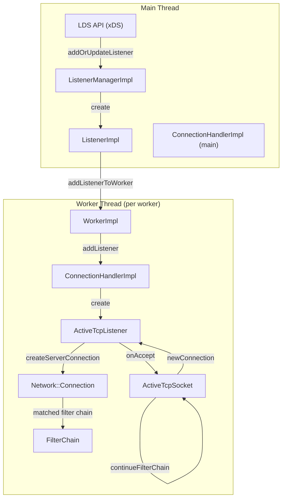
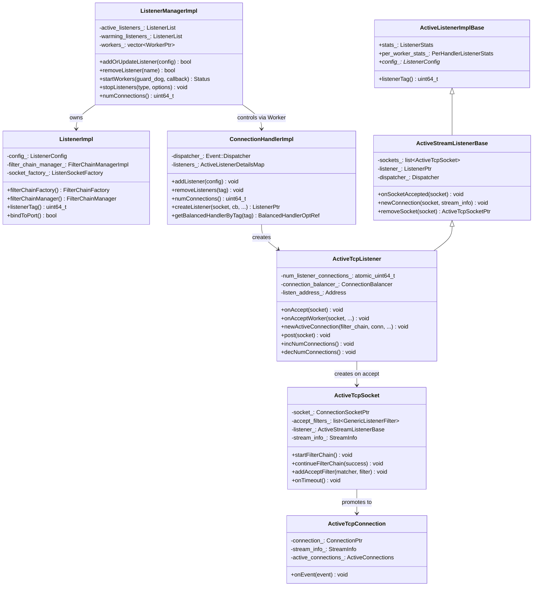
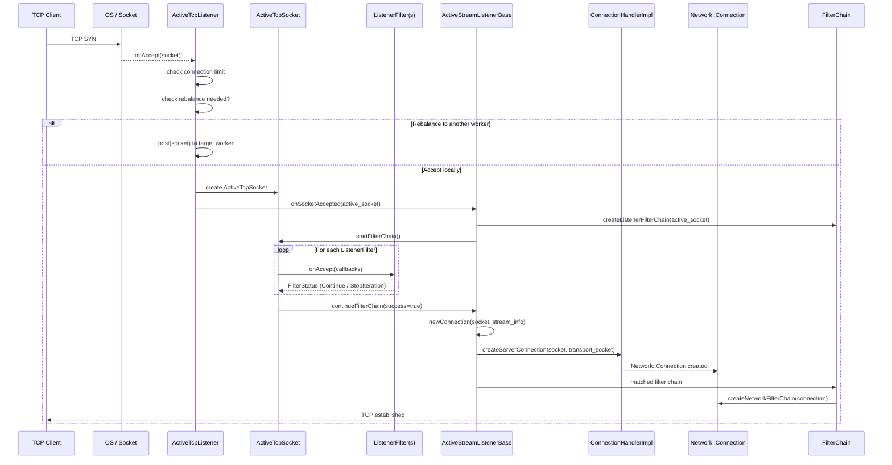
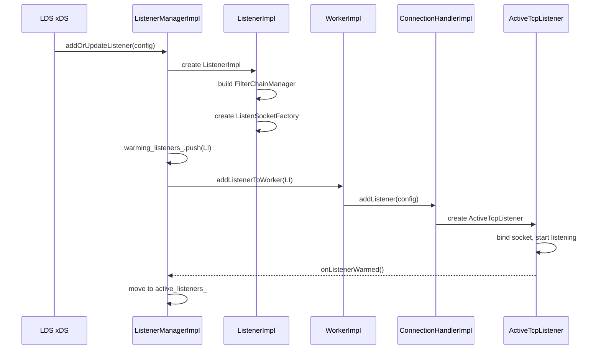
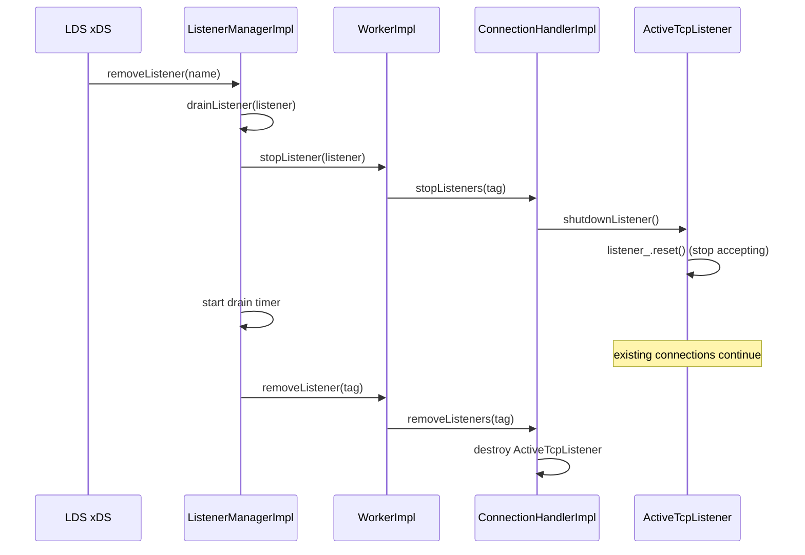
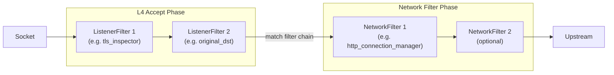
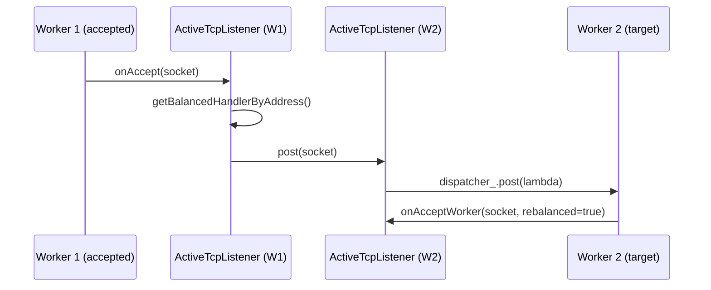

# Envoy Listener Architecture

> How `ListenerManagerImpl`, `ListenerImpl`, `ConnectionHandlerImpl`, `ActiveListenerImplBase`, `ActiveTcpListener`, `ActiveTcpSocket`, and `Connection` interact to accept and serve TCP connections.

---

## 1. Block Diagram

---

## 2. Class Diagram (UML)

---

## 3. TCP Connection Accept Sequence Diagram

---

## 4. Listener Startup Sequence Diagram

---

## 5. Listener Removal / Drain Sequence Diagram

---

## 6. Key Classes Explained

### 6.1 `ListenerManagerImpl`

**Location:** `source/common/listener_manager/listener_manager_impl.h`

**Purpose:** Top-level orchestrator for listeners. Translates xDS/LDS config into active listeners on workers.

| Method | Description |
|--------|-------------|
| `addOrUpdateListener()` | Add or hot-reload a listener from config |
| `removeListener()` | Drain and remove a listener |
| `startWorkers()` | Start all worker threads |
| `stopListeners()` | Stop accepting on all/inbound listeners |
| `numConnections()` | Aggregate connection count across workers |

**State:**
- `active_listeners_` — Fully warmed and active.
- `warming_listeners_` — Initializing, not yet serving.
- `draining_listeners_` — Draining old connections.

---

### 6.2 `ListenerImpl`

**Location:** `source/common/listener_manager/listener_impl.h`

**Purpose:** Represents one listener instance. Holds config, filter chain manager, socket factory, and drain manager.

| Member | Description |
|--------|-------------|
| `filter_chain_manager_` | Matches incoming connections to filter chains |
| `socket_factory_` | Creates/distributes listen sockets to workers |
| `drain_manager_` | Tracks drain state |
| `init_manager_` | Coordinates listener initialization |

---

### 6.3 `ConnectionHandlerImpl`

**Location:** `source/common/listener_manager/connection_handler_impl.h`

**Purpose:** Per-worker connection handler. Manages active listeners and counts connections.

| Method | Description |
|--------|-------------|
| `addListener()` | Creates `ActiveTcpListener` / UDP / QUIC listener |
| `removeListeners()` | Destroy listener by tag |
| `createListener()` | Create a `Network::Listener` from socket |
| `getBalancedHandlerByTag()` | Find the right handler for connection rebalancing |
| `numConnections()` | Count active connections on this worker |

---

### 6.4 `ActiveListenerImplBase`

**Location:** `source/server/active_listener_base.h`

**Purpose:** Shared base for all active listener types. Holds stats and listener config pointer.

| Member | Description |
|--------|-------------|
| `stats_` | Per-listener stats (active_cx, cx_overflow, etc.) |
| `per_worker_stats_` | Per-worker-per-listener stats |
| `config_` | Pointer to the `ListenerConfig` |

---

### 6.5 `ActiveStreamListenerBase`

**Location:** `source/common/listener_manager/active_stream_listener_base.h`

**Purpose:** Extends `ActiveListenerImplBase`. Manages the lifecycle of `ActiveTcpSocket` objects and transitions them to `Connection`.

| Method | Description |
|--------|-------------|
| `onSocketAccepted()` | Run listener filters, move socket to list if paused |
| `newConnection()` | Call `createServerConnection()`, run network filter chain |
| `removeSocket()` | Detach socket from internal list |
| `onFilterChainDraining()` | Remove connections from draining chains |

---

### 6.6 `ActiveTcpListener`

**Location:** `source/common/listener_manager/active_tcp_listener.h`

**Purpose:** TCP-specific active listener. Handles `onAccept`, balancing, and promoting sockets to connections.

| Method | Description |
|--------|-------------|
| `onAccept()` | Called by OS-level event, checks limits, may rebalance |
| `onAcceptWorker()` | Accepted on this worker; create `ActiveTcpSocket` |
| `newActiveConnection()` | Wraps a `ServerConnection` in `ActiveTcpConnection` |
| `post()` | Rebalance socket to another worker |
| `incNumConnections()` / `decNumConnections()` | Track per-listener connection count |

---

### 6.7 `ActiveTcpSocket`

**Location:** `source/common/listener_manager/active_tcp_socket.h`

**Purpose:** Wraps a newly accepted socket as it passes through listener filters.

| Method | Description |
|--------|-------------|
| `startFilterChain()` | Kick off listener filter iteration |
| `continueFilterChain()` | Advance to next filter or promote to connection |
| `addAcceptFilter()` | Register a listener filter |
| `onTimeout()` | Timeout on listener filter |
| `setDynamicMetadata()` | Filters can set metadata (e.g. for routing) |

**State machine:**
1. Created on `onAccept`.
2. Listener filters run one by one via `continueFilterChain()`.
3. If a filter stops iteration → socket is held in `sockets_` list, timer started.
4. When all filters pass → `newConnection()` is called.
5. Promoted to `Connection` → socket removed from list, `ActiveTcpConnection` created.

---

### 6.8 `ActiveTcpConnection`

**Location:** `source/common/listener_manager/active_stream_listener_base.h`

**Purpose:** Wraps a live `Network::Connection` in the listener's context.

| Member | Description |
|--------|-------------|
| `connection_` | The underlying network connection |
| `stream_info_` | Request/connection metadata |
| `active_connections_` | Parent connection collection |

---

### 6.9 `ActiveConnections`

**Purpose:** Groups `ActiveTcpConnection` objects that share the same filter chain. When a filter chain is drained, all its connections are removed together.

---

## 7. Listener Filter Chain vs Network Filter Chain

| Phase | Where | Purpose |
|-------|-------|---------|
| **Listener Filter** | `ActiveTcpSocket` | Pre-accept: inspect, modify, route socket before Connection is created |
| **Network Filter** | `Connection` | Post-accept: read/write data, codec, proxy |

---

## 8. Connection Balancing

When `use_original_dst` or `connection_balance_config` is set, `ActiveTcpListener` may redirect incoming sockets to a different worker via `post()`.

---

## 9. Source Paths

| Class | Path |
|-------|------|
| `ListenerManagerImpl` | `source/common/listener_manager/listener_manager_impl.*` |
| `ListenerImpl` | `source/common/listener_manager/listener_impl.*` |
| `ConnectionHandlerImpl` | `source/common/listener_manager/connection_handler_impl.*` |
| `ActiveListenerImplBase` | `source/server/active_listener_base.h` |
| `ActiveStreamListenerBase` / `ActiveConnections` | `source/common/listener_manager/active_stream_listener_base.*` |
| `ActiveTcpListener` | `source/common/listener_manager/active_tcp_listener.*` |
| `ActiveTcpSocket` | `source/common/listener_manager/active_tcp_socket.*` |
| `FilterChainManagerImpl` | `source/common/listener_manager/filter_chain_manager_impl.*` |
