# Envoy Listener Manager Architecture

## Table of Contents
1. [Overview](#overview)
2. [Core Components](#core-components)
   - [ListenerInfoImpl](#listenerinfoimpl)
   - [FilterChainFactoryContextCreator](#filterchainfactorycontextcreator)
   - [ActiveStreamListenerBase](#activestreamlistenerbase)
   - [ConnectionHandlerImpl](#connectionhandlerimpl)
   - [ListenerImpl](#listenerimpl)
   - [ActiveTcpListener](#activetcplistener)
   - [ListenerManagerImpl](#listenermanagerimpl)
3. [Architecture Diagrams](#architecture-diagrams)
4. [Connection Lifecycle](#connection-lifecycle)
5. [Filter Chain Management](#filter-chain-management)
6. [Listener Lifecycle](#listener-lifecycle)
7. [Worker Thread Model](#worker-thread-model)
8. [Load Balancing](#load-balancing)
9. [Configuration](#configuration)
10. [Testing and Debugging](#testing-and-debugging)

## Overview

The Listener Manager is a critical component in Envoy's architecture responsible for:
- Managing the lifecycle of network listeners (TCP, UDP, QUIC)
- Accepting incoming connections and distributing them across worker threads
- Matching connections to appropriate filter chains based on configured criteria
- Handling listener updates and hot restarts
- Coordinating with the connection handler for per-worker listener management

The listener manager bridges the gap between Envoy's configuration layer and the network I/O layer, ensuring that incoming connections are properly routed through the correct filter chain pipelines.

### Key Responsibilities

1. **Listener Lifecycle Management**: Creating, updating, and destroying listeners based on configuration
2. **Connection Acceptance**: Accepting new connections and creating the appropriate socket abstractions
3. **Filter Chain Matching**: Selecting the correct filter chain based on connection properties (SNI, ALPN, source IP, etc.)
4. **Worker Distribution**: Distributing listeners across worker threads for parallel processing
5. **Hot Restart**: Supporting zero-downtime configuration updates through listener draining

## Core Components

### ListenerInfoImpl

`ListenerInfoImpl` implements the `Network::ListenerInfo` interface and stores metadata about a listener extracted from its protobuf configuration.

**Location**: `source/common/listener_manager/listener_info_impl.h`

#### Class Definition

```cpp
class ListenerInfoImpl : public Network::ListenerInfo {
public:
  explicit ListenerInfoImpl(const envoy::config::listener::v3::Listener& config);

  // Network::ListenerInfo
  const envoy::config::core::v3::Metadata& metadata() const override { return metadata_; }
  envoy::config::core::v3::TrafficDirection direction() const override { return direction_; }
  bool isQuic() const override { return is_quic_; }
  bool shouldBypassOverloadManager() const override { return bypass_overload_manager_; }

private:
  const envoy::config::core::v3::Metadata metadata_;
  const envoy::config::core::v3::TrafficDirection direction_;
  const bool is_quic_;
  const bool bypass_overload_manager_;
};
```

#### Key Features

1. **Metadata Storage**: Stores listener metadata for filtering and identification
2. **Traffic Direction**: Indicates whether the listener handles inbound, outbound, or unspecified traffic
3. **Protocol Detection**: Identifies QUIC listeners for special handling
4. **Overload Manager Bypass**: Allows critical listeners to bypass overload protection

#### Usage Example

```cpp
// Creating listener info from configuration
auto config = // ... load listener config
auto listener_info = std::make_shared<ListenerInfoImpl>(config);

// Checking traffic direction
if (listener_info->direction() == envoy::config::core::v3::INBOUND) {
  // Handle inbound traffic
}

// Checking if QUIC is enabled
if (listener_info->isQuic()) {
  // Set up QUIC-specific handling
}
```

#### Sequence Diagram: ListenerInfo Creation

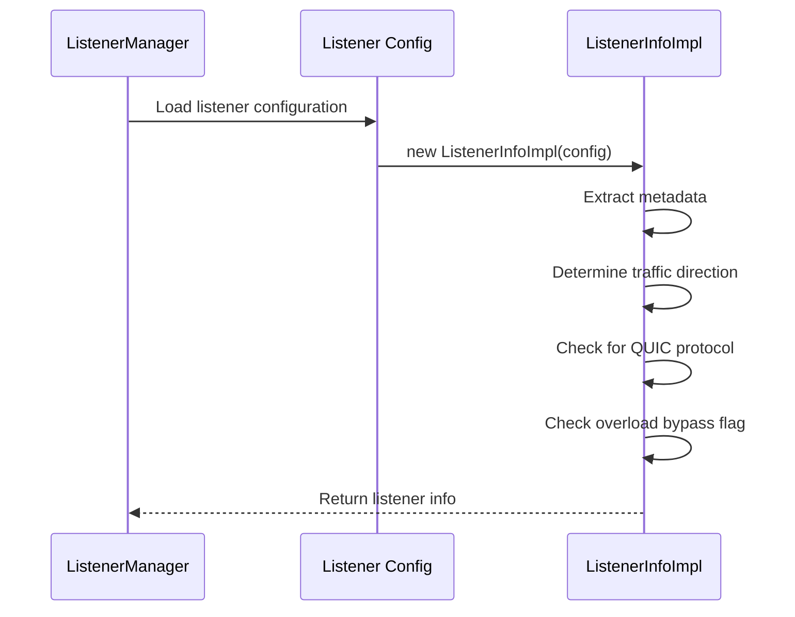
```mermaid
sequenceDiagram
    participant LM as ListenerManager
    participant Config as Listener Config
    participant LI as ListenerInfoImpl

    LM->>Config: Load listener configuration
    Config->>LI: new ListenerInfoImpl(config)
    LI->>LI: Extract metadata
    LI->>LI: Determine traffic direction
    LI->>LI: Check for QUIC protocol
    LI->>LI: Check overload bypass flag
    LI-->>LM: Return listener info
```

### FilterChainFactoryContextCreator

`FilterChainFactoryContextCreator` is an interface that provides a factory method for creating filter chain factory contexts.

**Location**: `source/common/listener_manager/filter_chain_factory_context_callback.h`

#### Interface Definition

```cpp
class FilterChainFactoryContextCreator {
public:
  virtual ~FilterChainFactoryContextCreator() = default;

  /**
   * @return a new filter chain factory context for the given filter chain config.
   * @param filter_chain the filter chain proto config. It can be nullptr if there is
   *        no filter chain config (e.g., internal listener).
   */
  virtual Configuration::FilterChainFactoryContextPtr createFilterChainFactoryContext(
      const ::envoy::config::listener::v3::FilterChain* const filter_chain) PURE;
};
```

#### Key Features

1. **Context Factory**: Creates contexts needed for building filter chains
2. **Configuration Binding**: Associates filter chain configuration with runtime context
3. **Null-Safe**: Handles cases where no filter chain config exists (internal listeners)

#### Implementation Context

This interface is typically implemented by `ListenerImpl` to provide the necessary context for filter chain creation:

```cpp
// In ListenerImpl
Configuration::FilterChainFactoryContextPtr ListenerImpl::createFilterChainFactoryContext(
    const ::envoy::config::listener::v3::FilterChain* const filter_chain) {

  return std::make_unique<PerFilterChainFactoryContextImpl>(
      parent_,
      init_manager_,
      *listener_scope_,
      *listener_factory_context_base_,
      filter_chain);
}
```

#### Usage Flow

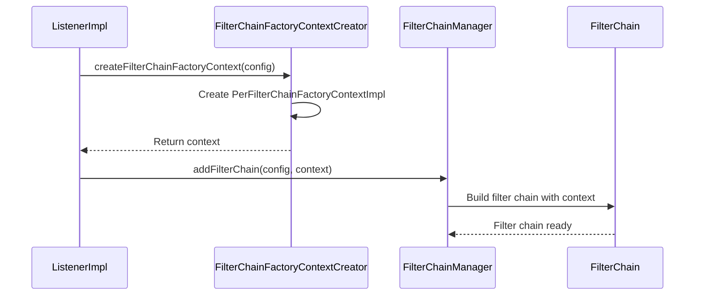
```mermaid
sequenceDiagram
    participant LI as ListenerImpl
    participant CFCC as FilterChainFactoryContextCreator
    participant FCM as FilterChainManager
    participant FC as FilterChain

    LI->>CFCC: createFilterChainFactoryContext(config)
    CFCC->>CFCC: Create PerFilterChainFactoryContextImpl
    CFCC-->>LI: Return context
    LI->>FCM: addFilterChain(config, context)
    FCM->>FC: Build filter chain with context
    FC-->>FCM: Filter chain ready
```

### ActiveStreamListenerBase

`ActiveStreamListenerBase` is the base class for all stream-based (TCP, Unix domain socket) active listeners. It manages the lifecycle of listener filters and active connections.

**Location**: `source/common/listener_manager/active_stream_listener_base.h`

#### Class Hierarchy

```cpp
class ActiveStreamListenerBase : public ActiveListenerImplBase {
public:
  ActiveStreamListenerBase(Network::ListenerConfig& config,
                          Server::Instance& server,
                          ListenerManagerImpl& parent,
                          Network::SocketSharedPtr&& listen_socket,
                          Network::Address::InstanceConstSharedPtr& listen_address,
                          Network::ListenerPtr&& listener);

  // Handle new connection from socket
  void newConnection(Network::ConnectionSocketPtr&& socket,
                    std::unique_ptr<StreamInfo::StreamInfo> stream_info);

  // Remove socket from active list
  std::unique_ptr<ActiveTcpSocket> removeSocket(ActiveTcpSocket& socket);

protected:
  // Subclasses implement this to create connections
  virtual void newActiveConnection(
      const Network::FilterChain& filter_chain,
      Network::ServerConnectionPtr server_conn_ptr,
      std::unique_ptr<StreamInfo::StreamInfo> stream_info) PURE;

  // Active connections grouped by filter chain
  std::list<ActiveConnectionsPtr> connections_by_context_;

  // Sockets in listener filter processing
  std::list<std::unique_ptr<ActiveTcpSocket>> sockets_;
};
```

#### Key Components

##### ActiveTcpSocket

Wraps a single connection socket during listener filter processing:

```cpp
class ActiveTcpSocket : public Network::ListenerFilterManager,
                       public Network::ListenerFilterCallbacks {
public:
  ActiveTcpSocket(ActiveStreamListenerBase& parent,
                 Network::ConnectionSocketPtr&& socket,
                 std::unique_ptr<StreamInfo::StreamInfo> stream_info);

  void onTimeout();  // Listener filter timeout
  void continueFilterChain(bool success) override;
  void setDynamicMetadata(const std::string& name,
                         const ProtobufWkt::Struct& value) override;
  // ... more methods

private:
  ActiveStreamListenerBase& parent_;
  Network::ConnectionSocketPtr socket_;
  std::unique_ptr<StreamInfo::StreamInfo> stream_info_;
  std::vector<Network::ListenerFilterPtr> filters_;
  Event::TimerPtr timer_;
  bool iter_stopped_{false};
};
```

##### ActiveConnections

Groups all active connections attached to the same filter chain:

```cpp
class ActiveConnections {
public:
  ActiveConnections(ActiveStreamListenerBase& listener,
                   const Network::FilterChain& filter_chain);

  ~ActiveConnections() {
    // Ensure all connections are closed
    ASSERT(connections_.empty());
  }

  const Network::FilterChain& filter_chain_;
  std::list<ActiveTcpConnectionPtr> connections_;
};
```

##### OwnedActiveStreamListenerBase

Mixin that adds ownership semantics for managing connection lifetime:

```cpp
template <class ListenerT, class ConnectionT, class FactoryContextT>
class OwnedActiveStreamListenerBase : public ActiveStreamListenerBase {
protected:
  void removeConnection(ConnectionT& connection);

  void newActiveConnection(
      const Network::FilterChain& filter_chain,
      Network::ServerConnectionPtr server_conn_ptr,
      std::unique_ptr<StreamInfo::StreamInfo> stream_info) override;
};
```

#### Connection Acceptance Flow

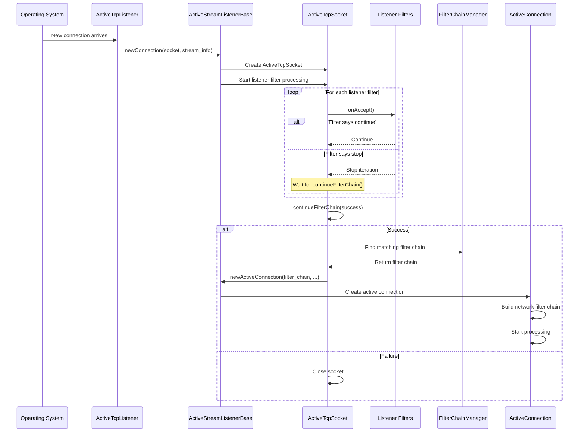
```mermaid
sequenceDiagram
    participant OS as Operating System
    participant ATL as ActiveTcpListener
    participant ASLB as ActiveStreamListenerBase
    participant ATS as ActiveTcpSocket
    participant LF as Listener Filters
    participant FCM as FilterChainManager
    participant AC as ActiveConnection

    OS->>ATL: New connection arrives
    ATL->>ASLB: newConnection(socket, stream_info)
    ASLB->>ATS: Create ActiveTcpSocket
    ASLB->>ATS: Start listener filter processing

    loop For each listener filter
        ATS->>LF: onAccept()
        alt Filter says continue
            LF-->>ATS: Continue
        else Filter says stop
            LF-->>ATS: Stop iteration
            Note over ATS: Wait for continueFilterChain()
        end
    end

    ATS->>ATS: continueFilterChain(success)
    alt Success
        ATS->>FCM: Find matching filter chain
        FCM-->>ATS: Return filter chain
        ATS->>ASLB: newActiveConnection(filter_chain, ...)
        ASLB->>AC: Create active connection
        AC->>AC: Build network filter chain
        AC->>AC: Start processing
    else Failure
        ATS->>ATS: Close socket
    end
```

#### Usage Example

```cpp
// Accepting a new TCP connection
void ActiveTcpListener::onAccept(Network::ConnectionSocketPtr&& socket) {
  // Connection balancing
  if (connection_balancer_->pickTargetHandler(*socket).has_value()) {
    // Hand off to another worker
    return;
  }

  // Create stream info
  auto stream_info = std::make_unique<StreamInfo::StreamInfoImpl>(
      time_source_,
      socket->connectionInfoProviderSharedPtr(),
      StreamInfo::FilterState::LifeSpan::Connection);

  // Pass to base class for listener filter processing
  newConnection(std::move(socket), std::move(stream_info));
}
```

### ConnectionHandlerImpl

`ConnectionHandlerImpl` manages all active listeners on a single worker thread.

**Location**: `source/common/listener_manager/connection_handler_impl.h`

#### Class Definition

```cpp
class ConnectionHandlerImpl : public Network::ConnectionHandler,
                              Logger::Loggable<Logger::Id::conn_handler> {
public:
  ConnectionHandlerImpl(Event::Dispatcher& dispatcher,
                       absl::optional<uint32_t> worker_index);

  // Network::ConnectionHandler
  uint64_t numConnections() const override;
  void incNumConnections() override;
  void decNumConnections() override;

  void addListener(absl::optional<uint64_t> overridden_listener,
                  Network::ListenerConfig& config,
                  Runtime::Loader& runtime) override;

  void removeListeners(uint64_t listener_tag) override;
  void removeFilterChains(uint64_t listener_tag,
                         const std::list<const Network::FilterChain*>& filter_chains,
                         std::function<void()> completion) override;

  void stopListeners(uint64_t listener_tag) override;
  void stopListeners() override;
  void disableListeners() override;
  void enableListeners() override;
  void setListenerRejectFraction(UnitFloat reject_fraction) override;

private:
  // Active listeners grouped by address
  struct PerAddressActiveListenerDetails {
    std::list<std::pair<Network::Address::InstanceConstSharedPtr,
                       ActiveListenerDetailsPtr>> active_listeners_;
  };

  // Map from listener tag to active listeners
  using ActiveListenersByTag =
      absl::flat_hash_map<uint64_t, PerAddressActiveListenerDetails>;

  ActiveListenersByTag listener_map_by_tag_;

  Event::Dispatcher& dispatcher_;
  const absl::optional<uint32_t> worker_index_;
  std::atomic<uint64_t> num_handler_connections_{};
  bool disable_listeners_{false};
};
```

#### Key Features

1. **Per-Worker Management**: Each worker thread has its own ConnectionHandler
2. **Listener Organization**: Listeners organized by tag and address
3. **Connection Counting**: Tracks total connections for overload protection
4. **Listener Control**: Enable/disable/stop operations for graceful shutdown
5. **Filter Chain Hot Reload**: Supports removing individual filter chains without stopping listener

#### Active Listener Organization

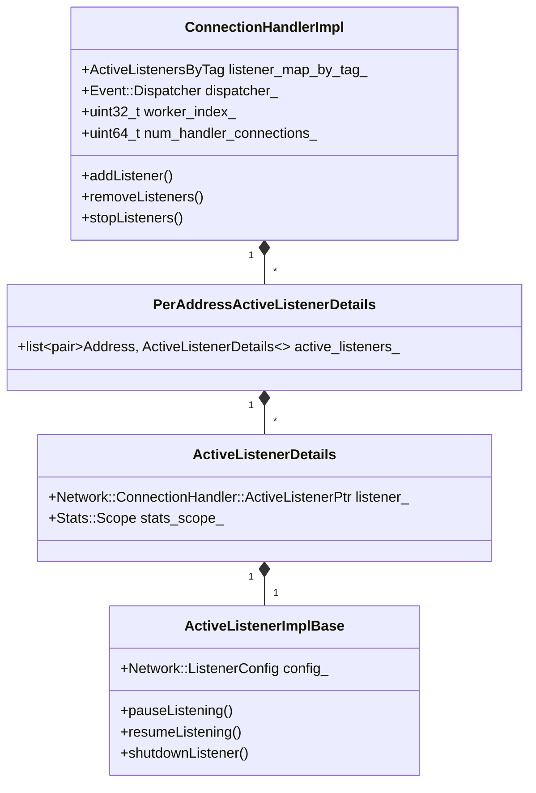
```mermaid
classDiagram
    class ConnectionHandlerImpl {
        +ActiveListenersByTag listener_map_by_tag_
        +Event::Dispatcher dispatcher_
        +uint32_t worker_index_
        +uint64_t num_handler_connections_
        +addListener()
        +removeListeners()
        +stopListeners()
    }

    class PerAddressActiveListenerDetails {
        +list~pair~Address, ActiveListenerDetails~~ active_listeners_
    }

    class ActiveListenerDetails {
        +Network::ConnectionHandler::ActiveListenerPtr listener_
        +Stats::Scope stats_scope_
    }

    class ActiveListenerImplBase {
        +Network::ListenerConfig config_
        +pauseListening()
        +resumeListening()
        +shutdownListener()
    }

    ConnectionHandlerImpl "1" *-- "*" PerAddressActiveListenerDetails
    PerAddressActiveListenerDetails "1" *-- "*" ActiveListenerDetails
    ActiveListenerDetails "1" *-- "1" ActiveListenerImplBase
```

#### Listener Management Flow

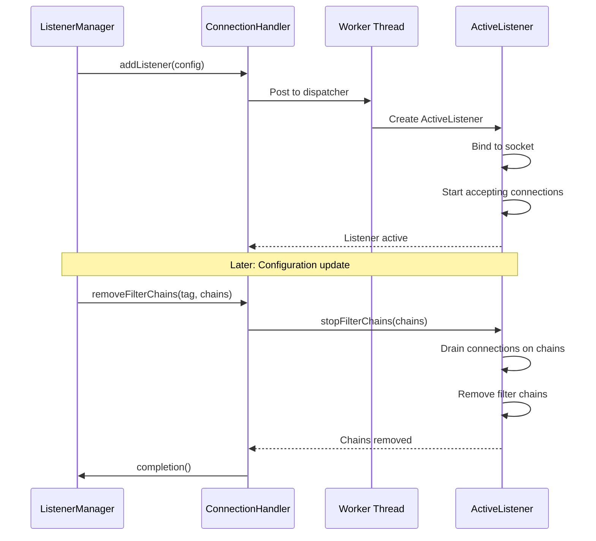
```mermaid
sequenceDiagram
    participant LM as ListenerManager
    participant CH as ConnectionHandler
    participant Worker as Worker Thread
    participant AL as ActiveListener

    LM->>CH: addListener(config)
    CH->>Worker: Post to dispatcher
    Worker->>AL: Create ActiveListener
    AL->>AL: Bind to socket
    AL->>AL: Start accepting connections
    AL-->>CH: Listener active

    Note over LM,AL: Later: Configuration update

    LM->>CH: removeFilterChains(tag, chains)
    CH->>AL: stopFilterChains(chains)
    AL->>AL: Drain connections on chains
    AL->>AL: Remove filter chains
    AL-->>CH: Chains removed
    CH->>LM: completion()
```

### ListenerImpl

`ListenerImpl` is the main implementation of `Network::ListenerConfig` and `Network::FilterChainFactory`. It manages a listener's configuration and creates filter chains.

**Location**: `source/common/listener_manager/listener_impl.h`

#### Class Definition

```cpp
class ListenerImpl : public Network::ListenerConfig,
                    public Network::FilterChainFactory,
                    public FilterChainFactoryContextCreator,
                    Logger::Loggable<Logger::Id::config> {
public:
  ListenerImpl(const envoy::config::listener::v3::Listener& config,
              const std::string& version_info,
              ListenerManagerImpl& parent,
              const std::string& name,
              bool added_via_api,
              bool workers_started,
              uint64_t hash,
              ProtobufMessage::ValidationContext& validation_context);

  // Network::ListenerConfig
  Network::FilterChainManager& filterChainManager() override { return *filter_chain_manager_; }
  Network::FilterChainFactory& filterChainFactory() override { return *this; }
  Network::ListenSocketFactory& listenSocketFactory() override { return *socket_factories_[0]; }
  bool bindToPort() const override { return bind_to_port_; }
  bool handOffRestoredDestinationConnections() const override;
  uint32_t perConnectionBufferLimitBytes() const override;
  std::chrono::milliseconds listenerFiltersTimeout() const override;
  bool continueOnListenerFiltersTimeout() const override;
  Stats::Scope& listenerScope() override { return *listener_scope_; }
  uint64_t listenerTag() const override { return listener_tag_; }
  ResourceLimit& openConnections() override { return *open_connections_; }
  const std::string& name() const override { return name_; }
  Network::UdpListenerConfigOptRef udpListenerConfig() override;
  Network::InternalListenerConfigOptRef internalListenerConfig() override;
  envoy::config::core::v3::TrafficDirection direction() const override;
  Network::ConnectionBalancer& connectionBalancer(const Network::Address::Instance&) override;
  const std::vector<AccessLog::InstanceSharedPtr>& accessLogs() const override;
  uint32_t tcpBacklogSize() const override;
  uint32_t maxConnectionsToAcceptPerSocketEvent() const override;
  Init::Manager& initManager() override;
  bool ignoreGlobalConnLimit() const override;

  // Network::FilterChainFactory
  bool createNetworkFilterChain(
      Network::Connection& connection,
      const std::vector<Network::FilterFactoryCb>& filter_factories) override;

  bool createListenerFilterChain(Network::ListenerFilterManager& manager) override;

  void createUdpListenerFilterChain(Network::UdpListenerFilterManager& manager,
                                   Network::UdpReadFilterCallbacks& callbacks) override;

  // FilterChainFactoryContextCreator
  Configuration::FilterChainFactoryContextPtr createFilterChainFactoryContext(
      const envoy::config::listener::v3::FilterChain* filter_chain) override;

private:
  ListenerManagerImpl& parent_;
  Network::Address::InstanceConstSharedPtr address_;
  Network::FilterChainManagerImpl* filter_chain_manager_{};
  const std::string version_info_;
  const std::string name_;
  const bool added_via_api_;
  const bool bind_to_port_;
  const bool hand_off_restored_destination_connections_;
  const uint32_t per_connection_buffer_limit_bytes_;
  const uint64_t listener_tag_;
  const std::chrono::milliseconds listener_filters_timeout_;
  const bool continue_on_listener_filters_timeout_;

  ListenSocketFactorySharedPtr socket_factories_;
  Stats::ScopeSharedPtr listener_scope_;
  std::unique_ptr<Init::Manager> dynamic_init_manager_;
  std::unique_ptr<BasicResourceLimitImpl> open_connections_;

  // Network filters
  std::vector<Network::FilterFactoryCb> network_filter_factories_;

  // Listener filters
  std::vector<Network::ListenerFilterFactoryCb> listener_filter_factories_;

  // UDP listener filters
  std::vector<Network::UdpListenerFilterFactoryCb> udp_listener_filter_factories_;

  // Access logs
  std::vector<AccessLog::InstanceSharedPtr> access_logs_;

  // Connection balancer
  Network::ConnectionBalancerSharedPtr connection_balancer_;
};
```

#### Key Responsibilities

1. **Configuration Storage**: Stores all listener configuration parameters
2. **Filter Chain Management**: Creates and manages filter chains through FilterChainManager
3. **Socket Management**: Creates and manages listen sockets
4. **Filter Factories**: Builds network, listener, and UDP filter factories
5. **Resource Limits**: Enforces connection limits and buffer sizes
6. **Access Logging**: Configures access log handlers

#### Initialization Flow

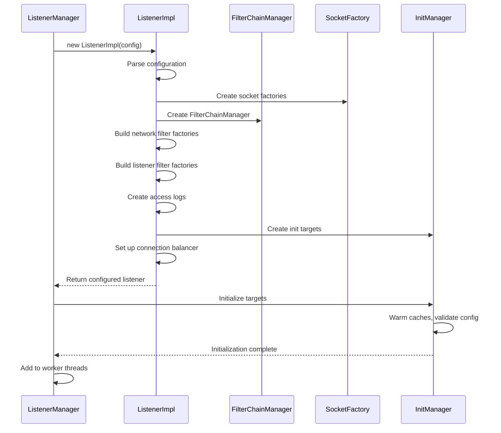
```mermaid
sequenceDiagram
    participant LM as ListenerManager
    participant LI as ListenerImpl
    participant FCM as FilterChainManager
    participant SF as SocketFactory
    participant IM as InitManager

    LM->>LI: new ListenerImpl(config)
    LI->>LI: Parse configuration
    LI->>SF: Create socket factories
    LI->>FCM: Create FilterChainManager
    LI->>LI: Build network filter factories
    LI->>LI: Build listener filter factories
    LI->>LI: Create access logs
    LI->>IM: Create init targets
    LI->>LI: Set up connection balancer
    LI-->>LM: Return configured listener

    LM->>IM: Initialize targets
    IM->>IM: Warm caches, validate config
    IM-->>LM: Initialization complete
    LM->>LM: Add to worker threads
```

### ActiveTcpListener

`ActiveTcpListener` handles TCP connection acceptance with load balancing support.

**Location**: `source/common/listener_manager/active_tcp_listener.h`

#### Class Definition

```cpp
class ActiveTcpListener : public Network::TcpListenerCallbacks,
                         public OwnedActiveStreamListenerBase<
                             ActiveTcpListener,
                             ActiveTcpConnection,
                             Server::Configuration::FactoryContext>,
                         public Network::BalancedConnectionHandler {
public:
  ActiveTcpListener(Network::ListenerConfig& config,
                   Server::Instance& server,
                   ListenerManagerImpl& parent,
                   Network::SocketSharedPtr&& listen_socket,
                   Network::ListenerPtr&& listener,
                   Stats::Scope& listener_scope);

  // Network::TcpListenerCallbacks
  void onAccept(Network::ConnectionSocketPtr&& socket) override;
  void onReject(RejectCause cause) override;

  // Network::BalancedConnectionHandler
  uint64_t numConnections() const override;
  void incNumConnections() override;
  void decNumConnections() override;
  void post(Network::ConnectionSocketPtr&& socket) override;

protected:
  void newActiveConnection(
      const Network::FilterChain& filter_chain,
      Network::ServerConnectionPtr server_conn_ptr,
      std::unique_ptr<StreamInfo::StreamInfo> stream_info) override;

private:
  Network::ConnectionBalancerSharedPtr connection_balancer_;
  Server::Configuration::FactoryContext& factory_context_;
};
```

#### Key Features

1. **Connection Balancing**: Distributes connections across worker threads
2. **TCP Callbacks**: Handles accept/reject events from the OS
3. **Connection Tracking**: Counts active connections for load balancing decisions

#### Connection Balancing Flow

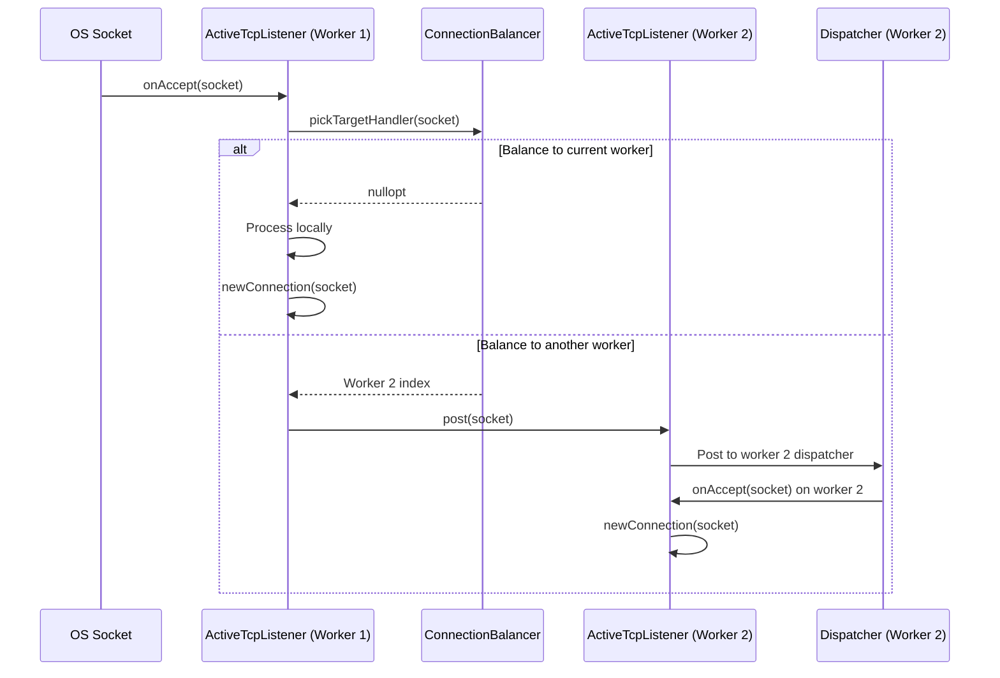
```mermaid
sequenceDiagram
    participant OS as OS Socket
    participant ATL1 as ActiveTcpListener (Worker 1)
    participant CB as ConnectionBalancer
    participant ATL2 as ActiveTcpListener (Worker 2)
    participant D2 as Dispatcher (Worker 2)

    OS->>ATL1: onAccept(socket)
    ATL1->>CB: pickTargetHandler(socket)

    alt Balance to current worker
        CB-->>ATL1: nullopt
        ATL1->>ATL1: Process locally
        ATL1->>ATL1: newConnection(socket)
    else Balance to another worker
        CB-->>ATL1: Worker 2 index
        ATL1->>ATL2: post(socket)
        ATL2->>D2: Post to worker 2 dispatcher
        D2->>ATL2: onAccept(socket) on worker 2
        ATL2->>ATL2: newConnection(socket)
    end
```

### ListenerManagerImpl

`ListenerManagerImpl` is the top-level coordinator for all listener lifecycle operations.

**Location**: `source/common/listener_manager/listener_manager_impl.h`

#### Key Responsibilities

1. **Listener CRUD**: Create, update, delete listeners based on LDS configuration
2. **Worker Coordination**: Distribute listeners across all worker threads
3. **Hot Restart**: Handle listener draining and takeover during restarts
4. **API Server**: Optionally expose listener management API
5. **Stats**: Track listener statistics and connection counts

#### Architecture

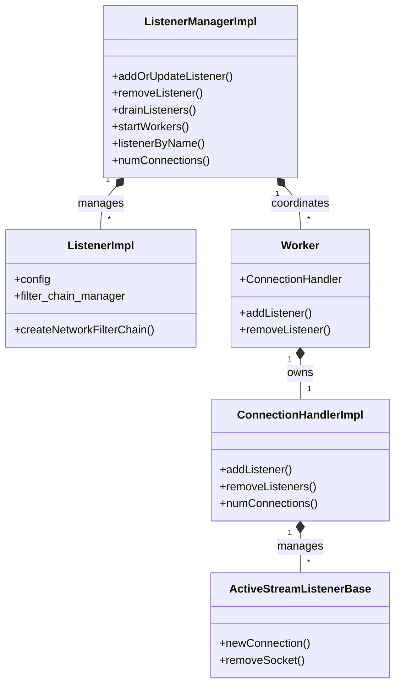
```mermaid
classDiagram
    class ListenerManagerImpl {
        +addOrUpdateListener()
        +removeListener()
        +drainListeners()
        +startWorkers()
        +listenerByName()
        +numConnections()
    }

    class ListenerImpl {
        +config
        +filter_chain_manager
        +createNetworkFilterChain()
    }

    class ConnectionHandlerImpl {
        +addListener()
        +removeListeners()
        +numConnections()
    }

    class ActiveStreamListenerBase {
        +newConnection()
        +removeSocket()
    }

    class Worker {
        +addListener()
        +removeListener()
        +ConnectionHandler
    }

    ListenerManagerImpl "1" *-- "*" ListenerImpl : manages
    ListenerManagerImpl "1" *-- "*" Worker : coordinates
    Worker "1" *-- "1" ConnectionHandlerImpl : owns
    ConnectionHandlerImpl "1" *-- "*" ActiveStreamListenerBase : manages
```

## Architecture Diagrams

### High-Level System Architecture

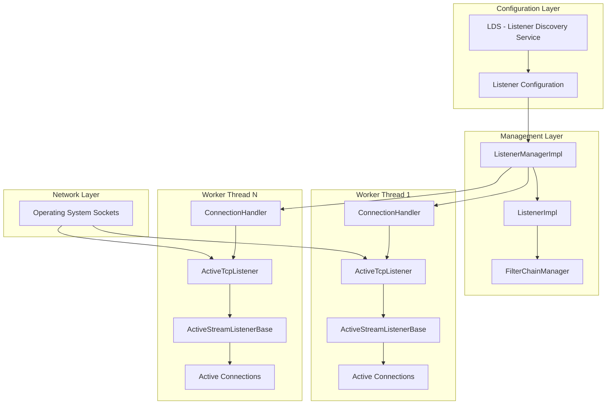
```mermaid
graph TB
    subgraph "Configuration Layer"
        LDS[LDS - Listener Discovery Service]
        Config[Listener Configuration]
    end

    subgraph "Management Layer"
        LM[ListenerManagerImpl]
        LI[ListenerImpl]
        FCM[FilterChainManager]
    end

    subgraph "Worker Thread 1"
        CH1[ConnectionHandler]
        ATL1[ActiveTcpListener]
        ASLB1[ActiveStreamListenerBase]
        Conn1[Active Connections]
    end

    subgraph "Worker Thread N"
        CHN[ConnectionHandler]
        ATLN[ActiveTcpListener]
        ASLBN[ActiveStreamListenerBase]
        ConnN[Active Connections]
    end

    subgraph "Network Layer"
        OS[Operating System Sockets]
    end

    LDS --> Config
    Config --> LM
    LM --> LI
    LI --> FCM
    LM --> CH1
    LM --> CHN
    CH1 --> ATL1
    ATL1 --> ASLB1
    ASLB1 --> Conn1
    CHN --> ATLN
    ATLN --> ASLBN
    ASLBN --> ConnN
    OS --> ATL1
    OS --> ATLN
```

### Component Interaction Diagram

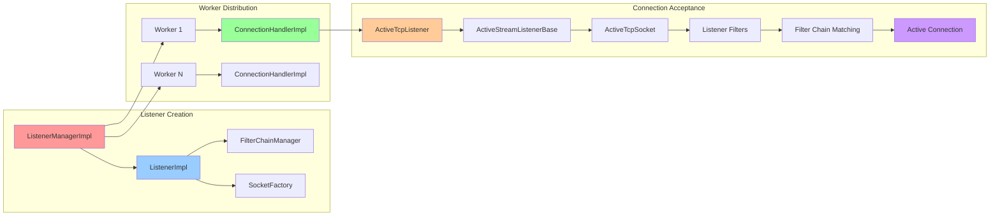
```mermaid
graph LR
    subgraph "Listener Creation"
        A[ListenerManagerImpl] --> B[ListenerImpl]
        B --> C[FilterChainManager]
        B --> D[SocketFactory]
    end

    subgraph "Worker Distribution"
        A --> E[Worker 1]
        A --> F[Worker N]
        E --> G[ConnectionHandlerImpl]
        F --> H[ConnectionHandlerImpl]
    end

    subgraph "Connection Acceptance"
        G --> I[ActiveTcpListener]
        I --> J[ActiveStreamListenerBase]
        J --> K[ActiveTcpSocket]
        K --> L[Listener Filters]
        L --> M[Filter Chain Matching]
        M --> N[Active Connection]
    end

    style A fill:#ff9999
    style B fill:#99ccff
    style G fill:#99ff99
    style I fill:#ffcc99
    style N fill:#cc99ff
```

## Connection Lifecycle

### Complete Connection Flow

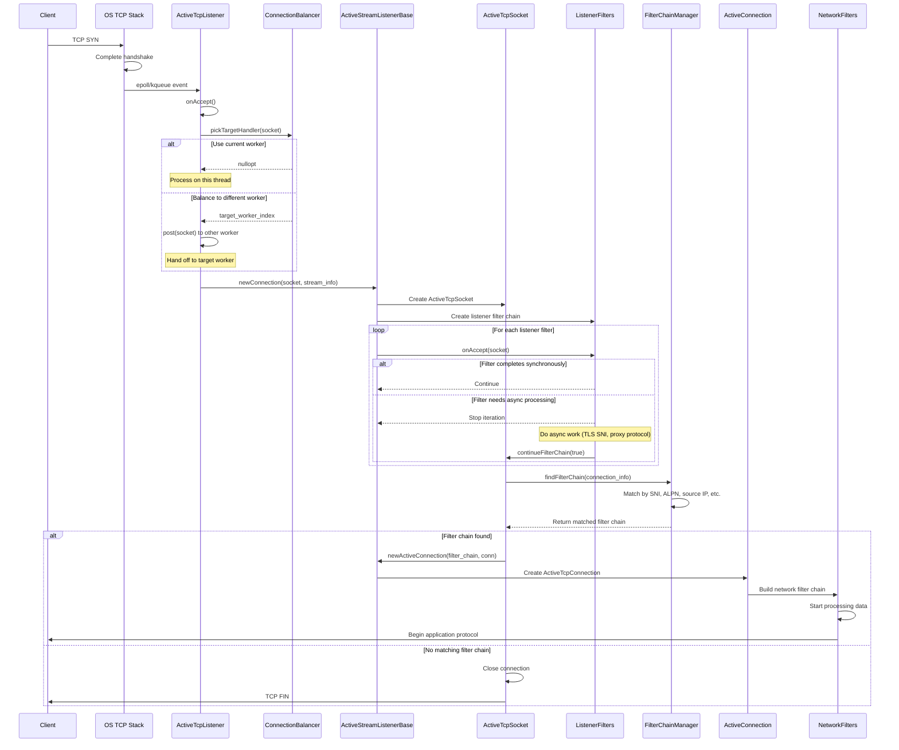
```mermaid
sequenceDiagram
    participant Client
    participant OS as OS TCP Stack
    participant ATL as ActiveTcpListener
    participant CB as ConnectionBalancer
    participant ASLB as ActiveStreamListenerBase
    participant ATS as ActiveTcpSocket
    participant LF as ListenerFilters
    participant FCM as FilterChainManager
    participant AC as ActiveConnection
    participant NF as NetworkFilters

    Client->>OS: TCP SYN
    OS->>OS: Complete handshake
    OS->>ATL: epoll/kqueue event
    ATL->>ATL: onAccept()

    ATL->>CB: pickTargetHandler(socket)
    alt Use current worker
        CB-->>ATL: nullopt
        Note over ATL: Process on this thread
    else Balance to different worker
        CB-->>ATL: target_worker_index
        ATL->>ATL: post(socket) to other worker
        Note over ATL: Hand off to target worker
    end

    ATL->>ASLB: newConnection(socket, stream_info)
    ASLB->>ATS: Create ActiveTcpSocket
    ASLB->>LF: Create listener filter chain

    loop For each listener filter
        ASLB->>LF: onAccept(socket)
        alt Filter completes synchronously
            LF-->>ASLB: Continue
        else Filter needs async processing
            LF-->>ASLB: Stop iteration
            Note over LF: Do async work (TLS SNI, proxy protocol)
            LF->>ATS: continueFilterChain(true)
        end
    end

    ATS->>FCM: findFilterChain(connection_info)
    FCM->>FCM: Match by SNI, ALPN, source IP, etc.
    FCM-->>ATS: Return matched filter chain

    alt Filter chain found
        ATS->>ASLB: newActiveConnection(filter_chain, conn)
        ASLB->>AC: Create ActiveTcpConnection
        AC->>NF: Build network filter chain
        NF->>NF: Start processing data
        NF->>Client: Begin application protocol
    else No matching filter chain
        ATS->>ATS: Close connection
        ATS->>Client: TCP FIN
    end
```

### Connection State Machine

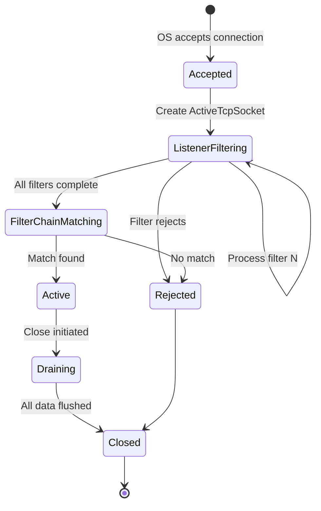
```mermaid
stateDiagram-v2
    [*] --> Accepted: OS accepts connection
    Accepted --> ListenerFiltering: Create ActiveTcpSocket

    ListenerFiltering --> ListenerFiltering: Process filter N
    ListenerFiltering --> FilterChainMatching: All filters complete
    ListenerFiltering --> Rejected: Filter rejects

    FilterChainMatching --> Active: Match found
    FilterChainMatching --> Rejected: No match

    Active --> Draining: Close initiated
    Draining --> Closed: All data flushed

    Rejected --> Closed
    Closed --> [*]
```

## Filter Chain Management

### Filter Chain Matching Process

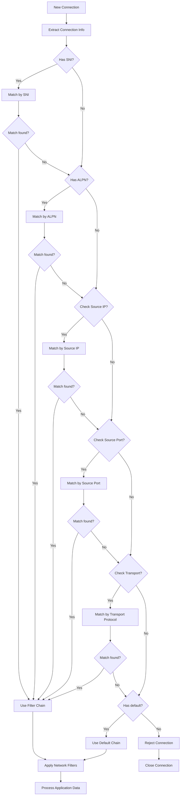
```mermaid
flowchart TD
    Start[New Connection] --> ExtractInfo[Extract Connection Info]
    ExtractInfo --> SNI{Has SNI?}

    SNI -->|Yes| MatchSNI[Match by SNI]
    SNI -->|No| ALPN{Has ALPN?}

    MatchSNI --> SNIFound{Match found?}
    SNIFound -->|Yes| UseChain[Use Filter Chain]
    SNIFound -->|No| ALPN

    ALPN -->|Yes| MatchALPN[Match by ALPN]
    ALPN -->|No| SourceIP{Check Source IP?}

    MatchALPN --> ALPNFound{Match found?}
    ALPNFound -->|Yes| UseChain
    ALPNFound -->|No| SourceIP

    SourceIP -->|Yes| MatchIP[Match by Source IP]
    SourceIP -->|No| SourcePort{Check Source Port?}

    MatchIP --> IPFound{Match found?}
    IPFound -->|Yes| UseChain
    IPFound -->|No| SourcePort

    SourcePort -->|Yes| MatchPort[Match by Source Port]
    SourcePort -->|No| Transport{Check Transport?}

    MatchPort --> PortFound{Match found?}
    PortFound -->|Yes| UseChain
    PortFound -->|No| Transport

    Transport -->|Yes| MatchTransport[Match by Transport Protocol]
    Transport -->|No| Default{Has default?}

    MatchTransport --> TransportFound{Match found?}
    TransportFound -->|Yes| UseChain
    TransportFound -->|No| Default

    Default -->|Yes| UseDefault[Use Default Chain]
    Default -->|No| Reject[Reject Connection]

    UseChain --> ApplyFilters[Apply Network Filters]
    UseDefault --> ApplyFilters
    ApplyFilters --> ProcessData[Process Application Data]
    Reject --> Close[Close Connection]
```

### Filter Chain Configuration Example

```yaml
listeners:
- name: main_listener
  address:
    socket_address:
      address: 0.0.0.0
      port_value: 443

  filter_chains:
  # HTTPS filter chain
  - filter_chain_match:
      server_names: ["example.com", "*.example.com"]
      transport_protocol: "tls"
      application_protocols: ["h2", "http/1.1"]
    filters:
    - name: envoy.filters.network.http_connection_manager
      typed_config:
        "@type": type.googleapis.com/envoy.extensions.filters.network.http_connection_manager.v3.HttpConnectionManager
        # ... HTTP config
    transport_socket:
      name: envoy.transport_sockets.tls
      typed_config:
        "@type": type.googleapis.com/envoy.extensions.transport_sockets.tls.v3.DownstreamTlsContext
        common_tls_context:
          tls_certificates:
          - certificate_chain: { filename: "/etc/certs/cert.pem" }
            private_key: { filename: "/etc/certs/key.pem" }

  # HTTP fallback chain
  - filter_chain_match:
      application_protocols: ["http/1.1"]
    filters:
    - name: envoy.filters.network.http_connection_manager
      # ... HTTP config for non-TLS

  # Default catch-all
  - filters:
    - name: envoy.filters.network.tcp_proxy
      # ... TCP proxy config
```

### Filter Chain Selection

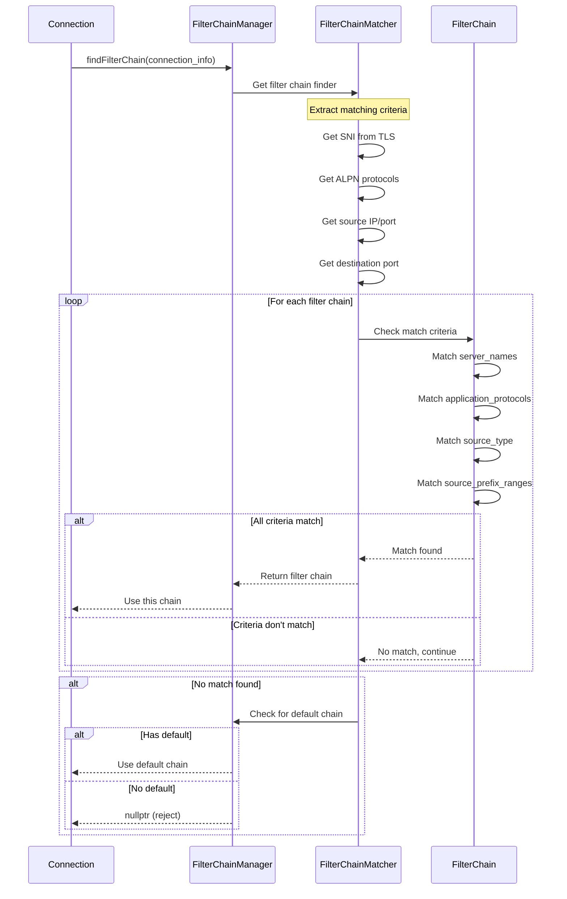
```mermaid
sequenceDiagram
    participant Conn as Connection
    participant FCM as FilterChainManager
    participant Matcher as FilterChainMatcher
    participant FC as FilterChain

    Conn->>FCM: findFilterChain(connection_info)
    FCM->>Matcher: Get filter chain finder

    Note over Matcher: Extract matching criteria
    Matcher->>Matcher: Get SNI from TLS
    Matcher->>Matcher: Get ALPN protocols
    Matcher->>Matcher: Get source IP/port
    Matcher->>Matcher: Get destination port

    loop For each filter chain
        Matcher->>FC: Check match criteria
        FC->>FC: Match server_names
        FC->>FC: Match application_protocols
        FC->>FC: Match source_type
        FC->>FC: Match source_prefix_ranges

        alt All criteria match
            FC-->>Matcher: Match found
            Matcher-->>FCM: Return filter chain
            FCM-->>Conn: Use this chain
        else Criteria don't match
            FC-->>Matcher: No match, continue
        end
    end

    alt No match found
        Matcher->>FCM: Check for default chain
        alt Has default
            FCM-->>Conn: Use default chain
        else No default
            FCM-->>Conn: nullptr (reject)
        end
    end
```

## Listener Lifecycle

### Listener Addition

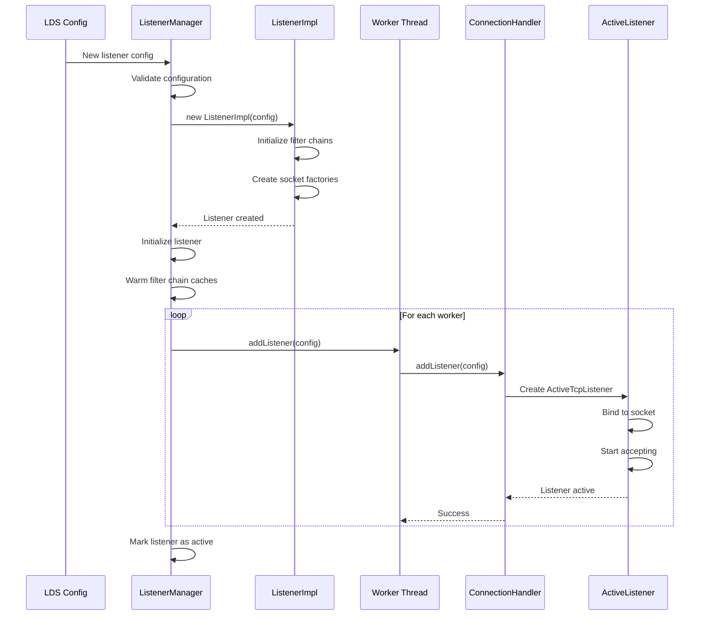
```mermaid
sequenceDiagram
    participant LDS as LDS Config
    participant LM as ListenerManager
    participant LI as ListenerImpl
    participant Worker as Worker Thread
    participant CH as ConnectionHandler
    participant AL as ActiveListener

    LDS->>LM: New listener config
    LM->>LM: Validate configuration
    LM->>LI: new ListenerImpl(config)
    LI->>LI: Initialize filter chains
    LI->>LI: Create socket factories
    LI-->>LM: Listener created

    LM->>LM: Initialize listener
    LM->>LM: Warm filter chain caches

    loop For each worker
        LM->>Worker: addListener(config)
        Worker->>CH: addListener(config)
        CH->>AL: Create ActiveTcpListener
        AL->>AL: Bind to socket
        AL->>AL: Start accepting
        AL-->>CH: Listener active
        CH-->>Worker: Success
    end

    LM->>LM: Mark listener as active
```

### Listener Update (Hot Reload)

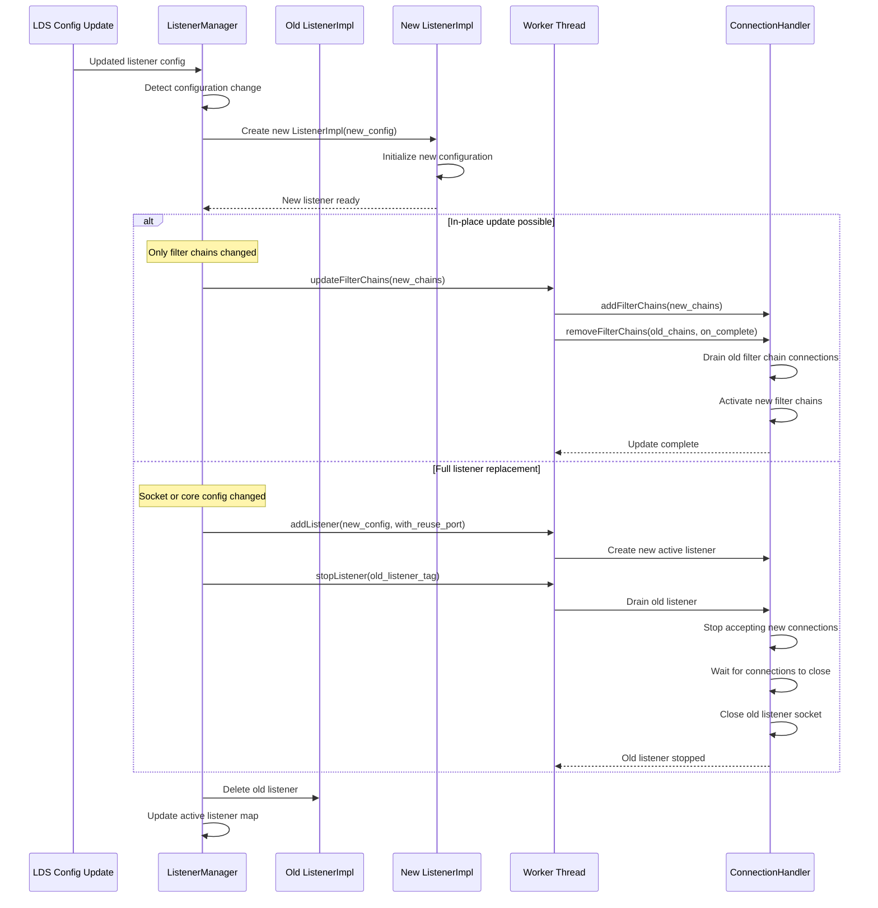
```mermaid
sequenceDiagram
    participant LDS as LDS Config Update
    participant LM as ListenerManager
    participant OldLI as Old ListenerImpl
    participant NewLI as New ListenerImpl
    participant Worker as Worker Thread
    participant CH as ConnectionHandler

    LDS->>LM: Updated listener config
    LM->>LM: Detect configuration change
    LM->>NewLI: Create new ListenerImpl(new_config)
    NewLI->>NewLI: Initialize new configuration
    NewLI-->>LM: New listener ready

    alt In-place update possible
        Note over LM: Only filter chains changed
        LM->>Worker: updateFilterChains(new_chains)
        Worker->>CH: addFilterChains(new_chains)
        Worker->>CH: removeFilterChains(old_chains, on_complete)
        CH->>CH: Drain old filter chain connections
        CH->>CH: Activate new filter chains
        CH-->>Worker: Update complete
    else Full listener replacement
        Note over LM: Socket or core config changed
        LM->>Worker: addListener(new_config, with_reuse_port)
        Worker->>CH: Create new active listener
        LM->>Worker: stopListener(old_listener_tag)
        Worker->>CH: Drain old listener
        CH->>CH: Stop accepting new connections
        CH->>CH: Wait for connections to close
        CH->>CH: Close old listener socket
        CH-->>Worker: Old listener stopped
    end

    LM->>OldLI: Delete old listener
    LM->>LM: Update active listener map
```

### Listener Removal

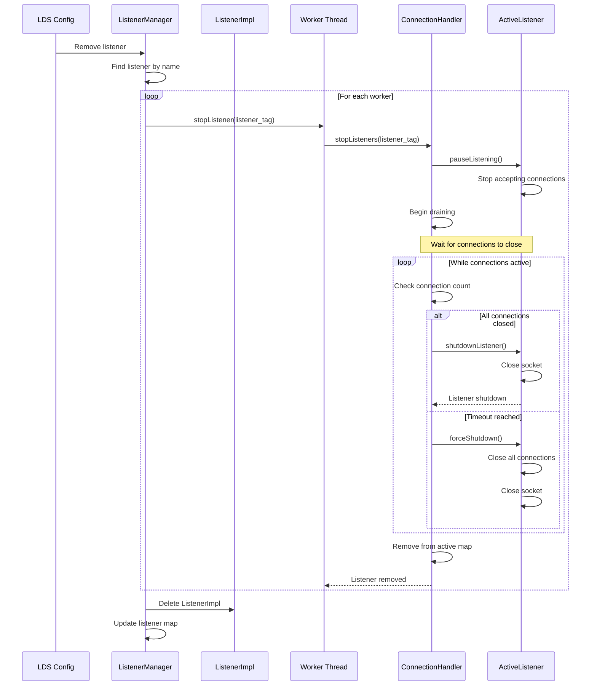
```mermaid
sequenceDiagram
    participant LDS as LDS Config
    participant LM as ListenerManager
    participant LI as ListenerImpl
    participant Worker as Worker Thread
    participant CH as ConnectionHandler
    participant AL as ActiveListener

    LDS->>LM: Remove listener
    LM->>LM: Find listener by name

    loop For each worker
        LM->>Worker: stopListener(listener_tag)
        Worker->>CH: stopListeners(listener_tag)
        CH->>AL: pauseListening()
        AL->>AL: Stop accepting connections

        CH->>CH: Begin draining
        Note over CH,AL: Wait for connections to close

        loop While connections active
            CH->>CH: Check connection count
            alt All connections closed
                CH->>AL: shutdownListener()
                AL->>AL: Close socket
                AL-->>CH: Listener shutdown
            else Timeout reached
                CH->>AL: forceShutdown()
                AL->>AL: Close all connections
                AL->>AL: Close socket
            end
        end

        CH->>CH: Remove from active map
        CH-->>Worker: Listener removed
    end

    LM->>LI: Delete ListenerImpl
    LM->>LM: Update listener map
```

### Listener State Machine

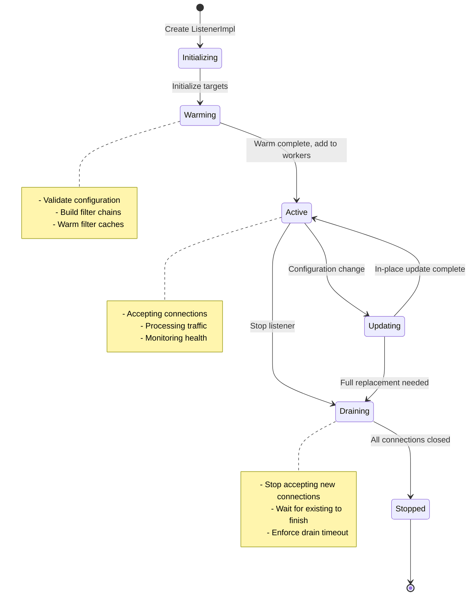
```mermaid
stateDiagram-v2
    [*] --> Initializing: Create ListenerImpl
    Initializing --> Warming: Initialize targets
    Warming --> Active: Warm complete, add to workers

    Active --> Draining: Stop listener
    Active --> Updating: Configuration change

    Updating --> Active: In-place update complete
    Updating --> Draining: Full replacement needed

    Draining --> Stopped: All connections closed
    Stopped --> [*]

    note right of Warming
        - Validate configuration
        - Build filter chains
        - Warm filter caches
    end note

    note right of Active
        - Accepting connections
        - Processing traffic
        - Monitoring health
    end note

    note right of Draining
        - Stop accepting new connections
        - Wait for existing to finish
        - Enforce drain timeout
    end note
```

## Worker Thread Model

### Thread Architecture

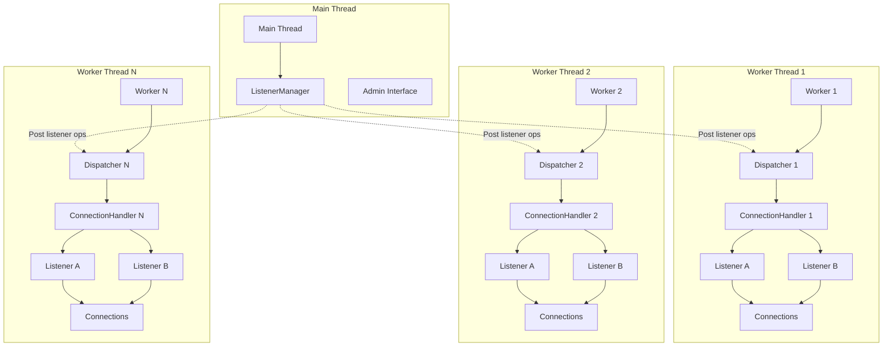
```mermaid
graph TB
    subgraph "Main Thread"
        Main[Main Thread]
        LM[ListenerManager]
        Admin[Admin Interface]
    end

    subgraph "Worker Thread 1"
        W1[Worker 1]
        D1[Dispatcher 1]
        CH1[ConnectionHandler 1]
        L1A[Listener A]
        L1B[Listener B]
        C1[Connections]
    end

    subgraph "Worker Thread 2"
        W2[Worker 2]
        D2[Dispatcher 2]
        CH2[ConnectionHandler 2]
        L2A[Listener A]
        L2B[Listener B]
        C2[Connections]
    end

    subgraph "Worker Thread N"
        WN[Worker N]
        DN[Dispatcher N]
        CHN[ConnectionHandler N]
        LNA[Listener A]
        LNB[Listener B]
        CN[Connections]
    end

    Main --> LM
    LM -.->|Post listener ops| D1
    LM -.->|Post listener ops| D2
    LM -.->|Post listener ops| DN

    W1 --> D1
    D1 --> CH1
    CH1 --> L1A
    CH1 --> L1B
    L1A --> C1
    L1B --> C1

    W2 --> D2
    D2 --> CH2
    CH2 --> L2A
    CH2 --> L2B
    L2A --> C2
    L2B --> C2

    WN --> DN
    DN --> CHN
    CHN --> LNA
    CHN --> LNB
    LNA --> CN
    LNB --> CN
```

### Worker Coordination

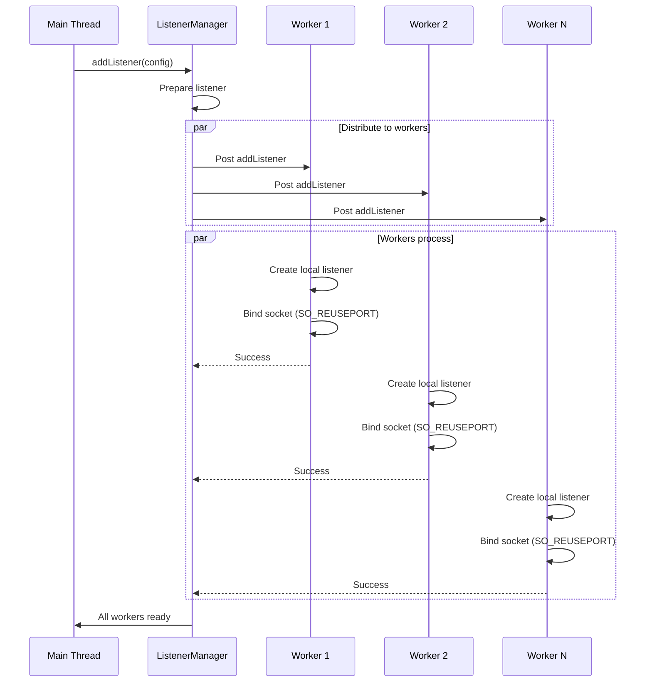
```mermaid
sequenceDiagram
    participant Main as Main Thread
    participant LM as ListenerManager
    participant W1 as Worker 1
    participant W2 as Worker 2
    participant WN as Worker N

    Main->>LM: addListener(config)
    LM->>LM: Prepare listener

    par Distribute to workers
        LM->>W1: Post addListener
        LM->>W2: Post addListener
        LM->>WN: Post addListener
    end

    par Workers process
        W1->>W1: Create local listener
        W1->>W1: Bind socket (SO_REUSEPORT)
        W1-->>LM: Success

        W2->>W2: Create local listener
        W2->>W2: Bind socket (SO_REUSEPORT)
        W2-->>LM: Success

        WN->>WN: Create local listener
        WN->>WN: Bind socket (SO_REUSEPORT)
        WN-->>LM: Success
    end

    LM->>Main: All workers ready
```

### SO_REUSEPORT Behavior

With `SO_REUSEPORT`, each worker thread can bind to the same address/port, and the kernel distributes incoming connections across all listening sockets:

```cpp
// Each worker creates its own listener
void Worker::addListener(Network::ListenerConfig& config) {
  auto socket = socket_factory.createListenSocket(
      config.listenSocketOptions(),
      config.bindToPort(),
      config.socketType(),
      // SO_REUSEPORT allows multiple bind() to same address
      {Network::Socket::SocketOption::ReusePort});

  // Each worker has its own accept() loop
  auto listener = std::make_unique<ActiveTcpListener>(
      config, *this, parent_, std::move(socket), ...);
}
```

## Load Balancing

### Connection Balancing Strategies

Envoy supports multiple connection balancing strategies to distribute connections across workers:

#### 1. Exact Balance

Attempts to keep connection counts exactly equal across workers:

```cpp
class ExactConnectionBalancerImpl : public ConnectionBalancer {
  absl::optional<uint64_t> pickTargetHandler(ConnectionSocket& socket) override {
    // Find worker with minimum connections
    uint64_t min_connections = UINT64_MAX;
    uint64_t target_worker = 0;

    for (uint64_t i = 0; i < num_workers_; ++i) {
      uint64_t worker_connections = workers_[i]->numConnections();
      if (worker_connections < min_connections) {
        min_connections = worker_connections;
        target_worker = i;
      }
    }

    // If current worker has minimum, use it
    if (target_worker == current_worker_index_) {
      return absl::nullopt;  // Process locally
    }

    return target_worker;  // Hand off to target worker
  }
};
```

#### 2. No Balance (SO_REUSEPORT)

Let the kernel distribute connections (default on Linux):

```cpp
class NoConnectionBalancerImpl : public ConnectionBalancer {
  absl::optional<uint64_t> pickTargetHandler(ConnectionSocket&) override {
    // Always process on current worker
    return absl::nullopt;
  }
};
```

### Connection Balancing Flow

```mermaid
sequenceDiagram
    participant K as Kernel
    participant W1 as Worker 1 (4 conns)
    participant CB as ConnectionBalancer
    participant W2 as Worker 2 (2 conns)
    participant D2 as Dispatcher 2

    K->>W1: New connection (via epoll)
    W1->>CB: pickTargetHandler(socket)
    CB->>CB: Count connections per worker
    CB->>CB: Worker 1: 4, Worker 2: 2

    alt Use exact balancing
        CB-->>W1: Target worker 2
        W1->>W2: post(socket)
        W2->>D2: Schedule on dispatcher
        D2->>W2: Process connection
        Note over W2: Now has 3 connections
    else Use SO_REUSEPORT
        CB-->>W1: nullopt (process locally)
        W1->>W1: Process connection
        Note over W1: Now has 5 connections
    end
```

### Configuration Example

```yaml
listeners:
- name: listener_with_balancing
  address:
    socket_address:
      address: 0.0.0.0
      port_value: 8080

  connection_balance_config:
    # Option 1: Exact balance (hand off to least-loaded worker)
    exact_balance: {}

    # Option 2: No balance (use SO_REUSEPORT kernel distribution)
    # This is the default on Linux
```

## Configuration

### Complete Listener Configuration

```yaml
static_resources:
  listeners:
  - name: main_https_listener
    address:
      socket_address:
        address: 0.0.0.0
        port_value: 443

    # Listener metadata for filtering/identification
    metadata:
      filter_metadata:
        envoy.lb:
          cluster: frontend

    # Traffic direction (INBOUND, OUTBOUND, UNSPECIFIED)
    traffic_direction: INBOUND

    # Bypass overload manager for critical listeners
    ignore_global_conn_limit: false

    # Per-connection buffer limits
    per_connection_buffer_limit_bytes: 1048576  # 1MB

    # Listener filters timeout (e.g., for TLS SNI extraction)
    listener_filters_timeout: 5s
    continue_on_listener_filters_timeout: false

    # Listener filters (run before network filters)
    listener_filters:
    - name: envoy.filters.listener.tls_inspector
      typed_config:
        "@type": type.googleapis.com/envoy.extensions.filters.listener.tls_inspector.v3.TlsInspector

    - name: envoy.filters.listener.http_inspector
      typed_config:
        "@type": type.googleapis.com/envoy.extensions.filters.listener.http_inspector.v3.HttpInspector

    # Socket options
    socket_options:
    - description: "Enable TCP keep-alive"
      level: 1  # SOL_SOCKET
      name: 9   # SO_KEEPALIVE
      int_value: 1
      state: STATE_LISTENING

    - description: "TCP keep-alive time"
      level: 6  # IPPROTO_TCP
      name: 4   # TCP_KEEPIDLE
      int_value: 60
      state: STATE_LISTENING

    # Connection balancing
    connection_balance_config:
      exact_balance: {}

    # TCP backlog size
    tcp_backlog_size: 1024

    # Max connections to accept per event loop iteration
    max_connections_to_accept_per_socket_event: 1

    # Filter chains with matching
    filter_chains:

    # HTTPS with HTTP/2 for example.com
    - filter_chain_match:
        server_names: ["example.com", "*.example.com"]
        transport_protocol: "tls"
        application_protocols: ["h2"]
        source_type: ANY
        source_prefix_ranges:
        - address_prefix: 10.0.0.0
          prefix_len: 8

      filters:
      - name: envoy.filters.network.http_connection_manager
        typed_config:
          "@type": type.googleapis.com/envoy.extensions.filters.network.http_connection_manager.v3.HttpConnectionManager
          stat_prefix: ingress_https_h2
          codec_type: AUTO
          route_config:
            name: local_route
            virtual_hosts:
            - name: backend
              domains: ["*"]
              routes:
              - match: { prefix: "/" }
                route: { cluster: backend_cluster }
          http_filters:
          - name: envoy.filters.http.router
            typed_config:
              "@type": type.googleapis.com/envoy.extensions.filters.http.router.v3.Router

      transport_socket:
        name: envoy.transport_sockets.tls
        typed_config:
          "@type": type.googleapis.com/envoy.extensions.transport_sockets.tls.v3.DownstreamTlsContext
          common_tls_context:
            tls_certificates:
            - certificate_chain: { filename: "/etc/certs/example.com.crt" }
              private_key: { filename: "/etc/certs/example.com.key" }
            alpn_protocols: ["h2", "http/1.1"]

    # HTTP/1.1 fallback
    - filter_chain_match:
        transport_protocol: "tls"
        application_protocols: ["http/1.1"]

      filters:
      - name: envoy.filters.network.http_connection_manager
        typed_config:
          "@type": type.googleapis.com/envoy.extensions.filters.network.http_connection_manager.v3.HttpConnectionManager
          stat_prefix: ingress_https_h1
          codec_type: AUTO
          route_config:
            name: local_route
            virtual_hosts:
            - name: backend
              domains: ["*"]
              routes:
              - match: { prefix: "/" }
                route: { cluster: backend_cluster }
          http_filters:
          - name: envoy.filters.http.router

      transport_socket:
        name: envoy.transport_sockets.tls
        typed_config:
          "@type": type.googleapis.com/envoy.extensions.transport_sockets.tls.v3.DownstreamTlsContext
          common_tls_context:
            tls_certificates:
            - certificate_chain: { filename: "/etc/certs/default.crt" }
              private_key: { filename: "/etc/certs/default.key" }

    # Default catch-all (non-TLS traffic)
    - filters:
      - name: envoy.filters.network.tcp_proxy
        typed_config:
          "@type": type.googleapis.com/envoy.extensions.filters.network.tcp_proxy.v3.TcpProxy
          stat_prefix: ingress_tcp
          cluster: backend_cluster

    # Access logs
    access_log:
    - name: envoy.access_loggers.file
      typed_config:
        "@type": type.googleapis.com/envoy.extensions.access_loggers.file.v3.FileAccessLog
        path: /var/log/envoy/access.log
        format: "[%START_TIME%] \"%REQ(:METHOD)% %REQ(X-ENVOY-ORIGINAL-PATH?:PATH)% %PROTOCOL%\" %RESPONSE_CODE% %RESPONSE_FLAGS% %BYTES_RECEIVED% %BYTES_SENT% %DURATION% %RESP(X-REQUEST-ID)% \"%REQ(USER-AGENT)%\"\n"

    # Drain type
    drain_type: DEFAULT
```

### Dynamic Listener Configuration (LDS)

```yaml
# Listener Discovery Service configuration
dynamic_resources:
  lds_config:
    resource_api_version: V3
    api_config_source:
      api_type: GRPC
      transport_api_version: V3
      grpc_services:
      - envoy_grpc:
          cluster_name: xds_cluster
      set_node_on_first_message_only: true
```

## Testing and Debugging

### Unit Testing Listeners

```cpp
#include "test/mocks/network/mocks.h"
#include "test/mocks/server/mocks.h"
#include "source/common/listener_manager/listener_impl.h"

class ListenerImplTest : public testing::Test {
protected:
  void SetUp() override {
    // Mock server components
    server_ = std::make_unique<NiceMock<Server::MockInstance>>();
    listener_manager_ = std::make_unique<NiceMock<Server::MockListenerManager>>();

    // Create test listener config
    listener_config_ = parseListenerFromV3Yaml(R"EOF(
      name: test_listener
      address:
        socket_address:
          address: 127.0.0.1
          port_value: 1234
      filter_chains:
      - filters:
        - name: envoy.filters.network.tcp_proxy
          typed_config:
            "@type": type.googleapis.com/envoy.extensions.filters.network.tcp_proxy.v3.TcpProxy
            stat_prefix: test
            cluster: test_cluster
    )EOF");
  }

  std::unique_ptr<Server::MockInstance> server_;
  std::unique_ptr<Server::MockListenerManager> listener_manager_;
  envoy::config::listener::v3::Listener listener_config_;
};

TEST_F(ListenerImplTest, CreatesFilterChainManager) {
  auto listener = std::make_unique<ListenerImpl>(
      listener_config_,
      "version1",
      *listener_manager_,
      "test_listener",
      false,  // added_via_api
      false,  // workers_started
      0,      // hash
      validation_context_);

  EXPECT_NE(nullptr, &listener->filterChainManager());
  EXPECT_EQ("test_listener", listener->name());
}

TEST_F(ListenerImplTest, BuildsNetworkFilters) {
  // Test that network filters are properly instantiated
  auto listener = // ... create listener

  NiceMock<Network::MockConnection> connection;
  EXPECT_TRUE(listener->createNetworkFilterChain(
      connection,
      listener->filterChainManager().filterChainFactories()));
}
```

### Integration Testing

```cpp
class ListenerIntegrationTest : public BaseIntegrationTest {
public:
  void SetUp() override {
    config_helper_.addConfigModifier([](envoy::config::bootstrap::v3::Bootstrap& bootstrap) {
      auto* listener = bootstrap.mutable_static_resources()->mutable_listeners(0);
      listener->set_name("test_listener");

      // Add TLS inspector listener filter
      auto* listener_filter = listener->add_listener_filters();
      listener_filter->set_name("envoy.filters.listener.tls_inspector");

      // Add filter chain with SNI matching
      auto* filter_chain = listener->add_filter_chains();
      auto* match = filter_chain->mutable_filter_chain_match();
      match->add_server_names("test.example.com");
    });

    BaseIntegrationTest::initialize();
  }
};

TEST_F(ListenerIntegrationTest, SNIRouting) {
  // Connect with SNI
  auto conn = makeSslClientConnection(
      lookupPort("test_listener"),
      "test.example.com",  // SNI hostname
      alpn_);

  // Send request
  auto response = conn->makeRequest(default_request_headers_);

  // Verify correct filter chain was used
  EXPECT_EQ("200", response->headers().Status()->value().getStringView());
}
```

### Debugging Tips

#### 1. Enable Debug Logging

```cpp
// In your Envoy config
admin:
  address:
    socket_address:
      address: 127.0.0.1
      port_value: 9901

// Change log level at runtime
curl -X POST http://localhost:9901/logging?level=debug
curl -X POST http://localhost:9901/logging?conn_handler=trace
```

#### 2. Inspect Active Listeners

```bash
# List all listeners
curl http://localhost:9901/listeners

# Get detailed listener info
curl http://localhost:9901/listeners?format=json | jq .

# Check listener stats
curl http://localhost:9901/stats | grep listener
```

#### 3. Monitor Connection Counts

```bash
# Overall connections
curl http://localhost:9901/stats | grep "^listener_manager.total_listeners_active"

# Per-listener connections
curl http://localhost:9901/stats | grep "listener.*downstream_cx_active"

# Worker distribution
curl http://localhost:9901/stats | grep "^worker_"
```

#### 4. Trace Filter Chain Matching

```cpp
// Add custom logging in filter chain matching
ENVOY_CONN_LOG(debug, "Attempting filter chain match: SNI={}, ALPN={}, SourceIP={}",
              connection, sni, alpn, source_address);

ENVOY_CONN_LOG(debug, "Selected filter chain: {}",
              connection, filter_chain->name());
```

#### 5. GDB Debugging

```bash
# Attach to running Envoy
gdb -p $(pgrep envoy)

# Set breakpoints
(gdb) break ActiveTcpListener::onAccept
(gdb) break FilterChainManagerImpl::findFilterChain

# Print connection info
(gdb) print socket->connectionInfoProvider()->remoteAddress()->asString()
(gdb) print socket->requestedServerName()

# Continue execution
(gdb) continue
```

### Common Issues and Solutions

#### Issue 1: Connection Rejected - No Matching Filter Chain

**Symptom**: Connections are immediately closed with no data transfer

**Debug**:
```bash
# Check for filter chain match failures
curl http://localhost:9901/stats | grep "no_filter_chain_match"
```

**Solution**: Verify filter chain match criteria:
- Check SNI if using TLS
- Verify ALPN protocols match
- Ensure source IP ranges are correct
- Add a default filter chain as catch-all

#### Issue 2: Listener Fails to Bind

**Symptom**: Error message "Address already in use"

**Debug**:
```bash
# Check what's using the port
lsof -i :8080
netstat -an | grep 8080
```

**Solution**:
- Ensure no other process is using the port
- Check that `bind_to_port: true` is set correctly
- Verify SO_REUSEPORT is enabled if multiple workers
- Check file descriptor limits: `ulimit -n`

#### Issue 3: Listener Filters Timeout

**Symptom**: Connections drop after listener_filters_timeout

**Debug**:
```bash
# Check timeout stats
curl http://localhost:9901/stats | grep "listener_filters_timeout"

# Enable trace logging
curl -X POST http://localhost:9901/logging?listener=trace
```

**Solution**:
- Increase `listener_filters_timeout`
- Set `continue_on_listener_filters_timeout: true` to proceed anyway
- Check if TLS Inspector or HTTP Inspector is hanging
- Verify client is sending proper TLS ClientHello or HTTP headers

#### Issue 4: Uneven Connection Distribution

**Symptom**: Some workers have many more connections than others

**Debug**:
```bash
# Check per-worker connection counts
curl http://localhost:9901/stats | grep "worker_.*connections"
```

**Solution**:
- Enable exact connection balancing:
  ```yaml
  connection_balance_config:
    exact_balance: {}
  ```
- Verify SO_REUSEPORT is working (Linux 3.9+)
- Check for connection pinning (e.g., HTTP/2 multiplexing)

### Performance Tuning

#### Socket Buffer Sizes

```yaml
listeners:
- name: high_throughput
  socket_options:
  # Increase receive buffer
  - level: 1  # SOL_SOCKET
    name: 8   # SO_RCVBUF
    int_value: 2097152  # 2MB
    state: STATE_LISTENING

  # Increase send buffer
  - level: 1  # SOL_SOCKET
    name: 7   # SO_SNDBUF
    int_value: 2097152  # 2MB
    state: STATE_LISTENING
```

#### TCP Backlog

```yaml
listeners:
- name: high_connection_rate
  # Increase backlog for high connection rates
  tcp_backlog_size: 4096
```

#### Connection Limits

```yaml
listeners:
- name: protected_listener
  # Limit per-listener connections
  connection_balance_config:
    exact_balance: {}

  # Don't count against global limit for critical listeners
  ignore_global_conn_limit: true

# Global limits
overload_manager:
  resource_monitors:
  - name: envoy.resource_monitors.fixed_heap
    typed_config:
      "@type": type.googleapis.com/envoy.extensions.resource_monitors.fixed_heap.v3.FixedHeapConfig
      max_heap_size_bytes: 2147483648  # 2GB

  actions:
  - name: envoy.overload_actions.stop_accepting_connections
    triggers:
    - name: envoy.resource_monitors.fixed_heap
      threshold:
        value: 0.95
```

## Summary

The Listener Manager is a sophisticated system that:

1. **Manages Listener Lifecycle**: Creates, updates, and destroys listeners based on dynamic configuration
2. **Distributes Load**: Spreads listeners and connections across worker threads for parallel processing
3. **Matches Filter Chains**: Selects appropriate filter chains based on connection properties (SNI, ALPN, source IP)
4. **Handles Connection Acceptance**: Processes listener filters before routing to network filters
5. **Supports Hot Reload**: Allows zero-downtime configuration updates through graceful draining

### Key Classes Summary

| Class | Responsibility |
|-------|---------------|
| `ListenerInfoImpl` | Stores listener metadata (direction, QUIC flag, overload bypass) |
| `FilterChainFactoryContextCreator` | Creates contexts for building filter chains |
| `ActiveStreamListenerBase` | Base class for stream listeners, manages connection lifecycle |
| `ConnectionHandlerImpl` | Per-worker listener management and connection counting |
| `ListenerImpl` | Main listener config implementation, creates filter chains |
| `ActiveTcpListener` | TCP connection acceptance with load balancing |
| `ListenerManagerImpl` | Top-level coordinator for all listener operations |

### Data Flow

```
Configuration (LDS)
    ↓
ListenerManagerImpl (validates, creates listeners)
    ↓
ListenerImpl (stores config, builds filter chains)
    ↓
Worker Threads (distributes listeners)
    ↓
ConnectionHandlerImpl (manages per-worker listeners)
    ↓
ActiveTcpListener (accepts connections, balances load)
    ↓
ActiveStreamListenerBase (runs listener filters)
    ↓
Filter Chain Matching (SNI, ALPN, IP matching)
    ↓
Active Connection (processes application data)
```

This architecture provides a flexible, performant, and maintainable foundation for Envoy's network proxy capabilities.
