# Listener Manager — Overview Part 1: Architecture & ListenerManager

**Directory:** `source/common/listener_manager/`  
**Part:** 1 of 4 — Overall Architecture, ListenerManagerImpl, Worker Dispatch, Listener Lifecycle

---

## Table of Contents

1. [High-Level Architecture](#1-high-level-architecture)
2. [Component Map](#2-component-map)
3. [End-to-End Flow: Config to Connection](#3-end-to-end-flow-config-to-connection)
4. [ListenerManagerImpl](#4-listermanagerimpl)
5. [Listener Lifecycle States](#5-listener-lifecycle-states)
6. [Worker Dispatch](#6-worker-dispatch)
7. [ListenerImpl — Config to Runtime](#7-listenerimpl--config-to-runtime)
8. [Key Design Patterns](#8-key-design-patterns)

---

## 1. High-Level Architecture

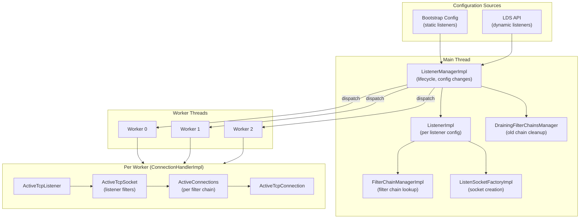

---

## 2. Component Map

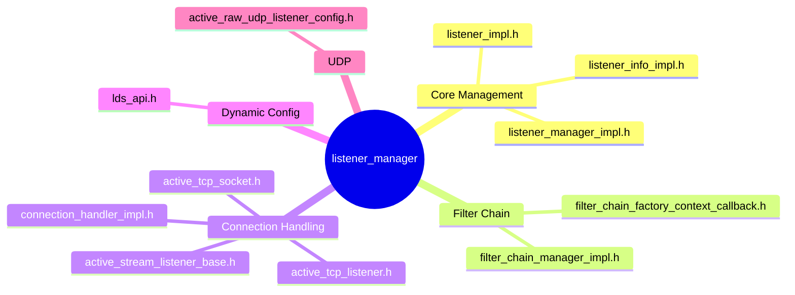

---

## 3. End-to-End Flow: Config to Connection

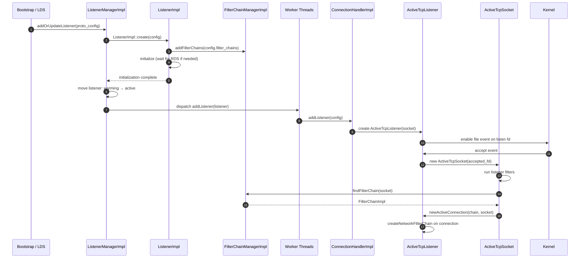

---

## 4. ListenerManagerImpl

### Responsibilities

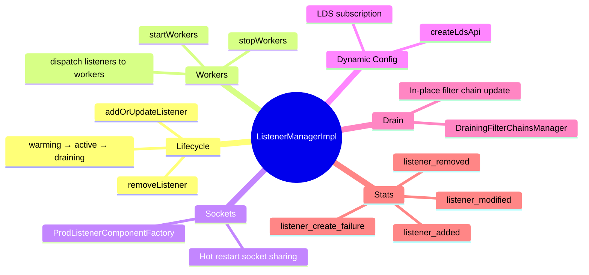

### Add vs Update Decision

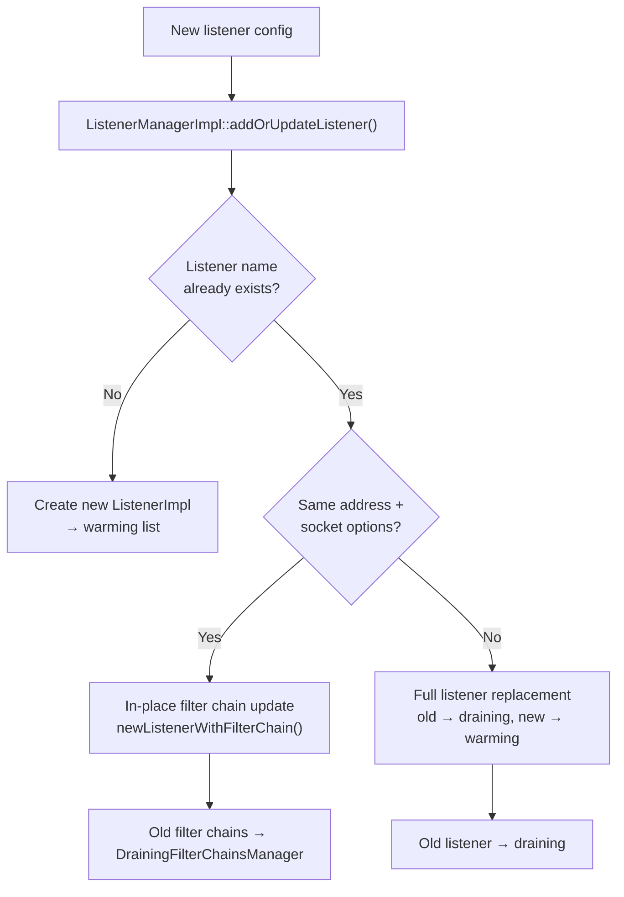

### Stats Generated

| Stat | When |
|------|------|
| `listener_manager.listener_added` | New listener successfully created |
| `listener_manager.listener_modified` | Existing listener updated |
| `listener_manager.listener_removed` | Listener removed |
| `listener_manager.listener_create_success` | Listener config parsed and validated |
| `listener_manager.listener_create_failure` | Listener config failed validation |
| `listener_manager.listener_in_place_updated` | Filter-chain-only update (no socket rebind) |
| `listener_manager.total_listeners_warming` | Gauge: listeners initializing |
| `listener_manager.total_listeners_active` | Gauge: listeners serving |
| `listener_manager.total_listeners_draining` | Gauge: listeners draining |

---

## 5. Listener Lifecycle States

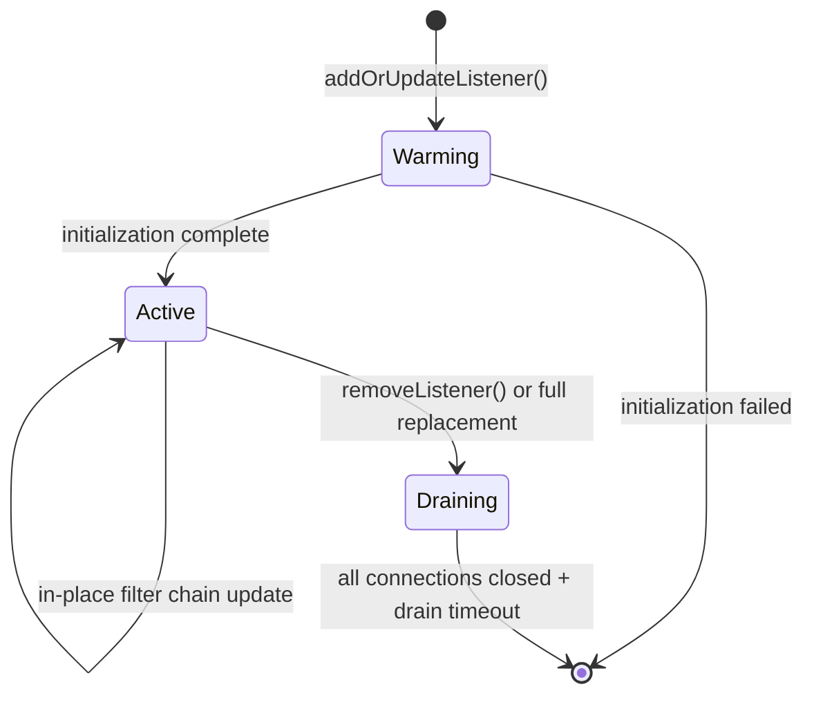

### What Happens in Each State

| State | Accepting? | In Worker? | Description |
|-------|-----------|-----------|-------------|
| **Warming** | No | No | Waiting for initialization (RDS, ECDS, secrets) |
| **Active** | Yes | Yes | Fully operational, accepting connections |
| **Draining** | No | Being removed | No new connections; existing connections finish |

---

## 6. Worker Dispatch

### Adding a Listener to Workers

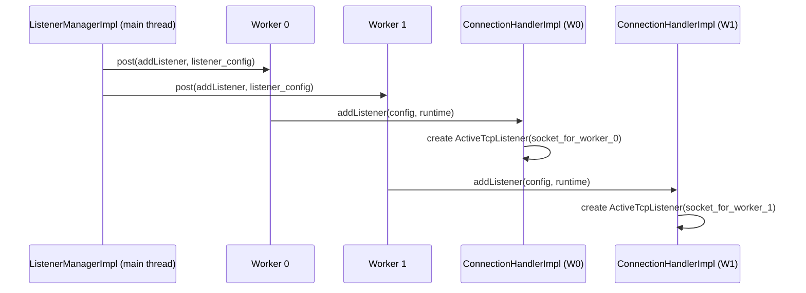

### `SO_REUSEPORT` — Per-Worker Sockets

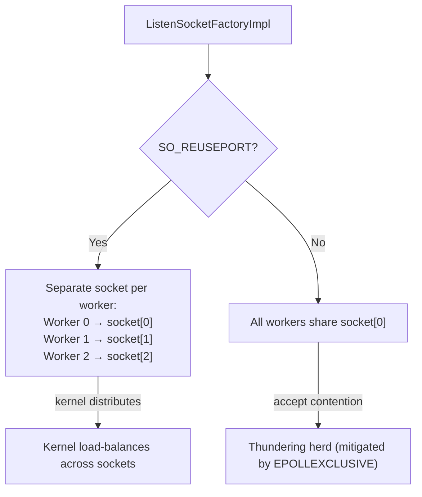

---

## 7. ListenerImpl — Config to Runtime

### What ListenerImpl Owns

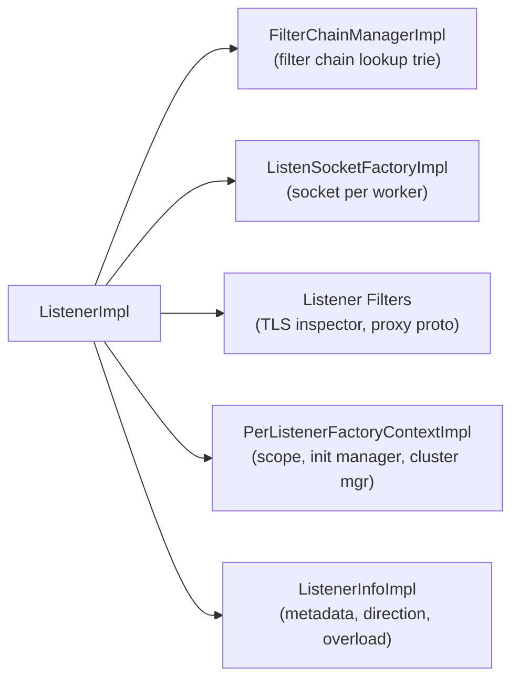

### `ListenerMessageUtil` — Config Comparison

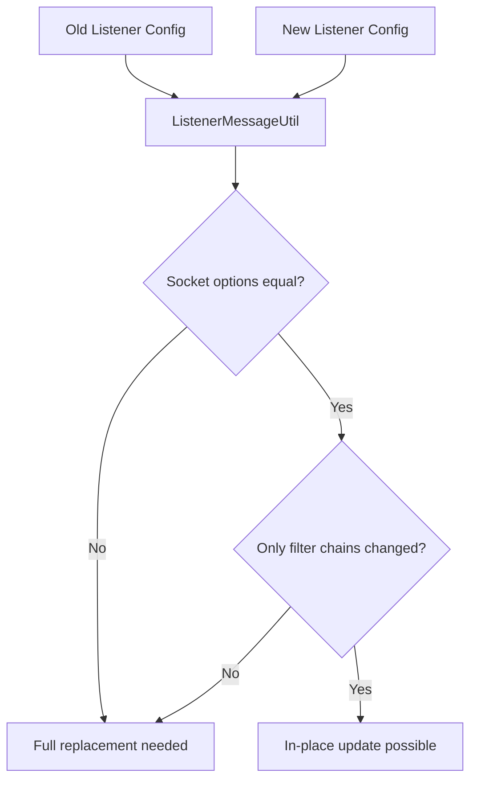

### `ProdListenerComponentFactory` — Hot Restart

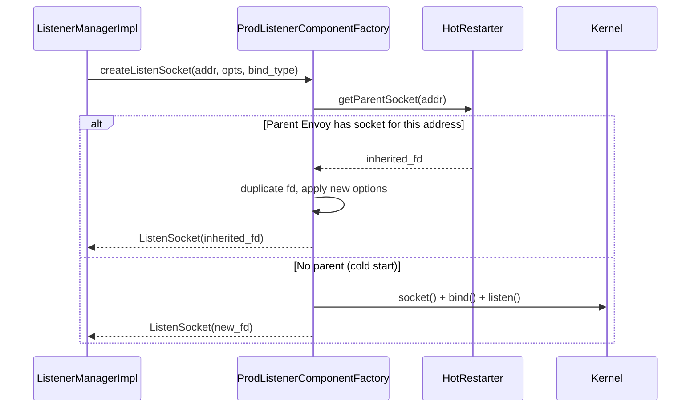

---

## 8. Key Design Patterns

### Pattern 1: Main Thread Owns Config, Workers Own Connections

All config changes flow through the main thread (`ListenerManagerImpl`). Workers are dispatched to asynchronously. This avoids locking on config data.

```mermaid
flowchart LR
    MainThread["Main Thread<br/>(LM, LI, FCM, LDS)"] -->|post()| Worker["Worker Thread<br/>(CH, ATL, ATS, Conn)"]
    Worker -->|stats/drain complete| MainThread
```

### Pattern 2: In-Place Filter Chain Update

When only filter chains change, the listener socket is preserved. Old chains drain in-place while new chains handle new connections:

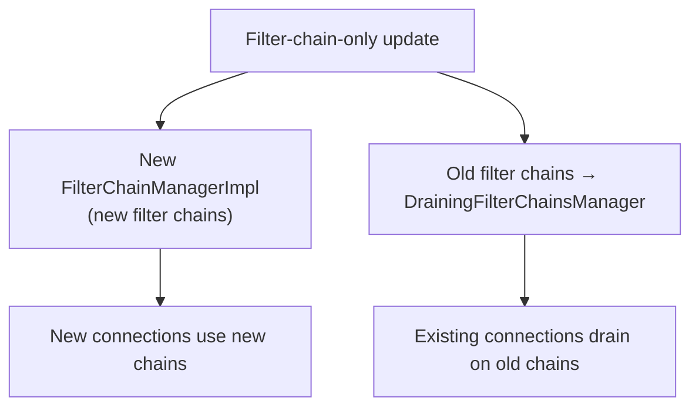

### Pattern 3: Deferred Listener Destruction

Listeners are not destroyed immediately. They are moved to a draining list and destroyed after all connections are closed and a drain timeout expires.

### Pattern 4: Hot Restart Socket Inheritance

During hot restart, the new Envoy process inherits listen sockets from the old process via domain sockets, ensuring zero downtime.

---

## Navigation

| Part | Topics |
|------|--------|
| **Part 1 (this file)** | Architecture, ListenerManagerImpl, Worker Dispatch, Lifecycle |
| [Part 2](OVERVIEW_PART2_filter_chains.md) | Filter Chain Manager, Matching, ListenerImpl Config |
| [Part 3](OVERVIEW_PART3_active_tcp.md) | ActiveTcpListener, ActiveTcpSocket, Listener Filters, Connection Tracking |
| [Part 4](OVERVIEW_PART4_lds_and_advanced.md) | LDS API, UDP, Draining, Internal Listeners, Advanced Topics |
