# Listener Manager — Overview Part 2: Filter Chains & Matching

**Directory:** `source/common/listener_manager/`  
**Part:** 2 of 4 — FilterChainManagerImpl, Matching Trie, FilterChainImpl, Factory Contexts

---

## Table of Contents

1. [Filter Chain System Overview](#1-filter-chain-system-overview)
2. [FilterChainManagerImpl — Matching Engine](#2-filtermanagerimpl--matching-engine)
3. [Matching Criteria Priority](#3-matching-criteria-priority)
4. [Nested Trie Structure](#4-nested-trie-structure)
5. [SNI Matching — Exact and Wildcard](#5-sni-matching--exact-and-wildcard)
6. [FilterChainImpl — Per Chain](#6-filterchainimpl--per-chain)
7. [Factory Contexts](#7-factory-contexts)
8. [Building Filter Chains from Config](#8-building-filter-chains-from-config)
9. [Default Filter Chain](#9-default-filter-chain)
10. [Connection to Filter Chain Selection at Runtime](#10-connection-to-filter-chain-selection-at-runtime)

---

## 1. Filter Chain System Overview

A listener can have multiple filter chains, each with different matching criteria and different network filters. When a connection is accepted, `FilterChainManagerImpl` selects the best-matching chain based on connection metadata (populated by listener filters).

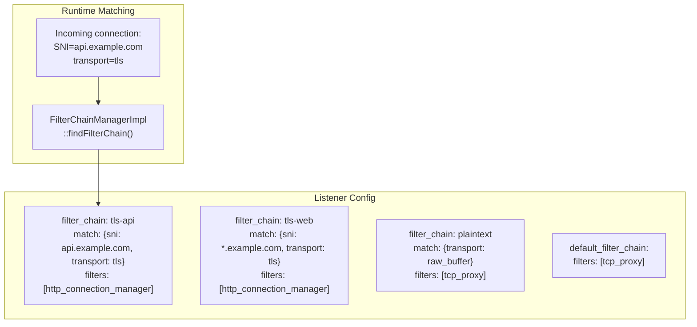

---

## 2. FilterChainManagerImpl — Matching Engine

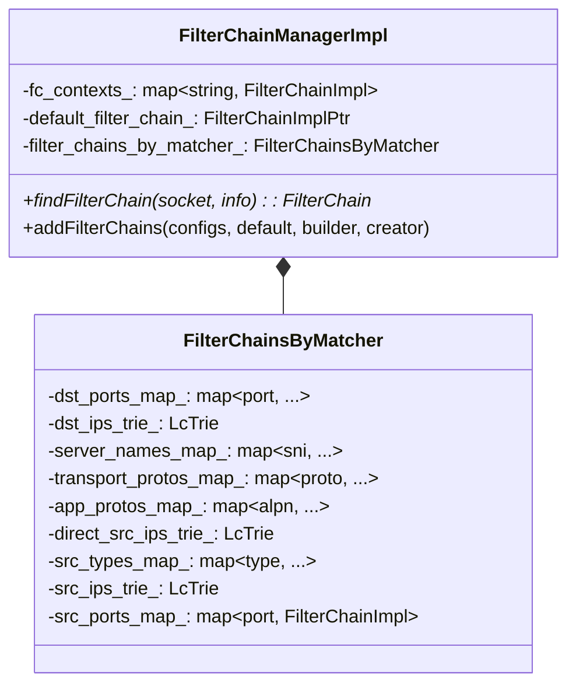

---

## 3. Matching Criteria Priority

Criteria are evaluated in strict order. At each level, the most specific match wins:

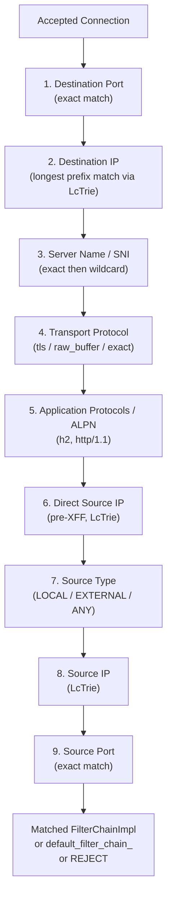

### Matching Priority Reference

| Priority | Field | Match Type | Example |
|----------|-------|-----------|---------|
| 1 | `destination_port` | Exact | `443` |
| 2 | `prefix_ranges` | Longest prefix (LcTrie) | `10.0.0.0/8` |
| 3 | `server_names` | Exact, then wildcard `*.` | `api.example.com` |
| 4 | `transport_protocol` | Exact | `tls` |
| 5 | `application_protocols` | Exact | `h2` |
| 6 | `direct_source_prefix_ranges` | Longest prefix (LcTrie) | `172.16.0.0/12` |
| 7 | `source_type` | Enum | `EXTERNAL` |
| 8 | `source_prefix_ranges` | Longest prefix (LcTrie) | `192.168.0.0/16` |
| 9 | `source_ports` | Exact | `5000` |

---

## 4. Nested Trie Structure

The internal matching structure is a deeply nested map/trie. Each level narrows the candidate set:

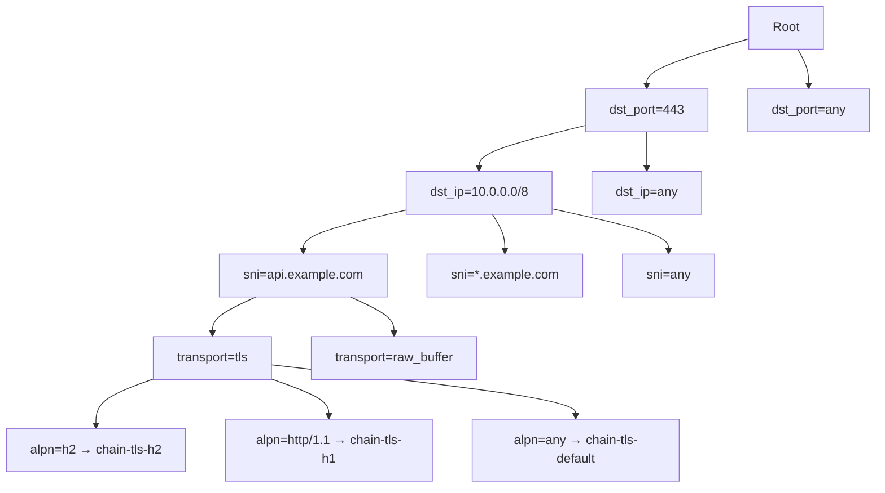

---

## 5. SNI Matching — Exact and Wildcard

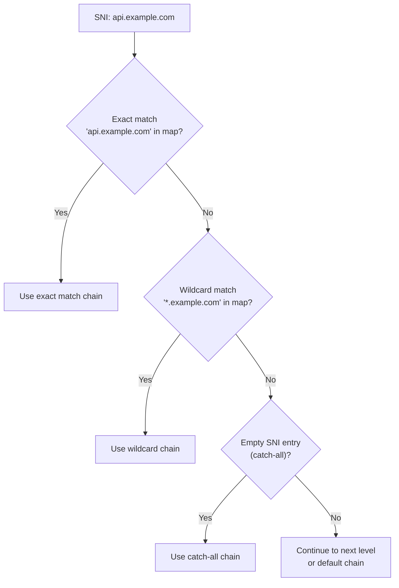

### Wildcard Rules

- Only leading `*.` wildcards are supported: `*.example.com`
- Not supported: `api.*.com`, `api.*`
- Wildcard matches only one domain level: `*.example.com` matches `api.example.com` but NOT `v1.api.example.com`

---

## 6. FilterChainImpl — Per Chain

Each filter chain holds everything needed to construct a connection's transport socket and network filter chain:

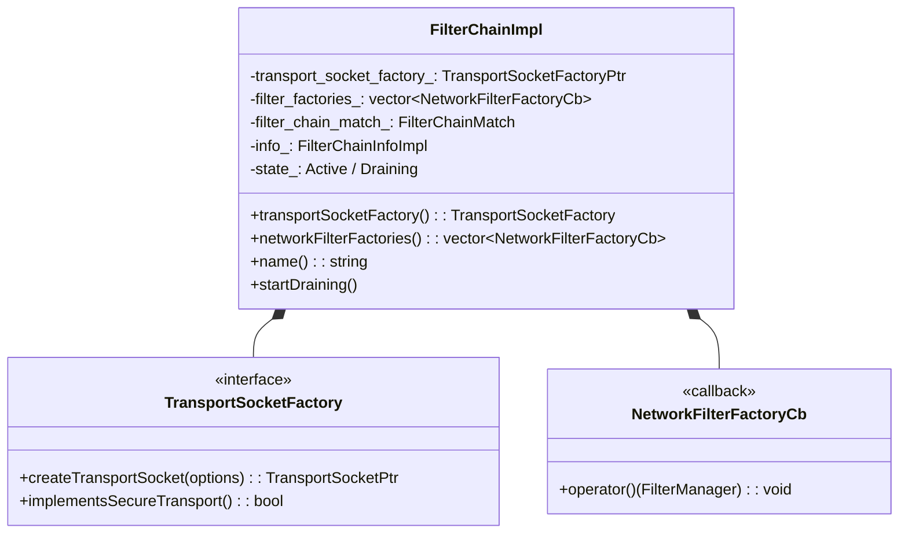

### What a `FilterChainImpl` Contains

| Component | Purpose |
|-----------|---------|
| `transport_socket_factory_` | Creates TLS or raw transport sockets for connections matched to this chain |
| `filter_factories_` | Ordered list of factory callbacks that add network filters to a connection |
| `filter_chain_match_` | The original match criteria proto (for debugging/stats) |
| `info_` | Metadata: name, filter chain info object |
| `state_` | Active or Draining |

---

## 7. Factory Contexts

Factory contexts provide filter factories access to Envoy internals (cluster manager, stats, runtime, etc.):

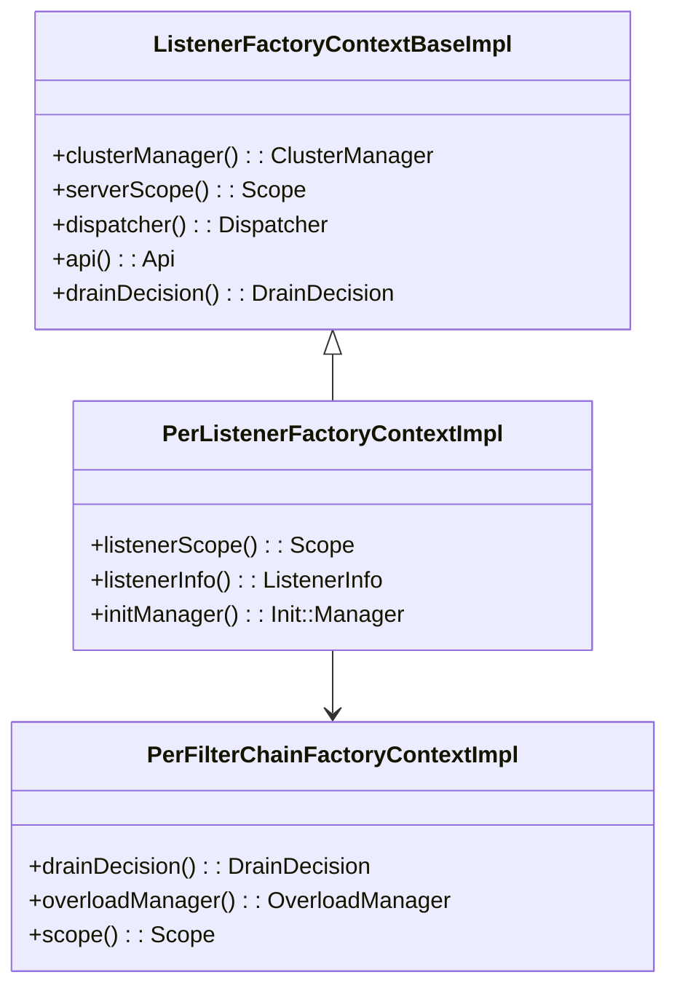

### Context Hierarchy

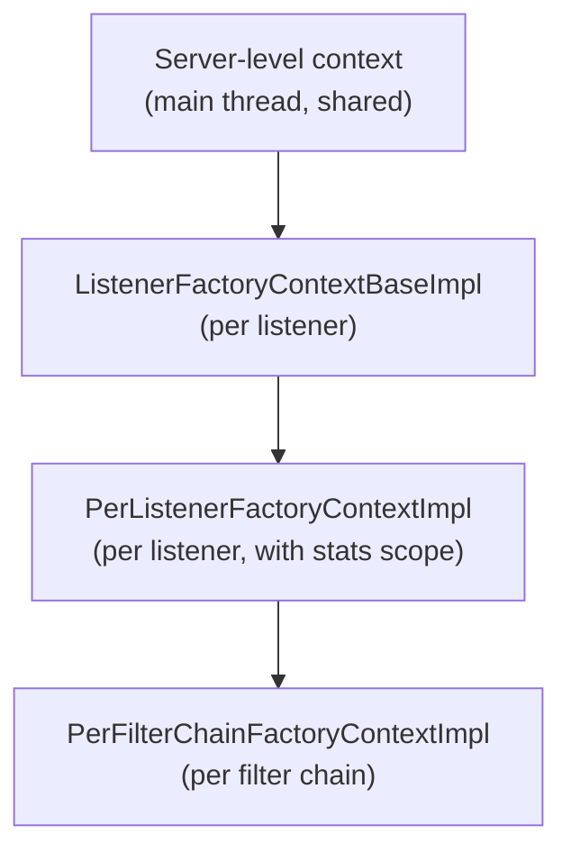

---

## 8. Building Filter Chains from Config

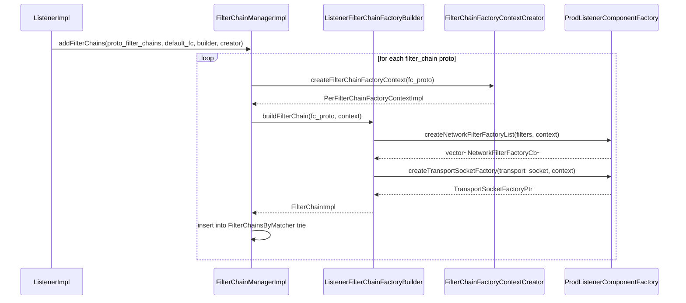

---

## 9. Default Filter Chain

If no `filter_chain_match` matches the incoming connection, the `default_filter_chain` is used (if configured):

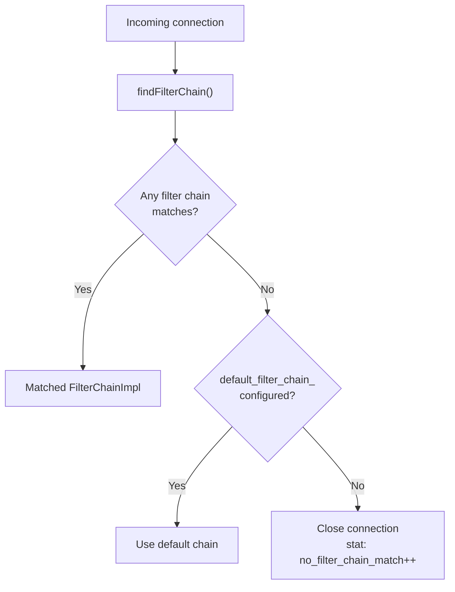

---

## 10. Connection to Filter Chain Selection at Runtime

The full runtime sequence from accepted socket to matched filter chain:

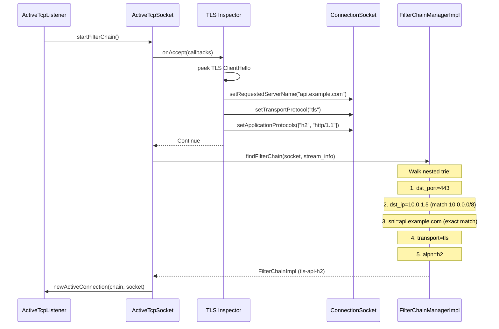

---

## Navigation

| Part | Topics |
|------|--------|
| [Part 1](OVERVIEW_PART1_architecture.md) | Architecture, ListenerManagerImpl, Worker Dispatch, Lifecycle |
| **Part 2 (this file)** | Filter Chain Manager, Matching, ListenerImpl Config |
| [Part 3](OVERVIEW_PART3_active_tcp.md) | ActiveTcpListener, ActiveTcpSocket, Listener Filters, Connection Tracking |
| [Part 4](OVERVIEW_PART4_lds_and_advanced.md) | LDS API, UDP, Draining, Internal Listeners, Advanced Topics |
