# Listener Manager — Overview Part 3: Active TCP & Socket Lifecycle

**Directory:** `source/common/listener_manager/`  
**Part:** 3 of 4 — ActiveTcpListener, ActiveTcpSocket, Listener Filters, Connection Tracking, Connection Balancing

---

## Table of Contents

1. [Active TCP Components](#1-active-tcp-components)
2. [Accept to Connection Flow](#2-accept-to-connection-flow)
3. [ActiveTcpSocket — Listener Filter Chain](#3-activetcpsocket--listener-filter-chain)
4. [Listener Filter Timeout](#4-listener-filter-timeout)
5. [Connection Tracking by Filter Chain](#5-connection-tracking-by-filter-chain)
6. [Connection Balancing Across Workers](#6-connection-balancing-across-workers)
7. [Filter Chain Level Drain](#7-filter-chain-level-drain)
8. [ActiveStreamListenerBase](#8-activestreamlistenerbase)

---

## 1. Active TCP Components

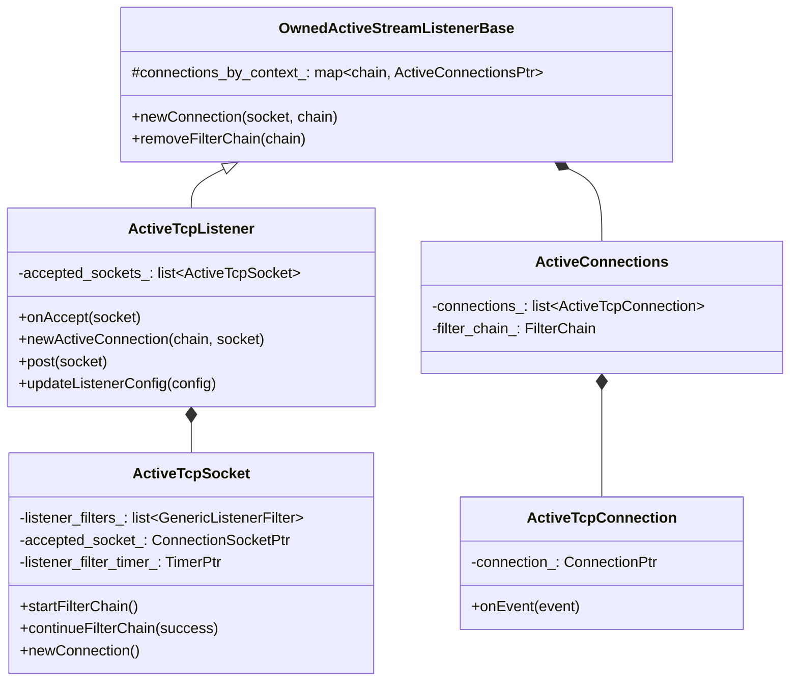

### Data Ownership

```
ActiveTcpListener (1 per listen address, per worker)
  ├── accepted_sockets_: list<ActiveTcpSocket>    (sockets in listener filter phase)
  └── connections_by_context_: map<FilterChain*, ActiveConnections>
        └── connections_: list<ActiveTcpConnection>  (established connections)
              └── connection_: Network::ConnectionPtr
```

---

## 2. Accept to Connection Flow

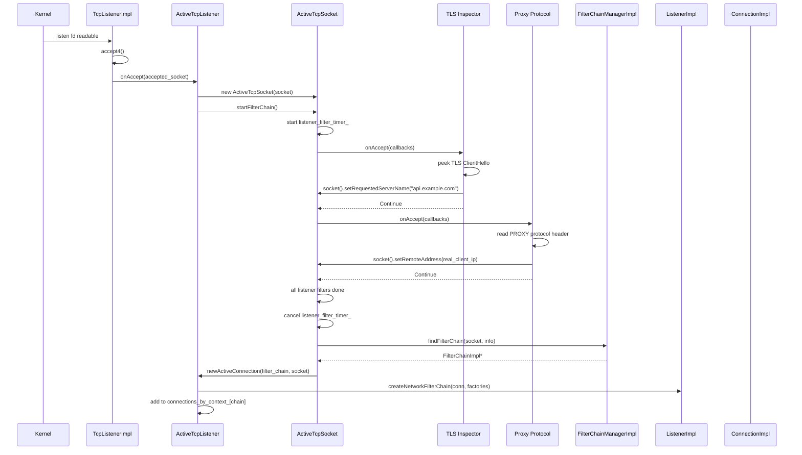

---

## 3. ActiveTcpSocket — Listener Filter Chain

### State Machine

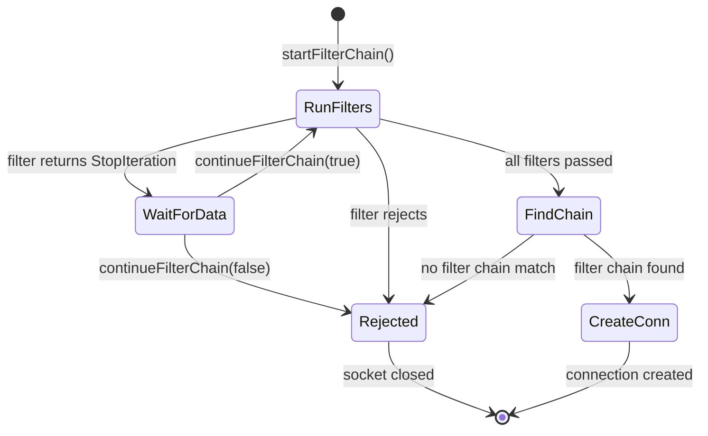

### `GenericListenerFilter` — Matcher + Filter

Each listener filter is wrapped with a predicate matcher. If the predicate doesn't match, the filter is skipped:

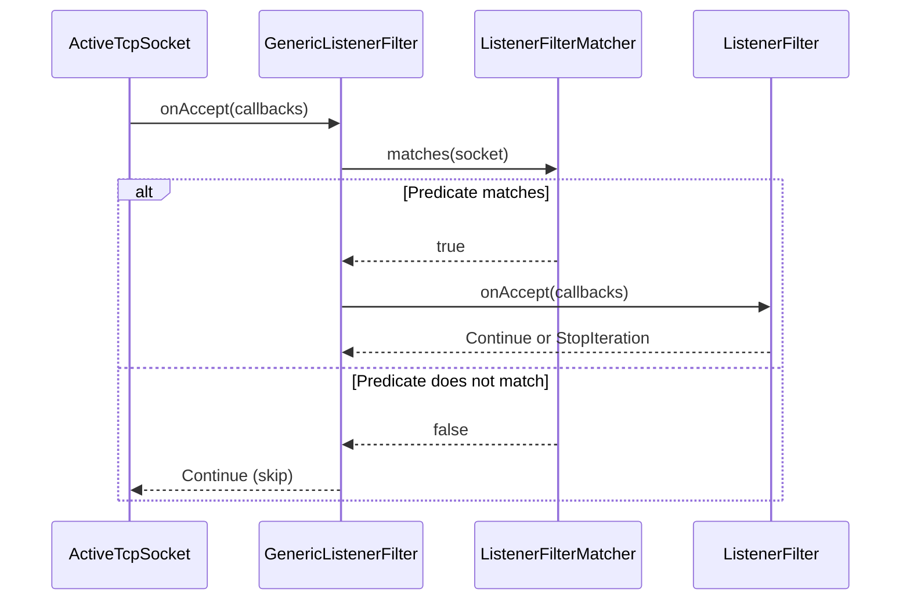

### Socket Metadata Populated by Listener Filters

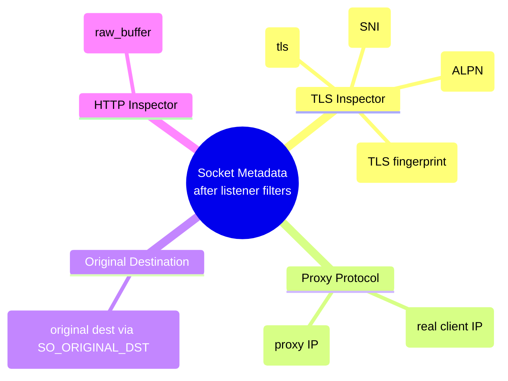

---

## 4. Listener Filter Timeout

Listener filters have a configurable timeout. If filters are still running when the timer fires, the socket is either promoted with partial metadata or rejected:

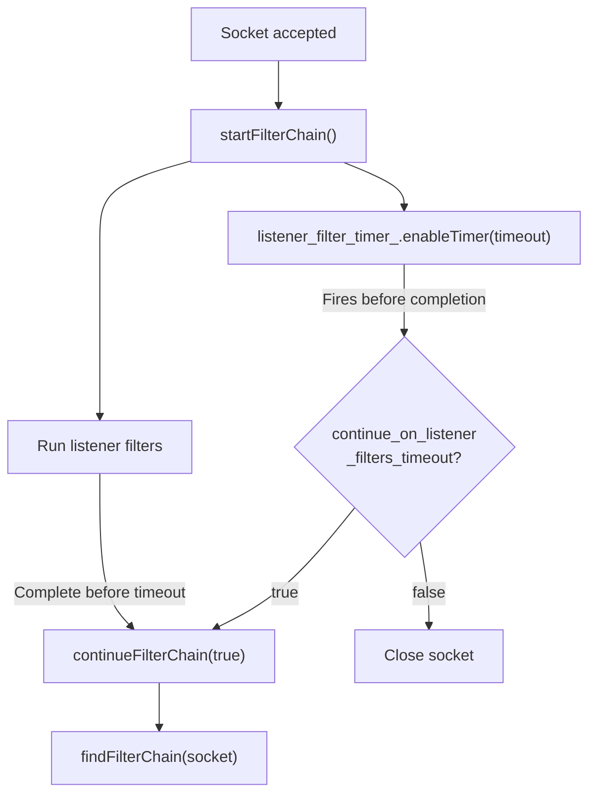

### Config

```yaml
listener:
  listener_filters_timeout: 15s         # max time for listener filters
  continue_on_listener_filters_timeout: true  # promote on timeout
```

---

## 5. Connection Tracking by Filter Chain

Connections are grouped by their matched filter chain. This enables per-chain operations:

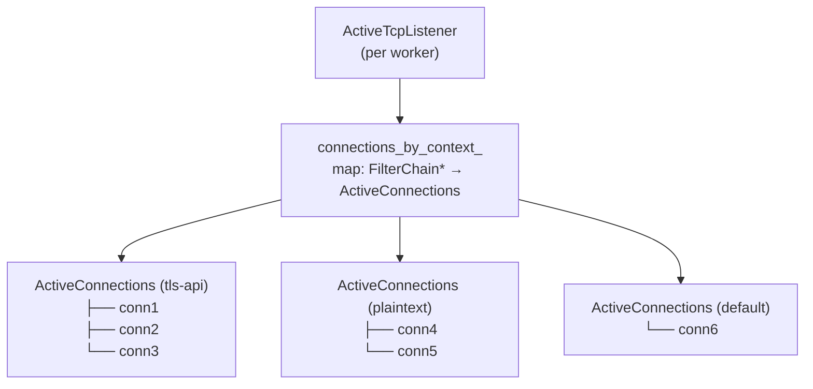

### `ActiveConnections` — Per Filter Chain Group

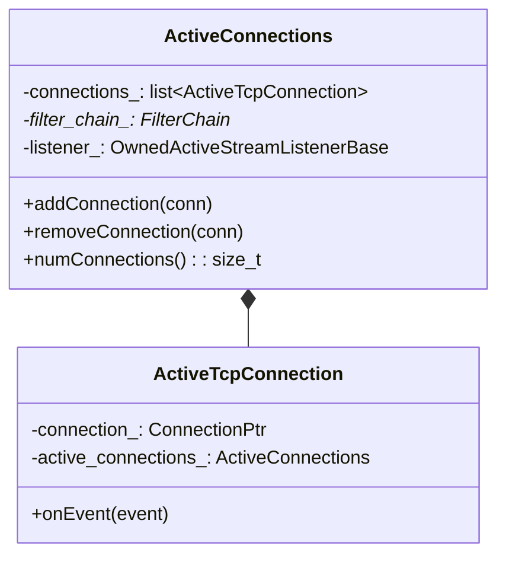

### Connection Close Flow

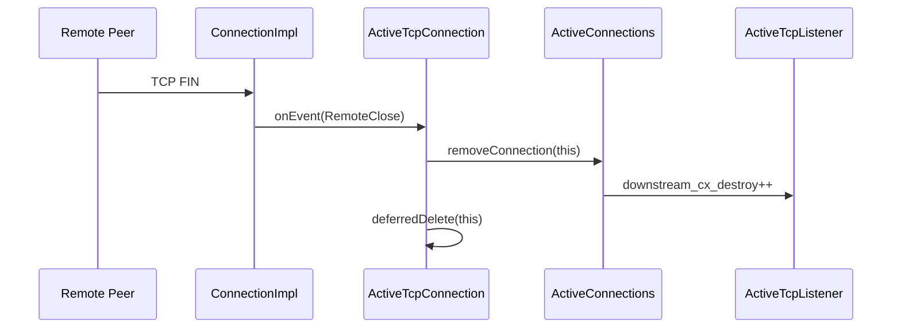

---

## 6. Connection Balancing Across Workers

When a connection balancer is configured, the accepting worker can redirect the socket to a less-loaded worker:

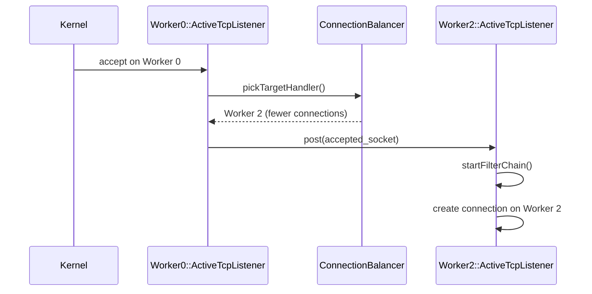

### Balancer Types

| Type | Class | Behavior |
|------|-------|---------|
| None | `NopConnectionBalancerImpl` | Socket stays on accepting worker |
| Exact | `ExactConnectionBalancerImpl` | Route to worker with fewest active connections (uses mutex) |

---

## 7. Filter Chain Level Drain

When a listener update replaces filter chains (in-place update), only connections on the old chains are drained. New connections use new chains:

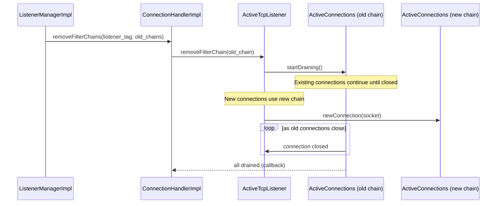

### Drain State Machine (Per Filter Chain)

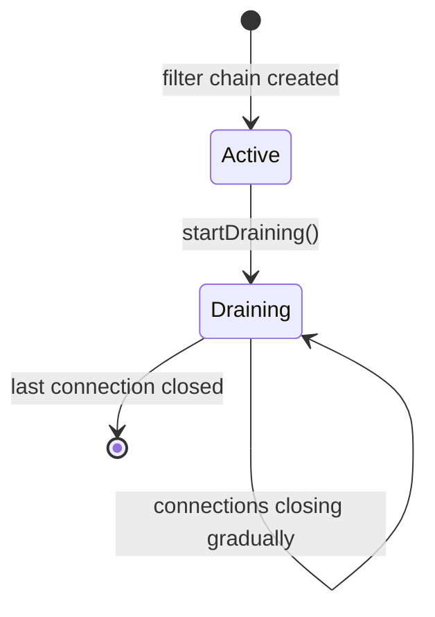

---

## 8. ActiveStreamListenerBase

`ActiveStreamListenerBase` is the shared base for TCP (and potentially QUIC) stream-oriented listeners:

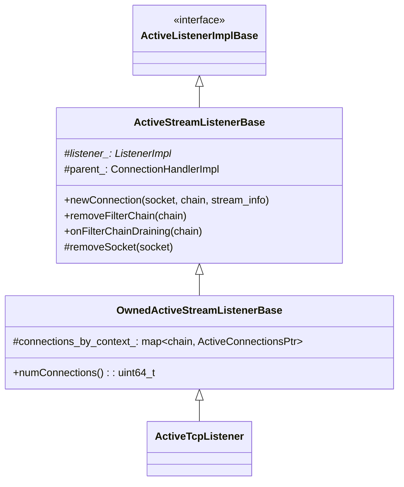

### Key Methods

| Method | Purpose |
|--------|---------|
| `newConnection(socket, chain)` | Create `ConnectionImpl`, apply network filter chain, add to `ActiveConnections` |
| `removeFilterChain(chain)` | Drain connections on a specific chain |
| `onFilterChainDraining(chain)` | Called when all connections on a drained chain are closed |
| `removeSocket(socket)` | Remove an `ActiveTcpSocket` from the pending list |

---

## Navigation

| Part | Topics |
|------|--------|
| [Part 1](OVERVIEW_PART1_architecture.md) | Architecture, ListenerManagerImpl, Worker Dispatch, Lifecycle |
| [Part 2](OVERVIEW_PART2_filter_chains.md) | Filter Chain Manager, Matching, ListenerImpl Config |
| **Part 3 (this file)** | ActiveTcpListener, ActiveTcpSocket, Listener Filters, Connection Tracking |
| [Part 4](OVERVIEW_PART4_lds_and_advanced.md) | LDS API, UDP, Draining, Internal Listeners, Advanced Topics |
