# Listener Manager — Overview Part 4: LDS, UDP, Draining & Advanced Topics

**Directory:** `source/common/listener_manager/`  
**Part:** 4 of 4 — LDS API, UDP Listeners, DrainingFilterChainsManager, Internal Listeners, Hot Restart, Full Interaction Map

---

## Table of Contents

1. [LDS API — Dynamic Listener Configuration](#1-lds-api--dynamic-listener-configuration)
2. [DrainingFilterChainsManager — Graceful Cleanup](#2-drainingfilterchainsmanager--graceful-cleanup)
3. [UDP Listeners](#3-udp-listeners)
4. [Internal Listeners](#4-internal-listeners)
5. [Hot Restart — Socket Inheritance](#5-hot-restart--socket-inheritance)
6. [Listener Configuration Comparison](#6-listener-configuration-comparison)
7. [Full Component Interaction Map](#7-full-component-interaction-map)
8. [Common Troubleshooting Scenarios](#8-common-troubleshooting-scenarios)

---

## 1. LDS API — Dynamic Listener Configuration

`LdsApiImpl` subscribes to listener config from an xDS management server and drives `ListenerManagerImpl` updates.

### LDS Update Flow

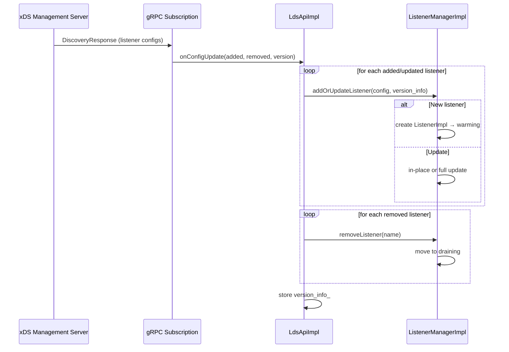
```mermaid
sequenceDiagram
    participant XDS as xDS Management Server
    participant Sub as gRPC Subscription
    participant LDS as LdsApiImpl
    participant LM as ListenerManagerImpl

    XDS->>Sub: DiscoveryResponse (listener configs)
    Sub->>LDS: onConfigUpdate(added, removed, version)

    loop for each added/updated listener
        LDS->>LM: addOrUpdateListener(config, version_info)
        alt New listener
            LM->>LM: create ListenerImpl → warming
        else Update
            LM->>LM: in-place or full update
        end
    end

    loop for each removed listener
        LDS->>LM: removeListener(name)
        LM->>LM: move to draining
    end

    LDS->>LDS: store version_info_
```

### SotW vs Delta

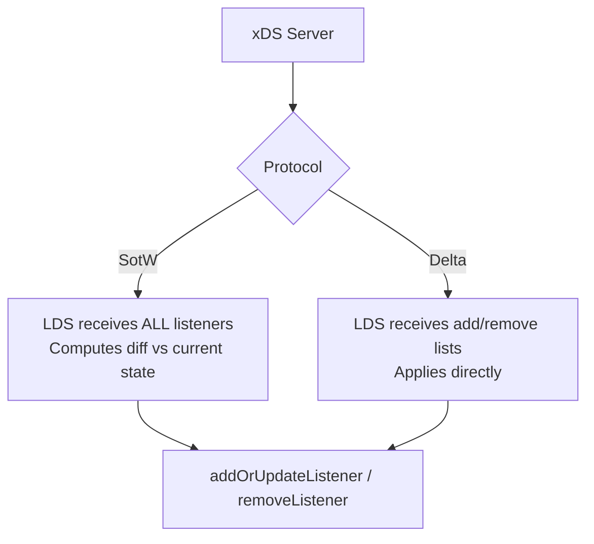
```mermaid
flowchart TD
    XDS["xDS Server"] --> B{Protocol}
    B -->|SotW| SotW["LDS receives ALL listeners<br/>Computes diff vs current state"]
    B -->|Delta| Delta["LDS receives add/remove lists<br/>Applies directly"]
    SotW --> Apply["addOrUpdateListener / removeListener"]
    Delta --> Apply
```

### Init Target — Startup Gate

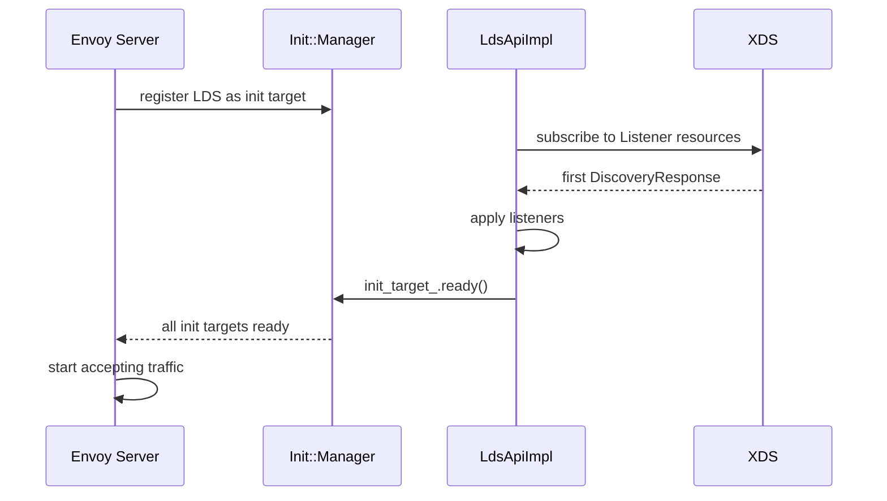
```mermaid
sequenceDiagram
    participant Server as Envoy Server
    participant IM as Init::Manager
    participant LDS as LdsApiImpl

    Server->>IM: register LDS as init target
    LDS->>XDS: subscribe to Listener resources
    XDS-->>LDS: first DiscoveryResponse
    LDS->>LDS: apply listeners
    LDS->>IM: init_target_.ready()
    IM-->>Server: all init targets ready
    Server->>Server: start accepting traffic
```

### Error Handling

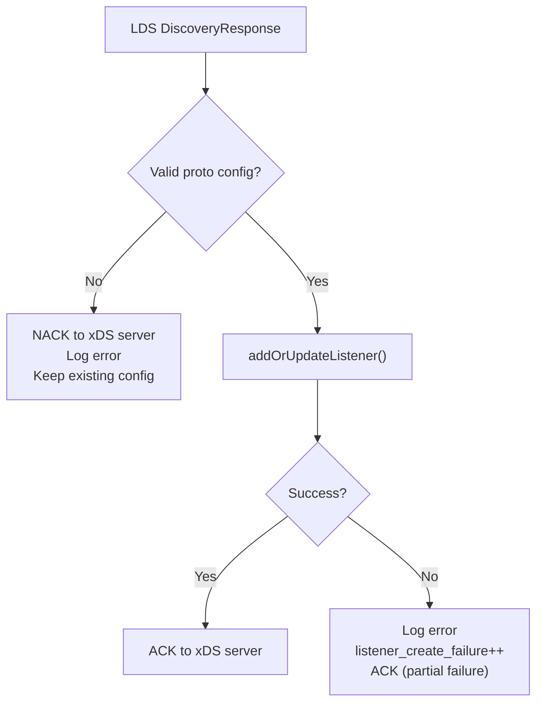
```mermaid
flowchart TD
    Response["LDS DiscoveryResponse"] --> Validate{Valid proto config?}
    Validate -->|No| NACK["NACK to xDS server<br/>Log error<br/>Keep existing config"]
    Validate -->|Yes| Apply["addOrUpdateListener()"]
    Apply --> B{Success?}
    B -->|Yes| ACK["ACK to xDS server"]
    B -->|No| Fail["Log error<br/>listener_create_failure++<br/>ACK (partial failure)"]
```

---

## 2. DrainingFilterChainsManager — Graceful Cleanup

When filter chains or entire listeners are replaced, existing connections must be gracefully drained.

### Draining Flow

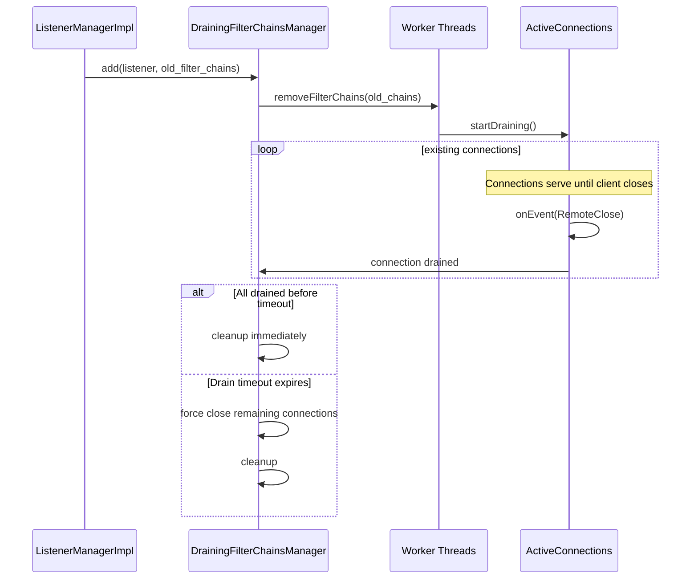
```mermaid
sequenceDiagram
    participant LM as ListenerManagerImpl
    participant DFCM as DrainingFilterChainsManager
    participant Workers as Worker Threads
    participant Conns as ActiveConnections

    LM->>DFCM: add(listener, old_filter_chains)
    DFCM->>Workers: removeFilterChains(old_chains)
    Workers->>Conns: startDraining()

    loop existing connections
        Note over Conns: Connections serve until client closes
        Conns->>Conns: onEvent(RemoteClose)
        Conns->>DFCM: connection drained
    end

    alt All drained before timeout
        DFCM->>DFCM: cleanup immediately
    else Drain timeout expires
        DFCM->>DFCM: force close remaining connections
        DFCM->>DFCM: cleanup
    end
```

### Listener-Level vs Filter-Chain-Level Drain

| Scenario | What Drains | New Connections |
|----------|-------------|-----------------|
| Full listener replacement | All connections on old listener | Use new listener |
| Filter-chain-only update | Only connections on replaced chains | Use new chains, same listener |
| Listener removed | All connections | No new connections |

### Drain Timeline

```mermaid
gantt
    title Listener Update Drain Timeline
    dateFormat s
    axisFormat %S

    section Old Filter Chain
    Active            :active, 0, 10
    Draining          :crit, 10, 25
    Destroyed         :done, 25, 26

    section New Filter Chain
    Created           :active, 10, 26

    section Drain Timeout
    Timer Running     :10, 25
```

---

## 3. UDP Listeners

### `ActiveRawUdpListenerFactory`

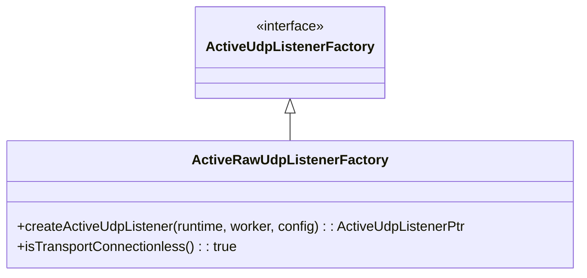
```mermaid
classDiagram
    class ActiveRawUdpListenerFactory {
        +createActiveUdpListener(runtime, worker, config): ActiveUdpListenerPtr
        +isTransportConnectionless(): true
    }

    class ActiveUdpListenerFactory {
        <<interface>>
    }

    ActiveUdpListenerFactory <|-- ActiveRawUdpListenerFactory
```

### UDP Listener in ConnectionHandler

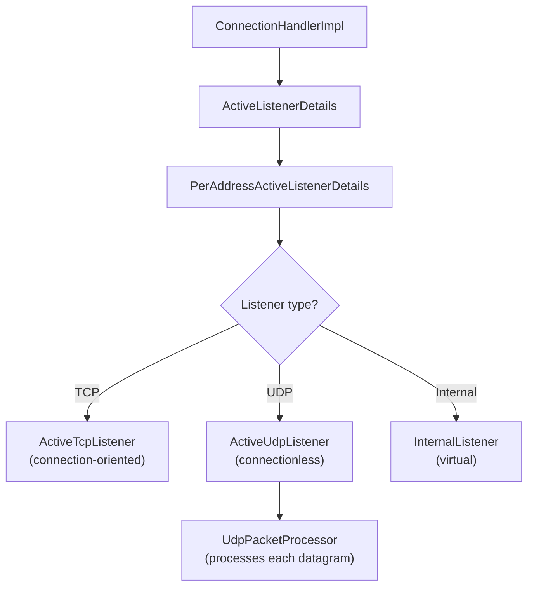
```mermaid
flowchart TD
    CH["ConnectionHandlerImpl"] --> ALD["ActiveListenerDetails"]
    ALD --> PAD["PerAddressActiveListenerDetails"]
    PAD --> B{Listener type?}
    B -->|TCP| ATL["ActiveTcpListener<br/>(connection-oriented)"]
    B -->|UDP| AUL["ActiveUdpListener<br/>(connectionless)"]
    B -->|Internal| AIL["InternalListener<br/>(virtual)"]

    AUL --> UPP["UdpPacketProcessor<br/>(processes each datagram)"]
```

### UDP vs TCP in Listener Manager

| Aspect | TCP | UDP |
|--------|-----|-----|
| Connection model | Connection-oriented | Connectionless datagrams |
| Filter chain selection | Per connection at accept time | N/A (per packet or session) |
| Listener filters | Yes (TLS inspector, proxy proto) | No |
| Active connections tracking | Yes (ActiveConnections) | No (stateless or session-based) |
| `SO_REUSEPORT` | Per-worker sockets | Per-worker sockets |
| Connection balancing | Yes | No (kernel-distributed) |

---

## 4. Internal Listeners

Internal listeners handle in-process connections (e.g., internal redirect, filter-to-filter communication):

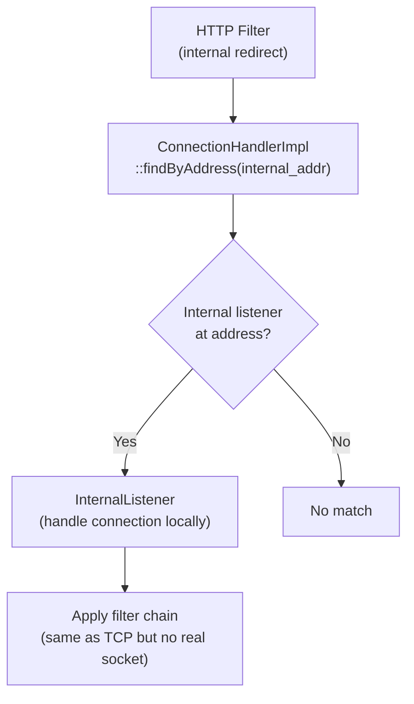
```mermaid
flowchart TD
    Filter["HTTP Filter<br/>(internal redirect)"] --> CH["ConnectionHandlerImpl<br/>::findByAddress(internal_addr)"]
    CH --> B{Internal listener<br/>at address?}
    B -->|Yes| IL["InternalListener<br/>(handle connection locally)"]
    B -->|No| NotFound["No match"]
    IL --> FC["Apply filter chain<br/>(same as TCP but no real socket)"]
```

### `InternalListenerConfigImpl`

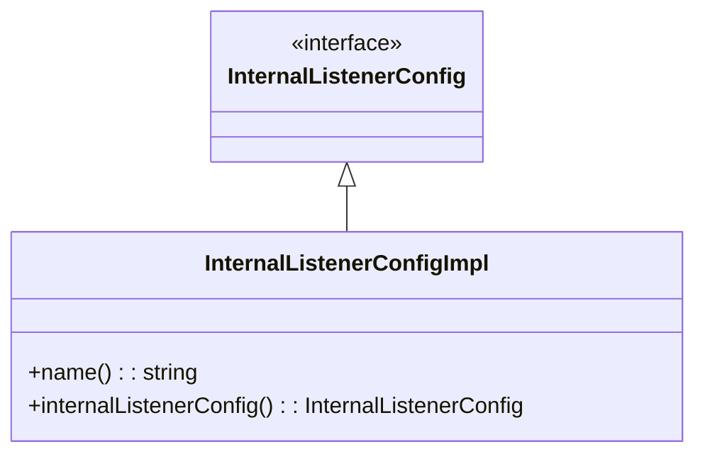
```mermaid
classDiagram
    class InternalListenerConfigImpl {
        +name(): string
        +internalListenerConfig(): InternalListenerConfig
    }

    class InternalListenerConfig {
        <<interface>>
    }

    InternalListenerConfig <|-- InternalListenerConfigImpl
```

---

## 5. Hot Restart — Socket Inheritance

During hot restart, the new Envoy process inherits listen sockets from the old process:

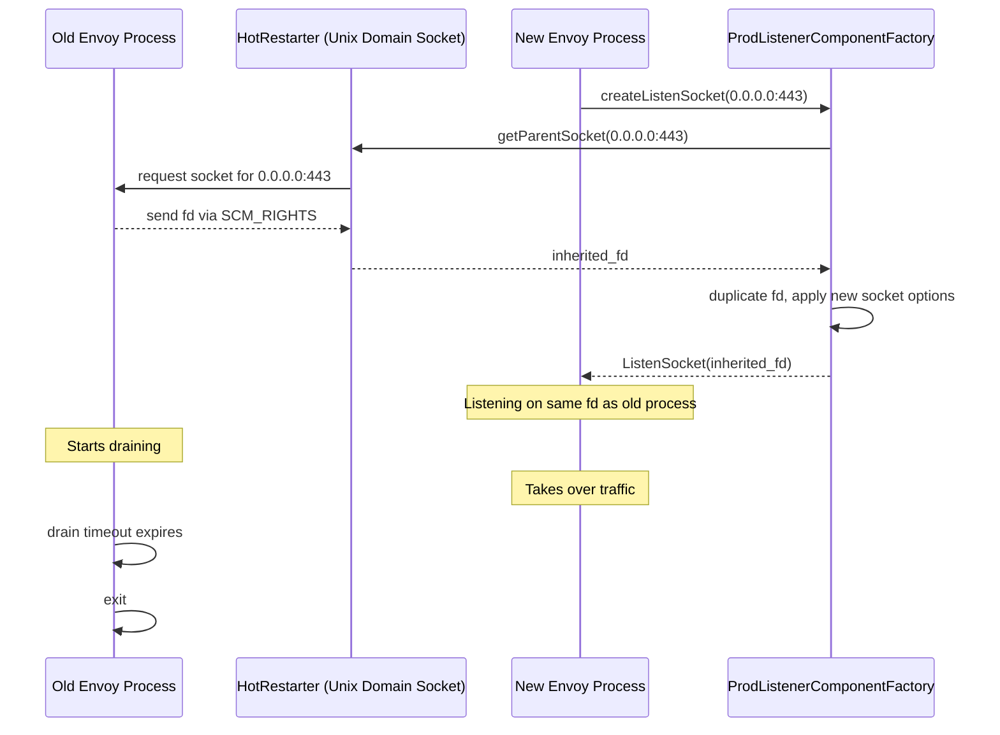
```mermaid
sequenceDiagram
    participant Old as Old Envoy Process
    participant HR as HotRestarter (Unix Domain Socket)
    participant New as New Envoy Process
    participant PLCF as ProdListenerComponentFactory

    New->>PLCF: createListenSocket(0.0.0.0:443)
    PLCF->>HR: getParentSocket(0.0.0.0:443)
    HR->>Old: request socket for 0.0.0.0:443
    Old-->>HR: send fd via SCM_RIGHTS
    HR-->>PLCF: inherited_fd
    PLCF->>PLCF: duplicate fd, apply new socket options
    PLCF-->>New: ListenSocket(inherited_fd)

    Note over New: Listening on same fd as old process
    Note over Old: Starts draining
    Note over New: Takes over traffic
    Old->>Old: drain timeout expires
    Old->>Old: exit
```

### Zero-Downtime Flow

```mermaid
gantt
    title Hot Restart Timeline
    dateFormat s
    axisFormat %S

    section Old Envoy
    Serving Traffic  :active, 0, 10
    Draining         :crit, 10, 20
    Exit             :done, 20, 21

    section New Envoy
    Starting         :0, 5
    Socket Inherited :milestone, 5, 5
    Warming          :5, 10
    Serving Traffic  :active, 10, 30
```

---

## 6. Listener Configuration Comparison

`ListenerMessageUtil` determines what type of update to perform:

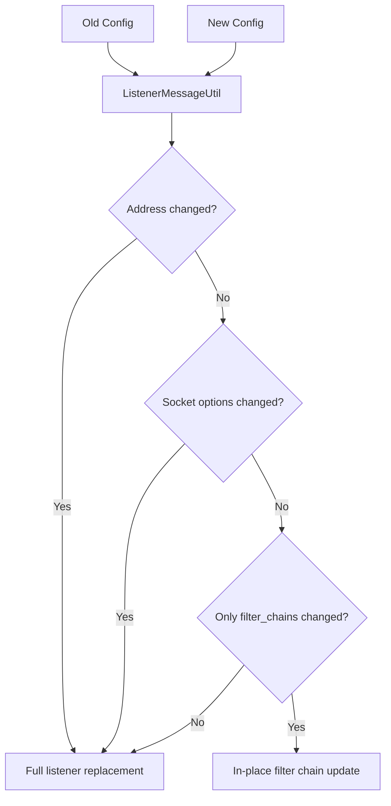
```mermaid
flowchart TD
    Old["Old Config"] --> Compare["ListenerMessageUtil"]
    New["New Config"] --> Compare

    Compare --> Q1{Address changed?}
    Q1 -->|Yes| Full["Full listener replacement"]
    Q1 -->|No| Q2{Socket options changed?}
    Q2 -->|Yes| Full
    Q2 -->|No| Q3{Only filter_chains changed?}
    Q3 -->|Yes| InPlace["In-place filter chain update"]
    Q3 -->|No| Full
```

### Fields That Trigger Full Replacement

| Field | Why |
|-------|-----|
| `address` | Must rebind socket |
| `socket_options` | Must recreate socket |
| `bind_to_port` | Fundamental listener behavior change |
| `enable_reuse_port` | Cannot change after bind |
| `freebind` | Socket option change |
| `tcp_backlog_size` | Must re-listen |

### Fields That Allow In-Place Update

| Field | What Changes |
|-------|-------------|
| `filter_chains` | New chains added, old chains drained |
| `default_filter_chain` | New default chain, old one drained |
| `listener_filters` | New listener filters for new connections |
| `per_connection_buffer_limit_bytes` | New value for new connections |

---

## 7. Full Component Interaction Map

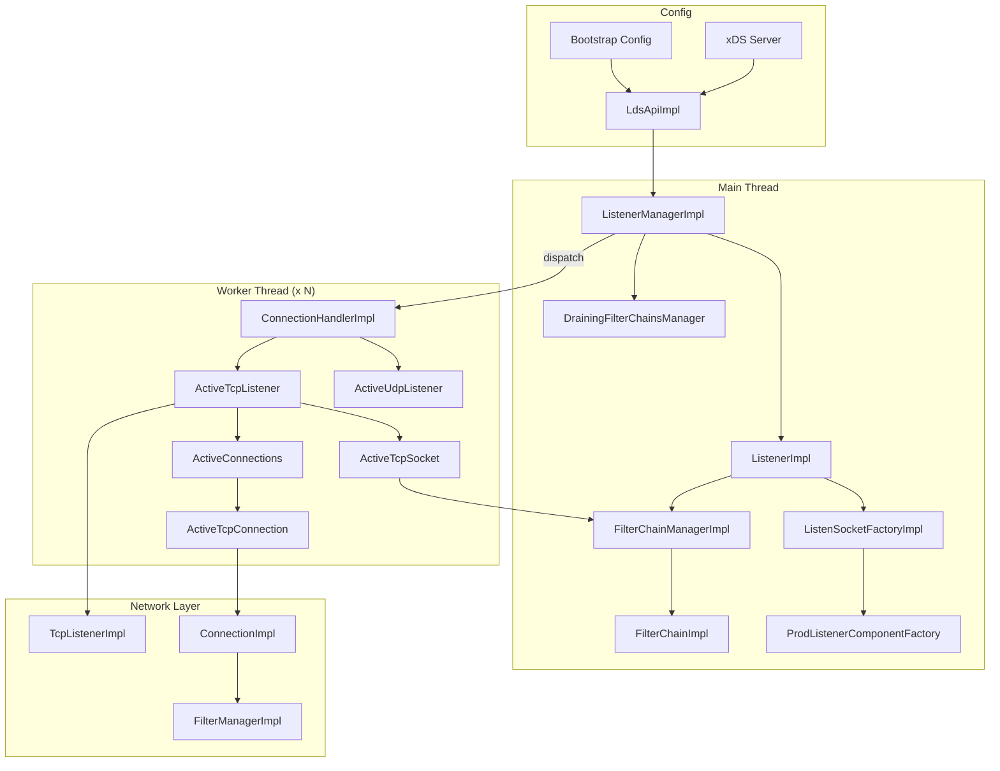
```mermaid
graph TD
    subgraph Config
        BS["Bootstrap Config"]
        LDS_API["LdsApiImpl"]
        XDS["xDS Server"]
    end

    subgraph MainThread["Main Thread"]
        LM["ListenerManagerImpl"]
        LI["ListenerImpl"]
        FCM["FilterChainManagerImpl"]
        FCI["FilterChainImpl"]
        LSFI["ListenSocketFactoryImpl"]
        PLCF["ProdListenerComponentFactory"]
        DFCM["DrainingFilterChainsManager"]
    end

    subgraph WorkerThread["Worker Thread (x N)"]
        CH["ConnectionHandlerImpl"]
        ATL["ActiveTcpListener"]
        ATS["ActiveTcpSocket"]
        AC["ActiveConnections"]
        ATC["ActiveTcpConnection"]
        AUL["ActiveUdpListener"]
    end

    subgraph NetworkLayer["Network Layer"]
        TL["TcpListenerImpl"]
        Conn["ConnectionImpl"]
        FM["FilterManagerImpl"]
    end

    BS & XDS --> LDS_API --> LM
    LM --> LI --> FCM --> FCI
    LI --> LSFI --> PLCF
    LM --> DFCM
    LM -->|dispatch| CH
    CH --> ATL & AUL
    ATL --> ATS
    ATL --> AC --> ATC
    ATL --> TL
    ATS --> FCM
    ATC --> Conn --> FM
```

---

## 8. Common Troubleshooting Scenarios

### No Filter Chain Match

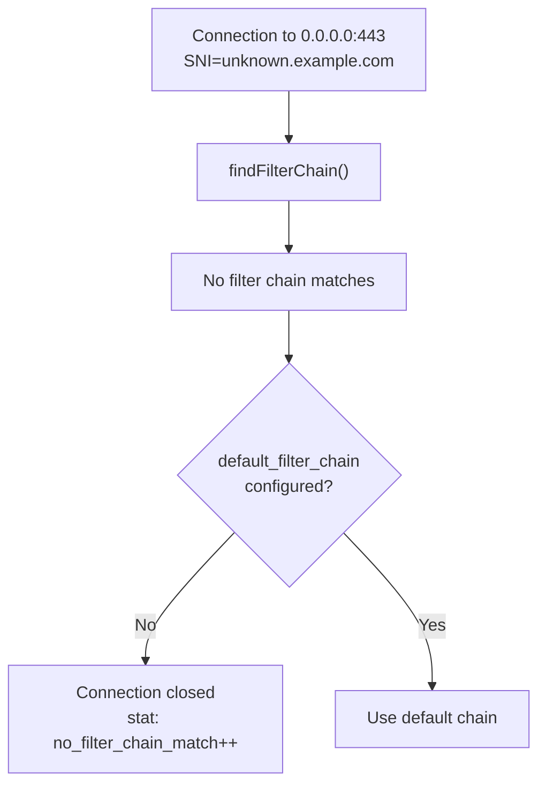
```mermaid
flowchart TD
    Conn["Connection to 0.0.0.0:443<br/>SNI=unknown.example.com"] --> FCM["findFilterChain()"]
    FCM --> NoMatch["No filter chain matches"]
    NoMatch --> Default{"default_filter_chain<br/>configured?"}
    Default -->|No| Reject["Connection closed<br/>stat: no_filter_chain_match++"]
    Default -->|Yes| UseDefault["Use default chain"]
```

**Fix:** Add a `default_filter_chain` to the listener config.

### Listener Filter Timeout

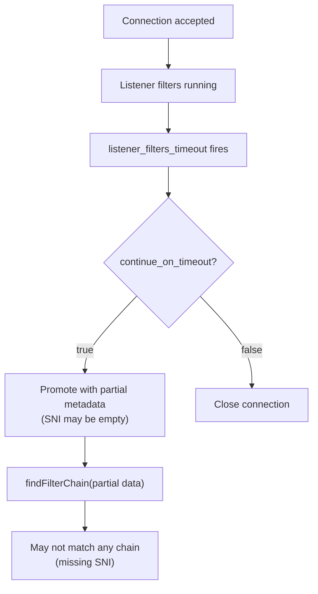
```mermaid
flowchart TD
    Accept["Connection accepted"] --> Filters["Listener filters running"]
    Filters --> Timeout["listener_filters_timeout fires"]
    Timeout --> B{continue_on_timeout?}
    B -->|true| Promote["Promote with partial metadata<br/>(SNI may be empty)"]
    B -->|false| Close["Close connection"]
    Promote --> FCM["findFilterChain(partial data)"]
    FCM --> NoMatch["May not match any chain<br/>(missing SNI)"]
```

**Fix:** Increase `listener_filters_timeout` or set `continue_on_listener_filters_timeout: true`.

### Draining Takes Too Long

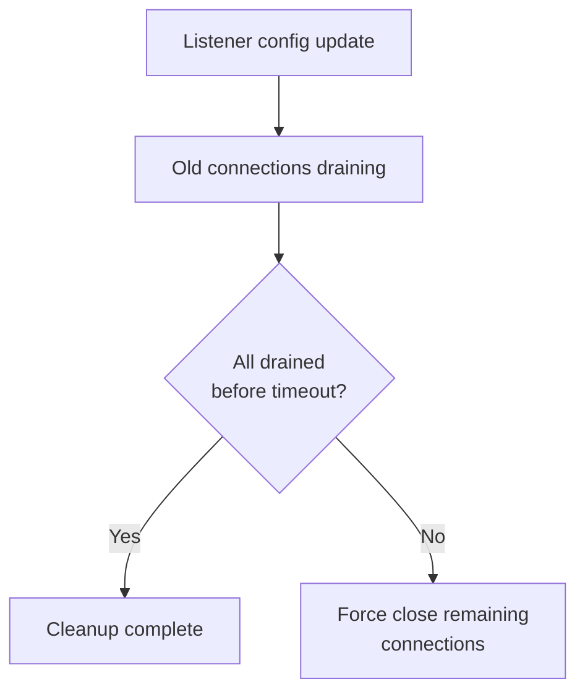
```mermaid
flowchart TD
    Update["Listener config update"] --> Drain["Old connections draining"]
    Drain --> Check{All drained<br/>before timeout?}
    Check -->|Yes| Clean["Cleanup complete"]
    Check -->|No| Force["Force close remaining<br/>connections"]
```

**Fix:** Reduce `drain_timeout` or configure `drain_type: MODIFY_ONLY`.

---

## Navigation

| Part | Topics |
|------|--------|
| [Part 1](OVERVIEW_PART1_architecture.md) | Architecture, ListenerManagerImpl, Worker Dispatch, Lifecycle |
| [Part 2](OVERVIEW_PART2_filter_chains.md) | Filter Chain Manager, Matching, ListenerImpl Config |
| [Part 3](OVERVIEW_PART3_active_tcp.md) | ActiveTcpListener, ActiveTcpSocket, Listener Filters, Connection Tracking |
| **Part 4 (this file)** | LDS API, UDP, Draining, Internal Listeners, Advanced Topics |

---

## Index of Individual File Documentation

| File | Individual Doc |
|------|---------------|
| `listener_manager_impl.h/.cc` | [listener_manager_impl.md](listener_manager_impl.md) |
| `listener_impl.h/.cc` | [listener_impl.md](listener_impl.md) |
| `filter_chain_manager_impl.h/.cc` | [filter_chain_manager_impl.md](filter_chain_manager_impl.md) |
| `connection_handler_impl.h/.cc` | [connection_handler_impl.md](connection_handler_impl.md) |
| `active_tcp_listener.h/.cc` + `active_tcp_socket.h/.cc` | [active_tcp_listener_and_socket.md](active_tcp_listener_and_socket.md) |
| `lds_api.h/.cc` | [lds_api.md](lds_api.md) |
