# Sockets, Connections, and Listeners in Envoy

**Purpose:** This document explains the fundamental concepts of sockets and connections, then maps them to Envoy's class hierarchy.

---

## Table of Contents

1. [Socket 101: The Fundamentals](#1-socket-101-the-fundamentals)
2. [From OS Sockets to Envoy Abstractions](#2-from-os-sockets-to-envoy-abstractions)
3. [Socket Classes in Envoy](#3-socket-classes-in-envoy)
4. [Connection Classes in Envoy](#4-connection-classes-in-envoy)
5. [Listener Classes in Envoy](#5-listener-classes-in-envoy)
6. [Complete Class Hierarchy](#6-complete-class-hierarchy)
7. [Lifecycle: From Socket to Connection](#7-lifecycle-from-socket-to-connection)
8. [Quick Reference](#8-quick-reference)

---

## 1. Socket 101: The Fundamentals

### 1.1 What is a Socket?

**At the OS level, a socket is a file descriptor that represents one endpoint of a network communication channel.**

Think of it like a telephone:
- The socket is the physical phone device
- The file descriptor is the phone number
- Communication happens when two sockets connect

### 1.2 Two Types of Sockets: Listen vs Connected

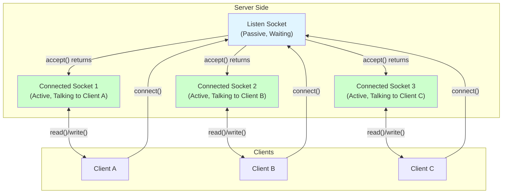

### 1.3 Listen Socket (Before accept())

**Purpose:** Waits for incoming connections

**Created by:**
```c
int listen_fd = socket(AF_INET, SOCK_STREAM, 0);  // Create socket
bind(listen_fd, &addr, sizeof(addr));              // Bind to address:port
listen(listen_fd, backlog);                        // Mark as passive listener
```

**Characteristics:**
- **One per listening address:port** (e.g., one for `0.0.0.0:8080`)
- **Passive socket** - doesn't send/receive data
- **Shared by all connections** - all clients connect to this socket initially
- **Never closes** (until server shuts down or listener is removed)
- **Monitors for new connections** - OS maintains accept queue

**What it knows:**
- ✅ Local address (e.g., `0.0.0.0:8080`)
- ❌ Remote client address (doesn't know who's connecting yet)
- ❌ Connection state (no established connection)

### 1.4 Connected Socket (After accept())

**Purpose:** Communicates with a specific client

**Created by:**
```c
struct sockaddr_in client_addr;
socklen_t client_len = sizeof(client_addr);
int conn_fd = accept(listen_fd, (struct sockaddr*)&client_addr, &client_len);
// conn_fd is a NEW file descriptor for this specific client
```

**Characteristics:**
- **One per client connection** (1000 clients = 1000 connected sockets)
- **Active socket** - sends and receives application data
- **Independent** - each connected socket is separate, doesn't affect others
- **Closes when connection ends** (client disconnect, timeout, error)
- **4-tuple identification:** (local_ip, local_port, remote_ip, remote_port)

**What it knows:**
- ✅ Local address (e.g., `10.1.2.3:8080` - server's IP:port)
- ✅ Remote address (e.g., `192.168.1.5:54321` - client's IP:port)
- ✅ Connection state (established, closing, etc.)

### 1.5 The accept() System Call: The Magic Moment

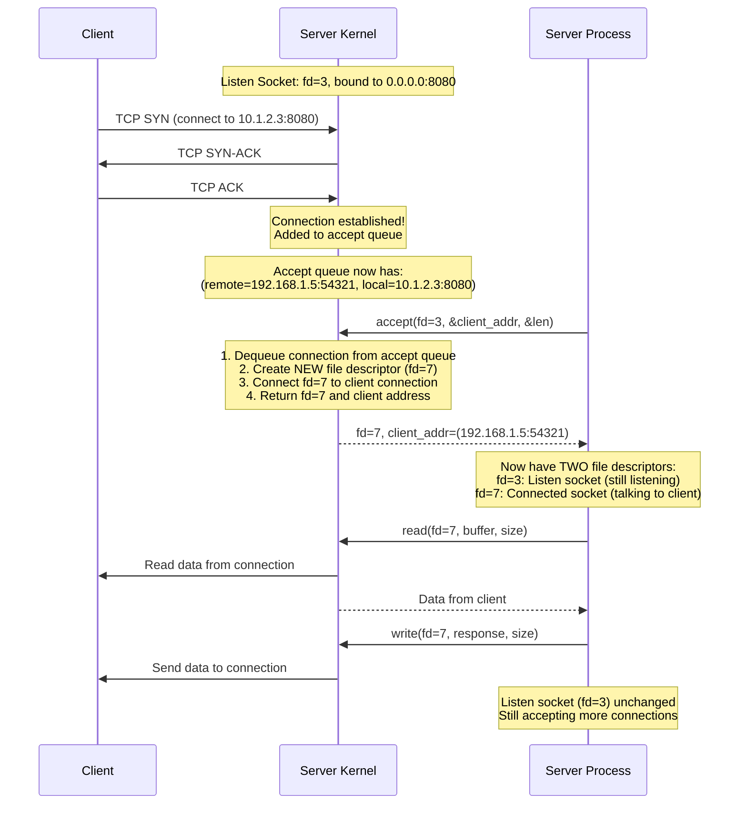

**Key Insights:**

1. **accept() creates a NEW file descriptor**
   - Listen socket: `fd=3` (unchanged, still listening)
   - Connected socket: `fd=7` (new, for this client)

2. **Listen socket remains available**
   - After accept() returns, listen socket can immediately accept another connection
   - Multiple connections can be accepted in rapid succession

3. **Each connection is independent**
   - Connected socket `fd=7` only talks to client A
   - Connected socket `fd=8` only talks to client B
   - They don't interfere with each other

4. **accept() is blocking** (unless socket is non-blocking)
   - If no connections are waiting, accept() blocks until one arrives
   - In non-blocking mode, returns immediately with EAGAIN

### 1.6 Socket States and Lifecycles

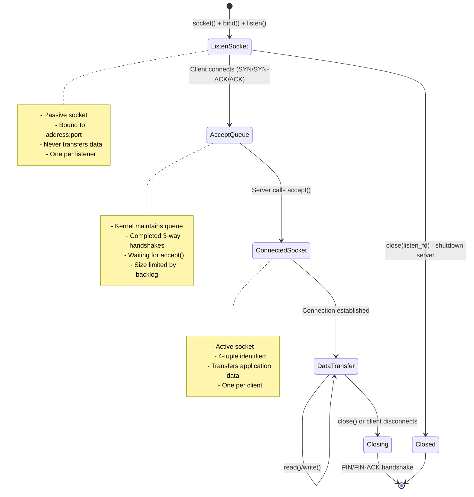

### 1.7 Analogy: Restaurant Host vs Waiter

This analogy helps understand the difference:

| Role | Socket Type | Responsibility |
|------|-------------|----------------|
| **Restaurant Host** | **Listen Socket** | Greets customers at entrance, checks for available tables |
| **Waiter** | **Connected Socket** | Serves a specific table, takes orders, brings food |

**Key Points:**
- **Host (Listen Socket):**
  - Stands at one location (bound address:port)
  - Greets all customers (accepts all connections)
  - Doesn't serve food (doesn't transfer data)
  - Delegates to waiters (creates connected sockets)

- **Waiter (Connected Socket):**
  - Assigned to specific table (specific client)
  - Takes orders and brings food (reads/writes data)
  - Multiple waiters work independently (multiple connections in parallel)
  - When customer leaves, waiter is free (socket closes)

**Restaurant Scenario:**
```
Host: "Welcome! Let me seat you." (accept() called)
Host creates Waiter #7 for Table #7 (returns new fd)
Waiter #7: "Hi! I'm your waiter. What can I get you?" (connection ready)
[Waiter #7 handles Table #7's entire meal]
Meanwhile, Host greets next customer and creates Waiter #8 for Table #8
```

---

## 2. From OS Sockets to Envoy Abstractions

### 2.1 Why Envoy Wraps Sockets

**Raw OS sockets are hard to work with:**
- ❌ OS-specific APIs (Linux epoll, BSD kqueue, Windows IOCP)
- ❌ Error handling is verbose and error-prone
- ❌ No transport layer abstraction (TLS vs raw TCP)
- ❌ No connection metadata tracking
- ❌ No integration with Envoy's event loop

**Envoy's solution: Wrap sockets in C++ classes**
- ✅ Platform-independent abstractions
- ✅ RAII for automatic resource cleanup
- ✅ Transport socket layer (TLS encryption transparent)
- ✅ Connection info tracking (addresses, SNI, ALPN)
- ✅ Integrated with event dispatcher

### 2.2 The Layering Strategy

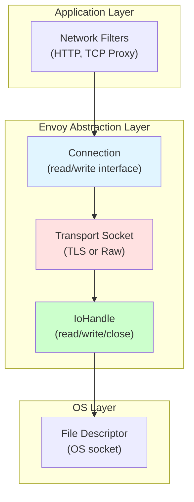

**Each layer adds functionality:**

1. **File Descriptor (OS):** Raw socket, just a number
2. **IoHandle:** Wraps fd, provides read/write/close methods
3. **Transport Socket:** Adds encryption (TLS) or passes through (raw TCP)
4. **Connection:** Adds filter chain, flow control, event callbacks
5. **Network Filters:** Application-level protocol handling

### 2.3 Conceptual Mapping

| OS Concept | Envoy Class | Purpose |
|------------|-------------|---------|
| **listen socket** | `Network::Listener`, `TcpListenerImpl` | Waits for connections, calls accept() |
| **connected socket (before protocol)** | `ConnectionSocket`, `AcceptedSocketImpl` | Holds accepted socket before connection is established |
| **connected socket (during filters)** | `ActiveTcpSocket` | Socket undergoing listener filter processing |
| **connected socket (active)** | `Connection`, `ConnectionImpl` | Established connection with filters |
| **socket address** | `Network::Address::Instance` | IP address and port |
| **socket options** | `Network::Socket::Options` | SO_REUSEPORT, SO_KEEPALIVE, etc. |

---

## 3. Socket Classes in Envoy

### 3.1 Socket Class Hierarchy

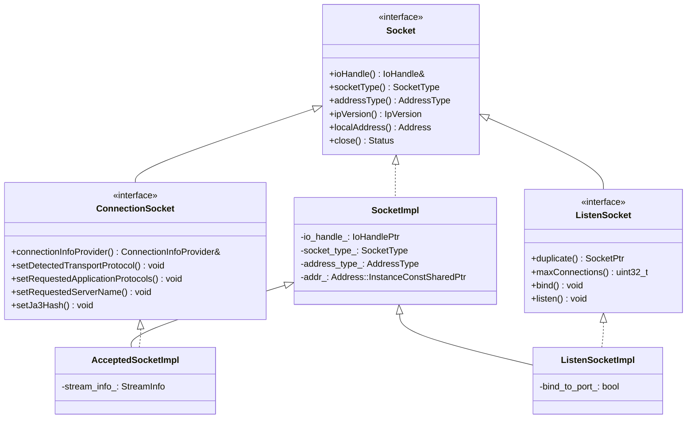

### 3.2 Socket Interface (Base)

**Purpose:** Common abstraction for all socket types

**Key Methods:**
- `ioHandle()`: Returns IoHandle for raw fd operations
- `localAddress()`: Gets socket's local address
- `close()`: Closes the socket
- `setBlockingForTest()`: Test utility

**When to use:** Never directly - use derived interfaces

### 3.3 ListenSocket

**Purpose:** Represents a listen socket (server-side passive socket)

**Maps to:** OS listen socket created by `socket()` + `bind()` + `listen()`

**Responsibilities:**
- Binds to an address and port
- Listens for incoming connections
- Can be duplicated across workers (SO_REUSEPORT)

**Example Usage:**
```cpp
// Created by ListenSocketFactory
auto listen_socket = socket_factory.getListenSocket(worker_index);
listen_socket->bind();
listen_socket->listen(backlog);
```

**Key Methods:**
- `bind()`: Binds socket to address
- `listen()`: Marks socket as passive listener
- `duplicate()`: Creates socket for another worker (SO_REUSEPORT)
- `maxConnections()`: Connection limit for this listener

**Important:** Listen sockets are never closed during listener updates if socket options haven't changed

### 3.4 ConnectionSocket

**Purpose:** Represents a socket for a client connection (active socket)

**Maps to:** OS connected socket returned by `accept()`

**Responsibilities:**
- Holds connection metadata (addresses, SNI, ALPN, etc.)
- Tracks detected protocols
- Provides connection info to filters

**Key Methods:**
- `connectionInfoProvider()`: Access connection metadata
- `setDetectedTransportProtocol()`: Set by listener filters (e.g., "tls")
- `setRequestedServerName()`: Set SNI from TLS Inspector
- `setRequestedApplicationProtocols()`: Set ALPN list
- `setJa3Hash()`: Set TLS fingerprint

**Lifecycle:**
1. Created by `accept()` wrapping new fd
2. Listener filters populate metadata
3. Filter chain is matched based on metadata
4. Socket is passed to Connection for data transfer

### 3.5 AcceptedSocketImpl

**Purpose:** Concrete implementation of ConnectionSocket for accepted sockets

**When created:** Immediately after `accept()` system call

**What it contains:**
- File descriptor (wrapped in IoHandle)
- Local address (server's address)
- Remote address (client's address)
- StreamInfo for tracking connection metadata
- Overload manager state

**Code Example:**
```cpp
// In TcpListenerImpl::onSocketEvent()
IoHandlePtr io_handle = socket_->ioHandle().accept(&remote_addr, &remote_addr_len);
auto accepted_socket = std::make_unique<AcceptedSocketImpl>(
    std::move(io_handle),
    local_address,
    remote_address,
    overload_state,
    track_global_cx_limit
);
cb_.onAccept(std::move(accepted_socket));  // Pass to ActiveTcpListener
```

### 3.6 Socket Wrapper Progression

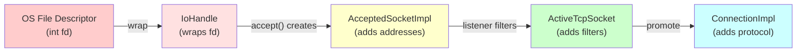

---

## 4. Connection Classes in Envoy

### 4.1 Connection Class Hierarchy

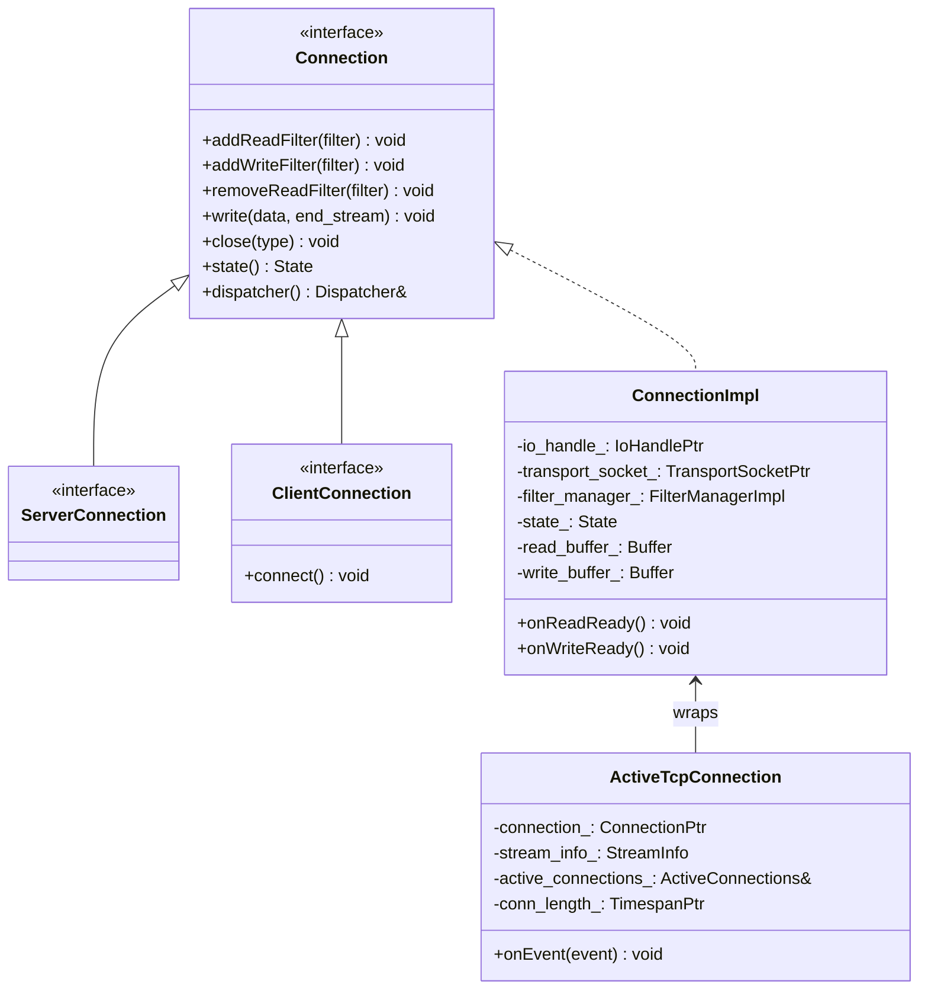

### 4.2 Connection Interface

**Purpose:** Abstract interface for network connections (both client and server side)

**Key Responsibilities:**
- Manage network filter chains (read and write filters)
- Read and write data through transport socket
- Handle connection events (connected, closed, error)
- Provide connection state and metadata

**Key Methods:**

**Filter Management:**
```cpp
void addReadFilter(ReadFilterSharedPtr filter);
void addWriteFilter(WriteFilterSharedPtr filter);
void addFilter(FilterSharedPtr filter);  // Both read and write
void removeReadFilter(ReadFilterSharedPtr filter);
```

**Data Transfer:**
```cpp
void write(Buffer::Instance& data, bool end_stream);
void close(ConnectionCloseType type);
```

**State and Events:**
```cpp
State state();  // Closing, Closed, Open
void addConnectionCallbacks(ConnectionCallbacks& cb);
Event::Dispatcher& dispatcher();
```

### 4.3 ServerConnection vs ClientConnection

| Aspect | ServerConnection | ClientConnection |
|--------|------------------|------------------|
| **Created by** | Accepting connections | Upstream connection manager |
| **Direction** | Downstream (client → Envoy) | Upstream (Envoy → backend) |
| **Created from** | `AcceptedSocket` from `accept()` | `connect()` system call |
| **Listener filters** | Yes - before filter chain match | No |
| **Extra method** | None | `connect()` - initiates connection |

**ServerConnection:**
```cpp
// Created after accepting connection
auto server_conn = dispatcher.createServerConnection(
    std::move(accepted_socket),
    std::move(transport_socket),
    stream_info
);
```

**ClientConnection:**
```cpp
// Created when making upstream connection
auto client_conn = dispatcher.createClientConnection(
    upstream_address,
    local_address,
    transport_socket,
    options
);
client_conn->connect();  // Initiate connection
```

### 4.4 ConnectionImpl

**Purpose:** Concrete implementation of Connection interface

**What it manages:**

**I/O Layer:**
- `io_handle_`: Raw file descriptor operations
- `transport_socket_`: TLS or raw TCP transport
- `read_buffer_`, `write_buffer_`: Data buffers

**Filter Chain:**
- `filter_manager_`: Manages read and write filter chains
- Iterates through filters on data events

**Event Integration:**
- Registers with dispatcher for read/write events
- `onReadReady()`: Called when socket readable
- `onWriteReady()`: Called when socket writable

**Connection State:**
- Tracks connection state (Open, Closing, Closed)
- Manages graceful shutdown
- Handles half-close scenarios

**Code Flow - Reading Data:**
```cpp
void ConnectionImpl::onReadReady() {
    // 1. Read from transport socket (handles TLS decryption)
    IoResult result = transport_socket_->doRead(read_buffer_);

    // 2. Pass data through read filter chain
    filter_manager_->onRead(read_buffer_, result.end_stream);

    // 3. Filters process data, may write response
}
```

### 4.5 ActiveTcpConnection

**Purpose:** Wraps a ConnectionImpl in the listener's context

**Why it exists:**
- Tracks connection within listener's connection pool
- Links connection to its filter chain (for draining)
- Manages connection lifecycle events
- Emits access logs when connection closes

**What it contains:**
- `connection_`: The actual ConnectionImpl
- `stream_info_`: Connection metadata and timing
- `active_connections_`: Parent container (grouped by filter chain)
- `conn_length_`: Timer tracking connection duration

**Lifecycle Events:**
```cpp
void ActiveTcpConnection::onEvent(Network::ConnectionEvent event) {
    switch (event) {
    case LocalClose:
    case RemoteClose:
        // Connection is closing
        listener_.removeConnection(*this);  // Remove from tracking
        listener_.emitLogs(stream_info_);   // Write access logs
        // Deferred deletion scheduled
        break;
    }
}
```

**Relationship to Connection:**
```
ActiveTcpConnection (listener context)
    ↓ wraps
ConnectionImpl (protocol handling)
    ↓ uses
TransportSocketImpl (TLS or raw)
    ↓ uses
IoHandle (file descriptor)
    ↓ wraps
int fd (OS socket)
```

### 4.6 Connection States

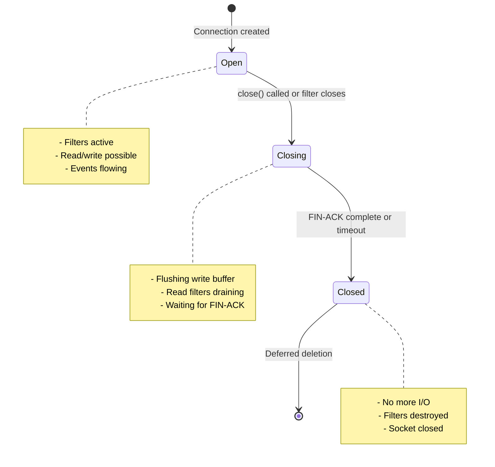

---

## 5. Listener Classes in Envoy

### 5.1 Listener Class Hierarchy

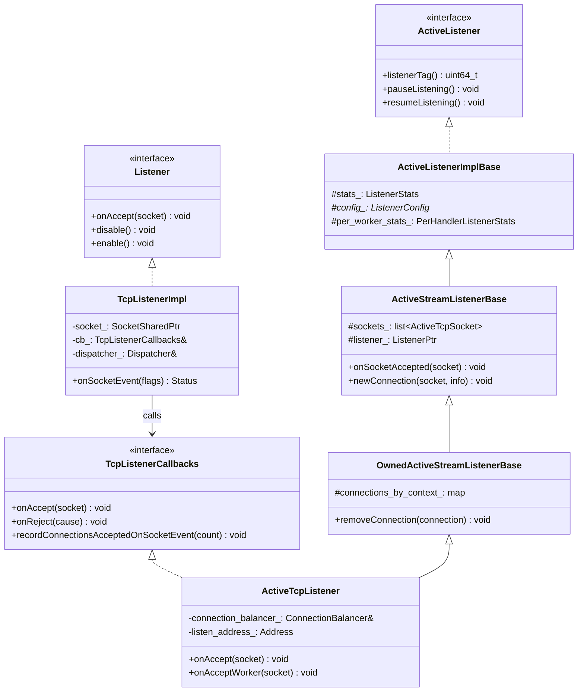

### 5.2 Listener Interface

**Purpose:** Abstraction for OS-level listener (wraps listen socket)

**Implementations:**
- `TcpListenerImpl`: TCP stream listeners
- `UdpListenerImpl`: UDP listeners
- `QuicListenerImpl`: QUIC listeners

**Key Methods:**
- `disable()`: Stop accepting connections (remove from event loop)
- `enable()`: Start accepting connections (add to event loop)

### 5.3 TcpListenerImpl

**Purpose:** Wraps OS listen socket and integrates with event loop

**Responsibilities:**
- Registers listen socket with event dispatcher
- Calls `accept()` when connections are ready
- Enforces global connection limits and overload protection
- Invokes callbacks for accepted/rejected connections

**Key Components:**
- `socket_`: The listen socket
- `cb_`: Callback interface (points to ActiveTcpListener)
- `dispatcher_`: Event loop integration

**Event Flow:**
```
Kernel: Connection ready
    ↓
Event Dispatcher: Socket readable
    ↓
TcpListenerImpl::onSocketEvent()
    ↓
accept() system call
    ↓
cb_.onAccept(accepted_socket)  ← Calls ActiveTcpListener
```

**Batch Acceptance:**
```cpp
// Accept multiple connections per event
for (uint32_t i = 0; i < max_connections_to_accept_per_socket_event_; ++i) {
    IoHandlePtr io_handle = socket_->ioHandle().accept(&addr, &len);
    if (!io_handle) break;  // No more connections

    // Check limits, overload, etc.
    if (should_reject) {
        io_handle->close();
        cb_.onReject(cause);
        continue;
    }

    cb_.onAccept(std::make_unique<AcceptedSocketImpl>(...));
}
```

### 5.4 ActiveListener Hierarchy

**Purpose:** Layered base classes for active listener implementations

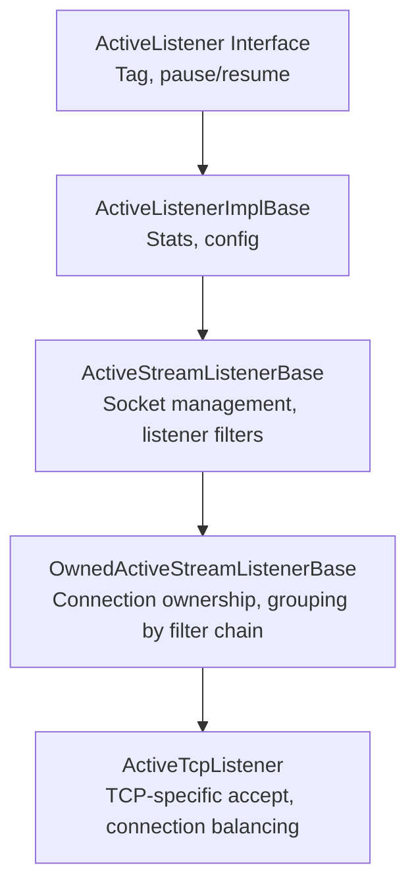

### 5.5 ActiveListenerImplBase

**Purpose:** Base class providing common listener functionality

**What it provides:**
- `stats_`: Per-listener statistics (connections, overflows, etc.)
- `per_worker_stats_`: Per-worker-per-listener statistics
- `config_`: Pointer to ListenerConfig
- `listenerTag()`: Unique identifier for this listener

**Used by:** All active listener types (TCP, UDP, QUIC)

### 5.6 ActiveStreamListenerBase

**Purpose:** Manages sockets during listener filter phase

**Key Responsibilities:**
- Maintains list of `ActiveTcpSocket` objects (sockets in filter processing)
- Creates listener filter chains
- Handles filter timeouts
- Transitions sockets to connections after filters complete

**Key Members:**
- `sockets_`: List of sockets undergoing listener filter processing
- `listener_`: The TcpListenerImpl instance
- `listener_filters_timeout_`: Timeout for listener filters
- `continue_on_listener_filters_timeout_`: Behavior on timeout

**Key Methods:**
- `onSocketAccepted()`: Called when socket is accepted
- `newConnection()`: Called when filters complete successfully
- `removeSocket()`: Removes socket from list (completed or failed)

### 5.7 OwnedActiveStreamListenerBase

**Purpose:** Adds connection ownership and grouping by filter chain

**Key Addition:**
- `connections_by_context_`: Maps FilterChain* → ActiveConnections
- Groups connections by filter chain for efficient draining
- Enables filter-chain-only updates without full listener drain

**Key Methods:**
- `removeConnection()`: Removes connection from tracking
- `getOrCreateActiveConnections()`: Gets container for filter chain
- `removeFilterChain()`: Drains all connections on a filter chain

**Why Grouping Matters:**
- When filter chain is updated, only connections on that chain are drained
- Other connections continue unaffected
- Enables zero-downtime filter chain updates

### 5.8 ActiveTcpListener

**Purpose:** TCP-specific listener implementation

**Additional Responsibilities:**
- Connection balancing across workers
- Per-listener connection limits
- TCP-specific configuration

**Key Members:**
- `connection_balancer_`: Decides which worker handles connection
- `tcp_conn_handler_`: Parent ConnectionHandlerImpl reference
- `listen_address_`: Address this listener is bound to

**Key Methods:**

**onAccept():**
```cpp
void ActiveTcpListener::onAccept(ConnectionSocketPtr&& socket) {
    // Check per-listener connection limit
    if (listenerConnectionLimitReached()) {
        socket->close();
        stats_.downstream_cx_overflow_.inc();
        return;
    }

    onAcceptWorker(std::move(socket), ...);
}
```

**onAcceptWorker():**
```cpp
void ActiveTcpListener::onAcceptWorker(ConnectionSocketPtr&& socket, ...) {
    // Connection balancing decision
    if (!rebalanced) {
        auto& target = connection_balancer_.pickTargetHandler(*this);
        if (&target != this) {
            target.post(std::move(socket));  // Send to other worker
            return;
        }
    }

    // Process on this worker
    auto active_socket = std::make_unique<ActiveTcpSocket>(*this, std::move(socket));
    active_socket->continueFilterChain(true);
}
```

### 5.9 Listener Lifecycle

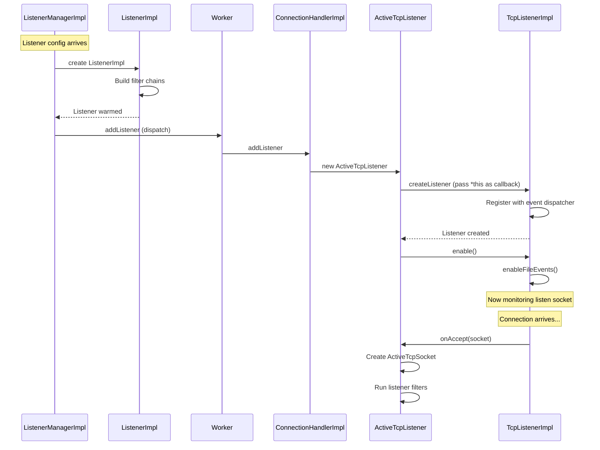

---

## 6. Complete Class Hierarchy

### 6.1 From Socket to Connection: Complete View

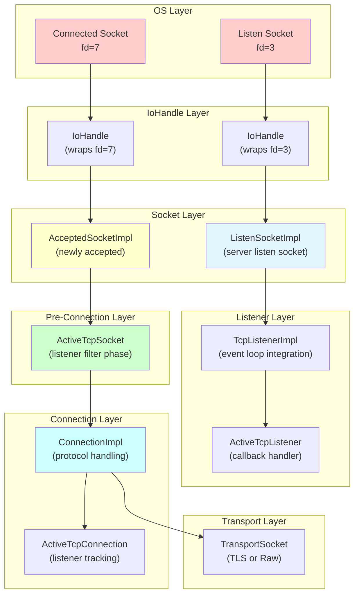

### 6.2 Responsibility Matrix

| Layer | Class | Lifetime | Key Responsibility |
|-------|-------|----------|-------------------|
| **OS** | File descriptor | Until close() | Raw network I/O |
| **I/O** | IoHandle | Wraps fd | Cross-platform I/O operations |
| **Socket** | ListenSocketImpl | Listener lifetime | Bind, listen, accept |
| **Socket** | AcceptedSocketImpl | Until promoted to connection | Hold accepted socket and addresses |
| **Listener** | TcpListenerImpl | Listener lifetime | Event loop integration, accept() |
| **Listener** | ActiveTcpListener | Listener lifetime per worker | Accept callback handler |
| **Pre-Connection** | ActiveTcpSocket | Listener filter phase | Run listener filters, collect metadata |
| **Connection** | ConnectionImpl | Connection lifetime | Network filters, data transfer |
| **Connection** | ActiveTcpConnection | Connection lifetime | Listener tracking wrapper |
| **Transport** | TransportSocket | Connection lifetime | TLS encryption/decryption |

---

## 7. Lifecycle: From Socket to Connection

### 7.1 Step-by-Step Transformation

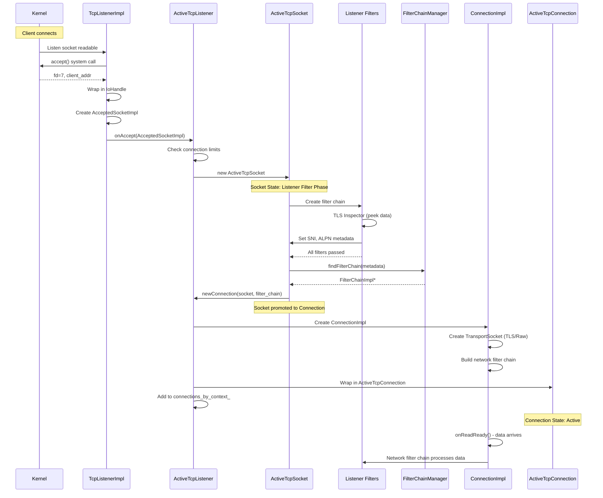

### 7.2 Socket Metadata Evolution

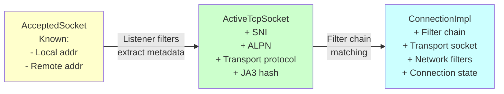

### 7.3 State Tracking Across Layers

| Stage | State Tracker | What's Tracked |
|-------|---------------|----------------|
| **Listen** | TcpListenerImpl | Socket readable events, accept queue |
| **Accepted** | AcceptedSocketImpl | Addresses, overload state |
| **Filtering** | ActiveTcpSocket | Filter iteration, timeout, metadata |
| **Active** | ConnectionImpl | Connection state (Open/Closing/Closed) |
| **Tracked** | ActiveTcpConnection | Connection in listener's connection pool |

---

## 8. Quick Reference

### 8.1 When to Use Which Class

**Need to...**
- **Accept connections?** → Use `TcpListenerImpl`
- **Handle accepted socket?** → Use `ActiveTcpListener::onAccept()`
- **Run listener filters?** → Use `ActiveTcpSocket`
- **Transfer data?** → Use `ConnectionImpl`
- **Track connection in listener?** → Use `ActiveTcpConnection`

### 8.2 Class Selection Guide

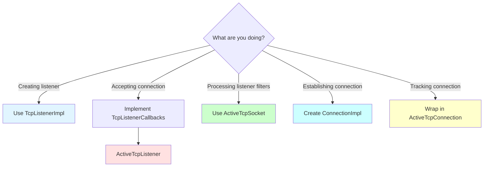

### 8.3 Common Pitfalls

❌ **Don't confuse:**
- Listen socket with connected socket (different file descriptors!)
- AcceptedSocket with Connection (socket is pre-filters, connection is post-filters)
- ActiveTcpSocket with ActiveTcpConnection (socket is temporary, connection is for full lifetime)

✅ **Remember:**
- One listen socket per listener (shared by all connections)
- One connected socket per client connection
- Listen socket never closes during normal operation
- Connected sockets close when client disconnects
- Socket → ActiveTcpSocket → Connection (not reversible)

### 8.4 File Descriptor Tracking

```
Server starts listener on port 8080:
    fd=3: Listen socket (bound to 0.0.0.0:8080)

Client A connects:
    fd=7: Connected socket for Client A
    fd=3: Still open, listening

Client B connects:
    fd=8: Connected socket for Client B
    fd=7: Still talking to Client A
    fd=3: Still open, listening

Client A disconnects:
    fd=7: Closed
    fd=8: Still talking to Client B
    fd=3: Still open, listening

Server shuts down:
    fd=8: Closed (force-close Client B)
    fd=3: Closed (stop listening)
```

### 8.5 Memory Ownership Summary

| Object | Owner | Lifetime |
|--------|-------|----------|
| ListenSocket | ListenSocketFactory | Listener lifetime |
| TcpListenerImpl | ActiveTcpListener | Listener lifetime |
| AcceptedSocket | Temporary | Until wrapped in ActiveTcpSocket |
| ActiveTcpSocket | sockets_ list in ActiveStreamListenerBase | Listener filter phase |
| ConnectionImpl | connections_ list in ActiveConnections | Connection lifetime |
| ActiveTcpConnection | connections_ list in ActiveConnections | Connection lifetime |
| TransportSocket | ConnectionImpl | Connection lifetime |

---

## Summary

**Key Takeaways:**

1. **Two socket types at OS level:**
   - Listen socket: Passive, waits for connections, never transfers data
   - Connected socket: Active, transfers data with specific client

2. **accept() is the dividing line:**
   - Before: Only listen socket exists
   - After: New connected socket created, listen socket unchanged

3. **Envoy's layered abstraction:**
   - IoHandle wraps file descriptor
   - Socket classes add addresses and metadata
   - Listener classes integrate with event loop
   - Connection classes add protocol handling

4. **Progressive metadata enrichment:**
   - AcceptedSocket: Just addresses
   - ActiveTcpSocket: + SNI, ALPN, transport protocol
   - ConnectionImpl: + filter chain, connection state

5. **One-way transformation:**
   - Socket → ActiveTcpSocket → Connection (irreversible)
   - Each stage adds functionality and context
   - Resources cleaned up in reverse order

This foundation helps understand why Envoy has so many socket/connection-related classes - each serves a specific purpose in the connection lifecycle!
