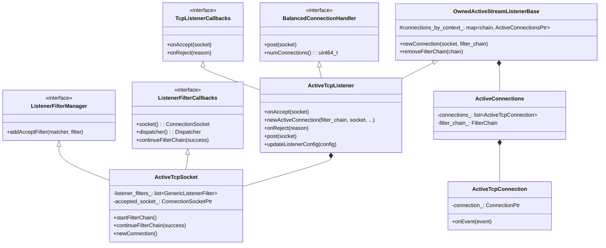
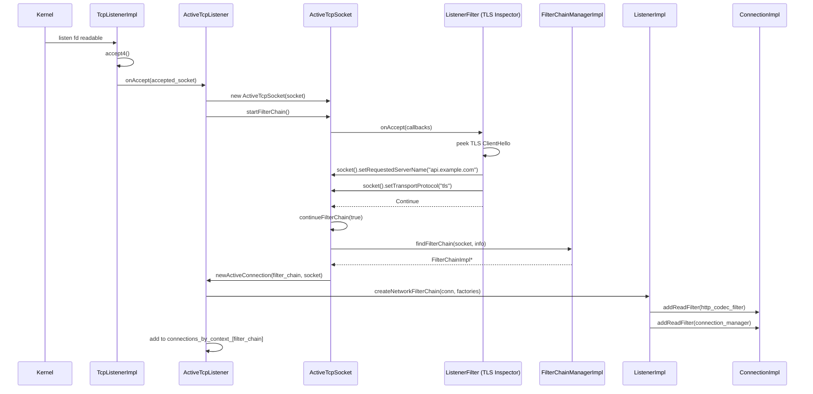
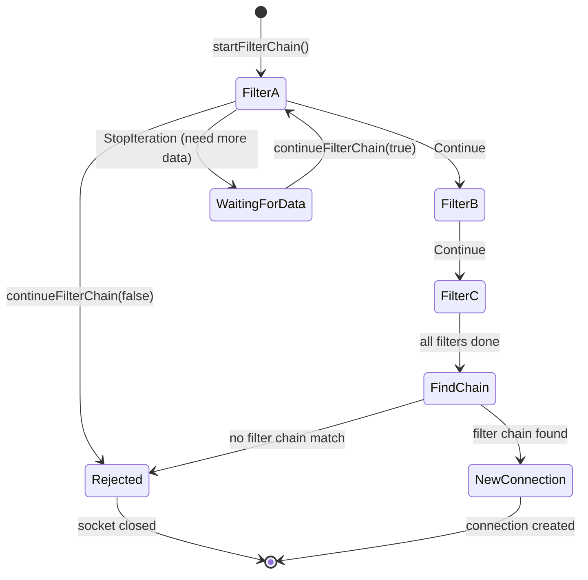
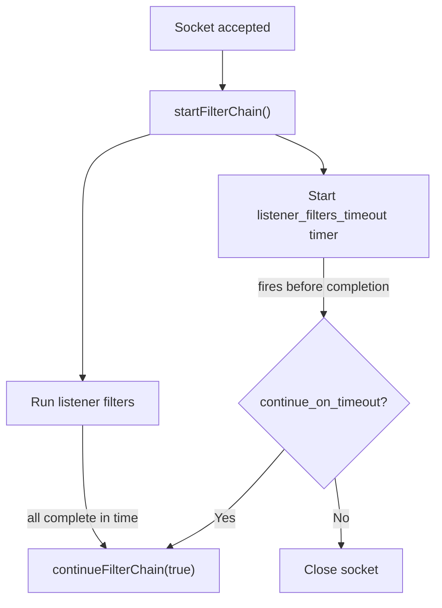
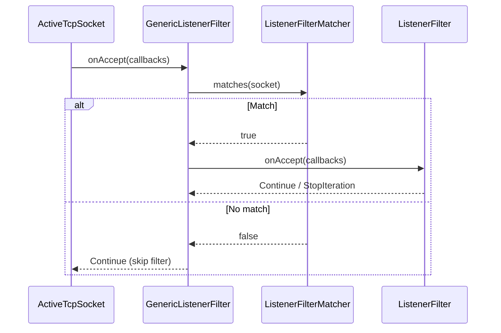
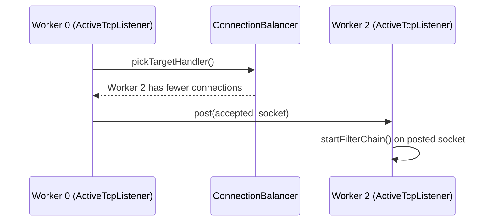
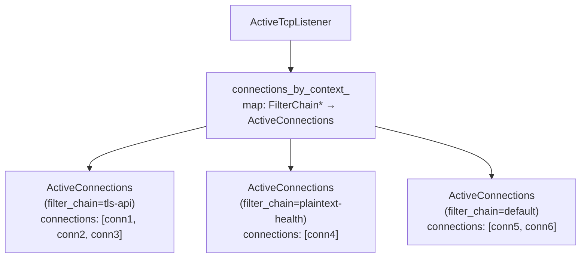
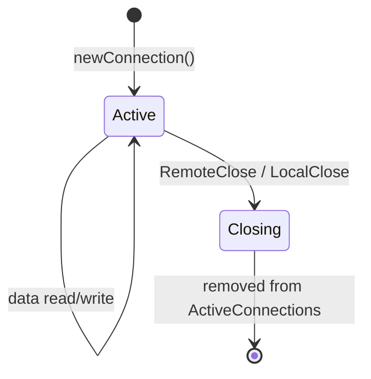
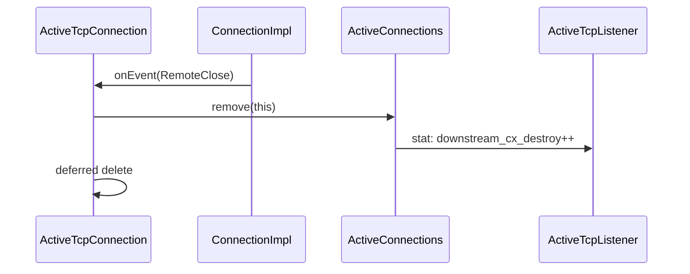
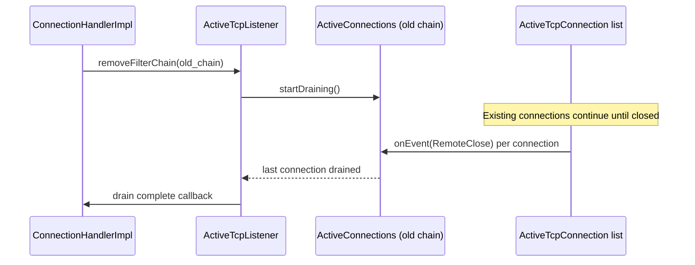

# ActiveTcpListener & ActiveTcpSocket

**Files:**
- `source/common/listener_manager/active_tcp_listener.h/.cc`
- `source/common/listener_manager/active_tcp_socket.h/.cc`
- `source/common/listener_manager/active_stream_listener_base.h/.cc`
**Namespace:** `Envoy::Server`

## Overview

`ActiveTcpListener` is the per-worker wrapper for a TCP listener. When a connection is accepted, it creates an `ActiveTcpSocket` to run listener filters, then selects a filter chain and creates a `ConnectionImpl`. `ActiveStreamListenerBase` provides the base logic for managing connections grouped by filter chain.

## Class Hierarchy



## Accept-to-Connection Flow



## `ActiveTcpSocket` — Listener Filter Chain

### Listener Filter Iteration



### Timeout Handling

Listener filters have a configurable timeout. If filters don't complete within the timeout, the socket is either promoted (with whatever metadata is available) or rejected:



### `GenericListenerFilter` — Wrapped with Matcher

Each listener filter is wrapped in a `GenericListenerFilter` that checks a `ListenerFilterMatcher` predicate first:



## Connection Balancing

`ActiveTcpListener` supports connection balancing: an accepted socket can be redirected to another worker if that worker has fewer connections:



## `ActiveConnections` — Per Filter Chain

Connections are grouped by their matched filter chain. This enables filter-chain-level drain (when a filter chain is updated, only connections using that chain are drained):



## `ActiveTcpConnection` — Per Connection Lifecycle





## Filter Chain Draining

When a filter chain is replaced, only the connections on that specific chain drain:



## Key Data Relationships

```
ActiveTcpListener (per worker, per listen address)
  ├── accepted_sockets_: list<ActiveTcpSocket>
  │     └── listener_filters_: list<GenericListenerFilter>
  └── connections_by_context_: map<FilterChain*, ActiveConnections>
        └── connections_: list<ActiveTcpConnection>
              └── connection_: Network::ConnectionPtr
```
