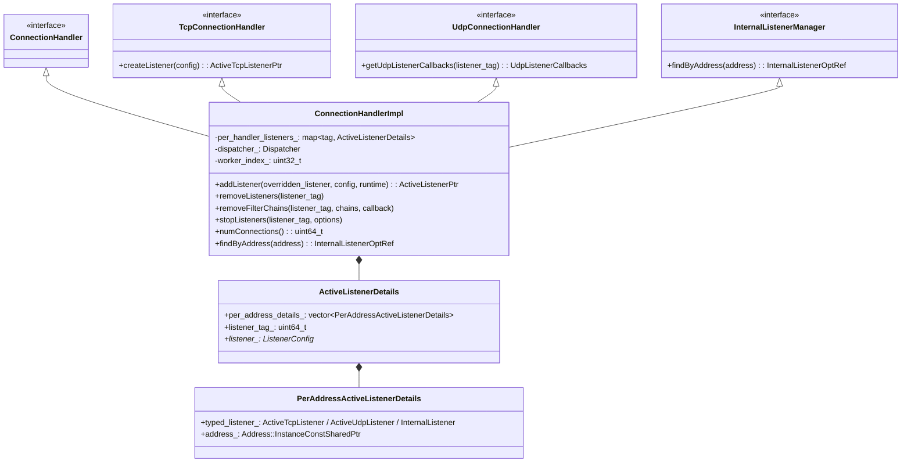
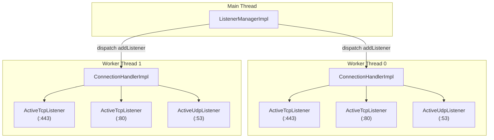
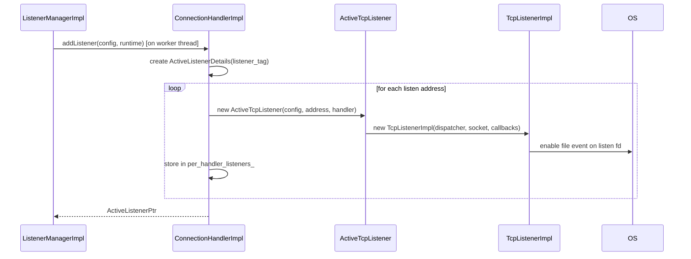
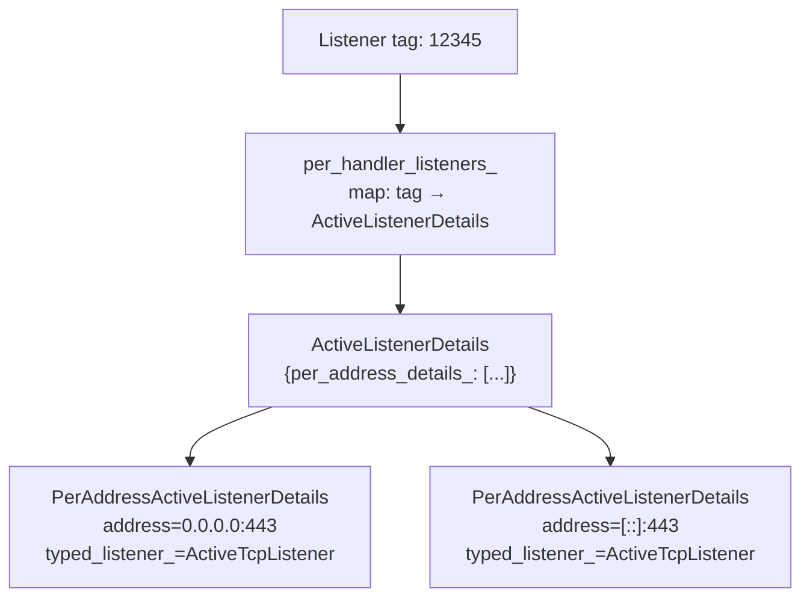
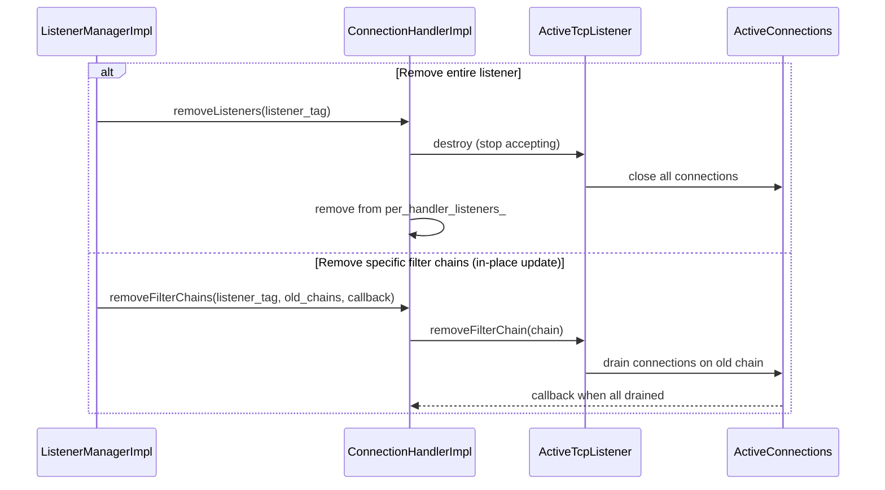
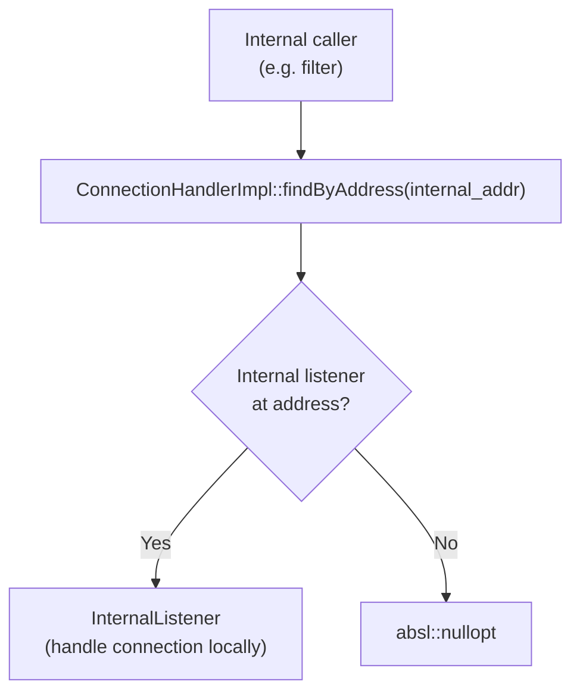

# ConnectionHandlerImpl

**Files:** `source/common/listener_manager/connection_handler_impl.h` / `.cc`  
**Size:** ~8 KB header, ~19 KB implementation  
**Namespace:** `Envoy::Server`

## Overview

`ConnectionHandlerImpl` is the **per-worker thread** connection handler. Each worker thread has one `ConnectionHandlerImpl` that owns all the active listeners and connections for that thread. It creates TCP/UDP listeners, manages listener lifecycle, and dispatches connection operations.

## Class Hierarchy

## Worker Thread Architecture

## `addListener` Flow

## Listener Lookup

## Remove Listeners / Filter Chains

## Internal Listener Support

For Envoy internal communication (e.g., between filters or internal redirect), `ConnectionHandlerImpl` supports internal listeners:

## Stats

Key stats maintained per worker:

| Stat | What it tracks |
|------|---------------|
| `downstream_cx_total` | Total connections accepted |
| `downstream_cx_active` | Currently active connections |
| `downstream_cx_destroy` | Connections destroyed |
| `no_filter_chain_match` | Connections with no matching filter chain |
