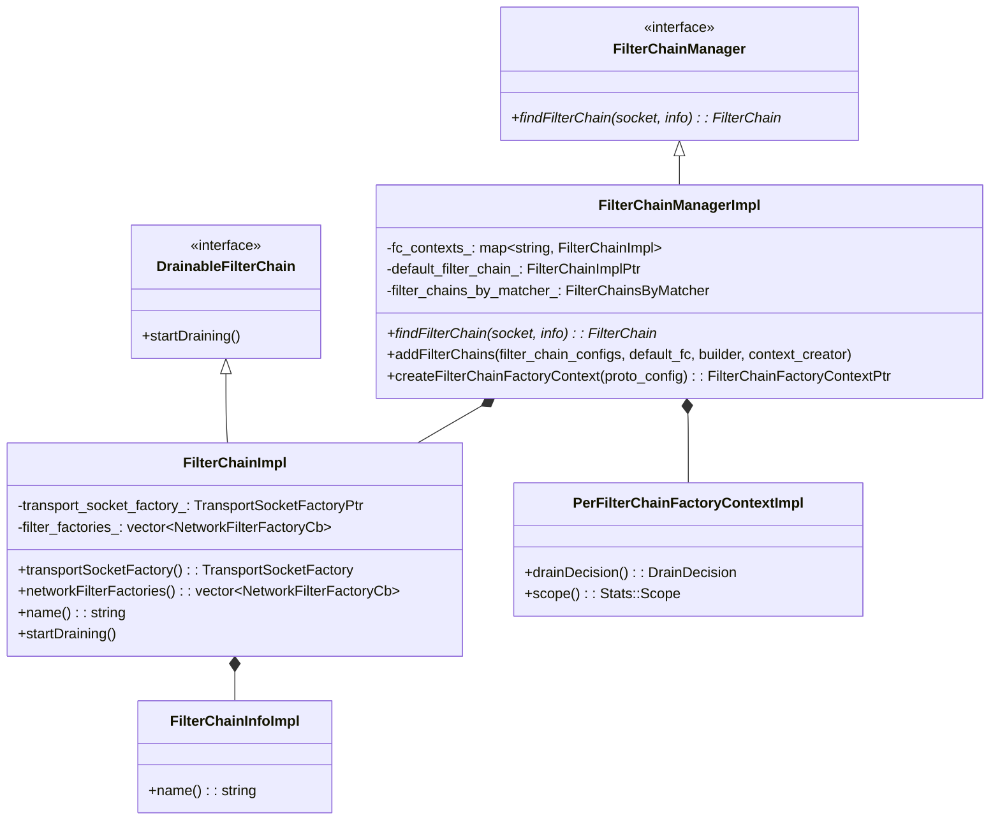
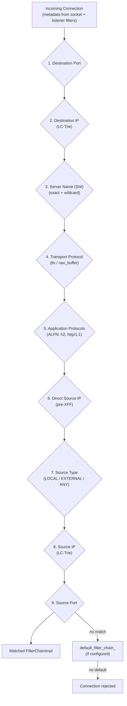
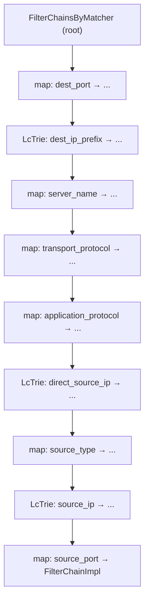
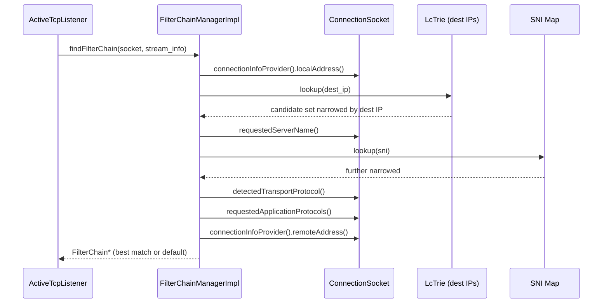
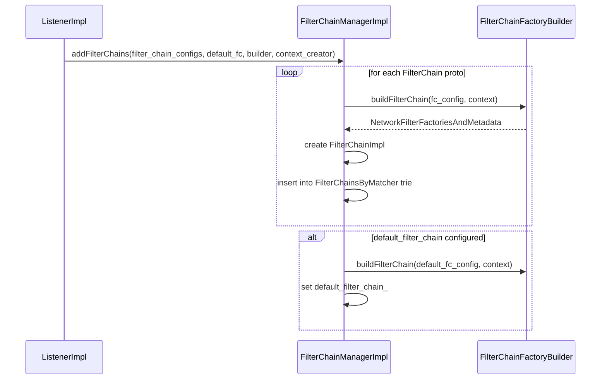
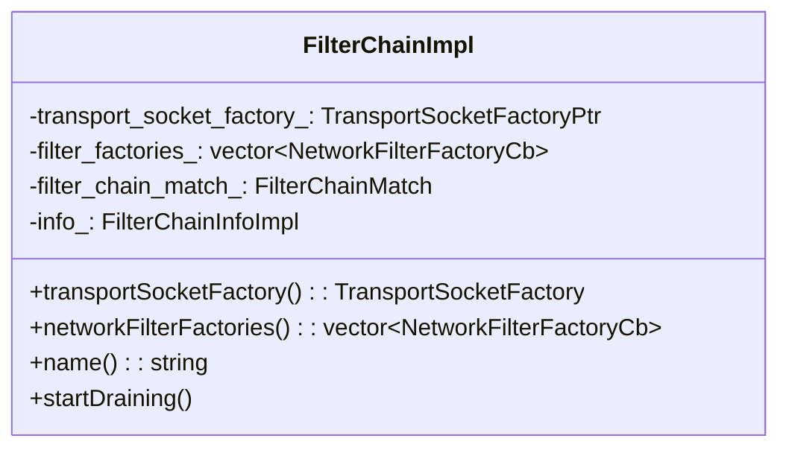
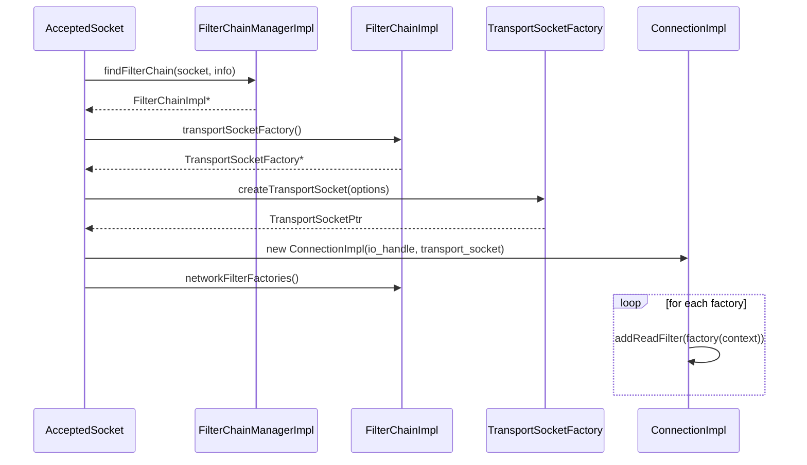
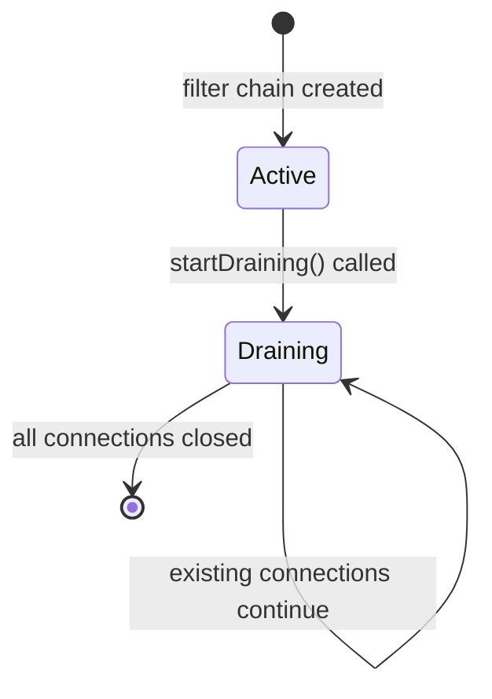

# FilterChainManagerImpl

**Files:** `source/common/listener_manager/filter_chain_manager_impl.h` / `.cc`  
**Size:** ~19 KB header, ~39 KB implementation  
**Namespace:** `Envoy::Server`

## Overview

`FilterChainManagerImpl` selects the correct filter chain for an incoming connection based on the connection's metadata (destination IP, SNI, ALPN, source IP/port). It uses a nested trie structure for fast O(1) matching across multiple criteria. It also manages filter chain lifecycle, draining, and factory context creation.

## Class Hierarchy



## Filter Chain Selection — Matching Criteria

Matching criteria are evaluated in a strict priority order. The first matching filter chain wins:



## Internal Matching Structure — `FilterChainsByMatcher`

The matching is implemented as a nested map/trie structure, with each level narrowing the candidate set:



## `findFilterChain` Flow



## SNI Matching — Exact and Wildcard

```mermaid
flowchart TD
    SNI["Requested SNI:<br/>api.example.com"] --> B{Exact match in map?}
    B -->|Yes| Found["Matched: api.example.com"]
    B -->|No| C{Wildcard match?<br/>*.example.com}
    C -->|Yes| WFound["Matched: *.example.com"]
    C -->|No| D{Empty SNI match?<br/>(catch-all)"}
    D -->|Yes| CatchAll["Matched: catch-all chain"]
    D -->|No| NoMatch["No SNI match at this level"]
```

## `addFilterChains` — Building the Trie



## `FilterChainImpl` — Per Filter Chain



What it holds per filter chain:

| Field | Purpose |
|-------|---------|
| `transport_socket_factory_` | Creates the TransportSocket (TLS or raw) for this chain |
| `filter_factories_` | Ordered list of network filter factory callbacks |
| `filter_chain_match_` | The matching criteria proto |
| `info_` | Metadata (name, filter chain info) |

## Connection to Filter Chain — Runtime



## Drain Flow

When a filter chain is replaced, the old `FilterChainImpl` is drained:



## Match Criteria Reference

| Priority | Match Field | Proto Field | Example Value |
|----------|-------------|-------------|--------------|
| 1 | Destination port | `destination_port` | `443` |
| 2 | Destination IP prefix | `prefix_ranges` | `10.0.0.0/8` |
| 3 | Server name (SNI) | `server_names` | `api.example.com`, `*.example.com` |
| 4 | Transport protocol | `transport_protocol` | `tls`, `raw_buffer` |
| 5 | Application protocols | `application_protocols` | `h2`, `http/1.1` |
| 6 | Direct source IP | `direct_source_prefix_ranges` | `172.16.0.0/12` |
| 7 | Source type | `source_type` | `LOCAL`, `EXTERNAL`, `ANY` |
| 8 | Source IP | `source_prefix_ranges` | `192.168.0.0/16` |
| 9 | Source port | `source_ports` | `5000` |
