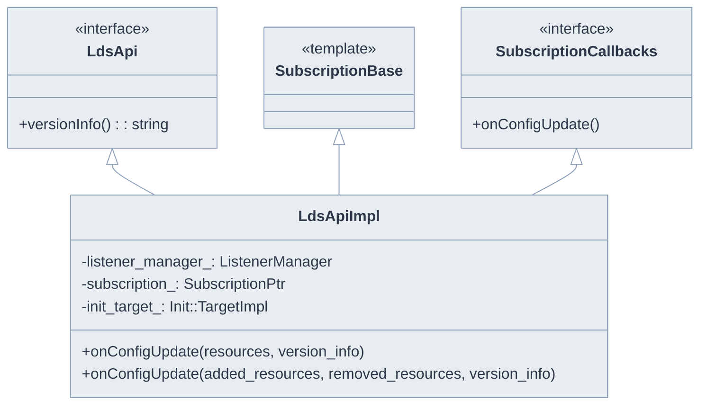
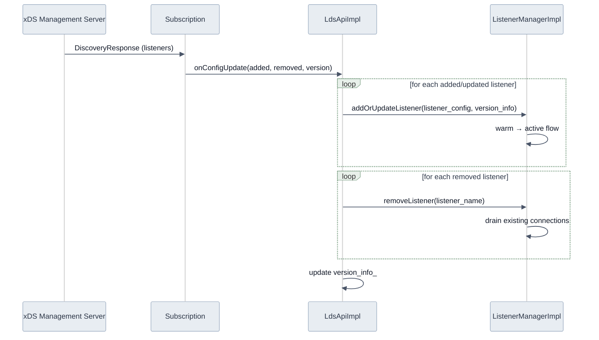
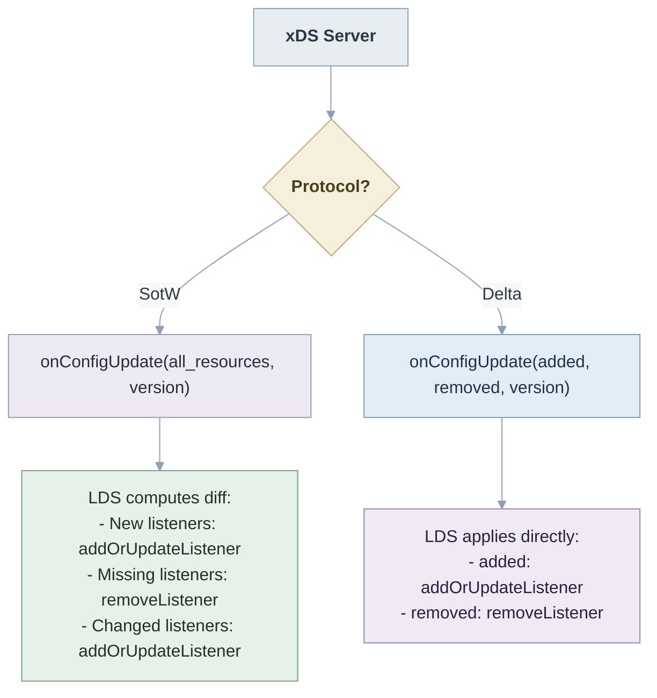
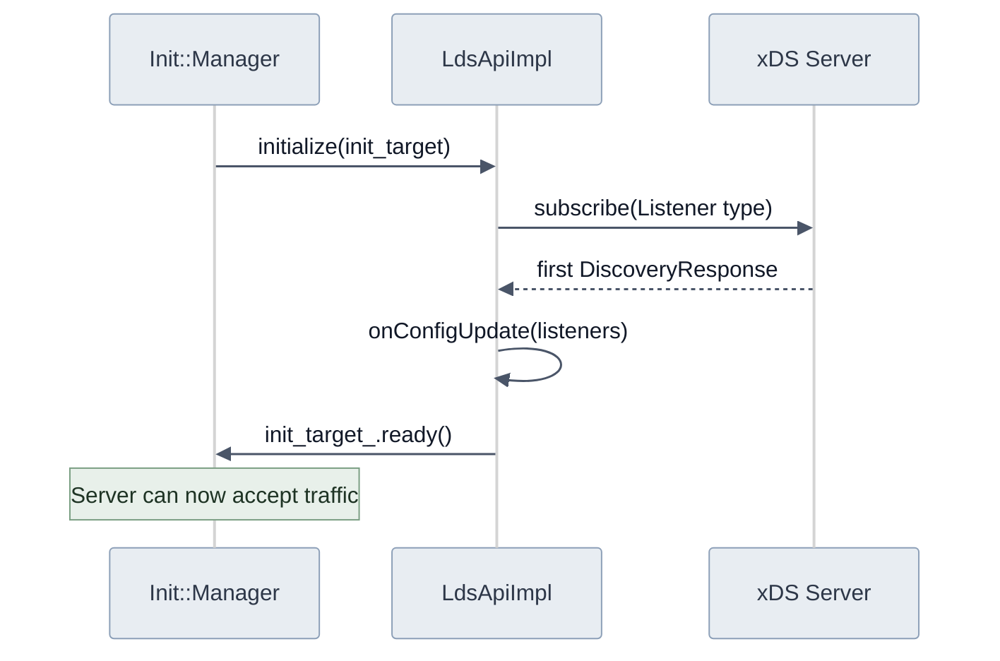
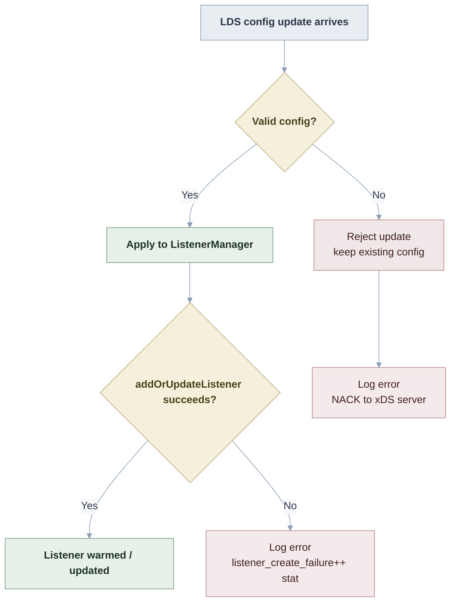

# LdsApiImpl

**Files:** `source/common/listener_manager/lds_api.h` / `.cc`  
**Size:** ~2 KB header, ~6.7 KB implementation  
**Namespace:** `Envoy::Server`

## Overview

`LdsApiImpl` implements the Listener Discovery Service (LDS) API. It subscribes to listener configuration from an xDS management server (or filesystem) and drives `ListenerManagerImpl::addOrUpdateListener()` and `removeListener()` on config changes.

## Class Hierarchy

## LDS Config Update Flow

## SotW vs Delta xDS

LDS supports both State-of-the-World (SotW) and Delta xDS protocols:

## Init Target Integration

LDS is an initialization target. Envoy waits for the first LDS response before marking the server as ready:

## Error Handling

## Subscription Configuration

| Config Field | Purpose |
|-------------|---------|
| `lds_config.api_config_source` | gRPC or REST xDS server address |
| `lds_config.path` | Filesystem path for static LDS config |
| `lds_config.resource_api_version` | V3 API version |
| `lds_config.initial_fetch_timeout` | Max time to wait for first LDS response |
