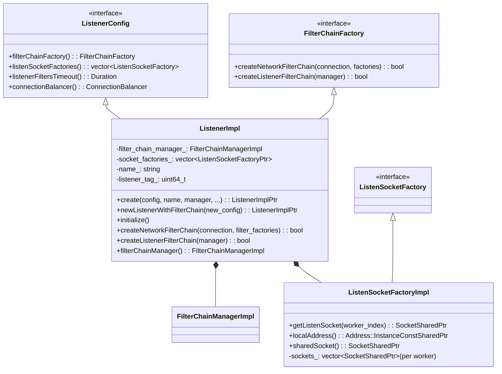
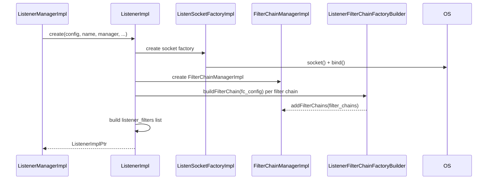
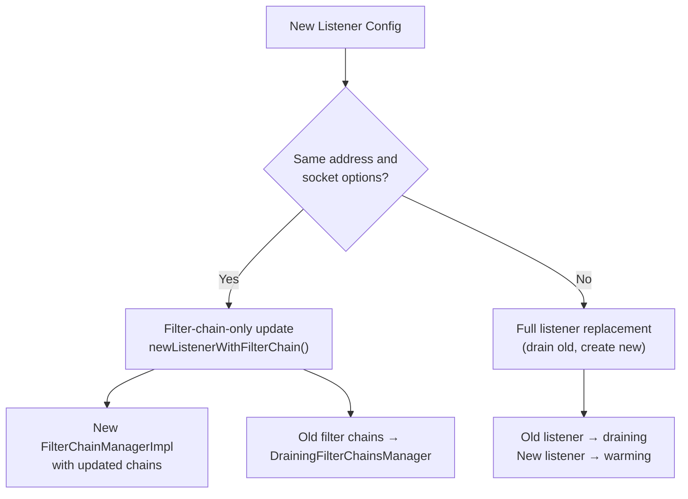
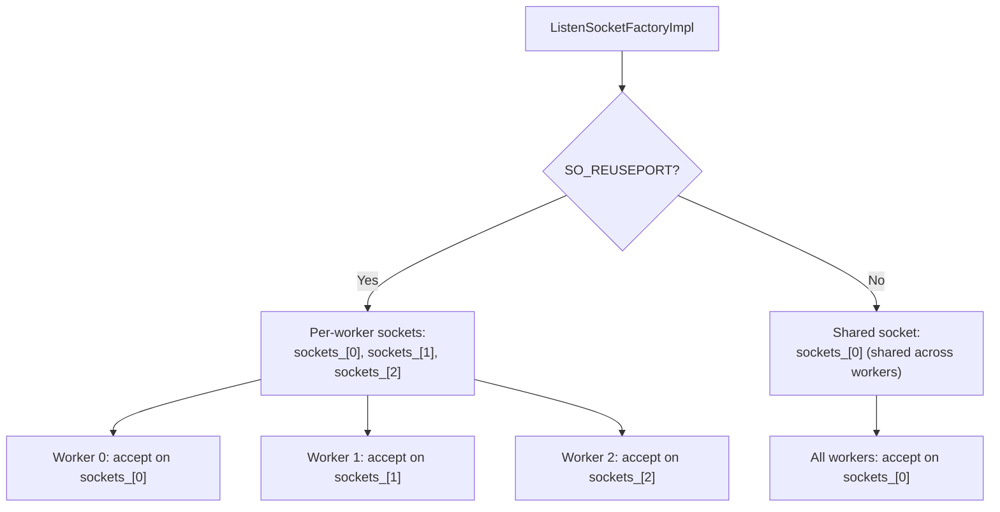
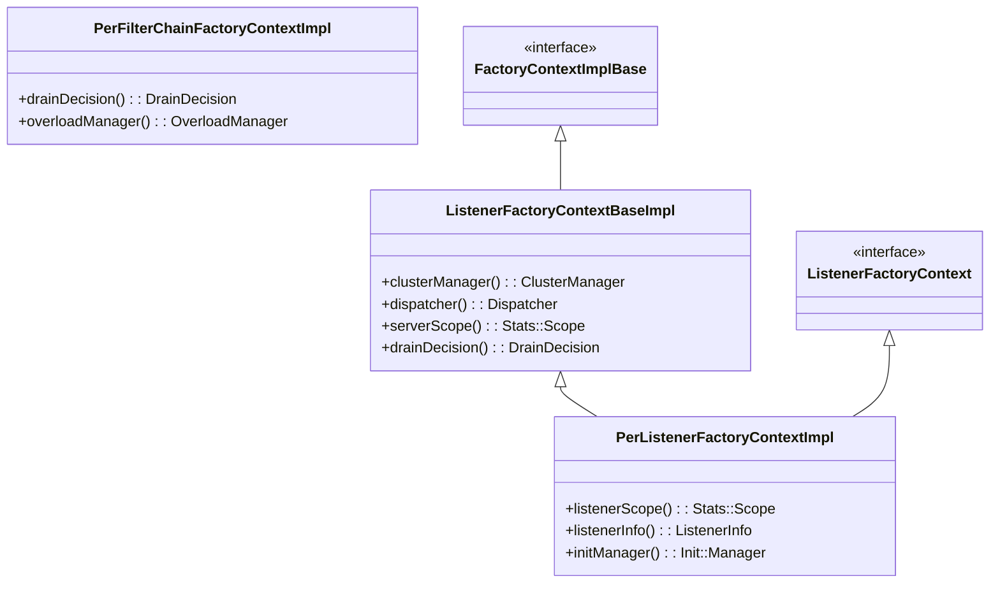
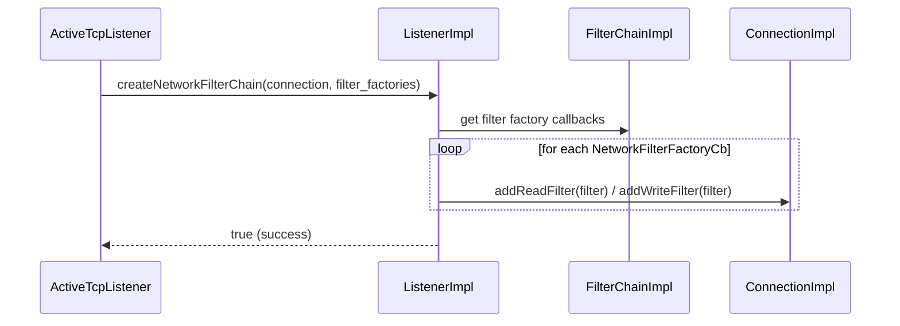
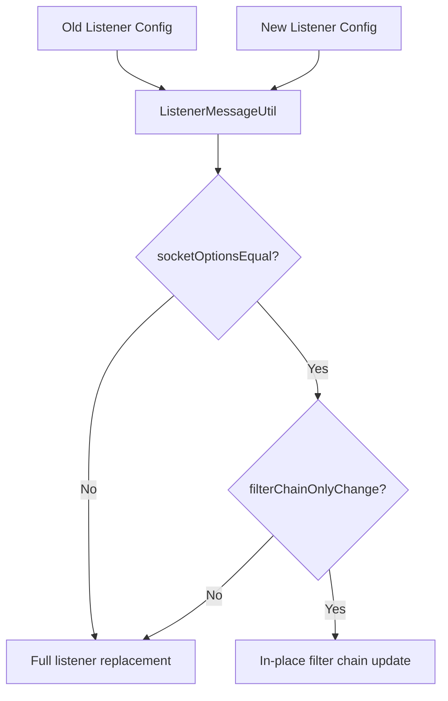

# ListenerImpl

**Files:** `source/common/listener_manager/listener_impl.h` / `.cc`  
**Size:** ~24 KB header, ~66 KB implementation  
**Namespace:** `Envoy::Server`

## Overview

`ListenerImpl` maps a protobuf `Listener` configuration to a runtime listener object. It owns the `FilterChainManagerImpl`, the `ListenSocketFactory`, and all the factory contexts needed to construct filter chains. It implements both `Network::ListenerConfig` (to configure the listener at the network level) and `Network::FilterChainFactory` (to construct filter chains for accepted connections).

## Class Hierarchy

## Listener Creation Flow

## In-Place Filter Chain Update

When only filter chains change (address and socket options are identical), the listener avoids rebinding:

## `ListenSocketFactoryImpl` — Per-Worker Sockets

With `SO_REUSEPORT`, each worker thread gets its own listen socket. Without it, all workers share a single socket:

## Factory Contexts

## `createNetworkFilterChain` — Per-Connection

Called for every new accepted connection to instantiate the network filter chain:

## `ListenerMessageUtil`

Static helper that compares listener configs to determine the type of update:

## Configuration Highlights

| Config Field | Purpose |
|-------------|---------|
| `listener_filters` | Pre-connection filters (TLS inspector, proxy protocol, original dst) |
| `listener_filters_timeout` | Max time to wait for listener filters before closing |
| `filter_chains` | List of filter chains with match criteria (SNI, ALPN, source IP, etc.) |
| `default_filter_chain` | Fallback when no `filter_chain_match` matches |
| `per_connection_buffer_limit_bytes` | Watermark buffer limit per connection |
| `connection_balance_config` | Connection balancing across workers |
| `enable_reuse_port` | Whether to use `SO_REUSEPORT` |
| `bind_to_port` | Whether to bind (false for API listeners) |
| `traffic_direction` | INBOUND / OUTBOUND / UNSPECIFIED |
