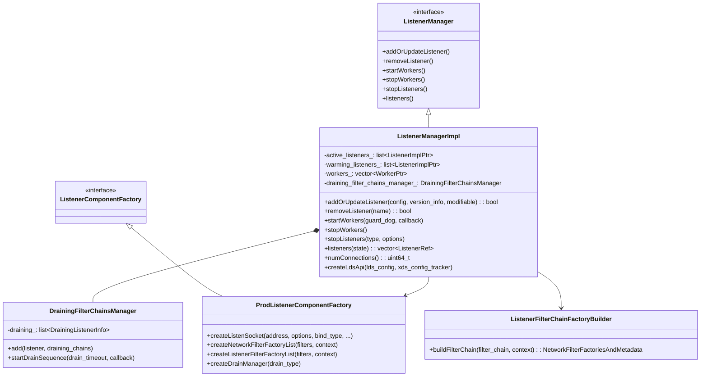
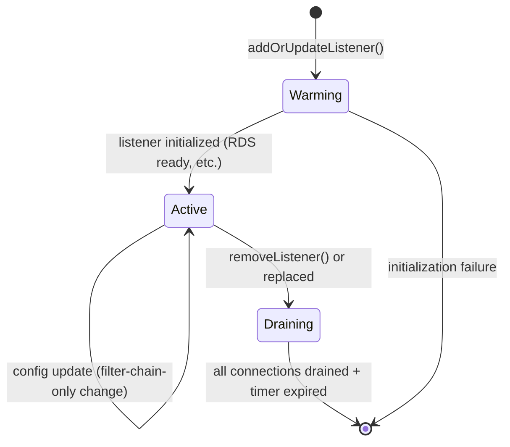
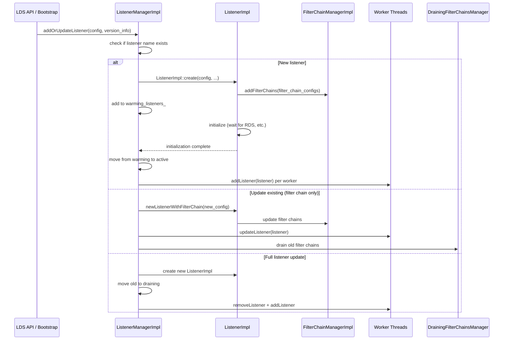
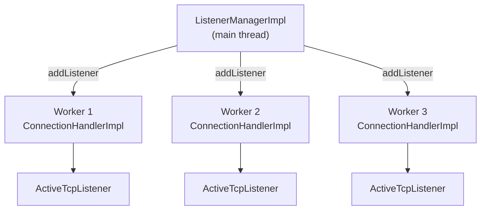
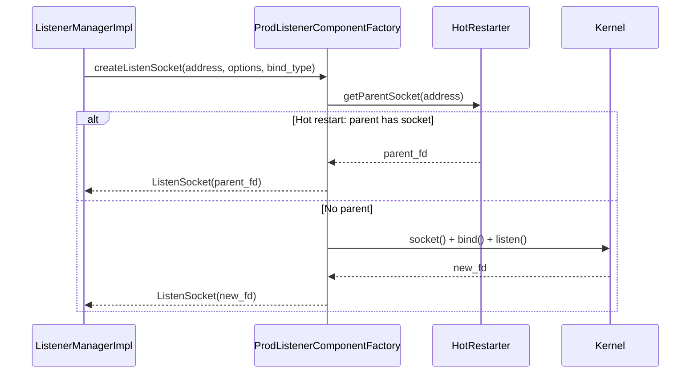
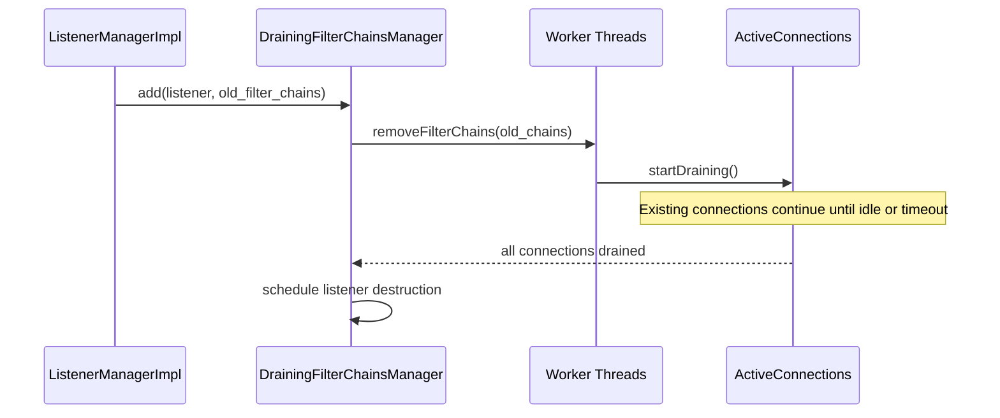
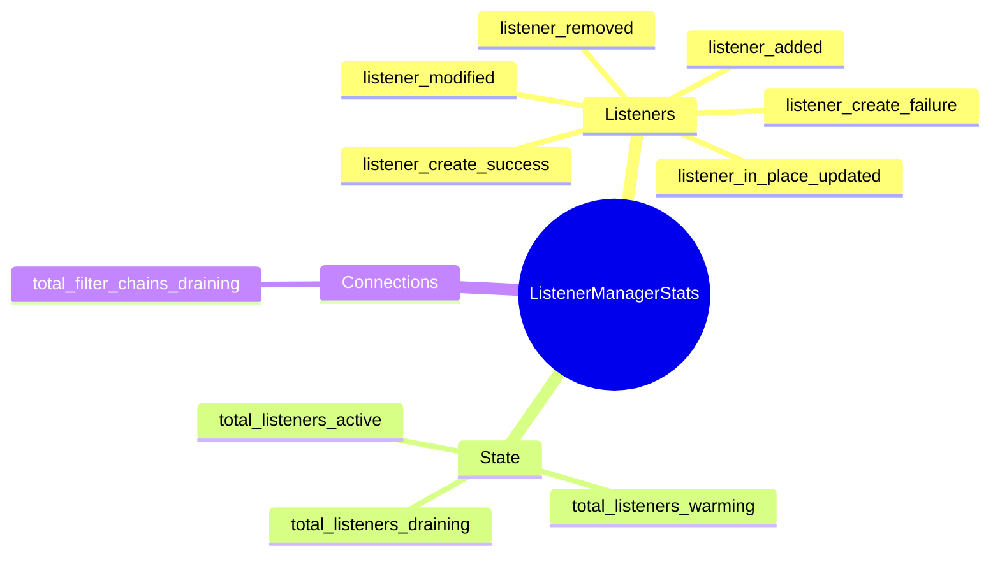

# ListenerManagerImpl

**Files:** `source/common/listener_manager/listener_manager_impl.h` / `.cc`  
**Size:** ~22 KB header, ~62 KB implementation  
**Namespace:** `Envoy::Server`

## Overview

`ListenerManagerImpl` is the top-level manager for all Envoy listeners. It runs on the **main thread** and coordinates:

- Adding, updating, and removing listeners (static and dynamic via LDS)
- Creating and sharing listen sockets (with hot-restart support)
- Dispatching listeners to worker threads
- Draining old listeners and filter chains on config changes
- Managing listener lifecycle (warming → active → draining)

## Class Hierarchy

## Listener Lifecycle

## Add/Update Listener Flow

## Worker Dispatch

## `ProdListenerComponentFactory` — Socket and Factory Creation

## `DrainingFilterChainsManager`

Manages the lifecycle of filter chains being replaced. When a listener update only changes filter chains, old filter chains are drained in-place without destroying the listener:

## Stats

## Key Configuration Points

| Config | Effect |
|--------|--------|
| `listener.name` | Unique identifier for update/remove |
| `listener.address` | Bind address (IP:port, UDS, internal) |
| `listener.filter_chains` | List of filter chains with match criteria |
| `listener.listener_filters` | Pre-connection filters (TLS inspector, proxy protocol) |
| `listener.drain_type` | `DEFAULT` (graceful) or `MODIFY_ONLY` |
| `listener.per_connection_buffer_limit_bytes` | Watermark buffer limit per connection |
| `listener.enable_reuse_port` | `SO_REUSEPORT` for multi-worker accept |
