# Envoy Network Layer — Overview Part 1: Architecture & Connections

**Directory:** `source/common/network/`  
**Part:** 1 of 4 — Overall Architecture, TCP Connections, Happy Eyeballs, Filter Manager

---

## Table of Contents

1. [High-Level Architecture](#1-high-level-architecture)
2. [Component Map](#2-component-map)
3. [Connection Hierarchy](#3-connection-hierarchy)
4. [ConnectionImpl Deep Dive](#4-connectionimpl-deep-dive)
5. [Data Flow: Read and Write Paths](#5-data-flow-read-and-write-paths)
6. [Watermark and Backpressure](#6-watermark-and-backpressure)
7. [FilterManagerImpl — Network Filter Chain](#7-filtermanagerimpl--network-filter-chain)
8. [HappyEyeballsConnectionImpl — RFC 8305](#8-happyeyeballsconnectionimpl--rfc-8305)
9. [Key Design Patterns](#9-key-design-patterns)

---

## 1. High-Level Architecture

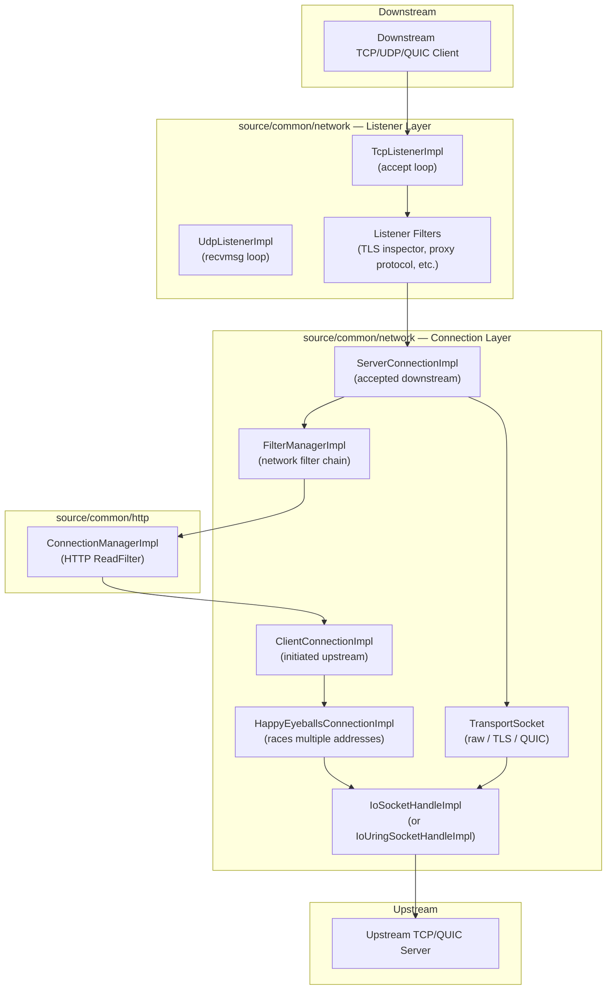

---

## 2. Component Map

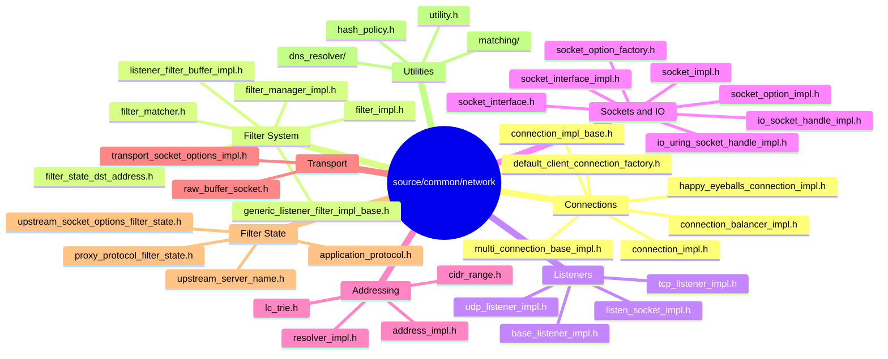

---

## 3. Connection Hierarchy

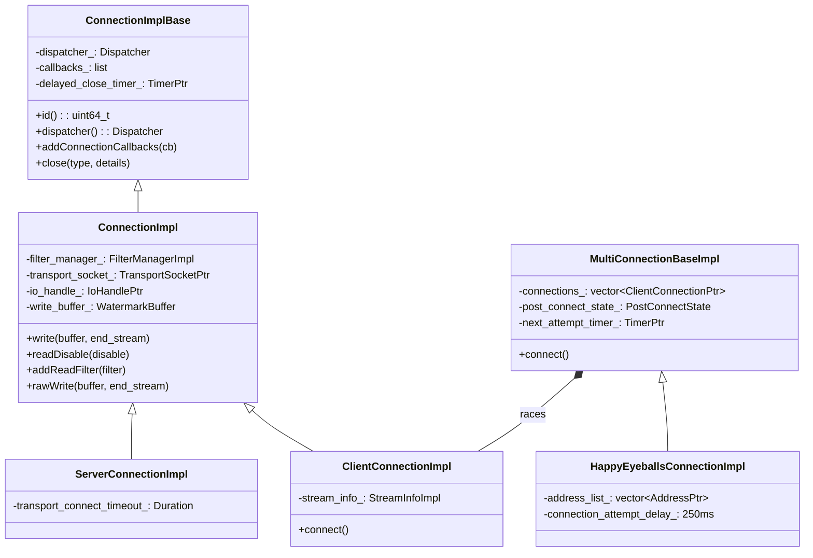

---

## 4. ConnectionImpl Deep Dive

### What `ConnectionImpl` Owns

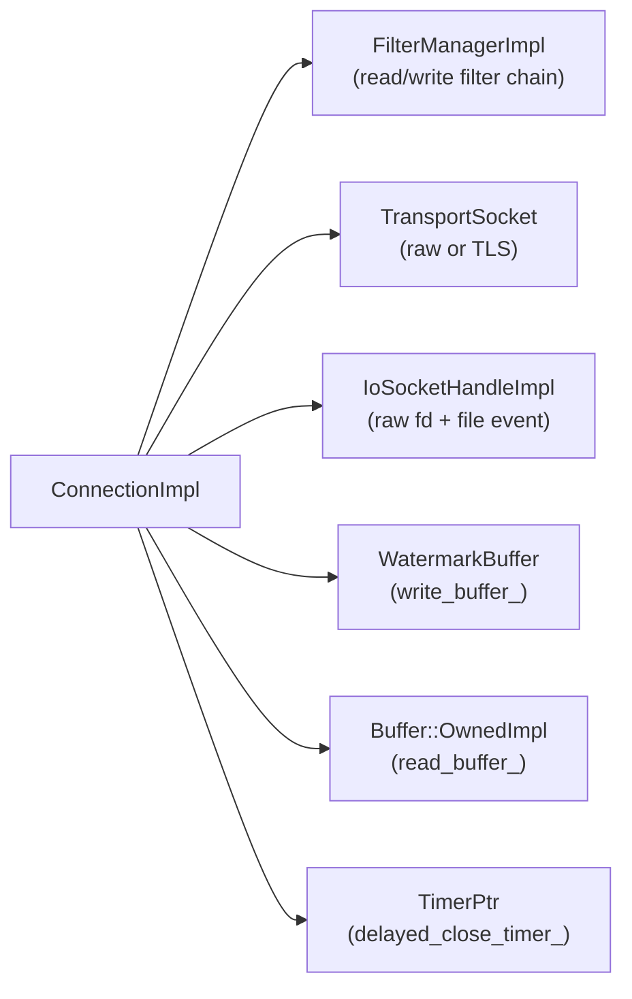

### Connection State Machine

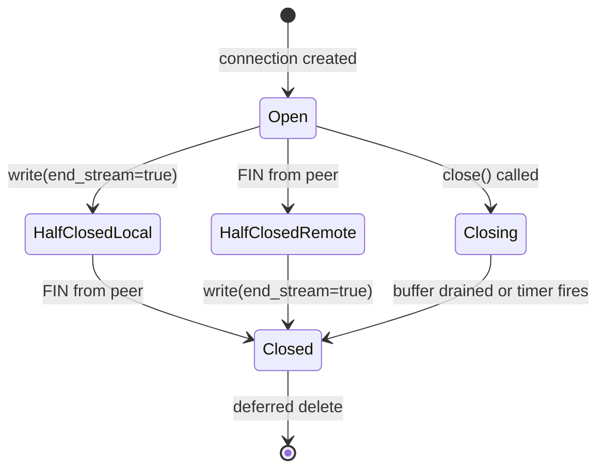

### Close Types

| `CloseType` | Behavior |
|-------------|---------|
| `NoFlush` | Immediate close, discard pending writes |
| `FlushWrite` | Drain write buffer first, then close |
| `FlushWriteAndDelay` | Drain, then wait `delayed_close_timeout` |

### `readDisable` — Reference-Counted Backpressure

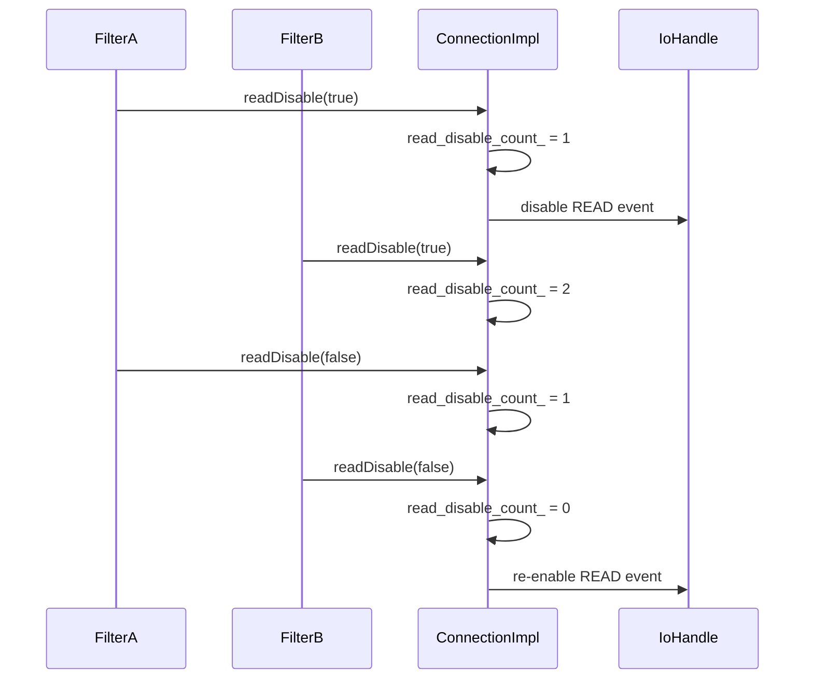

---

## 5. Data Flow: Read and Write Paths

### Read Path (Downstream → Filter Chain)

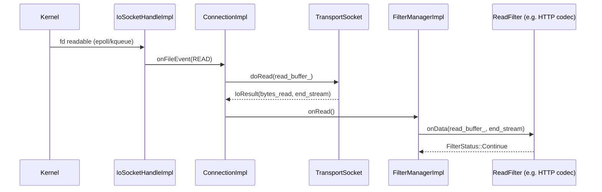

### Write Path (Filter Chain → Downstream)

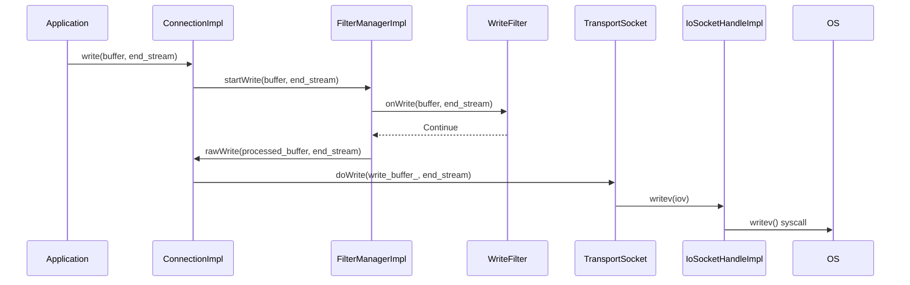

### Transport Socket as Middleware

```mermaid
flowchart LR
    subgraph TransportSocketChain
        CI["ConnectionImpl"] -->|doRead| TS_Read["TransportSocket::doRead<br/>(e.g. TLS decrypt)"] -->|plaintext| RB["read_buffer_"]
        WB["write_buffer_<br/>(ciphertext or plaintext)"] <--|doWrite| TS_Write["TransportSocket::doWrite<br/>(e.g. TLS encrypt)"] <--|plaintext| App
    end
```

---

## 6. Watermark and Backpressure

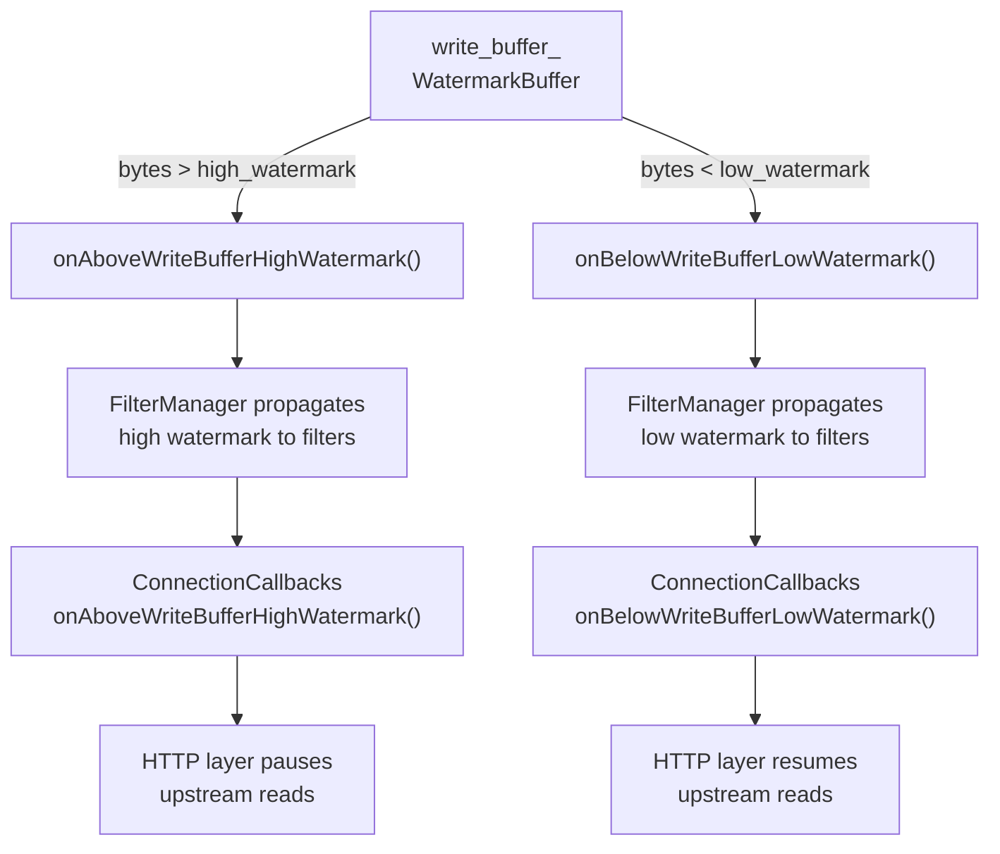

### Default Watermark Values

| Level | Default | Configurable via |
|-------|---------|-----------------|
| Low watermark | 32 KB | `setBufferLimits()` |
| High watermark | 64 KB | `setBufferLimits()` |

---

## 7. FilterManagerImpl — Network Filter Chain

### Filter Ordering

```mermaid
flowchart LR
    subgraph ReadFilters["Read Filters (forward: A → B → C)"]
        direction LR
        RA["ReadFilter A<br/>(e.g. TLS)"] --> RB["ReadFilter B<br/>(e.g. HTTP codec)"] --> RC["ReadFilter C"]
    end

    subgraph WriteFilters["Write Filters (reverse: C → B → A)"]
        direction RL
        WA["WriteFilter A"] <-- WB["WriteFilter B"] <-- WC["WriteFilter C"]
    end

    Net["Network (raw bytes)"] --> RA
    RC --> App["Application"]
    App --> WA
    WC --> Net
```

### Filter Initialization (`onNewConnection`)

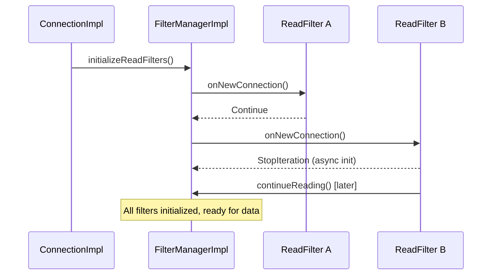

### Pending Close Safety

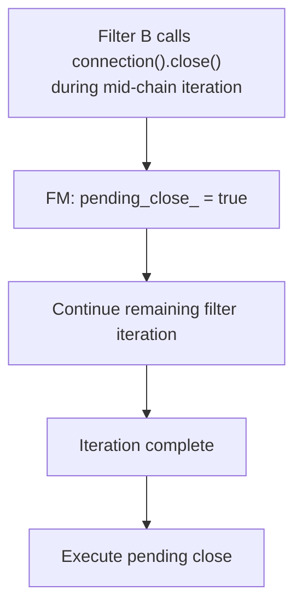

---

## 8. HappyEyeballsConnectionImpl — RFC 8305

### Racing Multiple Addresses

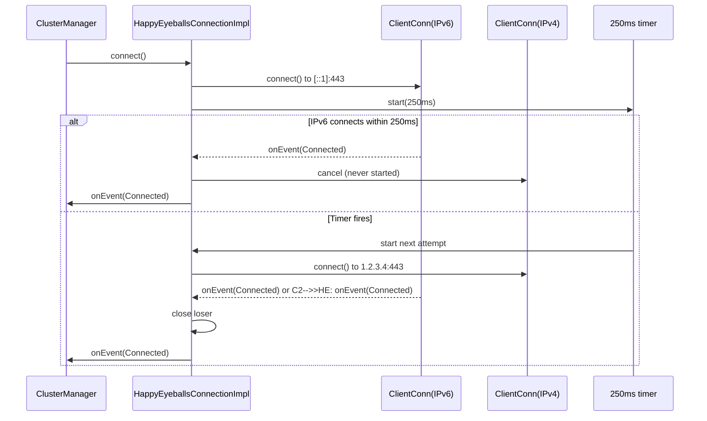

### `PostConnectState` — Deferred Replay

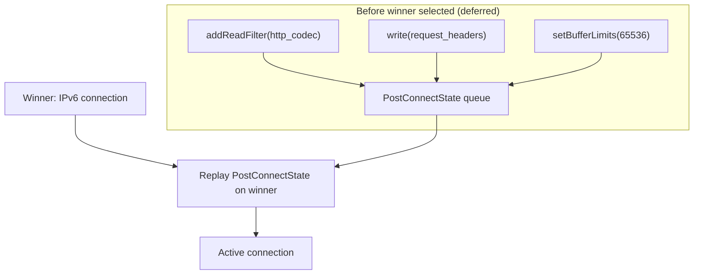

---

## 9. Key Design Patterns

### Pattern 1: Layered I/O Abstraction

Each layer has a single responsibility:

```
IoHandle  →  raw OS syscalls (readv, writev, accept, connect)
Socket    →  addressing + socket options + connection metadata
Connection →  filter chain + transport socket + lifecycle
```

### Pattern 2: Deferred Deletion

All connection objects implement `Event::DeferredDeletable`. Destruction is deferred to the next event loop iteration to prevent use-after-free within the current callback:

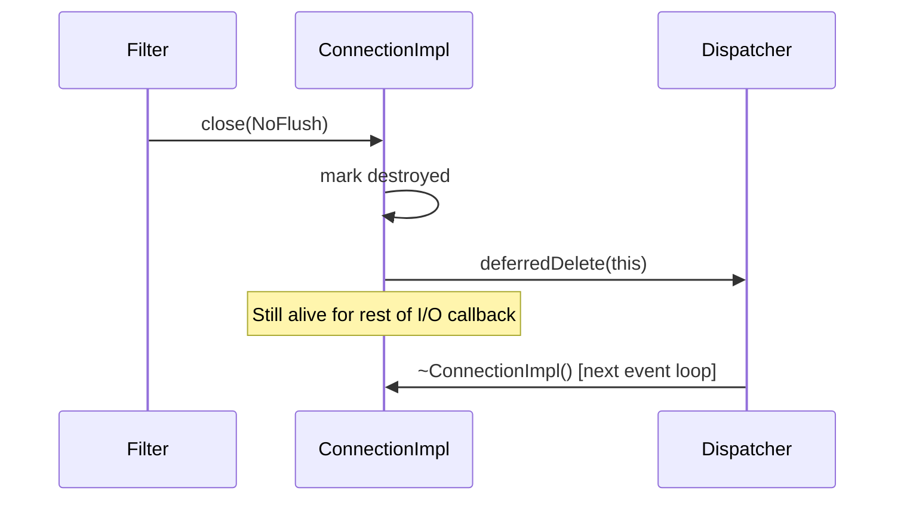

### Pattern 3: Injectable `SocketInterface`

The `SocketInterfaceSingleton` decouples `IoHandle` creation from `ConnectionImpl`, enabling the io_uring backend without any connection code changes:

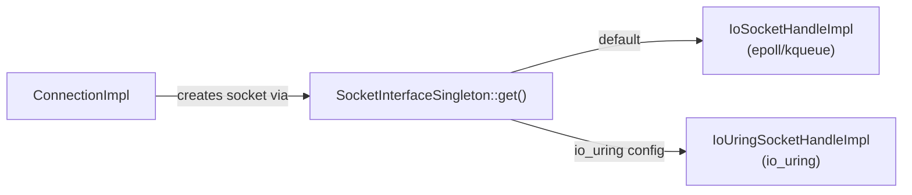

### Pattern 4: Filter State for Cross-Layer Tuning

Downstream filter state travels to the upstream transport layer without tight coupling:

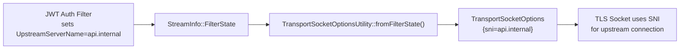

---

## Navigation

| Part | Topics |
|------|--------|
| **Part 1 (this file)** | Architecture, Connections, Happy Eyeballs, Filter Manager |
| [Part 2](OVERVIEW_PART2_filters_and_listeners.md) | Network Filters, TCP/UDP Listeners, Listener Filters |
| [Part 3](OVERVIEW_PART3_sockets_and_io.md) | Sockets, IoHandles, Socket Options, io_uring |
| [Part 4](OVERVIEW_PART4_addressing_dns_and_utilities.md) | Addressing, CIDR, DNS, Matching, Transport Socket Options |
