# Envoy Network Layer — Overview Part 2: Filters & Listeners

**Directory:** `source/common/network/`  
**Part:** 2 of 4 — Network Filter Manager, Listener Filters, TCP/UDP Listeners, Connection Balancing

---

## Table of Contents

1. [Network Filter System Overview](#1-network-filter-system-overview)
2. [FilterManagerImpl — Read/Write Chain Execution](#2-filtermanagerimpl--readwrite-chain-execution)
3. [Listener Filter System](#3-listener-filter-system)
4. [ListenerFilterBufferImpl — Peeking Data](#4-listenerfilterbufferimpl--peeking-data)
5. [TcpListenerImpl — Accept Loop](#5-tcplistenerimpl--accept-loop)
6. [UdpListenerImpl — Datagram Processing](#6-udplistenerimpl--datagram-processing)
7. [Listen Socket Types](#7-listen-socket-types)
8. [Connection Balancing](#8-connection-balancing)

---

## 1. Network Filter System Overview

Envoy has two separate filter systems:

| System | Layer | Data | Per-unit |
|--------|-------|------|---------|
| **Network filters** (`FilterManagerImpl`) | L4 (TCP/UDP) | Raw `Buffer::Instance` | Per connection |
| **HTTP filters** (`Http::FilterManager`) | L7 (HTTP) | Parsed headers/body | Per HTTP request |

Network filters are installed on a connection once at accept time and run for the entire connection lifetime.

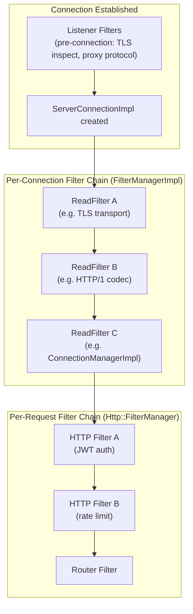

---

## 2. FilterManagerImpl — Read/Write Chain Execution

### Filter Chain Layout

```mermaid
flowchart LR
    subgraph ReadChain["Read Chain (head → tail, forward iteration)"]
        direction LR
        RH["Head"] --> RA["ReadFilter A"] --> RB["ReadFilter B"] --> RT["Tail"]
    end

    subgraph WriteChain["Write Chain (tail → head, reverse iteration)"]
        direction RL
        WH["Head"] <-- WA["WriteFilter A"] <-- WB["WriteFilter B"] <-- WT["Tail"]
    end

    Net["Raw bytes (inbound)"] --> RH
    RT -->|decoded data| App["Application"]
    App -->|response| WT
    WH -->|raw bytes| Net2["Network (outbound)"]
```

### `ActiveReadFilter` and `ActiveWriteFilter`

Each filter in the chain is wrapped in an Active struct that tracks initialization state and provides callback access:

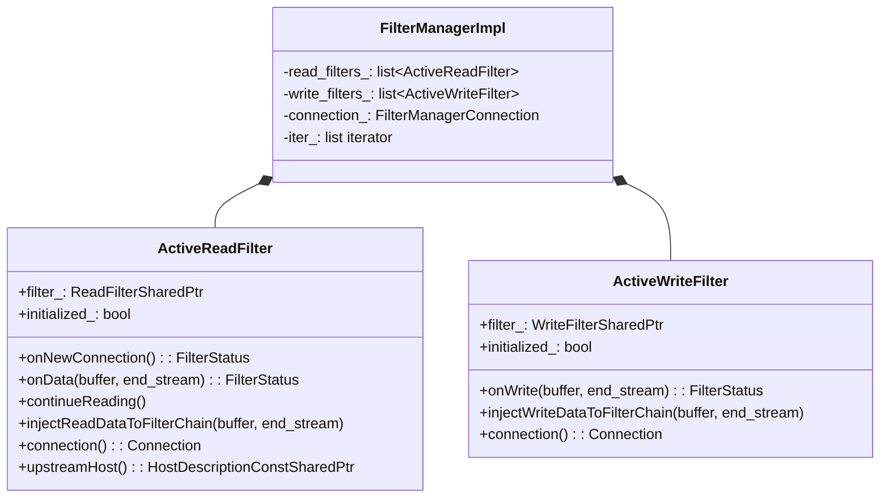

### Read Iteration with Stop/Continue

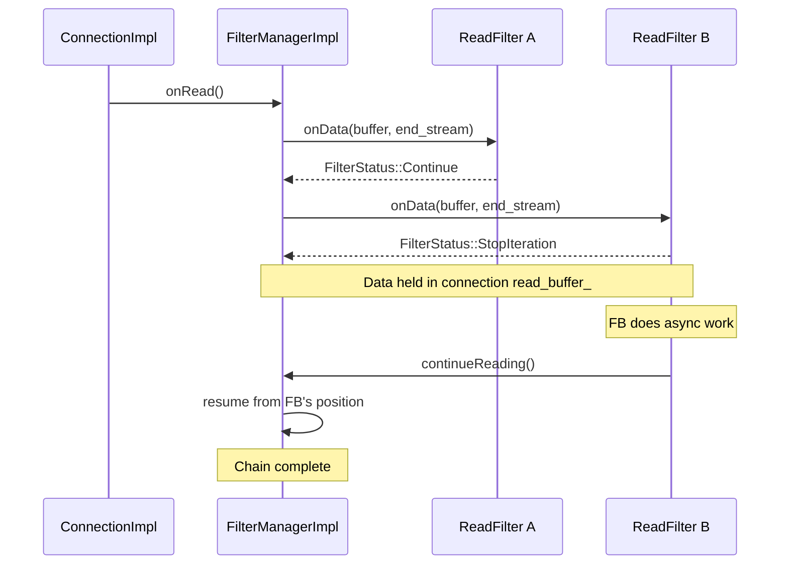

### `injectReadDataToFilterChain`

Allows a filter to synthesize data as if it arrived from the network, bypassing earlier filters:

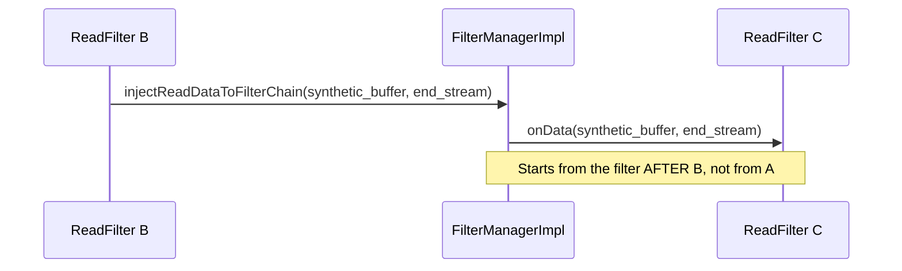

---

## 3. Listener Filter System

Listener filters run **before** a connection is handed to a filter chain. They can inspect early bytes, modify the accepted socket's metadata (SNI, transport protocol, destination address), or outright reject the connection.

### Filter Application Flow

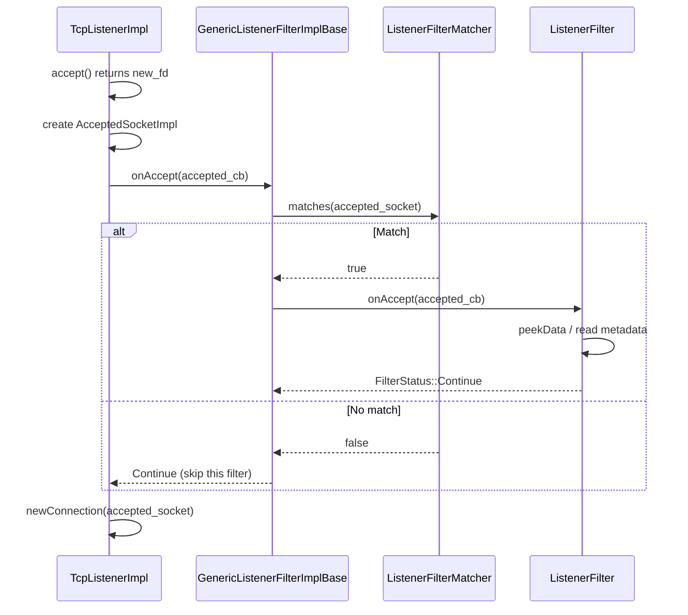

### Listener Filter Matchers

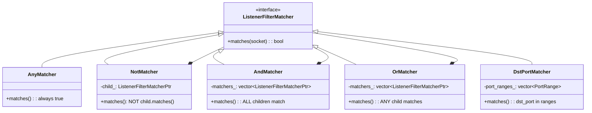

### Matcher Tree Example

```
Config:
  matcher:
    or:
      - dst_port: [443, 8443]
      - and:
          - dst_port: [80, 8080]
          - not: { dst_port: [8080] }

Resulting tree:
  OrMatcher
    ├── DstPortMatcher([443, 8443])
    └── AndMatcher
          ├── DstPortMatcher([80, 8080])
          └── NotMatcher
                └── DstPortMatcher([8080])
```

### Common Listener Filters

| Filter | What it does |
|--------|-------------|
| TLS Inspector | Peeks first bytes to detect TLS ClientHello; sets `transport_protocol=tls` and `requested_server_name` (SNI) |
| HTTP Inspector | Detects HTTP/1.1 vs HTTP/2 from preface bytes |
| Proxy Protocol | Reads PROXY protocol v1/v2 header; sets real remote address in filter state |
| Original Destination | Reads SO_ORIGINAL_DST; sets destination address override |

---

## 4. ListenerFilterBufferImpl — Peeking Data

Listener filters need to inspect connection bytes **without consuming them** from the socket buffer. `ListenerFilterBufferImpl` uses `recv(MSG_PEEK)`:

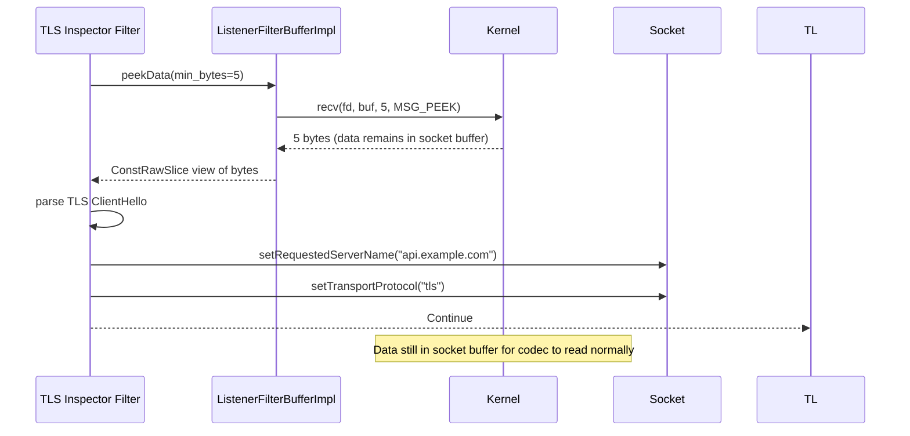

### Peek vs Drain

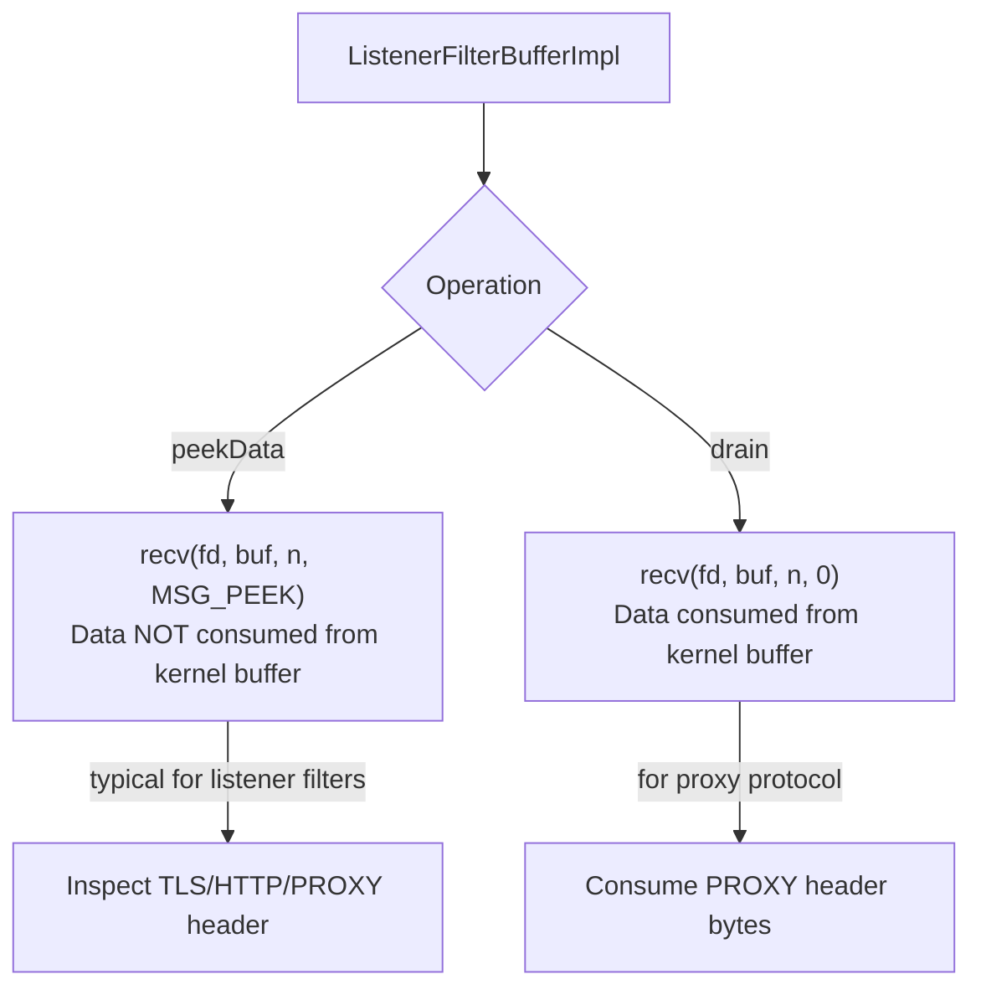

---

## 5. TcpListenerImpl — Accept Loop

### Accept Loop Flow

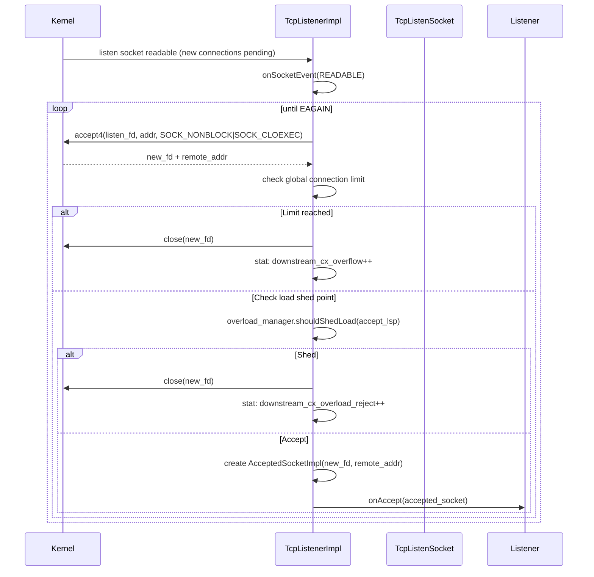

### Overload / Limit Protection

```mermaid
flowchart TD
    NewConn["New accepted connection"] --> GL{Global connection<br/>limit check}
    GL -->|exceeds limit| Reject1["close(fd)<br/>downstream_cx_overflow++"]
    GL -->|within limit| LSP{LoadShedPoint<br/>(OverloadManager)?}
    LSP -->|shed| Reject2["close(fd)<br/>downstream_cx_overload_reject++"]
    LSP -->|accept| LF["Run Listener Filters"]
    LF --> CM["newConnection(socket)"]
```

---

## 6. UdpListenerImpl — Datagram Processing

### Packet Receive Loop

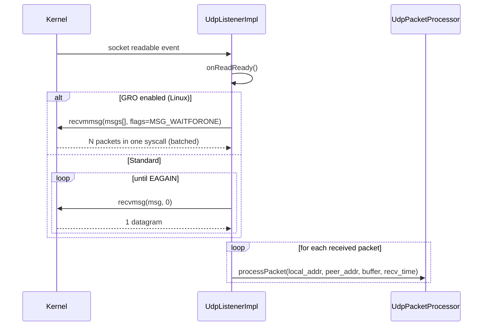

### UDP Worker Routing

For multi-threaded environments, UDP packets from the same peer must be consistently routed to the same worker:

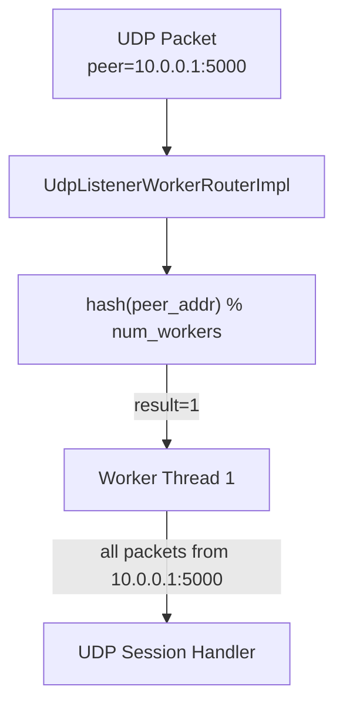

### UDP Send Path

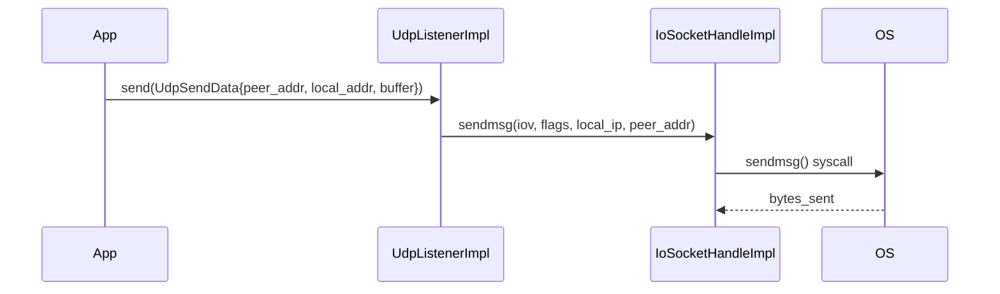

---

## 7. Listen Socket Types

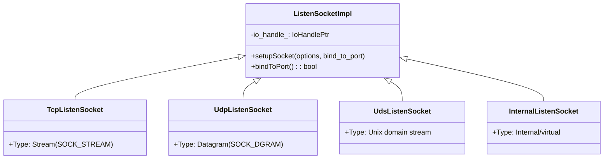

### Socket Lifecycle

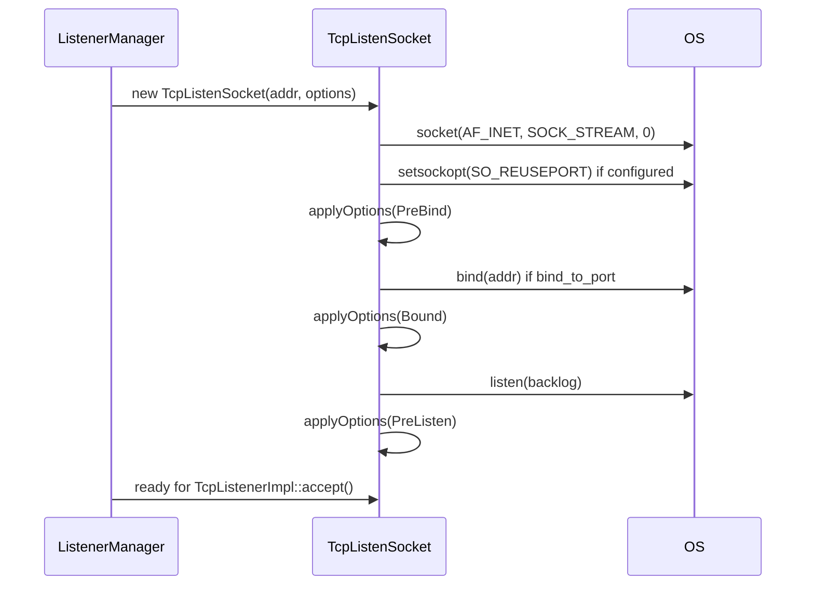

---

## 8. Connection Balancing

`connection_balancer_impl.h` provides strategies for distributing accepted connections across worker threads:

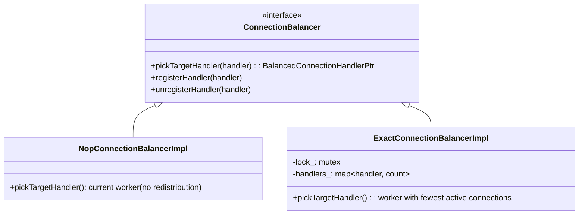

### Exact Balancer Flow

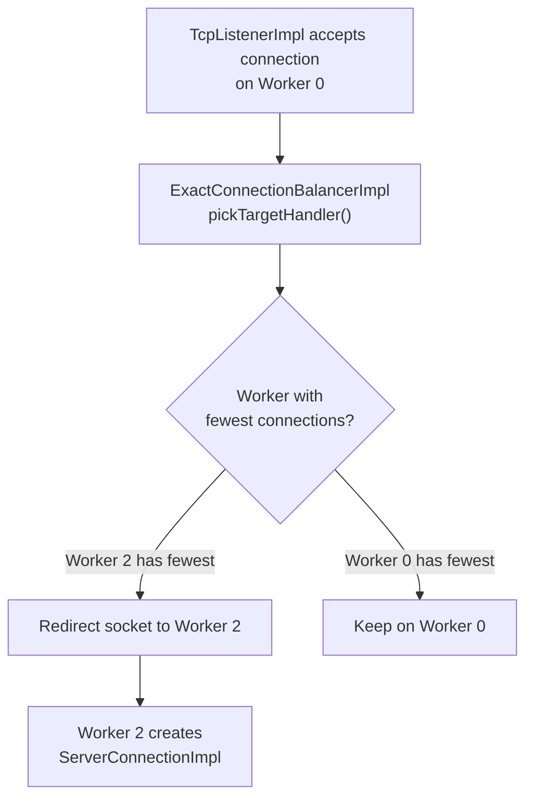

---

## Navigation

| Part | Topics |
|------|--------|
| [Part 1](OVERVIEW_PART1_architecture_and_connections.md) | Architecture, Connections, Happy Eyeballs, Filter Manager |
| **Part 2 (this file)** | Network Filters, TCP/UDP Listeners, Listener Filters |
| [Part 3](OVERVIEW_PART3_sockets_and_io.md) | Sockets, IoHandles, Socket Options, io_uring |
| [Part 4](OVERVIEW_PART4_addressing_dns_and_utilities.md) | Addressing, CIDR, DNS, Matching, Transport Socket Options |
